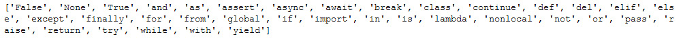

Lab 1. Vital Python -- Math, Strings, Conditionals, and Loops
=========================================================


In this lab, you will learn about the following topics:

- Simplify mathematical expressions with the order ofoperations using integers and floats; 
- Assign variables and change Python types to display and retrieve user information
- Apply global functions including `len()`, `print()`, and `input()`; 
- Manipulate strings using indexing, slicing, string concatenation, and string methods; 
- Apply Booleans and nested conditionals to solve problems
- Utilize \'for loops\' and \'while loops\' to iterate over strings.
- Create new programs by combining math, strings, conditionals, and loops.


This lab covers the fundamentals of the Python language.


Note

In this course, copy everything that follows `>>>` in a cell in
your Jupyter Notebook; that is, you exclude `>>>`. To run
code, make sure the cell is highlighted, then press *Shift* + *Enter*.
You may also press the `Run` button at the top of the
Notebook, but this takes more time. Start thinking like a developer and
use keystrokes instead.


Standard Math Operations
------------------------

You can have a look at the standard math operations and their symbols
that we will be using while coding. The following table covers these:


Caption: Standard math operations

Note

The `**` symbol is not universally for exponentiation, but it
should be. By definition, exponentiation is repeated multiplication.
Using the `*` symbol twice is representative of repeated
multiplication. It\'s terse, fast, and efficient. Other programming
languages require functions to exponentiate.

Python provides an optional method from the `math` library,
`math.pow()`, but `**` is cleaner and easier to use.


Basic Math Operations
---------------------

We can perform addition on two numbers using the `+` operator.
The following example shows the addition of 5 and 2:

1.  Here, we are using the addition operator, `+` in the code:


    ```
    5 + 2
    ```

    You should get the following output:


    ```
    7
    ```

    We can perform addition on two numbers using the `+`
    operator. The following example shows the subtraction of
    `5` and `2`.

2.  Using the subtraction operator in the code, we can perform
    subtraction on two numbers:


    ```
    5 - 2 
    ```

    You should get the following output:


    ```
    3
    ```

    The following example shows the multiplication of 5 by 2.

3.  Using the `*` multiplication operator to multiply the two
    numbers is done as follows:


    ```
    5 * 2 
    ```

    You should get the following output:


    ```
    10
    ```

4.  Now, use the `/` division operator and observe the output:


    ```
    5 / 2
    ```

    You should get the following output:


    ```
    2.5
    ```

    When dividing two numbers, Python will always return a decimal.

5.  Now the same division can be done using the `//` operator,
    which is called integer division. Observe the change in the output:


    ```
    5 // 2
    ```

    You should get the following output:


    ```
    2
    ```

    The result of the integer division is the integer before the decimal
    point.

6.  Now, using the `**` exponential operator, we can perform
    exponentiation:


    ```
    5 ** 2
    ```

    You should get the following output:


    ```
    25
    ```

    The next example shows how to use the modulus operator.

7.  Finally, use the modulus operator in the code and observe the
    output:


    ```
    5 % 2
    ```

    You should get the following output:


    ```
    1
    ```

    The modulus operator is performed using the `%` operator,
    as shown in step 7. It returns the remainder when the first number
    is divided by the second.

In the aforementioned examples, you have used the different math
operators and performed operations with them in a Jupyter Notebook.
Next, you move on to the order of operations in Python.


Order of Operations
-------------------

Parentheses are meaningful in Python. When it comes to computation,
Python always computes what is in parentheses first.

The Python language follows the same order of operations as in the math
world. You may remember the acronym PEMDAS: parentheses first,
exponentiation second, multiplication/division third, and
addition/subtraction fourth.

Consider the following expression:`5 + 2 * -3`

The first thing to note is that the negative sign and subtraction sign
are the same in Python. Let\'s have a look at the following example:

1.  Python will first multiply `2` and `–3`, and
    then add `5`:


    ```
    5 + 2 * -3
    ```

    You should get the following output:


    ```
    –1
    ```

2.  If parentheses are placed around the `5` and
    `2`, we obtain a different result:


    ```
    (5 + 2) * -3
    ```

    You should get the following output:


    ```
    –21
    ```

If ever in doubt, use parentheses. Parentheses are very helpful for
complex expressions, and extra parentheses do not affect code.

In the following exercise, we are going to dive into Python code and
work with math operations.


Exercise 1: Getting to Know the Order of Operations
---------------------------------------------------

The goal of this exercise is to work with the primary math operations in
Python and understand their order of execution. This exercise can be
performed on the Python terminal:

1.  Subtract `5` to the 3rd power, which is
    5[3]{.superscript}, from `100` and divide the result by
    `5`:


    ```
    (100 - 5 ** 3) / 5
    ```

    You should get the following output:


    ```
    –5.0
    ```

2.  Add `6` to the remainder of `15` divided
    `4`:


    ```
    6 + 15 % 4
    ```

    You should get the following output:


    ```
    9
    ```

3.  Add `2` to the 2nd power, which is 2[2]{.superscript}, to
    the integer division of `24` and `4`:


    ```
    2 ** 2 + 24 // 4
    ```

    You should get the following output:


    ```
    10
    ```

In this quick exercise, you have used Python to perform basic math using
the order of operations. As you can see, Python is an excellent
calculator. You will use Python often as a calculator in your career as
a developer.


Spacing in Python
-----------------

You may have wondered about spaces in between numbers and symbols. In
Python, spaces after a number or symbol do not carry any meaning. So,
`5**3` and `5 ** 3` both result in `125`.

Spaces are meant to enhance readability. Although there is no correct
way to space code, spaces are generally encouraged between operands and
operators. Thus, `5 ** 3` is preferable.

Trying to follow certain conventions is perfectly acceptable. If you
develop good habits early on, it will make the reading and debugging of
code easier later.


Number Types: Integers and Floats
---------------------------------

Now you will address the difference between an integer and a float.
Consider 8 and 8.0. You know that 8 and 8.0 are equivalent
mathematically. They both represent the same number, but they are
different types. 8 is an integer, and 8.0 is a decimal or float.

An integer in Python is classified as a type of `int`, short
for integer. Integers include all positive and negative whole numbers,
including 0. Examples of integers include 3, -2, 47, and 10000.

Floats, by contrast, are Python types represented as decimals. All
rational numbers expressed as fractions can be represented as floats.
Samples of floats include 3.0, -2.0, 47.45, and 200.001.

Note

We are only covering text and numeric types in this lab. Other types
will be discussed in subsequent labs.

Python types can be obtained explicitly using the `type()`
keyword, as you will see in the following exercise.


Exercise 2: Integer and Float Types
-----------------------------------

The goal of this exercise is to determine types and then change those
types in our Python code. This can be performed in the Jupyter Notebook:

1.  Begin by explicitly determining the type of `6` using the
    following code:


    ```
    type(6)
    ```

    You should get the following output:


    ```
    int
    ```

2.  Now, enter `type(6.0)` in the next cell of your notebook:


    ```
    type(6.0)
    ```

    You should get the following output:


    ```
    float
    ```

3.  Now, add `5` to `3.14`. Infer the type of their
    sum:


    ```
    5 + 3.14
    ```

    You should get the following output:


    ```
    8.14
    ```

    It\'s clear from the output that combining an `int` and a
    `float` gives us a `float`. This makes sense. If
    Python returned 8, you would lose information. When possible, Python
    converts types to preserve information.

    You can, however, change types by using the `type`
    keyword.

4.  Now, convert `7.999999999` to an `int`:


    ```
    int(7.999999999)
    ```

    You should get the following output:


    ```
    7
    ```

5.  Convert `6` to a `float`:


    ```
    float(6)
    ```

    You should get the following output:


    ```
    6.0
    ```

In this exercise, you determined types by using the `type()`
keyword, and you changed types between integers and floats. As a
developer, you will need to use your knowledge of variable types more
often than you might expect. It\'s not uncommon to be unsure of a type
when dealing with hundreds of variables simultaneously, or when editing
other people\'s code.

Note

Type changing will be revisited again in this lab, referred to as
**casting**.


Complex Number Types
--------------------

Python includes complex numbers as an official type. Complex numbers
arise when taking the square roots of negative numbers. There is no real
number whose square root is -9, so we say that it equals 3i. Another
example of a complex number is 2i + 3. Python uses `j` instead
of `i`.

You can take a look at the following code snippet to learn how to work
with complex number types.

Divide `2 + 3j` by `1 - 5j`, enclosing both
operations within parentheses:


``` {.language-markup}
(2 + 3j) / (1 - 5j)
```

You should get the following output:


``` {.language-markup}
–0.5+0.5j
```

For more information on complex numbers, check out
<https://docs.python.org/3.7/library/cmath.html>.


Errors in Python
----------------

In programming, errors are not to be feared; errors are to be welcomed.
Errors are common not only for beginners but for all developers. You
will learn skills to handle errors in *Lab 4*, *Extending Python,
Files, Errors, and Graphs*. For now, if you get an error, just go back
and try again. Python errors in Jupyter Notebooks won\'t crash your
computer or cause any serious problems but they will just stop running
the Python code.


Variables
---------

In Python, variables are memory slots that can store elements of any
type. The name variable is meant to be suggestive, as the idea behind a
variable is that the value can vary throughout a given program.


Variable Assignment
-------------------

In Python, variables are introduced the same way as in math, by using
the equals sign. In most programming languages, however, order matters;
that is, x = 3.14 means that the value 3.14 gets assigned to x. However,
3.14 = x will produce an error because it\'s impossible to assign a
variable to a number. In the following exercise, we will implement this
concept in code to give you a better understanding of it.


Exercise 3: Assigning Variables
-------------------------------

The goal of this exercise is to assign values to variables. Variables
can be assigned any value, as you will see in this exercise. This
exercise can be performed in the Jupyter Notebook:

1.  Set `x` as equal to the number `2`:


    ```
    x = 2
    ```

    In the first step, we assigned the value `2` to the
    `x` variable.

2.  Add `1` to the variable `x`:


    ```
    x + 1
    ```

    You should get the following output:


    ```
    3
    ```

    Once we add `1` to `x`, we get the output of
    `3`, because the variable has `1` added to it.

3.  Change `x` to `3.0` and add `1` to
    `x`:


    ```
    x = 3.0
    x + 1
    ```

    You should get the following output:


    ```
    4.0
    ```

    In this step, we change the value of `x` to
    `4.0`, and as in the previous 2 steps, we will be adding
    `1` to the `x` variable.

By the end of this quick exercise, you may have noticed that in
programming, you can assign a variable in terms of its previous value.
This is a powerful tool, and many developers use it quite often.
Furthermore, the type of `x` has changed. `x`
started as an `int`, but now `x` = `3.0`
which is a `float`. This is allowed in Python because Python
is dynamically typed.


Changing Types
--------------

In some languages, it\'s not possible for a variable to change types.
This means that if the `y` variable is an integer, then
`y` must always be an integer. Python, however, is dynamically
typed, as we saw in *Exercise 3*, *Assigning Variables* and as
illustrated in the following example:

1.  `y` starts as an integer:

    ```
    y = 10
    ```

2.  `y` becomes a float:

    ```
    y = y – 10.0
    ```

3.  Check the type of `y`:


    ```
    type(y)
    ```

    You should get the following output:


    ```
    float
    ```

In the next topic, you will be looking at reassigning variables in terms
of themselves.


Reassigning Variables in Terms of Themselves
--------------------------------------------

It\'s common in programming to add `1` to a variable; for
instance, `x = x + 1`. The shorthand for this is to use
`+=` as in the following example:


``` {.language-markup}
x += 1
```

So, if `x` was `6`, `x` is now
`7`. The `+=` operator adds the number on the right
to the variable and sets the variable equal to the new number.


Activity 1: Assigning Values to Variables
-----------------------------------------

In this activity, you will assign a number to the `x`
variable, increment the number, and perform additional operations.

By completing this activity, you will learn how to perform multiple
mathematical operations using Python. This activity can be performed in
the Jupyter Notebook.

The steps are as follows:

1.  First, set `14` to the `x` variable.

2.  Now, add `1` to `x`.

3.  Finally, divide `x` by `5` and square it.

    You should get the following output:


    ```
    9.0
    ```


Variable Names
--------------

To avoid confusion, it\'s recommended to use variable names that make
sense to readers. Instead of using `x`, the variable may be
`income` or `age`. Although `x` is
shorter, someone else reading the code might not understand what
`x` is referring to. Try to use variable names that are
indicative of the meaning.

There are some restrictions when naming variables. For instance,
variables cannot start with numbers, most special characters, keywords,
nor built-in types. Variables also can\'t contain spaces between
letters.

According to Python conventions, it\'s best to use lowercase letters and
to avoid special characters altogether as they will often cause errors.

Python keywords are reserved in the language. They have special
meanings. We will go over most of these keywords later.

Running the following two lines always shows a current list of Python
keywords:


``` {.language-markup}
import keyword
print(keyword.kwlist)
```

You should get the following output:




Caption: Output showing the Python keywords

Note

If you use any of the preceding keywords as variable names, Python will
throw an error.


Exercise 4: Variable Names
--------------------------

The goal of this exercise is to learn standard ways to name variables by
considering good and bad practices. This exercise can be performed in
Jupyter:

1.  Create a variable called `1st_number` and assign it a
    value of `1`:


    ```
    1st_number = 1
    ```

    You should get the following output:

    


    Caption: Output throwing a syntax error

    You\'ll get the error mentioned in the preceding screenshot because
    you cannot begin a variable with a number.

2.  Now, let\'s try using letters to begin a variable:

    ```
    first_number = 1
    ```

3.  Now, use special characters in a variable name, as in the following
    code:


    ```
    my_$ = 1000.00
    ```

    You should get the following output:

    


    Caption: Output throwing a syntax error

    You get the error mentioned because you cannot include
    a variable with a special character.

4.  Now, use letters again instead of special characters for the
    variable name:

    ```
    my_money = 1000.00
    ```

In this exercise, you have learned to use underscores to separate words
when naming variables, and not to start variables\' names with numbers
nor include any symbols. In Python, you will quickly get used to these
conventions.


Multiple Variables
------------------

Most programs contain multiple variables. The same rules apply as when
working with single variables. You will practice working with multiple
variables in the following exercise.


Exercise 5: Multiple Variables in Python
----------------------------------------

In this exercise, you will perform mathematical operations using more
than one variable. This exercise can be performed in the Jupyter
Notebook:

1.  Assign `5` to `x` and `2` to
    `y`:

    ```
    x = 5
    y = 2
    ```

2.  Add `x` to `x` and subtract `y` to the
    second power:


    ```
    x + x - y ** 2
    ```

    You should get the following output:


    ```
    6
    ```

    Python has a lot of cool shortcuts, and multiple variable assignment
    is one of them. Here\'s the Pythonic way of declaring two variables.

    Note

    Pythonic is a term used to describe code written in the optimum
    readable format. This will be covered in *Lab 7*, *Becoming
    Pythonic*.

3.  Assign `8` to `x` and `5` to
    `y` in one line:

    ```
    x, y = 8, 5
    ```

4.  Find the integer division of x and y:


    ```
    x // y
    ```

    You should get the following output:


    ```
    1
    ```

In this exercise, you practiced working with multiple variables, and you
even learned the Pythonic way to assign values to multiple variables in
one line. It\'s rare to only work with one variable in practice.


Comments
--------

Comments are extra blocks of code that do not run. They are meant to
clarify code for readers. In Python, any text following the
`#` symbol on a single line is a comment. Comments followed by
the `#` symbol may be inline or above the text.

Note

Consistent use of comments will make reviewing and debugging code much
easier. It\'s strongly advisable to practice this from here on out.


Exercise 6: Comments in Python
------------------------------

In this exercise, you will learn two different ways to display comments
in Python. This exercise can be performed in the Jupyter Notebook:

1.  Write a comment that states `This is a comment`:


    ```
    # This is a comment
    ```

    When you execute this cell, nothing should happen.

2.  Set the `pi` variable as equal to `3.14`. Add a
    comment above the line stating what you did:


    ```
    # Set the variable pi equal to 3.14
    pi = 3.14 
    ```

    Adding the comment clarifies what follows.

3.  Now, try setting the `pi` variable as equal to
    `3.14` again, but add the comment stating what you did on
    the same line:


    ```
    pi = 3.14  # Set the variable pi equal to 3.14
    ```

    Although it\'s less common to provide comments on the same line of
    code, it\'s acceptable and often appropriate.

    You should get the following output from the Jupyter notebook:


Caption: Output from the Jupyter Notebook using comments

In this exercise, you have learned how to write comments in Python. As a
developer, writing comments is essential to make your code legible to
others.


Docstrings
----------

Docstrings, short for document strings, state what a given document,
such as a program, a function, or a class, actually does. The primary
difference in syntax between a docstring and a comment is that
docstrings are intended to be written over multiple lines, which can be
accomplished with triple quotes `"""`. They also introduce a
given document, so they are placed at the top.

Here is an example of a docstring:


``` {.language-markup}
"""
This document will explore why comments are particularly useful 
when writing and reading code.
"""
```

When you execute this cell, nothing really happens. Docstrings, like
comments, are designed as information for developers reading and writing
code; they have nothing to do with the output of code.


Activity 2: Finding a Solution Using the Pythagorean Theorem in Python
----------------------------------------------------------------------

In this activity, you will determine the Pythagorean distance between
three points. You will utilize a docstring and comments to clarify the
process.

In this activity, you need to assign numbers to the `x`,
`y`, and `z` variables, square the variables, and
take the square root to obtain the distance, while providing comments
along the way and a docstring to introduce the sequence of steps. To
complete this activity, you\'ll utilize multiple variables, comments,
and docstrings to determine the Pythagorean distance between three
points.

The steps are as follows:

1.  Write a docstring that describes what is going to happen.

2.  Set `x`, `y`, and `z` as equal to
    `2`, `3`, and `4`.

3.  Determine the Pythagorean distance between `x`,
    `y`, and `z`.

4.  Include comments to clarify each line of code.

    You should get the following output:


    ```
    5.385164807134504
    ```


Next, you\'ll explore Python\'s other main type, strings.


Strings: Concatenation, Methods, and input()
============================================


You have learned how to express numbers, operations, and variables. What
about words? In Python, anything that goes between \'single\' or
\"double\" quotes is considered a string. Strings are commonly used to
express words, but they have many other uses, including displaying
information to the user and retrieving information from a user.

Examples include \'hello\', \"hello\", \'HELLoo00\', \'12345\', and
\'fun\_characters: !@ \#\$%\^&\*(\'.

In this section, you will gain proficiency with strings by examining
string methods, string concatenation, and useful built-in functions
including `print()` and `len()` with a wide range of
examples.


String Syntax
-------------

Although strings may use single or double quotes, a given string must be
internally consistent. That is, if a string starts with a single quote,
it must end with a single quote. The same is true of double quotes.

You can take a look at valid and invalid strings in *Exercise 7*,
*String Error Syntax*.


Exercise 7: String Error Syntax
-------------------------------

The goal of this exercise is to learn appropriate string syntax:

1.  Open a Jupyter Notebook.

2.  Enter a valid string:

    ```
    coursestore = 'City Lights'
    ```

3.  Now enter an invalid string:


    ```
    coursestore = 'City Lights"
    ```

    You should get the following output:

    


    Caption: Output with invalid string format

    If you start with a single quote, you must end with a single quote.
    Since the string has not been completed, you receive a syntax error.

4.  Now you need to enter a valid string format again, as in the
    following code snippet:


    ```
    coursestore = "Moe's"
    ```

    This is okay. The string starts and ends with double quotes.
    Anything can be inside the quotation marks, except for more
    quotation marks.

5.  Now add the invalid string again:


    ```
    coursestore = 'Moe's'
    ```

    You should get the following output:


Caption: Output with the invalid string

This is a problem. You started and ended with single quotes, and then
you added an `s` and another single quote.

A couple of questions arise. The first is whether single or double
quotes should be used. The answer is that it depends on developer
preference. Double quotes are more traditional, and they can be used to
avoid potentially problematic situations such as the aforementioned
`Moe's` example. Single quotes eliminate the need to press the
`Shift` key.

In this exercise, you have learned the correct and incorrect ways of
assigning strings to variables, including single and double-quotes.

Python uses the backslash character, `\`, called an **escape**
sequence in strings, to allow for the insertion of any type of quote
inside of strings. The character that follows the backslash in an escape
sequence may be interpreted as mentioned in Python\'s official
documentation, which follows. Of particular note is `\n`,
which is used to create a new line:


Caption: Escape sequences and their meaning

Note

For more information on strings, you can refer to
<https://docs.python.org/2.0/ref/strings.html>.


Escape Sequences with Quotes
----------------------------

Here is how an escape sequence works with quotes. The backslash
overrides the single quote as an end quote and allows it to be
interpreted as a string character:


``` {.language-markup}
coursestore = 'Moe\'s'
```


Multi-Line Strings
------------------

Short strings always display nicely but, what about multi-line strings?
It can be cumbersome to define a paragraph variable that includes a
string over multiple lines. In some IDEs, the string may run off the
screen, and it may be difficult to read. In addition, it might be
advantageous to have line breaks at specific points for the user.

Note

Line breaks will not work inside single or double quotes.

When strings need to span multiple lines, Python provides triple quotes,
using single or double quotation marks, as a nice option.

Here is an example of triple quotes (`'''`) used to write a
multi-line string:


``` {.language-markup}
vacation_note = ''' 
During our vacation to San Francisco, we waited in a long line by 
Powell St. Station to take the cable car. Tap dancers performed on 
wooden boards. By the time our cable car arrived, we started looking 
online for a good place to eat. We're heading to North Beach.
'''
```

Note

Multi-line strings take on the same syntax as a docstring. The
difference is that a docstring appears at the beginning of a document,
and a multi-line string is defined within the program.


The print() Function
--------------------

The `print()` function is used to display information to the
user, or to the developer. It\'s one of Python\'s most widely used
built-in functions.


Exercise 8: Displaying Strings
------------------------------

In this exercise, you will learn different ways to display strings:

1.  Open a new Jupyter Notebook.

2.  Define a greeting variable with the value \'Hello\'. Display the
    greeting using the `print()` function:


    ```
    greeting = 'Hello'
    print(greeting)
    ```

    You should get the following output:


    ```
    Hello
    ```

    `Hello`, as shown in the display, does not include single
    quotes. This is because the `print()` function is
    generally intended for the user to print the output.

    Note

    The quotes are for developer syntax, not user syntax.

3.  Display the value of `greeting` without using the
    `print()` function:


    ```
    greeting
    ```

    You should get the following output:


    ```
    'Hello'
    ```

    When we input `greeting` without the `print()`
    function, we are obtaining the encoded value, hence the quotes.

4.  Consider the following sequence of code in a single cell in a
    Jupyter Notebook:


    ```
    spanish_greeting = 'Hola.'
    spanish_greeting
    arabic_greeting = 'Ahlan wa sahlan.'
    ```

    When the preceding cell is run, the preceding code does not display
    `spanish_greeting`. If the code were run on a terminal as
    three separate lines, it would display `Hola.`, the string
    assigned to `spanish_greeting`. The same would be true if
    the preceding sequence of code were run in three separate cells in a
    Jupyter Notebook. For consistency, it\'s useful to use
    `print()` any time information should be displayed.

5.  Display the Spanish greeting:


    ```
    spanish_greeting = 'Hola.'
    print(spanish_greeting)
    ```

    You should get the following output:


    ```
    Hola.
    ```

6.  Now, display the Arabic greeting message, as mentioned in the
    following code snippet:


    ```
    arabic_greeting = 'Ahlan wa sahlan.'
    print(arabic_greeting)
    ```

    You should get the following output:


    ```
    Ahlan wa sahlan.
    ```

    The compiler runs through each line in order. Every time it arrives
    at `print()`, it displays information.

In this exercise, you have learned different ways to display strings,
including the `print()` function. You will use the
`print()` function very frequently as a developer.


String Operations and Concatenation
-----------------------------------

The multiplication and addition operators work with strings as well. In
particular, the `+` operator combines two strings into one and
is referred to as **string concatenation**. The `*` operator,
for multiplication, repeats a string. In the following exercise, you
will be looking at string concatenation in our string samples.


Exercise 9: String Concatenation
--------------------------------

In this exercise, you will learn how to combine strings using string
concatenation:

1.  Open a new Jupyter Notebook.

2.  Combine the `spanish_greeting` we used in *Exercise 8*,
    *Displaying Strings*, with \'Senor.\' using the `+`
    operator and display the results:


    ```
    spanish_greeting = 'Hola'
    print(spanish_greeting + 'Senor.')
    ```

    You should get the following output:


    ```
    HolaSenor.
    ```

    Notice that there are no spaces between `greeting` and
    name. If we want spaces between strings, we need to explicitly add
    them.

3.  Now, combine `spanish_greeting` with \'Senor.\' using the
    `+` operator, but this time, include a **space**:


    ```
    spanish_greeting = 'Hola '
    print(spanish_greeting + 'Senor.')
    ```

    You should get the following output:


    ```
    Hola Senor.
    ```

4.  Display the greeting 5 times using the `*` multiplication
    operator:


    ```
    greeting = 'Hello'
    print(greeting * 5)
    ```

    You should get the following output:


    ```
    HelloHelloHelloHelloHello
    ```

By completing this exercise successfully, you have combined strings
using string concatenation using the `+` and `*`
operators.


String Interpolation
====================


When writing strings, you may want to include variables in the output.
String interpolation includes the variable names as placeholders within
the string. There are two standard methods for achieving string
interpolation: **comma separators** and **format**.


Comma Separators
----------------

Variables may be interpolated into strings using commas to separate
clauses. It\'s similar to the `+` operator, except it adds
spacing for you.

You can have a look at an example here, where we add `Ciao`
within a `print` statement:


``` {.language-markup}
italian_greeting = 'Ciao'
print('Should we greet people with', italian_greeting, 'in North Beach?')
```

You should get the following output:


``` {.language-markup}
Should we greet people with Ciao in North Beach?
```


Format
------

With `format`, as with commas, Python types, `ints`,
`floats`, and so on, are converted into strings upon
execution. The `format` is accessed using brackets and dot
notation:


``` {.language-markup}
owner = 'Lawrence Ferlinghetti'
age = 100
print('The founder of City Lights Bookstore, {}, is now {} years old.'.format(owner, age))
```

You should get the following output:


``` {.language-markup}
The founder of City Lights Bookstore, Lawrence Ferlinghetti, is now 100 years old.
```

The `format` works as follows: First, define your variables.
Next, in the given string, use `{}` in place of each variable.
At the end of the string, add a dot (`.`) followed by the
`format` keyword. Then, in parentheses, list each variable in
the desired order of appearance. In the next section, you will look at
the built-in string functions available to a Python developer.


The len() Function
------------------

There are many built-in functions that are particularly useful for
strings. One such function is `len()`, which is short for
length. The `len()` function determines the number of
characters in a given string.

Note that the `len()` function will also count any blank
spaces in a given string.

You\'ll use the `arabic_greeting` variable used in *Exercise
8*, *Displaying Strings*:


``` {.language-markup}
len(arabic_greeting)
```

You should get the following output:


``` {.language-markup}
16
```

Note

When entering variables in Jupyter notebooks, you can use
`tab completion`. After you type in a letter or two, you can
press the *Tab* key. Python then displays all valid continuations that
will complete your expression. If done correctly, you should see your
variable listed. Then you can highlight the variable and press *Enter*.
Using tab completion will limit errors.


String Methods
--------------

All Python types, including strings, have their own methods. These
methods generally provide shortcuts for implementing useful tasks.
Methods in Python, as in many other languages, are accessed via dot
notation.

You can use a new variable, `name`, to access a variety of
methods. You can see all methods by pressing the *Tab* button after the
variable name and a dot.


Exercise 10: String Methods
---------------------------

In this exercise, you will learn how to implement string methods.

1.  Set a new variable, called `name`, to any name that you
    like:


    ```
    name = 'Corey'
    ```

    Note

    Access string methods by pressing the `Tab` button after
    the variable name and dot (`.`), as demonstrated in the
    following screenshot:

    


    Caption: Setting a variable name via the dropdown menu

    You can scroll down the list to obtain all available string methods.

2.  Now, convert the name into lowercase letters using the
    `lower()` function:


    ```
    name.lower()
    ```

    You should get the following output:


    ```
    'corey'
    ```

3.  Now, capitalize the name using the `capitalize()`
    function:


    ```
    name.capitalize()
    ```

    You should get the following output:


    ```
    'Corey'
    ```

4.  Convert the name into uppercase letters using `upper()`:


    ```
    name.upper()
    ```

    You should get the following output:


    ```
    'COREY'
    ```

5.  Finally, count the number of `o` instances in the word
    \'`Corey`\':


    ```
    name.count('o')
    ```

    You should get the following output:


    ```
    1
    ```

In this exercise, you have learned about a variety of string methods,
including `lower()`, `capitalize()`,
`upper()`, and `count()`.

Methods may only be applied to their representative types. For instance,
the `lower()` method only works on strings, not integers or
floats. By contrast, built-in functions such as `len()` and
`print()` can be applied to a variety of types.

Note

Methods do not change the original variable unless we explicitly
reassign the variable. So, the name has not been changed, despite the
methods that we have applied.


Casting
-------

It\'s common for numbers to be expressed as strings when dealing with
input and output. Note that `'5'` and `5` are
different types. We can easily convert between numbers and strings using
the appropriate type keywords. In the following exercise, we are going
to be using types and casting to understand the concepts much better.


Exercise 11: Types and Casting
------------------------------

In this exercise, you will learn how types and casting work together:

1.  Open a new Jupyter Notebook.

2.  Determine the type of `'5'`:


    ```
    type('5')
    ```

    You should get the following output:


    ```
    str
    ```

3.  Now, add \'5\' and \'7\':


    ```
    '5' + '7'
    ```

    You should get the following output:


    ```
    '57'
    ```

    The answer is not 12 because, here, `5` and `7`
    are of type **string**, not of type `int`. Recall that the
    `+` operator concatenates strings. If we want to add
    `5` and `7`, we must convert them first.

4.  Convert the \'5\' string to an `int` using the code
    mentioned in the following code snippet:


    ```
    int('5')
    ```

    You should get the following output:


    ```
    5
    ```

    Now `5` is a number, so it can be combined with other
    numbers via standard mathematical operations.

5.  Add \'5\' and \'7\' by converting them to `int` first:


    ```
    int('5') + int('7')
    ```

    You should get the following output:


Caption: Output after adding two integers converted from a string

In this exercise, you have learned several ways in which strings work
with casting.


The input() Function
--------------------

The `input()` function is a built-in function that allows user
input. It\'s a little different than what we have seen so far. Let\'s
see how it works in action.


Exercise 12: The input() Function
---------------------------------

In this exercise, you will utilize the `input()` function to
obtain information from the user:

1.  Open a new Jupyter Notebook.

2.  Ask a user for their name. Respond with an appropriate greeting:


    ```
    # Choose a question to ask
    print('What is your name?')
    ```

    You should get the following output:

    


    Caption: The user is prompted to answer a question

3.  Now, set a variable that will be equal to the `input()`
    function, as mentioned in the following code snippet:


    ```
    name = input()
    ```

    You should get the following output:

    


    Caption: The user may type anything into the provided space

4.  Finally, select an appropriate output:


    ```
    print('Hello, ' + name + '.')
    ```

    You should get the following output:


Caption: After pressing Enter, the full sequence is displayed

Note

`input()` can be finicky in Jupyter Notebooks. If an error
arises when entering the code, try `restarting` the kernel.
Restarting the kernel will erase the current memory and start each cell
afresh. This is advisable if the notebook stalls.

In this exercise, you have learned how the `input()` function
works.


Activity 3: Using the input() Function to Rate Your Day
-------------------------------------------------------

In this activity, you need to create an input type where you ask the
user to rate their day on a scale of 1 to 10.

Using the `input()` function, you will prompt a user for input
and respond with a comment that includes the input. In this activity,
you will print a message to the user asking for a number. Then, you will
assign the number to a variable and use that variable in a second
message that you display to the user.

The steps are as follows:

1.  Open a new Jupyter Notebook.

2.  Display a question prompting the user to rate their day on a number
    scale of `1` to `10`.

3.  Save the user\'s input as a variable.

4.  Display a statement to the user that includes the number.


String Indexing and Slicing
===========================


**Indexing** and **slicing** are crucial parts of programming. In data
analysis, indexing and slicing DataFrames is essential to keep track of
rows and columns, something we will practice in *Lab 10*, *Data
Analytics with pandas and NumPy*. The mechanics behind indexing and
slicing dataFrames is the same as indexing and slicing strings, which we
will learn in this lab.


Indexing
--------

The characters of Python strings exist in specific locations; in other
words, their order counts. The index is a numerical representation of
where each character is located. The first character is at index 0, the
second character is at index 1; the third character is at index 2, and
so on.

Note

We always start at 0 when indexing.

Consider the following string:


``` {.language-markup}
destination = 'San Francisco'
```

`'S'` is in the 0th index, `'a'` is in the 1st
index, `'n'` is in the 2nd index, and so on. The characters of
each index are accessed using bracket notation as follows:


``` {.language-markup}
destination[0]
```

You should get the following output:


``` {.language-markup}
'S'
```

To access the data from the first index, enter the following:


``` {.language-markup}
destination[1]
```

You should get the following output:


``` {.language-markup}
'a'
```

To access the data from the second index, enter the following:


``` {.language-markup}
destination[2]
```

You should get the following output:


``` {.language-markup}
'n'
```

The character value for `San Francisco` and the corresponding
index count is shown :


Now, try adding a `-1` as the index value and observe the
output:


``` {.language-markup}
destination[-1]
```

You should get the following output:


``` {.language-markup}
'o'
```

Note

Negative numbers start at the end of the string. (It makes sense to
start with -1 since -0 is the same as 0.)

To access the data from the rear of `San Francisco`, we use
the negative sign in this case `-2`:


``` {.language-markup}
destination[-2]
```

You should get the following output:


``` {.language-markup}
'c'
```

The following figure 1.16 mentions the characters `sco` from
the word `Francisco`, and the corresponding index count:


Caption: Index value for the negative values for San Francisco

Here is one more example:


``` {.language-markup}
bridge = 'Golden Gate'
bridge[6]
```

You should get the following output:


``` {.language-markup}
' '
```

You may be wondering whether you did something wrong because no letter
is displayed. On the contrary, it\'s perfectly fine to have an empty
string. In fact, an empty string is one of the most common strings in
programming.


Slicing
=======


A **slice** is a subset of a string or other element. A slice could be
the whole element or one character, but it\'s more commonly a group of
adjoining characters.

Let\'s say you want to access the fifth through eleventh letters of a
string. So, you start at index 4 and end at index 10, as was explained
in the previous *Indexing* section. When slicing, the colon symbol
(`:`) is inserted between indices, like so: \[4:10\].

There is one caveat. The lower bound of a slice is always included, but
the upper bound is not. So, in the preceding example, if you want to
include the 10th index, you must use \[4:11\].

You should now have a look at the following example for slicing.

Retrieve the fifth through eleventh letters of
`San Francisco`, which you used in the previous *Indexing*
section:


``` {.language-markup}
destination[4:11]
```

You should get the following output:


``` {.language-markup}
'Francis'
```

Retrieve the first three letters of `destination`:


``` {.language-markup}
destination[0:3]
```

You should get the following output:


``` {.language-markup}
'San'
```

There is a shortcut for getting the first `n` letters of a
string. If the first numerical character is omitted, Python will start
at the 0th index.

Now, to retrieve the first eight letters of `destination`
using the shortcut, use the following code:


``` {.language-markup}
destination[:8]
```

You should get the following output:


``` {.language-markup}
'San Fran'
```

Finally, to retrieve the last three letters of `destination`,
use this code:


``` {.language-markup}
destination[-3:]
```

You should get the following output:


``` {.language-markup}
'sco'
```

The negative sign, `-`, means that we start at the
third-to-last letter, and the colon means that we go to the end.


Strings and Their Methods
-------------------------

You started with string syntax, before moving on to a variety of ways to
concatenate strings. You looked at useful built-in functions including
`len()` and examined a sample of string methods. Next, you
casted numbers as strings and vice versa.

The `input()` function is used to access user input. This
really extends what you can do. Responding to user feedback is a core
element of programming that you will continue to develop. Finally, you
closed with two powerful tools that developers frequently use: indexing
and slicing.

There is a great deal more to learn about strings. You will encounter
additional problems and methods throughout this course. This introductory
lab is meant to equip you with the basic skills needed to handle
strings going forward.

Next, you will learn how to branch programs using conditionals and
Booleans.


Booleans and Conditionals
=========================


Booleans, named after George Boole, take the values of **True** or
**False**. Although the idea behind Booleans is rather simple, they make
programming immensely more powerful.

When writing programs, for instance, it\'s useful to consider multiple
cases. If you prompt the user for information, you may want to respond
differently depending upon the user\'s answer.

For instance, if the user gives a rating of 0 or 1, you may give a
different response than a rating of 9 or 10. The keyword here is
`if`.

Programming based upon multiple cases is referred to as branching. Each
branch is represented by a different conditional. Conditionals often
start with an \'`if`\' clause, followed by
\'`else`\' clauses. The choice of a branch is determined by
Booleans, depending on whether the given conditions are `True`
or `False`.


Booleans
--------

In Python, a Boolean class object is represented by the `bool`
keyword and has a value of `True` or `False`.

Note

Boolean values must be capitalized in Python.


Exercise 13: Boolean Variables
------------------------------

In this short exercise, you will use, assign, and check the type of
Boolean variables:

1.  Open a new Jupyter Notebook.

2.  Now, use a Boolean to classify someone as being over `18`
    using the following code snippet:


    ```
    over_18 = True
    type(over_18)
    ```

    You should get the following output:


    ```
    bool
    ```

    The output is satisfied, and the type is mentioned as a Boolean,
    that is, `bool`.

3.  Use a Boolean to classify someone as not being over `21`:


    ```
    over_21 = False
    type(over_21)
    ```

    You should get the following output:


    ```
    bool
    ```

In this short, quick exercise, you have learned about the
`bool` type, one of Python\'s most important types.


Logical Operators
-----------------

Booleans may be combined with the **and**, **or**, and **not** logical
operators.

For instance, consider the following propositions:

A = True

B = True

Y = False

Z = False

**Not** simply negates the value, as follows:

not A = False

not Z = True.

**And** is only true if both propositions are true. Otherwise, it is
false:

A and B = True

A and Y = False

Y and Z = False

**Or** is true if either proposition is true. Otherwise, it is false:

A or B = True

A or Y = True

Y or Z = False

Now let\'s use them in the following practice example.

Determine whether the following conditions are `True` or
`False` given that `over_18 = True` and
`over_21 = False`:

-   `over_18` and `over_21`
-   `over_18` or `over_21`
-   not `over_18`
-   not `over_21` or (`over_21 or over_18`)

1.  You have to put this into code and first assign `True` and
    `False` to `over_18` and `over_21`:

    ```
    over_18, over_21 = True, False
    ```

2.  Next you can assume the individual is `over_18` and
    `over_21`:


    ```
    over_18 and over_21
    ```

    You should get the following output:


    ```
    False
    ```

3.  You now assume the individual is `over_18` or
    `over_21`:


    ```
    over_18 or over_21
    ```

    You should get the following output:


    ```
    True
    ```

4.  You now assume the individual is not `over_18`:


    ```
    not over_18
    ```

    You should get the following output:


    ```
    False
    ```

5.  You assume the individual is not `over_21` or
    (`over_21 or over_18`):


    ```
    not over_21 or (over_21 or over_18)
    ```

    You should get the following output:


    ```
    True
    ```

In the next section, we will learn about the comparison operators that
go along with Booleans.


Comparison Operators
--------------------

Python objects may be compared using a variety of symbols that evaluate
to Booleans.


Note

The `=` and `==` symbols are often confused. The
`=` symbol is an assignment symbol. So, `x = 3`
assigns the integer `3` to the `x` variable. The
`==` symbol makes a comparison. Thus `x == 3` checks
to see whether `x` is equivalent to `3`. The result
of `x == 3` will be `True` or `False`.


Exercise 14: Comparison Operators
---------------------------------

In this exercise, you will practice using comparison operators. You will
start with some basic mathematical examples:

1.  Open a new Jupyter Notebook.

2.  Now, set `age` as equal to `20` and include a
    comparison operator to check whether `age` is less than
    `13`:


    ```
    age = 20
    age < 13
    ```

    You should get the following output:


    ```
    False
    ```

3.  Using the following code snippet, you can check whether
    `age` is greater than or equal to `20` and less
    than or equal to `21`:


    ```
    age >= 20 and age <= 21
    ```

    You should get the following output:


    ```
    True
    ```

4.  Now check whether `age` is equivalent to `21`:


    ```
    age != 21
    ```

    You should get the following output:


    ```
    True
    ```

5.  Now, check whether `age` is equivalent to `19`:


    ```
    age == 19
    ```

    You should get the following output:


    ```
    False
    ```

    The double equals sign, or the equivalent operator, `==`,
    is very important in Python. It allows us to determine whether two
    objects are equal. You can now address the question of whether
    `6` and `6.0` are the same in Python.

6.  Is `6` equivalent to `6.0` in Python? Let\'s
    find out:


    ```
    6 == 6.0
    ```

    You should get the following output:


    ```
    True
    ```

    This may come as a bit of a surprise. `6` and
    `6.0` are different types, but they are equivalent. Why
    would that be?

    Since `6` and `6.0` are equivalent
    mathematically, it makes sense that they would be equivalent in
    Python, even though the types are different. Consider whether 6
    should be equivalent to 42/7. The mathematical answer is yes. Python
    often conforms to mathematical truths, even with integer division.
    You can conclude that it\'s possible for different types to have
    equivalent objects.

7.  Now find out whether `6` is equivalent to the
    `'6'` string:


    ```
    6 == '6'
    ```

    You should get the following output:


    ```
    False
    ```

    Here, you emphasize that different types usually do not have
    equivalent objects. In general, it\'s a good idea to cast objects as
    the same type before testing for equivalence.

    Next, let\'s find out whether someone is in their 20\'s or 30\'s:


    ```
    (age >= 20 and age < 30) or (age >= 30 and age < 40)
    ```

    You should get the following output:


    ```
    True
    ```

    Parentheses are not necessary when there is only one possible
    interpretation. When using more than two conditions, parentheses are
    generally a good idea. Note that parentheses are always permitted.
    The following is another approach:


    ```
    (20 <= age < 30) or (30 <= age < 40)
    ```

    You should get the following output:


    ```
    True
    ```

    Although the parentheses in the preceding code line are not strictly
    required, they make the code more readable. A good rule of thumb is
    to use parentheses for clarity.

By completing this exercise, you have practiced using different
comparison operators.


Comparing Strings
-----------------

Does `'a' < 'c'` make sense? What about
`'New York' > 'San Francisco'`?

Python uses the convention of alphabetical order to make sense of these
comparisons. Think of a dictionary: when comparing two words, the word
that comes later in the dictionary is considered greater than the word
that comes before.


Exercise 15: Comparing Strings
------------------------------

In this exercise, you will be comparing strings using Python:

1.  Open a new Jupyter Notebook.

2.  Let\'s compare single letters:


    ```
    'a' < 'c'
    ```

    You should get the following output:


    ```
    True
    ```

3.  Now, let\'s compare \'New York\' and \'San Francisco\':


    ```
    'New York' > 'San Francisco'
    ```

    You should get the following output:


    ```
    False
    ```

This is `False` because
`'New York' < 'San Francisco'`. \'New York\' does not come
later in the dictionary than \'San Francisco\'.

In this exercise, you have learned how to compare strings using
comparison operators.


Conditionals
------------

Conditionals are used when we want to express code based upon a set of
circumstances or values. Conditionals evaluate Boolean values or Boolean
expressions, and they are usually preceded by `'if'`.

Let\'s say we are writing a voting program, and we want to print
something only if the user is under 18.


The if Syntax
-------------


``` {.language-markup}
if age < 18:
    print('You aren\'t old enough to vote.')
```

There are several key components to a condition. Let\'s break them down.

The first is the `'if'` keyword. Most conditionals start with
an `if` clause. Everything between `'if'` and the
colon is the condition that we are checking.

The next important piece is the colon `:`. The colon indicates
that the `if` clause has completed. At this point, the
compiler decides whether the preceding condition is `True` or
`False`.

Syntactically, everything that follows the colon is indented.

Python uses **indentation** instead of brackets. Indentation can be
advantageous when dealing with nested conditionals because it avoids
cumbersome notation. Python indentation is expected to be **four
spaces** and may usually be achieved by pressing `Tab` on your
keyboard.

Indented lines will only run if the condition evaluates to
`True`. If the condition evaluates to `False`, the
indented lines will be skipped over entirely.


Indentation
-----------

Indentation is one of Python\'s singular features. Indentation is used
everywhere in Python. Indentation can be liberating. One advantage is
the number of keystrokes. It takes one keystroke to tab, and two
keystrokes to insert brackets. Another advantage is readability. It\'s
clearer and easier to read code when it all shares the same indentation,
meaning the block of code belongs to the same branch.

One potential drawback is that dozens of tabs may draw text offscreen,
but this is rare in practice, and can usually be avoided with elegant
code. Other concerns, such as indenting or unindenting multiple lines,
may be handled via shortcuts. Select all of the text and press
`Tab` to indent. Select all of the text and press
`Shift + Tab` to unindent.

Note

Indentation is unique to Python. This may result in strong opinions on
both sides. In practice, indentation has been shown to be very
effective, and developers used to other languages will appreciate its
advantages in time.


Exercise 16: Using the if Syntax
--------------------------------

In this exercise, you will be using conditionals using the
`if` clause:

1.  Open a new Jupyter Notebook.

2.  Now, run multiple lines of code where you set the `age`
    variable to `20` and add an `if` clause, as
    mentioned in the following code snippet:


    ```
    age = 20
    if age >= 18 and age < 21:
       print('At least you can vote.')
       print('Poker will have to wait.')
    ```

    You should get the following output:


    ```
    At least you can vote.
    Poker will have to wait.
    ```

    There is no limit to the number of indented statements. Each
    statement will run in order, provided that the preceding condition
    is `True`.

3.  Now, use nested conditionals:


    ```
    if age >= 18:
      print('You can vote.')
      if age >= 21:
        print('You can play poker.')
    ```

    You should get the following output:


    ```
    You can vote.
    ```

    In this case, it\'s true that `age >= 18`, so the first
    statement prints `You can vote`. The second condition, age
    `>= 21`, however, is false, so the second statement does
    not get printed.

In this exercise, you have learned how to use conditionals using the
`if` clause. Conditionals will always start with
`if`.


if else
-------

`if` conditionals are commonly joined with `else`
clauses. The idea is as follows. Say you want to print something to all
users unless the user is under 18. You can address this with an
`if-else` conditional. If the user is less than 18, you print
one statement. Otherwise, you print another. The otherwise clause is
preceded with `else`.


Exercise 17: Using the if-else Syntax
-------------------------------------

In this exercise, you will learn how to use conditionals that have two
options, one following `if`, and one following
`else`:

1.  Open a new Jupyter Notebook.

2.  Introduce a voting program only to users over 18 by using the
    following code snippet:


    ```
    age = 20
    if age < 18:
      print('You aren\'t old enough to vote.')
    else:
      print('Welcome to our voting program.')
    ```

    You should get the following output:


    ```
    Welcome to our voting program.
    ```

    Note

    Everything after `else` is indented, just like everything
    after the `if` loop.

3.  Now run the following code snippet, which is an alternative to the
    code mentioned in step 2 of this exercise:


    ```
    if age >= 18:
      print('Welcome to our voting program.')
    else:
      print('You aren\'t old enough to vote.')
    ```

    You should get the following output:


    ```
    Welcome to our voting program.
    ```

In this exercise, you have learned how to use `if-else` in
conjunction with loops.

There are many ways to write a program in Python. One is not necessarily
better than another. It may be advantageous to write faster programs or
more readable programs.

A program is a set of instructions run by a computer to complete a
certain task. Programs may be one line of code, or tens of thousands.
You will learn important skills and techniques for writing Python
programs in various labs throughout this course.


The elif Statement
------------------

`elif` is short for **else if**. `elif` does not
have meaning in isolation. elif appears in between an `if` and
`else` clause. An example should make things clearer. Have a
look at the following code snippet and copy it into your Jupyter
notebook. The explanation for this code is mentioned right after the
output:


``` {.language-markup}
if age <= 10:
  print('Listen, learn, and have fun.')
elif age<= 19:
  print('Go fearlessly forward.')
elif age <= 29:
  print('Seize the day.')
elif age <= 39:
  print('Go for what you want.')
elif age <= 59:
  print('Stay physically fit and healthy.')
else:
  print('Each day is magical.')
```

You should get the following output:


``` {.language-markup}
Seize the day.
```

Now, let\'s break down the code for a better explanation:

1.  The first line checks `if` age is less than or equal to
    `10`. Since this condition is false, the next branch is
    checked.
2.  The next branch is `elif` age `<= 19`. This line
    checks if age is less than or equal to 19. This is also not true, so
    we move to the next branch.
3.  The next branch is `elif` age `<= 29`. This is
    true since `age = 20`. The indented statement that follows
    will be printed.
4.  Once any branch has been executed, the entire sequence is aborted,
    none of the subsequent `elif` or else branches are
    checked.
5.  If none of the `if` or `elif` branches were
    true, the final `else` branch will automatically be
    executed.

In the next topic, you will be learning about loops.


Loops
=====


\"Write the first 100 numbers.\"

There are several assumptions implicit in this seemingly simple command.
The first is that the student knows where to start, namely at number 1.
The second assumption is that the student knows where to end, at number
100. And the third is that the student understands that they should
count by 1.

In programming, this set of instructions may be executed with a loop.

There are three key components to most loops:

1.  The start of the loop
2.  The end of the loop
3.  The increment between numbers in the loop

Python distinguishes between two fundamental kinds of loops:
`while` loops, and `for` loops.


The while Loops
---------------

In a `while` loop, a designated segment of code repeats
provided that a particular condition is true. When the condition
evaluates to false, the `while` loop stops running. The
`while` loops print out the first 10 numbers.

You could print the first 10 numbers by implementing the
`print` function 10 times, but using a `while` loop
is more efficient, and it scales easily. In general, it\'s not a good
idea to copy and paste while coding. If you find yourself copying and
pasting, there\'s probably a more efficient way. Let\'s have a look at
the following example code block:


``` {.language-markup}
i = 1
while i <= 10:
  print(i)
  i += 1
```

You should get the following output:


``` {.language-markup}
1
2
3
4
5
6
7
8
9
10
```

You can break down the preceding code block and find out what\'s
happening in concrete steps:

-   **Initialize the variable**: Loops need to be initialized with a
    variable. The variable is going to change throughout the loop. The
    naming of the variable is up to you. `i` is often chosen
    because it stands for incrementor. An example is `i = 1`.
-   **Set up the while loop**: The `while` loop starts with
    the `while` keyword. Following `while` is the
    chosen variable. After the variable comes the condition that must be
    met for the loop to run. In general, the condition should have some
    way of being broken. When counting, the condition usually includes
    an upper limit, but it could also be broken in other ways, such as
    `i != 10`. This line of code is the most critical piece of
    the loop. It sets up how many times the loop is expected to run. An
    example is **while** `i <= 10:`.
-   **Instructions**: The instructions include all indented lines after
    the colon. Anything could be printed, any function could be called,
    and any number of lines may be executed. It all depends on the
    program. As long as the code is syntactically correct, generally
    speaking, anything goes. This part of the loop is going to run over
    and over as long as the aforementioned condition is true. An example
    is `print(i)`.
-   **Increment**: The incrementor is a crucial part of this example.
    Without it, the preceding code will never stop running. It will
    print 1\'s endlessly because 1 is always less than 10. Here, you
    increment by 1, but you could also increment by 2, or any other
    number. An example is `i += 1`.

Now that you understand the separate pieces, you should look at how it
works together:

1.  The variable is initialized as `1`. The `while`
    loop checks the condition. `1` is less than or equal to
    `10`. `1` is printed. `1` is added to
    `i`. We increment to `i = 2`.

2.  After all indented code after the colon has run, the loop is
    executed again by returning to the `while` keyword.

3.  The `while` loop checks the condition again. `2`
    is less than or equal to `10`. `2` is printed to
    the console. `1` is added to `i`. We now
    increment to `i = 3`.

4.  The `while` loop checks the condition again. `3`
    is less than or equal to `10`. `3` is printed to
    the console. `1` is added to `i`. We increment
    to `i = 4`.

5.  The while loop continues to increment and print out numbers until
    reaching the number 10.

6.  The `while` loop checks the condition. `10` is
    less than or equal to `10`. `10` is printed to
    the console. `1` is added to `i`. Now, increment
    to `i = 11`.

7.  The `while` loop checks the condition. `11` is
    not less than or equal to `10`. We break out of the loop
    by moving beyond the indentation.

    Note

    You will get stuck in infinite loops. It happens to everyone. At
    some point, you will forget to add the increment, and you will be
    stuck in an infinite loop. In Jupyter Notebooks, just
    `restart` the kernel.


An Infinite Loop
----------------

Now you should have a look at **infinite** loops. The following code
snippet supports this topic:


``` {.language-markup}
x = 5
while x <= 20:
  print(x)
```

Python often runs very quickly. If something is taking much longer than
expected, an infinite loop might be the culprit, as in the
aforementioned code snippet. A developer here would be setting all the
variables and conditions right to avoid the infinite loop case. An
example of a well-written Python code is as follows:


``` {.language-markup}
x = 5
while x<= 20:
    print(x)
    x += 5
```


break
-----

**break** is a special keyword in Python that is specifically designed
for loops. If placed inside of a loop, commonly in a conditional,
`break` will immediately terminate the loop. It doesn\'t
matter what comes before or after the loop. The break is placed on its
own line, and it *breaks out of the loop*.

To practice, you should print the first number greater than
`100` that is divisible by `17`.

The idea is that you are going to start at 101 and keep counting until
you find a number divisible by `17`. Assume you don\'t know
what number to stop at. This is where break comes into play.
`break` will terminate the loop. You can set our upper bound
at some number that you know you will never reach and break out of the
loop when you get there:


``` {.language-markup}
# Find first number greater than 100 and divisible by 17.
x = 100
while x <= 1000:
  x += 1
  if x % 17 == 0:
    print('', x, 'is the first number greater than 100 that is divisible by 17.')
    break
```

The `x += 1` iterator is placed at the beginning of the loop.
This allows us to start with 101. The iterator may be placed anywhere in
the loop.

Since 101 is not divisible by `17`, the loop repeats, and
`x = 102`. Since `102` is divisible by
`17`, the `print` statement executes and we break
out of the loop.

This is the first time you have used **double indentation**. Since the
`if` conditional is inside of a `while` loop, it
must be indented as well.


Activity 4: Finding the Least Common Multiple (LCM)
---------------------------------------------------

In this activity, you will find the LCM of two divisors. The LCM of two
divisors is the first number that both divisors can divide.

For instance, the LCM of 4 and 6 is 12, because 12 is the first number
that both 4 and 6 can divide. You will find the LCM of 2 numbers. You
will set the variables, then initialize a `while` loop with an
iterator and a Boolean that is `True` by default. You will set
up a conditional that will break if the iterator divides both numbers.
You will increase the iterator and print the results after the loop
completes.

In this activity, using the following steps, you need to find the LCM of
`24` and `36`.

The steps are as follows:

1.  Set a pair of variables as equal to `24` and
    `36`.

2.  Initialize the `while` loop, based on a Boolean that is
    `True` by default, with an iterator.

3.  Set up a conditional to check whether the iterator divides both
    numbers.

4.  Break the while loop when the LCM is found.

5.  Increment the iterator at the end of the loop.

6.  `Print` the results.

    You should get the following output:


    ```
    The Least Common Multiple of 24 and 36 is 72.
    ```

Programs
--------

You have been writing programs all through this course. Every chunk of
executable code that can be saved and run on demand is a computer
program. You have written programs that greeted users, and you just
wrote a program to compute the LCM of a given number in *Activity 4*,
*Finding the Least Common Multiple (LCM).*

Now that you have a lot of tools under our belt, you can combine them to
write some pretty interesting programs. You know how to generate input
from a user, we know how to convert the input into desired types, and
you know how to use conditionals and loops to iterate through cases and
print various results depending upon the outcome.

Later in the course, you will get into the details of saving and testing
programs. For now, you should work on some interesting examples and
exercises. For instance, in the next exercise, you will build a program
step by step to identify perfect squares.


Exercise 18: Calculating Perfect Squares
----------------------------------------

The goal of this exercise is to prompt the user to enter a given number
and find out whether it is a perfect square.

The following steps in this exercise will help you with this:

1.  Open a new Jupyter Notebook.

2.  Prompt the user to enter a number to see if it\'s a perfect square:

    ```
    print('Enter a number to see if it\'s a perfect square.')
    ```

3.  Set a variable as equal to `input()`. In this case let\'s
    enter 64:

    ```
    number = input()
    ```

4.  Ensure the user input is a positive integer:

    ```
    number = abs(int(number))
    ```

5.  Choose an iterator variable:

    ```
    i = -1
    ```

6.  Initialize a Boolean to check for a perfect square:

    ```
    square = False
    ```

7.  Initialize a `while` loop from `-1` to the
    square root of the number:

    ```
    while i <= number**(0.5):
    ```

8.  Increment `i` by `1`:

    ```
      i += 1 
    ```

9.  Check the square root of the `number`:

    ```
      if i*i == number:   
    ```

10. Indicate that we have a perfect `square`:

    ```
        square = True   
    ```

11. `break` out of the loop:

    ```
        break
    ```

12. If the number is `square`, `print` out the
    result:

    ```
    if square:
      print('The square root of', number, 'is', i, '.')
    ```

13. If the number is not a square, print out this result:


    ```
    else:
      print('', number, 'is not a perfect square.')
    ```

    You should get the following output:


    ```
    The square root of 64 is 8.
    ```

In this exercise, you have written a program to check to see whether the
user\'s number is a perfect square.

In the next exercise, you are going to build a similar program that will
accept inputs from the user. You need to provide the best possible offer
for a real estate and either accept or decline the offer.


Exercise 19: Real Estate Offer
------------------------------

The goal of this exercise is to prompt the user to bid on a house and
let them know if and when the bid has been accepted.

The following steps in this exercise will help you with this:

1.  Open a new Jupyter Notebook.

2.  Begin by stating a market price:

    ```
    print('A one bedroom in the Bay Area is listed at $599,000')
    ```

3.  Prompt the user to make an offer on the house:

    ```
    print('Enter your first offer on the house.')
    ```

4.  Set `offer` as equal to `input()`:

    ```
    offer = abs(int(input()))
    ```

5.  Prompt the user to enter their best offer for the house:

    ```
    print('Enter your best offer on the house.')
    ```

6.  Set `best` as equal to `input()`:

    ```
    best = abs(int(input()))
    ```

7.  Prompt the user to choose increments:

    ```
    print('How much more do you want to offer each time?')
    ```

8.  Set `increment` as equal to `input()`:

    ```
    increment = abs(int(input()))
    ```

9.  Set `offer_accepted` as equal to `False`:

    ```
    offer_accepted = False
    ```

10. Initialize the `for` loop from `offer` to
    `best`:

    ```
    while offer <= best:
    ```

11. If the `offer` is greater than `650000`, they
    get the house:

    ```
      if offer >= 650000:
        offer_accepted = True
        print('Your offer of', offer, 'has been accepted!')
        break
    ```

12. If the `offer` does not exceed `650000`, they
    don\'t get the house:

    ```
      print('We\'re sorry, you\'re offer of', offer, 'has not been accepted.' )
    ```

13. Add `increment` to `offer`:


    ```
      offer += increment
    ```

    You should get the following output:

    


In this exercise, you have prompted the user to bid for a house and let
them know when and if the bid was accepted.


The for Loop
------------

The `for` loops are similar to `while` loops, but
they have additional advantages, such as being able to iterate over
strings and other objects.


Exercise 20: Using for Loops
----------------------------

In this exercise, you will utilize `for` loops to print the
characters in a string in addition to a range of numbers:

1.  Open a new Jupyter Notebook.

2.  Print out the characters of \'Portland\':


    ```
    for i in 'Portland':
      print(i)
    ```

    You should get the following output:


    ```
    P
    o
    r
    t
    l
    a
    n
    d
    ```

    The `for` keyword often goes with the in keyword. The
    `i` variable is generic. The phrase, `for i in`,
    means that Python is going to check what comes next and look at its
    individual components. Strings are composed of characters, so Python
    will do something with each of the individual characters. In this
    particular case, Python will print out the individual characters, as
    per the `print(i)` command.

    What if we want to do something with a range of numbers? Can
    `for` loops be used for that? Absolutely. Python provides
    another keyword, `range`, to access a range of numbers.
    `range` is often defined by two numbers, the first number,
    and the last number, and it includes all numbers in between.
    Interestingly, the output of `range` includes the first
    number, but not the last number. You will see why in a minute.

3.  You use a lower bound of `1` and an upper bound of
    `10` with range to `print`
    `1`-`9`:


    ```
    for i in range(1,10):
      print(i)
    ```

    You should get the following output:


    ```
    1
    2
    3
    4
    5
    6
    7
    8
    9
    ```

    The range does not print the number `10`.

4.  Now use `range` with one bound only, the number
    `10`, to print the first ten numbers:


    ```
    for i in range(10):
      print(i)
    ```

    You should get the following output:


    ```
    0
    1
    2
    3
    4
    5
    6
    7
    8
    9
    ```

    So, `range(10)` will print out the first `10`
    numbers, starting at `0`, and ending with `9`.

    Now let\'s say that you want to count by increments of
    `2`. You can add a third bound, a step increment, to count
    up or down by any number desired.

    Use a step increment to count the even numbers through 10:


    ```
    for i in range(1, 11, 2):
      print(i)
    ```

    You should get the following output:


    ```
    1
    3
    5
    7
    9
    ```

    Similarly, you can count down using negative numbers, which is shown
    in the next step.

5.  Use a step increment to count down from `3` to
    `-1`:


    ```
    for i in range(3, 0, -1):
      print(i)
    ```

    You should get the following output:


    ```
    3
    2
    1
    ```

    And, of course, you can use nested loops, which is shown in the next
    step.

6.  Now, `print` each letter of your `name` three
    times:


    ```
    name = 'Corey'
    for i in range(3):
      for i in name:
        print(i)
    ```

    You should get the following output:


    ```
    C
    o
    r
    e
    y
    C
    o
    r
    e
    y
    C
    o
    r
    e
    y
    ```

In this exercise, you have utilized loops to print any given number of
integers and characters in a string.


The continue Keyword
--------------------

`continue` is another Python keyword designed for loops. When
Python reaches the `continue` keyword, it stops the code and
goes back to the beginning of the loop. continue is similar to
`break` because they both interrupt the loop process, but
`break` terminates the loop, `continue` continues
the loop from the beginning.

Let\'s look at an example of `continue` in practice. The
following code prints out every two-digit prime number:


``` {.language-markup}
for num in range(10,100):
  if num % 2 == 0:
    continue
  if num % 3 == 0:
    continue
  if num % 5 == 0:
    continue
  if num % 7 == 0:
    continue
  print(num)
```

You should get the following output:


``` {.language-markup}
11
13
17
19
23
29
31
37
41
43
47
53
59
61
67
71
73
79
83
89
97
```

Let\'s go through the beginning of the code. The first number to check
is `10`. The first line checks to see if `10` can be
divided by `2`. Since `2` does divide
`10`, we go inside the conditional and reach the
`continue` keyword. Executing `continue` returns to
the start of the loop.

The next number that is checked is `11`. Since
`2`,`3`,`5`, and `7` do not
divide `11`, you reach the final line and print the number
`11`.


Activity 5: Building Conversational Bots Using Python
-----------------------------------------------------

You are working as a Python developer and you are building two
conversational bots for your clients. You create a list of steps
beforehand to help you out, as outlined in the following section. These
steps will help you build two bots that take input from the user and
produce a coded response.

The aim of this activity is to use `nested` conditionals to
build two conversational bots. In this activity, you will build two
conversational bots. The first bot will ask the user two questions and
include the user\'s answer in each of its follow-up responses. The
second bot will ask a question that requires a numerical answer.
Different responses will be given to a different number of scales. The
process will be repeated for a second question.

The steps are as follows:

For the first bot, the steps are as follows:

1.  Ask the user at least two questions.
2.  Respond to each answer. Include the answer in the response.

For the second bot, the steps are as follows:

1.  Ask a question that can be answered with a number scale, such as
    \"`On a scale of 1-10…`\".

2.  Respond differently depending on the answer given.

3.  State a different question following each answer that can be
    answered with a number scale.

4.  Respond differently depending on the answer given.

    Note

    The second bot should be written with nested conditionals.

**Hint** - casting may be important.

The expected output for bot 1 is as follows:


``` {.language-markup}
We're kindred spirits, Corey.Talk later.
```

The expected output for bot 2 is as follows:


**Next**

Coming up next, you will learn about some of the most important Python
types, including lists, dictionaries, tuples, and sets.
