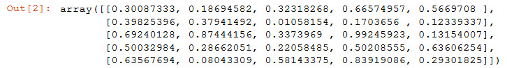
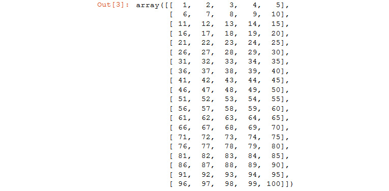
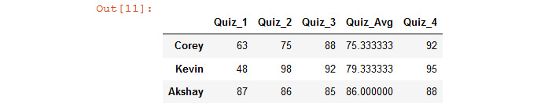

Lab 10. Data Analytics with pandas and NumPy
========================================

Overview

By the end of this lab, you will be able, use pandas to view,
create, analyze, and modify DataFrames; use NumPy to perform statistics
and speed up matrix computations; organize and modify data using read,
transpose, loc, iloc, and concatenate; clean data by deleting or
manipulating NaN values and coercing column types; visualize data by
constructing, modifying, and interpreting histograms and scatter plots;
generate and interpret statistical models using pandas and statsmodels
and solve real-world problems using data analytics techniques.


Exercise 128: Converting Lists to NumPy Arrays
----------------------------------------------

In this exercise, you will convert a list to a `numpy` array.
The following steps will enable you to complete the exercise:

1.  Open a new Jupyter Notebook.

2.  Firstly, you need to import `numpy`:

    ```
    import numpy as np
    ```

3.  Now, you\'ll create a list for `test_scores` and confirm
    the type of data:


    ```
    test_scores = [70,65,95,88]
    type(test_scores)
    ```

    The output will be as follows:


    ```
    list
    ```

    Note

    Now that `numpy` has been imported, you can access all
    `numpy` methods, such as `numpy` arrays. Type
    `np.`+ `Tab` on your keyboard to see the breadth
    of options. You are looking for an array.

4.  Now, you will convert the list of marks to a `numpy` array
    and check the `type` of the array. Enter the code in the
    following code snippet:


    ```
    scores = np.array(test_scores)
    type(scores)
    ```

    The output will be as follows:


    ```
    numpy.ndarray
    ```

In this exercise, you were able to convert a list of test score marks to
a NumPy array. You will find the mean using these values within the
NumPy array in *Exercise 129*, *Calculating the Mean of the Test Score*.


Exercise 129: Calculating the Mean of the Test Score
----------------------------------------------------

In this exercise, you will use the `numpy` array you created
to store our test scores from *Exercise 128*, *Converting Lists to NumPy
Arrays*, and you will calculate the mean of `testscores`. The
following steps will enable you to complete the exercise:

1.  Continue in the same Jupyter Notebook from *Exercise 128*,
    *Converting Lists to NumPy Arrays.*

2.  Now, to find the \"average\" of `testscore`, you can use
    the `mean` method, as shown here:


    ```
    scores.mean()
    ```

    The output will be as follows:


    ```
    79.5
    ```

    Note

    The word \"average\" is in quotation marks. This is not an accident.
    The mean is only one kind of average. Another kind of average is the
    median.

Given our test scores of 70, 65, 95, and 88, the \"average\" is 79.5,
which is the expected output. In this exercise, you were able to use the
`mean` function of NumPy and find the average of
`test_scores`. In the following exercise, you will find the
median using NumPy.

The median is the number in the middle. Although not necessarily the
best measure of test averages, it\'s an excellent measure of income
average.


Exercise 130: Finding the Median from a Collection of Income Data
-----------------------------------------------------------------

In this exercise, you will be finding the median from a collection of
income data for a neighborhood and help a millionaire decide whether he
should build his dream house in the neighborhood based on the income
data. The `median` function here is a method of
`numpy`.

The following steps will enable you to complete the exercise:

1.  Open a new Jupyter Notebook.

2.  Firstly, you need to import the `numpy` package as
    `np`, then create a `numpy` array and assign
    various pieces of `income` data, as shown in the following
    code snippet:

    ```
    import numpy as np
    income = np.array([75000, 55000, 88000, 125000, 64000, 97000])
    ```

3.  Next, find the mean of the income data:


    ```
    income.mean()
    ```

    The output will be as follows:


    ```
    84000
    ```

    So far, so good. `84000` is the average `income`
    on your block. Now, say the millionaire decides to build his dream
    house on the vacant corner lot. He adds a salary of 12 million
    dollars.

4.  Append the value of 12 million dollars to the current array and find
    the new mean:


    ```
    income = np.append(income, 12000000)
    income.mean()
    ```

    The output will be as follows:


    ```
    1786285.7142857143
    ```

    The new average income is 1.7 million dollars. Okay. Nobody makes
    close to 1.7 million dollars on the block. It\'s not a
    representative average. This is where the median comes into play.

    Note

    Median here is not a method of `np.array`, but it is a
    method of `numpy`. (The mean may be computed in the same
    way, as a method of numpy.)

5.  Now to find the `median` function from the
    `income` values you have:


    ```
    np.median(income)
    ```

    The output will be as follows:


    ```
    88000
    ```

This result says that half of the neighborhood residents make more than
88,000, and half of the blocks make less. This would give the
millionaire a fair idea of the neighborhood. In this particular case,
the median is a much better estimation of average income than the mean.

In the next section, you will be covering skewed data and outliers.


Skewed Data and Outliers
------------------------

Something about the 12 million salary does not sit right. It\'s nowhere
near anyone else\'s income. In statistics, there is official terminology
for this. You say that the data is skewed by an outlier of 12,000,000.
In particular, the data is right-skewed since 12,000,000 is far to the
right of every other data point.

Right-skewed data pulls the mean away from the median. In fact, if the
mean greatly exceeds the median, this is clear evidence of right-skewed
data. Similarly, if the mean is much less than the median, this is clear
evidence of left-skewed data.

Unfortunately, there is no universal way to compute individual outliers.
There are some general methods, but you won\'t get into them here. Just
keep in mind that outliers are far removed from other data points, and
they skew the data.


Standard Deviation
------------------

The standard deviation is a precise statistical measure of how spread
out data points are. In the following exercise, you will use the
standard deviation.


Exercise 131: Finding the Standard Deviation from Income Data
-------------------------------------------------------------

In this exercise, you will be using the income data from *Exercise 130*,
*Finding the Median from a Collection of Income Data*, and you will find
the amount of deviation you have between the income of the millionaire
to the regular residents living in the neighborhood.

The following steps will enable you to complete the exercise:

1.  Continue with the previous Jupyter Notebook.

2.  Now check the standard deviation using the `std()`
    function, as mentioned in the following code snippet:


    ```
    income.std()
    ```

    The output will be as follows:


    ```
    4169786.007331644
    ```

    As you can see, the standard deviation here is a huge number, which
    is 4 million, and this could be practically meaningless while you
    plot the data. On average, the incomes are not 4 million away from
    each other.

    Now, try to find the standard deviation from the
    `test_scores` data from *Exercise 128*, *Converting Lists
    to NumPy Arrays*.

3.  Assign the `test_scores` list value once again as this is
    a new Jupyter notebook:

    ```
    test_scores = [70,65,95,88]
    ```

4.  Now, convert this list to a `numpy` array:

    ```
    scores = np.array(test_scores)
    ```

5.  Now, find the standard deviation of `test_scores` using
    the `std()` function:


    ```
    scores.std()
    ```

    The output will be as follows:


    ```
    12.379418403139947
    ```

In this exercise, you observed that the income data is so skewed that
the standard deviation of 4 million is practically meaningless. But the
12.4 standard deviation of the test scores is very meaningful; the mean
test score of 79.5 with a standard deviation of 12.4 means that you can
expect the scores to be about 12 points away from the mean on average.

What if you need to find the maximum, minimum, or sum of the
`numpy` arrays? For instance, you can use the values from
`test_scores` to find the maximum, minimum, and sum of
`test_scores`.

You can find the maximum from the `numpy` array using the
`max()` method, the minimum using the `min()`
method, and the sum using the `sum()` method.

You can easily find the `max`, the `min`, and the
`sum` values of `numpy` arrays.

To find the maximum, enter the following code:


``` {.language-markup}
test_scores = [70,65,95,88]
scores = np.array(test_scores)  
scores.max()
```

The output will be as follows:


``` {.language-markup}
95
```

To find the minimum, enter the following code:


``` {.language-markup}
scores.min()
```

The output will be as follows:


``` {.language-markup}
65
```

To find the sum, enter the following code:


``` {.language-markup}
scores.sum()
```

The output will be as follows:


``` {.language-markup}
318
```


Matrices
========


A DataFrame is generally composed of rows, and each row has the same
number of columns. From one point of view, it\'s a two-dimensional grid
containing lots of numbers. It can also be interpreted as a list of
lists, or an array of arrays.

In mathematics, a matrix is a rectangular array of numbers defined by
the number of rows and columns. It is standard always to list rows
first, and columns second. For instance, a 2 x 3 matrix consists of 2
rows and 3 columns, whereas a 3 x 2 matrix consists of 3 rows and 2
columns.

Here is a 4 x 4 matrix:


Caption: Matrix representation of a 4 x 4 matrix


Exercise 132: Matrices
----------------------

NumPy has methods for creating matrices or n-dimensional arrays. One
option is to place random numbers between 0 and 1 into each entry, as
follows.

In this exercise, you will implement the various `numpy`
matrix methods and observe the outputs (recall that
`random.seed` will allow us to reproduce the same numbers, and
it\'s okay if you want to generate your own).

The following steps will enable you to complete the exercise:

1.  Begin with a new Jupyter Notebook.

2.  Now, generate a random 5 x 5 matrix, as shown in the following code
    snippet:


    ```
    import numpy as np 
    np.random.seed(seed=60)
    random_square = np.random.rand(5,5)
    random_square
    ```

    You should get the following output:

    



    Figure 10.2 A random matrix being generated

    In the preceding code, you have used `random.seed`. You
    just invoke **random.seed(seed=60)**, and whenever you run the
    script, you will get the same sequence of values.

    This is very similar to the DataFrames that you will be dealing with
    for the rest of this course. You can go through some code to obtain
    particular rows, columns, and entries.

3.  Now, find the rows and columns of the matrix that is generated.

    In general, if you omit the columns from the matrix
    `[row, column]`, `numpy` will select them all.


    ```
    # First row
    random_square[0]
    ```

    You should get the following output, consisting of all columns, and
    the first row:

    


    Caption: The values of the matrix row


    ```
    # First column 
    ```

    Now, to find the values of all the rows, and the first column of the
    matrix.


    ```
    random_square[:,0]
    ```

    You should get the following output, consisting of all rows, and the
    first column:

    


    Caption: The values of the matrix column

4.  Now find individual entries by specifying the value of the matrix
    `[row, column]`, as shown in the following code snippet:


    ```
    # First entry
    random_square[0,0]
    ```

    The output, the entry in the first row and first column, will be as
    follows:


    ```
    0.30087333004661876
    ```

    Here is the `first entry` using another way:


    ```
    random_square[0][0]
    ```

    The output will be as follows:


    ```
    0.30087333004661876
    ```

    Entry in 2nd row, 3rd column:


    ```
    random_square[2,3]
    ```

    The output will be as follows:


    ```
    0.9924592256795676
    ```

    Now, to find the mean values of the matrix, you will find the mean
    of the entire matrix, individual rows, and columns using the
    `square.mean()` method, as shown in the following code
    snippet.

    Here is the `mean` entry of the matrix:


    ```
    random_square.mean()
    ```

    The output will be as follows:


    ```
    0.42917627159618377
    ```

    Here is the `mean` entry of the first row:


    ```
    random_square[0].mean()
    ```

    The output will be as follows:


    ```
    0.4087444389228477
    ```

    Here is the `mean` entry of the last column:


    ```
    random_square[:,-1].mean()
    ```

    The output will be as follows:


    ```
    0.35019700684996913
    ```

In this exercise, you created a random 5 x 5 matrix and implemented a
few basic operations on the matrix.


Computation Time for Large Matrices
-----------------------------------

Now that you have gotten a hang of creating random matrices, you can see
how long it takes to generate a large matrix and compute the mean:


``` {.language-markup}
%%time
np.random.seed(seed=60)
big_matrix = np.random.rand(100000, 100)
```

The output will be as follows:


Caption: Computation time for a large matrix

Now, to find the computation time for the mean of the matrix.


``` {.language-markup}
%%time
big_matrix = np.random.rand(100000, 100)
big_matrix.mean()
```

You should get the following output:


Caption: Computation time for the mean of the matrix

Your time will be different than ours, but it should be in the order of
milliseconds. Not bad. It takes much less than a second to generate a
matrix of 10 million entries and compute its mean.

In the next exercise, you will create arrays using NumPy and compute
various values through them. One such computation you will be using is
`ndarray`. `numpy.ndarray` is a (usually fixed-size)
multidimensional array container of items of the same type and size.


Exercise 133: Creating an Array to Implement NumPy Computations
---------------------------------------------------------------

In this exercise, you will generate a new matrix and perform
mathematical operations on it, which will be covered later in this
exercise. Unlike with traditional lists, NumPy arrays allow each member
of the list to be manipulated with ease. The following steps will enable
you to complete the exercise:

1.  Open a new Jupyter Notebook.

2.  Now import `numpy` and create `ndarray` between
    `1` and `100`:


    ```
    import numpy as np
    np.arange(1, 101)
    ```

    You should get the following output:

    


    Caption: Showing ndarray with values 1 to 100

3.  Reshape the array to `20` rows and `5` columns:


    ```
    np.arange(1, 101).reshape(20,5)
    ```

    You should get the following output:

    



    Caption: Output with the reshaped array of 20 rows and 5 columns

4.  Now, define `mat1` as a `20` x `5`
    array between `1` and `100` and then subtract
    `50` from `mat1`, as shown in the following code
    snippet:


    ```
    mat1 = np.arange(1, 101).reshape(20,5)
    mat1 – 50
    ```

    You should get the following output:

    


    Caption: Output subtracting values from the array

5.  Now, multiply `mat1` by `10` and observe the
    change in the output:


    ```
    mat1 * 10
    ```

    You should get the following output:

    


    Caption: Output when you multiply mat1 by 10

6.  Now you need to add `mat1` to itself, as mentioned in the
    following code snippet:


    ```
    mat1 + mat1
    ```

    You should get the following output:

    


    Caption: Output of adding mat1 to itself

7.  Now you will multiply each entry in `mat1` by itself:


    ```
    mat1*mat1
    ```

    You should get the following output:

    


    Caption: Output of multiplying mat1 by itself

8.  Now, take the `dot` product of `mat1` and
    `mat1.T`:


    ```
    np.dot(mat1, mat1.T)
    ```

    You should get the following output:


The output shown above has been truncated.

In this exercise, you computed and added in values to an array, after
which you implemented different NumPy computations.

When it comes to data analysis, NumPy will make your life tremendously
easier. The ease with which NumPy arrays may be combined, manipulated,
and used to compute standard statistical measures like the mean, median,
and standard deviation make them far superior to Python lists. They also
handle big data so exceptionally well, it\'s hard to imagine the world
of data science without them.

In the next section, you will be covering pandas, which is another
library available in Python to make the life of a Python developer much
easier.


The pandas Library
==================


Pandas is the Python library that handles data on all fronts. Pandas can
import data, read data, and display data in an object called a
**DataFrame**. A DataFrame consists of rows and columns. One way to get
a feel for DataFrames is to create one.

In the IT industry, pandas is widely used for data manipulation. It is
also used for stock prediction, statistics, analytics, big data, and, of
course, data science.

In the following exercises, you will be working with DataFrames and
learning different computations that are available with them.


Exercise 134: Using DataFrames to Manipulate Stored Student testscore Data
--------------------------------------------------------------------------

In this exercise, you will create a **dictionary**, which is one of many
ways to create a `pandas` DataFrame. You will then manipulate
this data as required. In order to use pandas, you must import
`pandas`, which is universally imported as `pd`.
Pandas and NumPy are so omnipresent it\'s a good idea to import them
first before performing any kind of data analysis. The following steps
will enable you to complete the exercise:

1.  You\'ll begin by importing `pandas` as `pd`:


    ```
    import pandas as pd
    ```

    Now that you have imported `pandas`, you will create a
    `DataFrame`.

2.  First, you will create a dictionary of test scores as
    `test_dict`:

    ```
    # Create dictionary of test scores
    test_dict = {'Corey':[63,75,88], 'Kevin':[48,98,92], 'Akshay': [87, 86, 85]}
    ```

3.  Next, you place the `text_dict` into the DataFrame using
    the `DataFrame` method:

    ```
    # Create DataFrame
    df = pd.DataFrame(test_dict)
    ```

4.  Now, you can display the Dataframe:


    ```
    # Display DataFrame
    df
    ```

    You should get the following output:

    


    Caption: Output with the values added in the DataFrame

    You can inspect the `DataFrame`. First, each dictionary
    key is listed as a column. Second, the rows are labeled with indices
    starting with `0` by default. Third, the visual layout is
    clear and legible.

    Each column and row of `DataFrame` is officially
    represented as a **Series**. A series is a one-dimensional
    `ndarray`.

    Now, you will rotate the DataFrame, which is also known as a
    **transpose**, a standard `pandas` method. A transpose
    turns rows into columns and columns into rows.

5.  Copy the code shown in the following code snippet to perform a
    transpose on the DataFrame:


    ```
    # Transpose DataFrame
    df = df.T
    df
    ```

    You should get the following output:


Caption: The output of the transpose on the DataFrame

In this exercise, you created a DataFrame that holds the values of
`testscores`, and to finish, you transposed this DataFrame to
get the output. In the next exercise, you will look at renaming column
names and selecting data from the DataFrame, which is an important part
of working with pandas.


Exercise 135: DataFrame Computations with the Student testscore Data
--------------------------------------------------------------------

In this exercise, you will rename the columns of the DataFrame, and you
will then select the data to display as output from the DataFrame:

1.  Open a new Jupyter Notebook.

2.  Import `pandas` as `pd` and enter the student
    value, as shown in *Exercise 134*, *Using DataFrames to Manipulate
    Stored Student testscore Data*. After this, convert it to a
    DataFrame and have it transposed:

    ```
    import pandas as pd
    # Create dictionary of test scores
    test_dict = {'Corey':[63,75,88], 'Kevin':[48,98,92], 'Akshay': [87, 86, 85]}
    # Create DataFrame
    df = pd.DataFrame(test_dict)
    df = df.T
    ```

3.  Now rename the columns to something more precise. You can use
    `.columns` on the DataFrame to rename the column names:


    ```
    # Rename Columns
    df.columns = ['Quiz_1', 'Quiz_2', 'Quiz_3']
    df
    ```

    You should get the following output:

    


    Caption: Output with changed column names

    Now, select a range of values from specific rows and columns. You
    will be using `.iloc` with the index number, which is a
    function present in a pandas DataFrame for selection. This is shown
    in the following step:

4.  Select a range of rows:


    ```
    # Access first row by index number
    df.iloc[0]
    ```

    You should get the following output:

    


    Caption: Output with the selected values

5.  Now, select a column using its name, as shown in the following code
    snippet.

    You can access columns by putting the column name in quotes inside
    of brackets:


    ```
    # Access first column by name
    df['Quiz_1']
    ```

    You should get the following output:

    


6.  Now, select a column using the dot (`.`) notation:


    ```
    # Access first column using dot notation
    df.Quiz_1
    ```

    You should get the following output:


Caption: Output of selecting a column using the dot notation

Note

There are limitations to using dot notation, so bracket quotations are
often preferable.

In this exercise, you implemented and changed the column names of the
DataFrame. Next, you used `.iloc` to select data as per our
requirement from the DataFrame.

In the next exercise, you will implement different computations on the
DataFrame.


Exercise 136: Computing DataFrames within DataFrames
----------------------------------------------------

In this exercise, you will use the same `testscore` data and
perform more computations on the DataFrame. The following steps will
enable you to complete the exercise:

1.  Open a new Jupyter Notebook.

2.  Import `pandas` as `pd` and enter the student
    value as shown in *Exercise 135*, *DataFrame Computations with the
    Student testscore Data*. After this, convert it to a DataFrame:

    ```
    import pandas as pd
    # Create dictionary of test scores
    test_dict = {'Corey':[63,75,88], 'Kevin':[48,98,92], 'Akshay': [87, 86, 85]}
    # Create DataFrame
    df = pd.DataFrame(test_dict)
    ```

3.  Now, begin by arranging the rows of the DataFrame, as shown in the
    following code snippet.

    You can use the same bracket notation, `[]`, for rows as
    for lists and strings:


    ```
    # Limit DataFrame to first 2 rows
    df[0:2]
    ```

    You should get the following output:

    


    Caption: Output of arranging rows

4.  Transpose the DataFrame:

    ```
    df = df.T
    df
    ```

5.  Now, rename the columns to `Quiz_1`, `Quiz_2`,
    and `Quiz_3`, which was covered in *Exercise 135*,
    *DataFrame Computations with the Student testscore Data*:


    ```
    # Rename Columns
    df.columns = ['Quiz_1', 'Quiz_2', 'Quiz_3']
    df
    ```

    You should get the following output:

    


    Caption: Output with the renamed column names

6.  Now, define a new `DataFrame` from the first two rows and
    the last two columns.

    You can choose the rows and columns by name first, as shown in the
    following code snippet:


    ```
    # Defining a new DataFrame from first 2 rows and last 2 columns 
    rows = ['Corey', 'Kevin']
    cols = ['Quiz_2', 'Quiz_3']
    df_spring = df.loc[rows, cols]
    df_spring
    ```

    You should get the following output:

    


    Caption: Output of the newly defined DataFrame

7.  Now, select the first two rows and the last two columns using index
    numbers.

    You can use `.iloc` to select rows and columns by index,
    as shown in the following code snippet:


    ```
    # Select first 2 rows and last 2 columns using index numbers 
    df.iloc[[0,1], [1,2]]
    ```

    You should get the following output:

    


    Now, add a new column to find the quiz average of our students.

    You can generate new columns in a variety of ways. One way is to use
    available methods such as the mean. In pandas, it\'s important to
    specify the axis. An axis of 0 represents the index, and an axis of
    1 represents the rows.

8.  Now, create a new column as the mean, as shown in the following code
    snippet:


    ```
    # Define new column as mean of other columns
    df['Quiz_Avg'] = df.mean(axis=1)
    df
    ```

    You should get the following output:

    


    Caption: Adding a new quiz\_avg column to the output

    A new column can also be added as a list by choosing the rows and
    columns by name first.

9.  Create a new column as a list, as shown in the following code
    snippet:


    ```
    df['Quiz_4'] = [92, 95, 88]
    df
    ```

    You should get the following output:

    



    Caption: Output with a newly added column using lists

    What if you need to delete the column you created? You can do so by
    using the `del` function. It\'s easy to delete columns in
    pandas using `del`.

10. Now, delete the `Quiz_Avg` column as it is not needed
    anymore:


    ```
    del df['Quiz_Avg']
    df
    ```

    You should get the following output:


Caption: Output with a deleted column

In this exercise, you implemented different ways to add and remove
columns as per our requirements. In the next section, you will be
looking at new rows and `NaN`, which is an official
`numpy` term.


New Rows and NaN
----------------

It\'s not easy to add new rows to a pandas DataFrame. A common strategy
is to generate a new DataFrame and then to concatenate the values.

Say you have a new student who joins the class for the fourth quiz. What
values should you put for the other three quizzes? The answer is NaN. It
stands for **Not a Number**

`NaN` is an official NumPy term. It can be accessed using
`np.NaN`. It is case-sensitive. In later exercises, you will
look at how NaN can be used. In the next exercise, you will look at
concatenating and working with null values.


Exercise 137: Concatenating and Finding the Mean with Null Values for Our testscore Data
----------------------------------------------------------------------------------------

In this exercise, you will be concatenating and finding the mean with
null values for the student `testscore` data you created in
*Exercise 136*, *Computing DataFrames within DataFrames* with four quiz
scores. The following steps will enable you to complete the exercise:

1.  Open a new Jupyter Notebook.

2.  Import `pandas` and `numpy` and create a
    dictionary with the `testscore` data to be transformed
    into a DataFrame, as mentioned in *Exercise 134*, *Using DataFrames
    to Manipulate Stored Student testscore Data:*

    ```
    import pandas as pd
    # Create dictionary of test scores
    test_dict = {'Corey':[63,75,88], 'Kevin':[48,98,92], 'Akshay': [87, 86, 85]}
    # Create DataFrame
    df = pd.DataFrame(test_dict)
    ```

3.  Transpose the DataFrame and rename the columns:


    ```
    df = df.T
    df
    # Rename Columns
    df.columns = ['Quiz_1', 'Quiz_2', 'Quiz_3']
    df
    ```

    You should get the following output:

    


    Caption: The transposed and renamed DataFrame

4.  Now, add a new column, as shown in *Exercise 136*, *Computing
    DataFrames within DataFrames*:


    ```
    df['Quiz_4'] = [92, 95, 88]
    df
    ```

    You should get the following output:

    


    Caption: Output of the added Quiz\_4 column

5.  Now, add a new row with the value set as `Adrian`, as
    shown in the following code snippet:

    ```
    import numpy as np
    # Create new DataFrame of one row
    df_new = pd.DataFrame({'Quiz_1':[np.NaN], 'Quiz_2':[np.NaN], 'Quiz_3': [np.NaN], 'Quiz_4':[71]}, index=['Adrian'])
    ```

6.  Now, concatenate `Dataframe` with the added new row,
    `Adrian`, and display the new `Dataframe` value
    using `df`:


    ```
    # Concatenate DataFrames
    df = pd.concat([df, df_new])
    # Display new DataFrame
    df
    ```

    You should get the following output:

    


    Caption: Output with the row added to the DataFrame

    You can now compute the new mean, but you must skip the
    `NaN` values; otherwise, there will be no mean score for
    `Adrian`. This will be fixed in step 7.

7.  Find the `mean` value ignoring NaN and use these values to
    create a new column named `Quiz-Avg`, as shown in the
    following code snippet:


    ```
    df['Quiz_Avg'] = df.mean(axis=1, skipna=True)
    df
    ```

    You should get the following output:


Caption: Output with quiz\_4 values added to Adrian

Notice that all values are floats except for `Quiz_4`. There
will be occasions when you need to cast all values in a particular
column as another type.


Cast Column Types
-----------------

For the sake of consistency, you will do that here. Cast all the ints in
`Quiz_4` that you used in *Exercise 137*, *Concatenating and
Finding the Mean with Null Values for Our testscore Data* as floats
using the following code snippet:


``` {.language-markup}
df.Quiz_4.astype(float)
```

You should get the following output:


Caption: Output with the cast column types

You can observe the change in values by examining the DataFrame
yourself. Now, move on to the next topic: which is data.


Data
====


Now that you have been introduced to NumPy and pandas, you will use them
to analyze some real data.

Data scientists analyze data that exists in the cloud or online. One
strategy is to download data directly to your computer.

Note

It is recommended to create a new folder to store all of your data. You
can open your Jupyter Notebook in this same folder.


Downloading Data
----------------

Data comes in many formats, and pandas is equipped to handle most of
them. In general, when looking for data to analyze, it\'s worth
searching the keyword \"dataset.\" A dataset is a collection of data.
Online, \"data\" is everywhere, whereas datasets contain data in its raw
format.

You will start by examining the famous Boston Housing dataset from 1980. This dataset can be found in `Datasets` folder.

You can begin by first downloading the dataset onto our system.


Downloading the Boston Housing Data from GitHub
-----------------------------------------------

1.  Head to the GitHub repository and download the dataset onto your
    system.
2.  Move the downloaded dataset file into your data folder.
3.  Open a Jupyter Notebook in the same folder.


Reading Data
------------

Now that the data is downloaded, and the Jupyter Notebook is open, you
are ready to read the file. The most important part of reading a file is
the extension. Our file is a `.csv` file. You need a method
for reading `.csv` files.

CSV stands for Comma-Separated Values. CSV files are a popular way of
storing and retrieving data, and pandas handles them very well.

Here is a list of standard data files that pandas will read, along with
the code for reading data:


Caption: Standard data files that pandas read

If the files are clean, pandas will read them properly. Sometimes, files
are not clean, and changing function parameters may be required. It\'s
advisable to copy any errors and search for solutions online.

A further point of consideration is that the data should be read into a
`DataFrame`. Pandas will convert the data into a DataFrame
upon reading it, but you need to save `DataFrame` as a
variable.

Note

`df` is often used to store DataFrames, but it\'s not
universal since you may be dealing with many DataFrames.

In *Exercise 138*, *Reading and Viewing the Boston Housing Dataset*, you
will be using the Boston Housing dataset and performing basic actions on
the data.


Exercise 138: Reading and Viewing the Boston Housing Dataset
------------------------------------------------------------

In this exercise, your goal is to read and view the Boston Housing
dataset in our Jupyter Notebook. The following steps will enable you to
complete the exercise:

1.  Open a new Jupyter Notebook.

2.  Import `pandas` as `pd`:

    ```
    import pandas as pd
    ```

3.  Now, choose a variable to store `DataFrame` and place the
    `HousingData.csv` file in the folder for *Exercise 138*.
    Then, run the following command:


    ```
    housing_df = pd.read_csv('HousingData.csv')
    ```

    If no errors arise, the file has been properly read. Now you can
    examine and view the file.

4.  Now, you need to view the file by entering the following command:


    ```
    housing_df.head()
    ```

    The `pandas` `.head` method does just that. By
    default, it selects the first five rows. You may enter more if you
    choose by adding a number in parentheses.

    You should get the following output:


Before you explore operations performed on this dataset, you may wonder
what values such as `CRIM` and `ZN` mean in the
dataset.

It\'s always nice to view data to get a general feel for things. In this
particular case, you might want to know what the columns actually mean:


Caption: Representation of the column values of the dataset

Now that you know what the values in the dataset mean you will start
performing some advanced operations on the dataset. You will cover this
in the following exercise.


Exercise 139: Gaining Data Insights on the Boston Housing Dataset
-----------------------------------------------------------------

In this exercise, you will be performing some more advanced operations
and using pandas methods to understand the dataset and get desired
insights. The following steps will enable you to complete the exercise:

1.  Open a new Jupyter Notebook and copy the dataset file into a
    separate folder where you will perform this exercise.

2.  Import pandas and choose a variable to store `DataFrame`
    and place the `HousingData.csv` file:

    ```
    import pandas as pd
    housing_df = pd.read_csv('HousingData.csv')
    ```

3.  Now, use the `describe()` method to display key
    statistical measures of each column, including the mean, median, and
    quartiles, as shown in the following code snippet:


    ```
    housing_df.describe()
    ```

    You should get the following output:

    


    Caption: Output with the desired () method

    In this output, you will review the meaning of each row.

    `Count`: The number of rows with actual values.

    `Mean`: The sum of each entry divided by the number of
    entries. It is often a good estimate of the average.

    `Std`: The number of unit entries that are expected to
    deviate from the mean. It is a good measure of spread.

    `Min`: The smallest entry in each column.

    `25%`: The first quartile. 25% of the data has a value
    less than this number.

    `50%`: The median. The halfway marker of the data. It is
    another good estimate of the average.

    `75%`: The third quartile. 75% of the data has a value
    less than this number.

    `Max`: The largest entry in each column.

4.  Now use the `info()` method to deliver a full list of
    columns.

    `info()` is especially valuable when you have hundreds of
    columns, and it takes a long time to horizontally scroll through
    each one:


    ```
    housing_df.info()
    ```

    You should get the following output:


Caption: Output with the info () method

As you can see, `.info()` reveals the count of non-null values
in each column along with the column type. Since some columns have less
than 506 non-null values, it\'s safe to assume that the other values are
null values.

In this dataset, there are a of total of 506 rows and 14 columns. You
can use the `.shape` attribute to obtain this information.

Now confirm the number of rows and columns in the dataset:


``` {.language-markup}
housing_df.shape
```

You should get the following output:


``` {.language-markup}
(506, 14)
```

This confirms that you have 506 rows and 14 columns. Notice that
`shape` does not have any parentheses after it. This is
because it\'s technically an attribute and pre-computed.

In this exercise, you performed basic operations on the dataset, such as
describing the dataset and finding the number of rows and columns in the
dataset.

In the next section, you will cover null values.


Null Values
===========


You need to do something about the null values. There are several
popular choices when dealing with null values:

1.  Eliminate the rows: A great approach if null values are a very small
    percentage, such as 1% of the total dataset.

2.  Replace with a significant value, such as the median or the mean: A
    great approach if the rows are valuable, and the column is
    reasonably balanced.

3.  Replace with the most likely value, perhaps a 0 or 1: It\'s
    preferable to option 2 when the median might be useless. The median
    can often work here.

    Note

    **mode** is the official term for the value that occurs the greatest
    number of times.

As you can see, which option you choose depends on the data.


Exercise 140: Null Value Operations on the Dataset
--------------------------------------------------

In this exercise, you will perform a null value operation. You can only
select the columns that have null values in our dataset:

1.  Open a new Jupyter Notebook and copy the dataset file within a
    separate folder where you will perform this exercise.

2.  Import `pandas` and choose a variable to store the
    `DataFrame` and place the `HousingData.csv`
    file:

    ```
    import pandas as pd
    housing_df = pd.read_csv('HousingData.csv')
    ```

3.  Now, find values and columns in the dataset with `null`
    values, as shown in the following code snippet:


    ```
    housing_df.isnull().any()
    ```

    You should get the following output:

    


    Caption: Output of the columns with null values

    The `.isnull()` method will display an entire
    `DataFrame` of `True/False` values depending on
    the `Null` value. Give it a try.

    The `.any()` method returns the individual columns.

    Take it a step further and choose the `DataFrame` with
    those columns.

4.  Now, using the `DataFrame`, find the null columns.

    You can use `.loc` to find the location of particular
    rows. You will select the first five rows and all of the columns
    that have null values, as shown in the following code snippet:


    ```
    housing_df.loc[:5, housing_df.isnull().any()]
    ```

    You should get the following output:

    


    Caption: Output of the dataset with the null columns

    Now for the final step. Use the `.describe` method on
    these particular columns but select all of the rows.

5.  Use the `.describe()` method on the null columns of the
    dataset.

    The code mentioned ahead is a long piece of the code snippet.
    `housing_df` is the DataFrame. `.loc` allows you
    to specify rows and columns. `:` selects all rows.
    `housing_df.isnull().any()` selects only columns with null
    values. `.describe()` pulls up the statistics:


    ```
    housing_df.loc[:, housing_df.isnull().any()].describe()
    ```

    You should get the following output:


Consider the first column, `CRIM`. The mean is way more than
the median (`50%`). This indicates that the data is very
right-skewed with some outliers. Indeed, you can see that the maximum of
`88.97` is much larger than the `3.56` value of the
`75th` percentile. This makes the mean a poor replacement
candidate for this column.

It turns out, after examining every column, that the median is a good
candidate. Although the median is clearly not better than the mean in
some cases, there are a few cases where the mean is clearly worse
(`CRIM`, `ZN`, and `CHAS`).

The choice depends on what you ultimately want to do with the data. If
the goal is a straightforward data analysis, eliminating the rows with
null values is worth consideration. However, if the goal is to use
machine learning to predict data, then perhaps more is to be gained by
changing the null values to a suitable replacement. It\'s impossible to
know in advance.

A more thorough examination could be warranted depending on the data.
For instance, if analyzing new medical drugs, it would be worth putting
more time and energy into appropriately dealing with null values. You
may want to perform more analysis to determine whether a value is 0 or
1, depending upon other factors.

In this particular case, replacing all the null values with the median
is warranted. You can have a look at this in the following example.


Replacing Null Values
---------------------

Pandas include a nice method, `fillna`, which can be used to
replace null values. It works for individual columns and entire
DataFrames. You will use three approaches, replacing the null values of
a column with the mean, replacing the null values of a column with
another value, and replacing all the null values in the entire dataset
with the median. You will use the same Boston Housing dataset.

Replace null column values with `mean`:


``` {.language-markup}
housing_df['AGE'] = housing_df['AGE'].fillna(housing_df.mean())
```

Then, replace null column values with a value:


``` {.language-markup}
housing_df['CHAS'] = housing_df['CHAS'].fillna(0)
```

Replace null DataFrame values with `median`:


``` {.language-markup}
housing_df = housing_df.fillna(housing_df.median())
```

Finally, check that all null values have been replaced:


``` {.language-markup}
housing_df.info()
```

You should get the following output:


Caption: Output with the null values eliminated

After eliminating all null values, the dataset is much cleaner. There
may also be unrealistic outliers or extreme outliers that will lead to
poor prediction. These can often be detected through visual analysis,
which you will be covering in the next section.


Visual Analysis
===============


Most people interpret the data visually. They prefer to view colorful,
meaningful graphs that make sense of the data. As a data science
practitioner, it\'s your job to create these graphs.

In this section, you will primarily focus on two kinds of graphs:
histograms and scatter plots. You will use Python to create these
graphs. Although software packages such as Tableau are rather popular,
they are essentially drag and drop. Since Python is an all-purpose
programming language, the limitations are only what you know and are
capable of doing.


The matplotlib Library
----------------------

A popular Python library for creating graphs is `matplotlib`.
It\'s traditionally imported as `plt`, as shown in the
following code snippet:


``` {.language-markup}
import matplotlib.pyplot as plt
%matplotlib inline
```

Note the strange second line of code. It basically shows all graphs
within Jupyter Notebooks instead of exporting them to external files.
It\'s used when you want to see the graphs right there in front of you.


Histograms
----------

Creating a histogram is rather simple. You choose a column and place it
inside of `plt.hist()`. The general idea behind a histogram is
that it groups the `x` value (in our case, the median home
value) into various bins. The height of the bin is determined by the
number of values that fall into that particular range. By default,
Matplotlib selects 10 bins.

In order to make the graph more meaningful, you should add some labels.
You can also use the Seaborn library by importing `seaborn` as
`sns` , which provides some nice added visuals.


Exercise 141: Creating a Histogram Using the Boston Housing Dataset
-------------------------------------------------------------------

In this exercise, you will use `MEDV`, the median value of the
Boston Homes dataset, a future target column for machine learning. The
following steps will enable you to complete the exercise:

1.  Open a new Jupyter Notebook and copy the dataset file into a
    separate folder where you will perform this exercise.

2.  Import `pandas` as pd and choose a variable,
    `housing_df`, to store the `DataFrame` after
    reading the `HousingData` csv file.:

    ```
    import pandas as pd
    housing_df = pd.read_csv('HousingData.csv')
    ```

3.  Next, you need to import `matplotlib` as `plt`,
    as shown here:


    ```
    import matplotlib.pyplot as plt
    %matplotlib inline
    ```

    Note

    The `%matplotlib` inline ensures that your graphs appear
    in the Jupyter Notebook instead of external files.

4.  Now, import `seaborn` which will make the graph more
    visually appealing.

    ```
    import seaborn as sns
    # Set up seaborn dark grid
    sns.set()
    ```

5.  Now plot the histogram for the dataset.


    ```
    plt.hist(housing_df['MEDV'])
    plt.show()
    ```

    You should get the following output:

    


    Caption: Output of the histogram

6.  Now, plot the changes onto the histogram, as shown in the following
    code snippet:


    ```
    plt.hist(housing_df['MEDV'])
    plt.title('Median Boston Housing Prices')
    plt.xlabel('1980 Median Value in Thousands')
    plt.ylabel('Count')
    plt.show()
    ```

    You should get the following output:

    


    Caption: Histogram with meaningful values using seaborn

    Now, this is a bit clearer. But in the Jupyter Notebook, the entry
    is a little small. You can make the graph and the title larger. You
    can also save the figure using the title of the graph.

7.  Make the histogram clearer by increasing the
    `dpi(dots per inch)` and the `fontsize`. This
    indicates that the output is really flexible, as per our needs. Copy
    the following code snippet and observe the change in the output:


    ```
    title = 'Median Boston Housing Prices'
    plt.figure(figsize=(10,6))
    plt.hist(housing_df['MEDV'])
    plt.title(title, fontsize=15)
    plt.xlabel('1980 Median Value in Thousands')
    plt.ylabel('Count')
    plt.savefig(title, dpi=300)
    plt.show()
    ```

    You should get the following output:


Caption: Output of an ideal histogram

By the end of this exercise, you were able to achieve a solid histogram,
which can help to communicate your results to a wider audience.

Now, say you want to create another histogram. Should you keep copying
the same code? Copying code repeatedly is never a good idea. It\'s
better to write functions.


Histogram Functions
-------------------

Define a histogram function, as mentioned in the following code snippet:


``` {.language-markup}
def my_hist(column, title, xlab, ylab):
    plt.figure(figsize=(10,6))
    plt.hist(column)
    plt.title(title, fontsize=15)
    plt.xlabel(xlab)
    plt.ylabel(ylab)
    plt.savefig(title, dpi=300)
    plt.show()
```

It\'s not easy to create functions with Matplotlib, so you should go
over the parameters carefully. The `figsize` allows you to
establish the size of the figure. The `column` is the
essential parameter. It\'s what you are going to be graphing. Next, you
have the title, followed by the label for the x and y axes. Finally, you
save the figure and show the plot. Inside of the function is basically
the same code that you ran before. You can try it on a new column ---
the number of rooms.

Do this by calling the histogram function, as mentioned in the following
code snippet:


``` {.language-markup}
my_hist(housing_df['RM'], 'Average Number of Rooms in Boston Households', 'Average Number of Rooms', 'Count')
```

You should get the following output:


Caption: Output with the histogram function

Okay. It\'s not bad, but there\'s one glaring issue. It\'s the
distribution of bins. It seems most rooms have an average of six, but
how many of those are closer to seven? Our graph could be improved if
each histogram was clearly between two numbers on the plot. A survey of
the preceding data (check `max` and `min` from
`.describe()`), reveals that the average number of rooms is
between three and nine.

In addition to changing the bins, you can also add options to change the
color, and the alpha, or transparency.

You can improve the built histogram function, as mentioned in the
following code snippet:


``` {.language-markup}
def my_hist(column, title, xlab, ylab, bins=10, alpha=0.7, color='c'):
    title = title
    plt.figure(figsize=(10,6))
    plt.hist(column, bins=bins, range=(3,9), alpha=alpha, color=color)
    plt.title(title, fontsize=15)
    plt.xlabel(xlab)
    plt.ylabel(ylab)
    plt.savefig(title, dpi=300)
    plt.show() 
```

The number of bins is 10 by default, so you can change it whenever you
desire. `alpha` is a convenient tool that can be used to make
the bars transparent. 1.0 has no transparency, and 0.0 has full
transparency. Play around with this to select the number that you like.

Call the improved histogram function:


``` {.language-markup}
my_hist(housing_df['RM'], 'Average Number of Rooms in Boston', 'Average Number of Rooms', 'Count', bins=6)
```

You should get the following output:


Caption: Output of the improved histogram function being called

Now it\'s clear that the highest average is between six and seven. Also,
note that this dataset is surveying groups of houses, not individual
houses. This is why the average number of rooms is between 6 and 7.

Now that you have understood histograms you can have a look at another
type of visual data analysis, called scatter plots.


Scatter Plots
-------------

Scatter plots are hugely important in data analysis. They require an x
value, and a y value, typically taken from two numeric columns of a
DataFrame. You can use the average number of rooms as our x value and
the average median income as our y value.


Exercise 142: Creating a Scatter Plot for the Boston Housing Dataset
--------------------------------------------------------------------

In this exercise, you will create a scatter plot for our Boston housing
dataset.

The following steps will enable you to complete the exercise:

1.  Open a new Jupyter file and copy the dataset file into a separate
    folder.

2.  Import `pandas` and choose a variable to store the
    `DataFrame` and place the `HousingData.csv`
    file:

    ```
    import pandas as pd
    housing_df = pd.read_csv('HousingData.csv')
    ```

3.  Next, you need to import `matplotlib` as `plt`,
    as shown here:

    ```
    import matplotlib.pyplot as plt
    %matplotlib inline
    ```

4.  Now you need to plot the scatter plot data, as shown in the
    following code snippet:


    ```
    x = housing_df['RM']
    y = housing_df['MEDV']
    plt.scatter(x, y) 
    plt.show()
    ```

    You should get the following output:


Caption: Scatter plot output of the dataset

There is a definite positive association. This means that as the x value
goes up, the y value goes up.

In statistics, there is a particular concept to determine association;
it\'s called **correlation**.


Correlation
-----------

Correlation is a statistical measure between -1 and +1 that indicates
how closely two variables are related. A correlation of -1 or +1 means
that variables are dependent, and they fall in a perfectly straight
line. A correlation of 0 indicates that an increase in one variable
gives no information whatsoever about the other variable. Visually, this
would be points all over the place. Correlations usually fall somewhere
in the middle. For instance, a correlation of 0.75 represents a fairly
strong relationship, whereas a correlation of 0.25 is a reasonably weak
relationship. Positive correlations go up (meaning as x goes up, y goes
up), and negative correlations go down.

In the following exercise, you will find the correlation values from the
Boston Housing dataset.


Exercise 143: Correlation Values from the Dataset
-------------------------------------------------

In this exercise, you will find the correlation values from the Boston
Housing dataset. The following steps will enable
you to complete the exercise:

1.  Open a new Jupyter Notebook and copy the `dataset` file
    into a separate folder where you will perform this exercise.

2.  Import `pandas` and choose a variable to store
    `DataFrame` and place the `HousingData.csv`
    file:

    ```
    import pandas as pd
    housing_df = pd.read_csv('HousingData.csv')
    ```

3.  Next, you need to import `matplotlib` as `plt`,
    as shown here:

    ```
    import matplotlib.pyplot as plt
    %matplotlib inline
    ```

4.  Now, find the correlation value of the dataset, as shown in the
    following code snippet:


    ```
    housing_df.corr()
    ```

    You should get the following output:

    


    Caption: Correlation value output

    This tells us the exact correlation values. For instance, to see
    what variables are the most correlated with the
    `Median Value Home`, you can examine the values under the
    `MEDV` column. There, you will find that `RM` is
    the largest at `0.695360`. But you also see a value of
    `-0.735822` for `LSTAT`, which is the percentage
    of the lower status of the population. Seaborn provides a nice way
    to view correlations, called a heatmap. You can have a look at a
    heatmap in the following step.

    Now, you need to get the heatmap for the correlation values.

5.  Begin by importing the `seaborn` module as
    `sns`:

    ```
    import seaborn as sns
    # Set up seaborn dark grid
    sns.set()
    ```

6.  Now find the `heatmap`, as shown in the following code
    snippet:


    ```
    corr = housing_df.corr()
    plt.figure(figsize=(8,6))
    sns.heatmap(corr, xticklabels=corr.columns.values, 
    yticklabels=corr.columns.values, cmap="Blues", linewidths=1.25, alpha=0.8)
    plt.show()
    ```

    You should get the following output:


Caption: Heatmap for the correlation values

The darker the squares, the higher the correlation, and the lighter the
squares, the lower the correlation. Now when examining the MEDV column,
it\'s much easier to find the darkest square RM, and the lightest square
LSTAT. You may have noticed that technically the MEDV square is the
darkest. This has to be true because MEDV is perfectly correlated with
itself. The same holds for each column along the diagonal.

In this exercise, you were able to work with correlation values from the
dataset and get a visual aid for the data output.

In the next section, you will have a look at regression.


Regression
----------

Perhaps the most important addition to a scatter plot is the regression
line. The idea of regression came from Sir Francis Galton, who measured
the heights of the offspring of very tall and very short parents. The
offspring were not taller or shorter than these parents on average, but
rather closer to the mean height of all people. Sir Francis Galton used
the term \"regression to the mean,\" meaning that the heights of the
offspring were closer to the mean of their very tall or very short
parents. The name stuck.

In statistics, a regression line is a line that tries to fit the values
of a scatter plot as closely as possible. Generally speaking, half of
the points are above the line, and half of the points are below. The
most popular regression line method is ordinary least squares, which
sums the square of the distance from each point to the line.

There are a variety of methods to compute and display regression lines
using Python.


Plotting a Regression Line
--------------------------

To create a regression line of our Boston dataset, the following code
steps need to be followed:


``` {.language-markup}
plt.figure(figsize=(10, 7))
sns.regplot(x,y)
plt.show()
```

You should get the following output:


StatsModel Regression Output
----------------------------

You will import `StatsModel` and use its methods to print out
a summary of the regression line:


``` {.language-markup}
import statsmodels.api as sm
X = sm.add_constant(x)
model = sm.OLS(y, X)
est = model.fit()
print(est.summary())
```

The strangest part of the code is adding the constant. This is basically
the y-intercept. When the constant is not added, the y-intercept is 0.
In our case, it makes sense that the y-intercept would be 0; if there
are 0 rooms, the house should have no value. In general, however, it\'s
a good idea to keep a y-intercept, and it\'s the default choice of the
preceding Seaborn graph. It\'s a good idea to try both methods and
compare the results of the data. A comparative analysis will definitely
improve your background in statistics:


Additional Models
-----------------

There\'s a great deal of data analysis in Python --- far more than you
can adequately cover in an introductory text. Thus far, you have covered
histograms and scatter plots in considerable detail. Two additional
types of plots will be highlighted before moving on to machine learning.


Exercise 144: Box Plots
-----------------------

A box plot provides a nice visual of the mean, median, quartiles, and
outliers of a given column of data.

In this exercise, you will create box plots using the Boston Housing
dataset. The following steps will enable you to complete the exercise:

1.  Open a new Jupyter Notebook and copy the dataset file within a
    separate folder where you will perform this exercise.

2.  Import `pandas` and choose a variable to store the
    DataFrame and place the `HousingData.csv` file:

    ```
    import pandas as pd
    housing_df = pd.read_csv('HousingData.csv')
    import matplotlib.pyplot as plt
    %matplotlib inline
    import seaborn as sns
    # Set up seaborn dark grid
    sns.set()
    ```

3.  Now, enter the following code in the code snippet to create a box
    plot:


    ```
    x = housing_df['RM']
    y = housing_df['MEDV']
    plt.boxplot(x)
    plt.show()
    ```

    You should get the following output:


Caption: Box plot output

Note that the open circles are considered outliers. The orange bar in
the middle is the median, and the bars at the end of the black box are
the 25th and 75th percentiles, or the 1st and 3rd quartiles,
respectively. The end bars represent the quartiles plus or minus 1.5
times the interquartile range. The value of 1.5 times the interquartile
range is a standard limit in statistics used to define outliers. In this
exercise, you created a box plot graph to represent the graph.


Violin Plots
------------

A violin plot is a different type of plot that conveys similar
information:


``` {.language-markup}
plt.violinplot(x)
plt.show()
```

You should get the following output:


Activity 24: Data Analysis to Find the Outliers in Pay versus the Salary Report in the UK Statistics Dataset
------------------------------------------------------------------------------------------------------------

You are working as a data scientist, and you come across a government
dataset that seems really interesting with regard to pay. But as the
dataset values are cluttered, you need to use visual data analysis to
study the data and come to a conclusion to understand whether there are
any outliers in the dataset.

In this activity, you will be performing visual data analysis using
histograms and scatter plots and creating a regression line to come to a
certain conclusion.

Follow these steps to complete this activity:

1.  First, you need to copy the `UKStatistics.csv` dataset
    file into a specific folder.

2.  Now, import the necessary data visualization packages.

3.  View the dataset file and find the number of rows and columns in the
    dataset file.

4.  Plot the histogram for `Actual Pay Floor (£)`.

5.  Plot the scatter plot using the values for `x` as
    `Salary Cost of Reports (£)` and `y` as
    `Actual Pay Floor (£)`.

6.  Now get the box plot for the `x` and `y` values,
    as shown in *Step 5*.

    More information on the `UKStatistics` dataset can be
    found at <https://data.gov.uk/dataset/bb3520e6-dd76-46d9-8bdd-86f0a2178be9/organogram-of-staff-roles-salaries/datafile/cb432dfd-a5eb-4eaa-8523-961601d5601b/preview#organogram>.

    Here is the expected output with the outliers in the box plot:


Summary
=======


You began our introduction to data analysis with `NumPy`,
Python\'s incredibly fast library for handling massive matrix
computations. Next, you learned about the fundamentals of pandas,
Python\'s library for handling DataFrames. Taken together, you used
NumPy and pandas to analyze the Boston Housing dataset, which included
descriptive statistical methods and Matplotlib and Seaborn\'s graphical
libraries. Along the way, you learned about fundamental statistical
concepts, including the mean, standard deviation, median, quartiles,
correlation, skewed data, and outliers. You also learned about advanced
methods for creating clean, clearly labeled, publishable graphs.

In *Lab 11*, *Machine Learning*, you will come across interesting
machine learning concepts such as regression, different types of
classifications, decision trees. You will use Python to build efficient
machine learning models and predict new results.
