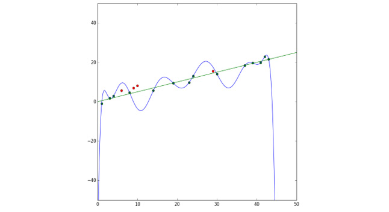
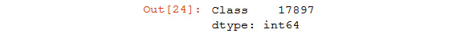
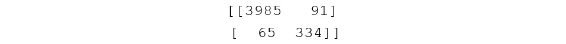

Lab 11. Machine Learning
====================

Overview

By the end of this lab, you will be able to, apply machine learning
algorithms to solve different problems; compare, contrast, and apply
different types of machine learning algorithms, including linear
regression, logistic regression, decision trees, random forests, Naive
Bayes, and AdaBoost; analyze overfitting and implement regularization;
work with `GridSearchCV` and `RandomizedSearchCV` to
adjust hyperparameters; evaluate algorithms using a confusion matrix and
cross-validation and solve real-world problems using the machine
learning algorithms outlined here.


Exercise 145: Using Linear Regression to Predict the Accuracy of the Median Values of Our Dataset
-------------------------------------------------------------------------------------------------

The goal of this exercise is to build a machine learning model using
linear regression. Your model will predict the median value of Boston
houses and, based on this, we will come to a conclusion about whether
the value is optimal or not.

This exercise will be performed on a Jupyter Notebook.

Note

To proceed with the exercises in the lab, you will need the
`scikit-learn` library that is mentioned in the Preface.

1.  Open a new notebook file.

2.  Now, `import` all the necessary libraries, as shown in the
    following code snippet:


    ```
    import pandas as pd
    import numpy as np
    from sklearn.linear_model import LinearRegression
    from sklearn.metrics import mean_squared_error
    from sklearn.model_selection import train_test_split
    ```

    Now that we have imported the libraries, we will load the data.

3.  Load the dataset and view the DataFrames to look at the first five
    rows:


    ```
    # load data
    housing_df = pd.read_csv('HousingData.csv')
    housing_df.head()
    ```

    Recall that, as mentioned in *Lab 10*, *Data Analytics with
    pandas and NumPy*,
    `housing_df = pd.read_cs('HousingData.csv')` will read the
    `CSV` file in parentheses and store it in a DataFrame
    called `housing_df`. Then, `housing_df.head()`
    will display the first five rows of the `housing_df`
    DataFrame by default.

    You should get the following output:

    


    Caption: Output with the dataset displayed

4.  Next, enter the following code to clean the dataset of null values
    using `.dropna()`:


    ```
    # drop null values
    housing_df = housing_df.dropna()
    ```

    In *Lab 10*, *Data Analytics with pandas and NumPy*, we cleared
    the `null` values by counting them and comparing them to
    measures of central tendency. In this lab, however, we will use
    a swifter approach in order to expedite testing for machine
    learning. The `housing_df.dropna()` code will drop all
    null values from the `housing_df` DataFrame.

    Now that the data is clean, it\'s time to prepare our `X`
    and `y` values.

5.  Now, declare the `X` and `y` variables, where
    you use `X` for the **predictor** columns and
    `y` for the **target** column:


    ```
    # declare X and y
    X = housing_df.iloc[:,:-1]
    y = housing_df.iloc[:, -1]
    ```

    The target column is `MEDV`, which is the median value of
    the Boston house prices. The predictor columns include every other
    column. The standard notation is to use `X` for the
    predictor columns and `y` for the target column.

    Since the last column is the target column, which is `y`,
    it should be eliminated from the predictor column, that is,
    `X`. We can achieve this split by indexing.

6.  Now we build the actual linear regression model.

    Although many machine learning models are incredibly sophisticated,
    they can be built using very few lines of code. In this case, it
    takes three steps. We are going to build a model that will predict
    the median house value given all of the input columns.

    The first line uses `train_test_split()` to split
    `X` and `y`, the predictor and target columns,
    into `training` and `test` sets. The model will
    be built using the training set.

    Split `X` and `y` into training and test sets as
    follows:


    ```
    #Create training and test sets
    X_train, X_test, y_train, y_test = train_test_split(X, y, test_size = 0.2)
    ```

    `test_size = 0.2` reflects the percentage of rows held
    back for the `test` set. This is the default setting and
    does not need to be added explicitly. It is presented so that you
    know how to change it.

    Note

    The output values may differ from the values mentioned in the course.
    We have chosen not use a random seed so that you can get accustomed
    to diverse outputs.

    Next, create an empty `LinearRegression()` model, as shown
    in the following code snippet:


    ```
    #Create the regressor: reg
    reg = LinearRegression()
    ```

    Finally, we `fit` the model to the data using the
    `.fit()` method:


    ```
    #Fit the regressor to the training data
    reg.fit(X_train, y_train)
    ```

    The parameters are `X_train` and `y_train`,
    which is the training set that we have defined.
    `reg.fit(X_train, y_train)` is where machine learning
    actually happens. In this line, the `LinearRegression()`
    model adjusts itself to the training data. The model keeps changing
    weights, according to the machine learning algorithm, until the
    weights minimize the error.

    You should get the following output:

    


    At this point, `reg` is a machine learning model with
    specified weights. There is one weight for each `X`
    column. These weights are multiplied by the entry in each row to get
    as close as possible to the target column, `y`, which is
    the median house value.

7.  Now, find how accurate the model is. Here, we can test it on unseen
    data:


    ```
    # Predict on the test data: y_pred y_pred = reg.predict(X_test)
    ```

    To make a prediction, we implement a method, `.predict()`.
    This method takes specified rows of data as the input and produces
    the corresponding predicted values as the output. The input is
    `X_test`, the `X-values` that were held back for
    our test set. The output is the predicted `y`-values.

8.  We can now test the prediction by comparing the predicted
    `y-values`, which is `y_pred`, to the actual
    `y-values`, which is `y_test`, as shown in the
    following code snippet:


    ```
    # Compute and print RMSE
    rmse = np.sqrt(mean_squared_error(y_test, y_pred))
    print("Root Mean Squared Error: {}".format(rmse))
    ```

    The error, the difference between the two `np.array`, may
    be computed as `mean_squared_error`. We take the square
    root of the mean squared error to keep the same units as the target
    column.

    You should get the following output:


Caption: Output on the accuracy of the dataset model

Note that there are other errors to choose from. The square root of
`mean_squared_error` is a standard choice with linear
regression. `rmse`, short for \"root mean squared error,\"
will give us the error of the model on the test set.

A root mean squared error of `5.56` means that, on average,
the machine learning model predicts values approximately
`5.56` units away from the target value, which is not bad in
terms of accuracy. Since the median value (from 1980) is in the
thousands, the predictions are about `5.56` thousand off.
Lower errors are always better, so we will see if can improve the error
going forward.

In this very first exercise, we were able to load our dataset, clean it,
and use linear regression, and we were able to train the model to make
predictions and find out exactly how accurate it is.


Linear Regression Function
--------------------------

In the first exercise, you were able to see how accurate your Boston
Housing median value predictions were. What if you enter the entire code
in a function and then run it multiple times? Will you get different
results?

You do this as shown in the following example using the same Boston
Housing dataset.

Let\'s put all the machine learning code in a function and run it again.


``` {.language-markup}
def regression_model(model):
  # Create training and test sets
  X_train, X_test, y_train, y_test = train_test_split(X, y, test_size = 0.2)
  # Create the regressor: reg_all 
  reg_all = model
  # Fit the regressor to the training data
  reg_all.fit(X_train, y_train)
  # Predict on the test data: y_pred
  y_pred = reg_all.predict(X_test)
  # Compute and print RMSE
  rmse = np.sqrt(mean_squared_error(y_test, y_pred))
  print("Root Mean Squared Error: {}".format(rmse))
```

Now run the function multiple times to see the results:


``` {.language-markup}
regression_model(LinearRegression())
```

You should get the following output:


``` {.language-markup}
Root Mean Squared Error: 4.085279539934423
```

Now, run the function once again:


``` {.language-markup}
regression_model(LinearRegression())
```

You should get the following output:


``` {.language-markup}
Root Mean Squared Error: 4.317496624587608
```

And finally, run it one more time:


``` {.language-markup}
regression_model(LinearRegression())
```

You should get the following output:


``` {.language-markup}
Root Mean Squared Error: 4.7884343211684435
```

This is troublesome, right? The score is always different. Your scores
are also likely to differ from ours.

The scores are different because we are splitting the data into a
different training set and test set each time, and the model is based on
different training sets. Furthermore, it\'s being scored against a
different test set.

In order for machine learning scores to be meaningful, we want to
minimize fluctuation and maximize accuracy. We will see how to do this
in the next section.


Cross-Validation
================


In cross-validation, also known as CV, the training data is split into
five folds (any number will do, but **five is standard**). The machine
learning algorithm is fit on one fold at a time and tested on the
remaining data. The result is five different training and test sets that
are all representative of the same data. The mean of the scores is
usually taken as the accuracy of the model.

Note

Five is only one suggestion. Any natural number may be used.

Cross-validation is a core tool for machine learning. Mean test scores
on different folds will always be more reliable than one mean test score
on the entire set, which we performed in the first exercise. When
examining one test score, there is no way of knowing whether it is low
or high. Five test scores give a better picture of the accuracy of the
model.

Cross-validation can be implemented in a variety of ways. A standard
approach is to use `cross_val_score`, which returns an array
of scores for each fold; `cross_val_score` breaks
`X` and `y` into the training set and test set for
you.

Let\'s modify our regression machine learning function to include
`cross_val_score` in the following exercise.


Exercise 146: Using the cross\_val\_score Function to Get Accurate Results on the Dataset
-----------------------------------------------------------------------------------------

The goal of this exercise is to use cross-validation to obtain more
accurate machine learning results from the dataset compared to the
previous exercise.

1.  Continue using the same Jupyter Notebook from *Exercise 145*, *Using
    Linear Regression to Predict the Accuracy of the Median Values of
    Our Dataset*.

2.  Now, `import` `cross_val_score`:

    ```
    from sklearn.model_selection import cross_val_score
    ```

3.  Define the `regression_model_cv` function, which takes a
    fitted model as one parameter. The `k = 5` hyperparameter
    gives the number of folds. Enter the code shown in the following
    code snippet:


    ```
    def regression_model_cv(model, k=5):
        scores = cross_val_score(model, X, y, scoring='neg_mean_squared_      error', cv=k)
        rmse = np.sqrt(-scores)
        print('Reg rmse:', rmse)
        print('Reg mean:', rmse.mean ())
    ```

    In `sklearn`, the scoring options are sometimes limited.
    Since `mean_squared_error` is not an option for
    `cross_val_score`, we choose the
    `neg_mean_squared_error`. `cross_val_score`
    takes the highest value by default, and the highest negative mean
    squared error is 0.

4.  Use the `regression_model_cv` function on the
    `LinearRegression()` model defined in the previous
    exercise:


    ```
    regression_model_cv(LinearRegression())
    ```

    You may get something similar to the following output:


    ```
    Reg rmse: [3.26123843 4.42712448 5.66151114 8.09493087 5.24453989]
    Reg mean: 5.337868962878373
    ```

5.  Use the `regression_model_cv` function on the
    `LinearRegression()` model with `3` folds and
    then `6` folds, as shown in the following code snippet,
    for `3` folds:


    ```
    regression_model_cv(LinearRegression(), k=3)
    ```

    You may get something similar to the following output:


    ```
    Reg rmse: [ 3.72504914 6.01655701 23.20863933]
    Reg mean: 10.983415161090695
    ```

6.  Now, test the values for `6` folds:


    ```
    regression_model_cv(LinearRegression(), k=6)
    ```

    You may get something similar to the following output:


    ```
    Reg rmse: [3.23879491 3.97041949 5.58329663 3.92861033 9.88399671           3.91442679]
    Reg mean: 5.08659081080109
    ```

You have found out that there is a large discrepancy between the number
of folds. One reason is that we have a reasonably small dataset to begin
with. In the real world, with a huge amount of data, this generally does
not make a huge difference to the results when we compare results with
different folds.


Regularization: Ridge and Lasso
===============================


Regularization is an important concept in machine learning; it\'s used
to counteract overfitting. In the world of big data, it\'s easy to
overfit data to the training set. When this happens, the model will
often perform badly on the test set as indicated by
`mean_squared_error`, or some other error.

You may wonder why a test set is kept aside at all. Wouldn\'t the most
accurate machine learning model come from fitting the algorithm on all
the data?

The answer, generally accepted by the machine learning community after
years of research and experimentation, is probably not.

There are two main problems with fitting a machine learning model on all
the data:

-   There is no way to test the model on unseen data. Machine learning
    models are powerful when they make good predictions on new data.
    Models are trained on known results, but they perform in the real
    world on data that has never been seen before. It\'s not vital to
    see how well a model fits known results (the training set), but
    it\'s absolutely crucial to see how well it performs on unseen data
    (the test set).
-   The model may overfit the data. Models exist that may fit any set of
    data points perfectly. Consider the 14 green points in the following
    diagram. A 14th-degree polynomial exists that fits these points
    almost perfectly. But it\'s a poor predictor of the new data. The
    green line is a much better predictor of the new data. Have a look
    at the following figure to get a better understanding:




Caption: Model fitting the data points

There are many models and approaches to counteract overfitting. Let\'s
go over a couple of models now.

**Ridge** is a simple alternative to linear regression, designed to
counteract overfitting. Ridge includes an L2 penalty term (L2 is based
on Euclidean Distance) that shrinks the linear coefficients based on
their size. The coefficients are the weights, numbers that determine how
influential each column is on the output. Larger weights carry greater
penalties in Ridge.

**Lasso** is another regularized alternative to linear regression. Lasso
adds a penalty equal to the absolute value of the magnitude of
coefficients. This L1 regularization (L1 is taxicab distance.) can
eliminate some columns and result in a model that is sparse by
comparison.

Let\'s look at an example to check how Ridge and Lasso perform on our
Boston Housing dataset.

In this example, we perform regularization on the dataset using Ridge
and Lasso to counteract overfitting. You can continue on the notebook
from *Exercise 146*, *Using the cross\_val\_score Function to Get
Accurate Results on the Dataset*, to work on this example.

We begin by setting `Ridge()` as a parameter for
`regression_model_cv`, as shown in the following code snippet:


``` {.language-markup}
from sklearn.linear_model import Ridge
regression_model_cv(Ridge())
```

You should get the following output:


``` {.language-markup}
Reg rmse: [3.52479283 4.72296032 5.54622438 8.00759231 5.26861171]
Reg mean: 5.414036309884279
```

It\'s not surprising that Ridge has a slightly better score than linear
regression. This is because both algorithms use Euclidean distance and
the linear regression model is overfitting the data by a slight amount.
Your results may be different from ours, however, and the scores are
very close.

Another basis of comparison is the worst score of the five. In Ridge, we
obtained `8.00759` as the worst score. In linear regression,
we obtained `23.20863933` as the worst score. This suggests
that `23.20863933` is badly overfitting the training data. In
Ridge, this overfitting is compensated.

Now, set `Lasso()` as the parameter for
`regression_model_cv`:


``` {.language-markup}
from sklearn.linear_model import Lasso
regression_model_cv(Lasso())
```

You should get the following output:


``` {.language-markup}
Reg rmse: [4.712548   5.83933857 8.02996117 7.89925202 4.38674414]
Reg mean: 6.173568778640692
```

Whenever you\'re trying `LinearRegression()`, it\'s always
worth trying Lasso and Ridge as well, since overfitting the data is
common, and they only actually take a few lines of code to test. Lasso
does not perform as well here because the L1 distance metric, taxicab
distance, was not used in our model.

Regularization is an essential tool when implementing machine learning
algorithms. Whenever you choose a particular model, be sure to research
regularization methods to improve your results, as you observed in the
preceding example.

Now, let\'s get to know a developer\'s doubt. Although we have focused
on overfitting the data, underfitting the data is also possible, right?
It\'s less common in the world of big data, though. Underfitting can
occur if the model is a straight line, but a higher degree polynomial
will fit the data better. By trying multiple models, you are more likely
to find optimal results.

So far, you have learned how to implement linear regression as a machine
learning model. You have learned how to perform cross-validation to get
more accurate results, and you have learned about using two additional
models, Ridge and Lasso, to counteract overfitting.

Now that you understand how to build machine learning models using
`scikit-learn`, let\'s take a look at some different kinds of
models that will also work on regression.


K-Nearest Neighbors, Decision Trees, and Random Forests
=======================================================


Are there other machine learning algorithms, besides
`LinearRegression()`, that is suitable for the Boston Housing
dataset? Absolutely. There are many regressors in the
`scikit-learn` library that may be used. Regressors are
generally considered a class of machine learning algorithms that are
suitable for continuous target values. In addition to Linear Regression,
Ridge, and Lasso, we can try K-Nearest Neighbors, Decision Trees, and
Random Forests. These models perform well on a wide range of datasets.
Let\'s try them out and analyze them individually.


K-Nearest Neighbors
-------------------

The idea behind K-Nearest Neighbors (KNN) is straightforward. When
choosing the output of a row with an unknown label, the prediction is
the same as the output of its k-nearest neighbors, where k may be any
whole number.

For instance, let\'s say that k=3. Given an unknown label, we take n
columns for this row and place them in n-dimensional space. Then we look
for the three closest points. These points already have labels. We
assume the majority label for our new point.

KNN is commonly used for classification since classification is based on
grouping values, but it can be applied to regression as well. When
determining the value of a home, for instance, in our Boston Housing
dataset, it makes sense to compare the values of homes in a similar
location, with a similar number of bedrooms, a similar amount of square
footage, and so on.

You can always choose the number of neighbors for the algorithm and
adjust it accordingly. The number of neighbors denoted here is **k**,
which is also called a **hyperparameter**. In machine learning, the
model parameters are derived during training, whereas the
hyperparameters are chosen in advance.

Fine-tuning hyperparameters is an essential task to master when building
machine learning models. Learning the ins and outs of hyperparameter
tuning takes time, practice, and experimentation.


Exercise 147: Using K-Nearest Neighbors to Find the Median Value of the Dataset
-------------------------------------------------------------------------------

The goal of this exercise is to use K-Nearest Neighbors to predict the
optimal median value of homes in Boston. We will use the same function,
`regression_model_cv`, with an input of
`KNeighborsRegressor()`:

1.  Continue with the same Jupyter Notebook from the previous *Exercise
    146*.

2.  Set and `import` `KNeighborsRegressor()` as the
    parameter on the `regression_model_cv` function:


    ```
    from sklearn.neighbors import KNeighborsRegressor
    regression_model_cv(KNeighborsRegressor())
    ```

    You should get the following output:


    ```
    Reg rmse: [ 8.24568226  8.81322798 10.58043836  8.85643441  5.98100069]
    Reg mean: 8.495356738515685
    ```

    K-Nearest Neighbors did not perform as well as
    `LinearRegression()`, but it performed respectably. Recall
    that `rmse` stands for root mean squared error. So, the
    mean error is about `8.50` (or 85,000 since the units are
    ten of thousands of dollars).

    We can change the number of neighbors to see if we can get better
    results. The default number of neighbors is `5`. Let\'s
    change the number of neighbors to `4`, `7`, and
    `10`.

3.  Now, change the `n_neighbors` hyperparameter to
    `4`, `7`, and `10`. For `4`
    neighbors, enter the following code:


    ```
    regression_model_cv(KNeighborsRegressor(n_neighbors=4))
    ```

    You should get an output similar to the following:


    ```
    Reg rmse: [ 8.44659788  8.99814547 10.97170231  8.86647969  5.72114135]
    Reg mean: 8.600813339223432
    ```

    Change `n_neighbors` to 7:


    ```
    regression_model_cv(KNeighborsRegressor(n_neighbors=7))
    ```

    You should get the following output:


    ```
    Reg rmse: [ 7.99710601  8.68309183 10.66332898  8.90261573  5.51032355]
    Reg mean: 8.351293217401393
    ```

    Change `n_neighbors` to 10:


    ```
    regression_model_cv(KNeighborsRegressor(n_neighbors=10))
    ```

    You should get the following output:


    ```
    Reg rmse: [ 7.47549287  8.62914556 10.69543822  8.91330686  6.52982222]
    Reg mean: 8.448641147609868
    ```

The best results so far come from 7 neighbors. But how do we know if 7
neighbors give us the best results? How many different scenarios do we
have to check?

Scikit-learn provides a nice option to check a wide range of
hyperparameters, which is `GridSearchCV`. The idea behind
`GridSearchCV` is to use cross-validation to check all
possible values in a grid. The value in the grid that gives the best
result is then accepted as a hyperparameter.


Exercise 148: K-Nearest Neighbors with GridSearchCV to Find the Optimal Number of Neighbors
-------------------------------------------------------------------------------------------

The goal of this exercise is to use `GridSearchCV` to find the
optimal number of neighbors for K-Nearest Neighbors to predict the
median housing value in Boston. In the previous exercise, if you recall,
we used only three neighbor values. Here, we will increase the number
using `GridSearchCV`:

1.  Continue with the Jupyter Notebook from the previous exercise.

2.  Import `GridSearchCV,` as shown in the following code
    snippet:

    ```
    from sklearn.model_selection import GridSearchCV
    ```

3.  Now, choose the grid. The grid is the range of numbers -- in this
    case, neighbors -- that will be checked. Set up a hyperparameter
    grid for between `1` and `20` neighbors:


    ```
    neighbors = np.linspace(1, 20, 20)
    ```

    We achieve this with `np.linspace(1, 20, 20)`, where the
    `1` is the first number, the first `20` is the
    last number, and the second `20` in the brackets is the
    number of intervals to count.

4.  Convert floats to `int` (required by `knn`):

    ```
    k = neighbors.astype(int)
    ```

5.  Now, place the grid in a dictionary, as shown in the following code
    snippet:

    ```
    param_grid = {'n_neighbors': k}
    ```

6.  Build the model for each neighbor:

    ```
    knn = KNeighborsRegressor()
    ```

7.  Instantiate the `GridSearchCV` object --
    `knn_tuned`:

    ```
    knn_tuned = GridSearchCV(knn, param_grid, cv=5, scoring='neg_mean_squared_error')
    ```

8.  Fit `knn_tuned` to the data using `.fit`:

    ```
    knn_tuned.fit(X, y)
    ```

9.  Finally, you `print` the best parameter results, as shown
    in the following code snippet:


    ```
    k = knn_tuned.best_params_
    print("Best n_neighbors: {}".format(k))
    score = knn_tuned.best_score_
    rsm = np.sqrt(-score)
    print("Best score: {}".format(rsm))
    ```

    You should get the following output:


Caption: Output showing the best score using n\_neighbors

In our case, 7 gave the best results. Your results may differ. Now,
moving on, let\'s look at the different types of decision trees and
random forests.


Decision Trees and Random Forests
---------------------------------

The best way to understand a concept is to relate it to something. You
may be familiar with the game Twenty Questions. It\'s a game in which
someone is asked to think of something or someone, perhaps a person. The
questioner asks them binary yes or no questions, gradually narrowing
down the search in order to determine exactly who they are thinking of.

Twenty Questions is a decision tree. Every time a question is asked,
there are two possible branches that the tree may take depending upon
the answer. For every new question, new branching occurs, until the
branches end at a prediction, called a leaf.

Here is a mini-Decision Tree that predicts whether a Titanic passenger
survived:


Caption: Decision tree sample on the Titanic incident

This decision tree starts by determining whether the passenger was male.
If the passenger was male, the branch is followed that asks the question
was their age greater than 9.5. If the passenger was not male, we reach
the end of a branch, and we find out that the probability of survival is
0.73. The other number, 36%, indicates that 36% of the passengers end up
at this leaf.

Decision Trees are very good machine learning algorithms, but they are
prone to overfitting. A random forest is an ensemble of decision trees.
Random forests consistently outperform decision trees because their
predictions generalize to data much better. A random forest may consist
of hundreds of decision trees.

A random forest is a great machine-learning algorithm to try on almost
any dataset. Random forests work well with both regression and
classification, and they often perform well out of the box.

Let\'s try Decision Trees and Random Forests on our data.


Exercise 149: Decision Trees and Random Forests
-----------------------------------------------

The goal of this exercise is to use decision trees and random forests to
predict median house values in Boston:

1.  Continue with the same Jupyter Notebook from the previous exercise.

2.  Use `DecisionTreeRegressor()` as the input for
    `regression_model_cv`.


    ```
    from sklearn import tree
    regression_model_cv(tree.DecisionTreeRegressor())
    ```

    You should get the following output:


    ```
    Reg rmse: [3.84098484 5.67885262 7.7328741  6.53263473 5.78903694]
    Reg mean: 5.914876645128473
    ```

    Note

    The output values may differ from the values mentioned in the course.

3.  Use `RandomForestRegressor()` as the input for
    `regression_model_cv`:


    ```
    from sklearn.ensemble import RandomForestRegressor
    regression_model_cv(RandomForestRegressor())
    ```

    You should get the following output:


    ```
    Reg rmse: [3.49719743 3.86463108 4.60294622 6.7640934  3.73856719]
    Reg mean: 4.493487064599419
    ```

As you can see, the random forest regressor gives the best results yet.
Let\'s see if we can improve these results by examining random forest
hyperparameters.


Random Forest Hyperparameters
-----------------------------

Random forests have a lot of hyperparameters. Instead of going over them
all, we will highlight the most important ones:

-   `n_jobs(default=None)`: The number of jobs has to do with
    internal processing. `None` means 1. It\'s ideal to set
    `n_jobs = -1` to permit the use of all processors.
    Although this does not improve the accuracy of the model, it does
    improve the speed.
-   `n_estimators(default=10)`: The number of trees in the
    forest. The more trees, the better. The more trees, the more RAM is
    required. It\'s worth increasing this number until the algorithm
    moves too slowly. Although 1,000,000 trees may give better results
    than 1,000, the gain might be small enough to be negligible. A good
    starting point is 100, and 500 if time permits.
-   `max_depth(default=None)`: The max depth of the trees in
    the forest. The deeper the trees, the more information is captured
    about the data, but the more prone the trees are to overfitting.
    When set to the default `max_depth` of `None`,
    there are no limitations, and each tree goes as deep as necessary.
    The max depth may be reduced to a smaller number of branches.
-   `min_samples_split(default=2)`: This is the minimum number
    of samples required for a new branch or split to occur. This number
    can be increased to constrain the trees as they require more samples
    to make a decision.
-   `min_samples_leaf(default=1)`: This is the same as
    `min_samples_split`, except it\'s the minimum number of
    samples at the leaves or the base of the tree. By increasing this
    number, the branch will stop splitting when it reaches this
    parameter.
-   `max_features(default="auto")`: The number of features to
    consider when looking for the best split. The default for regression
    is to consider the total number of columns. For classification
    random forests, `sqrt` is recommended.


Exercise 150: Random Forest Tuned to Improve the Prediction on Our Dataset
--------------------------------------------------------------------------

The goal of this exercise is to tune a random forest to improve the
median house value predictions for Boston:

1.  Continue with the same Jupyter Notebook from *Exercise 149*,
    *Decision Trees and Random Forests*:

2.  Set `n_jobs = -1` and `n_estimators=100` for
    `RandomForestRegressor` as the input of
    `regression_model_cv`. We can always use
    `n_jobs` to speed up the algorithm, and we can increase
    `n_estimators` to achieve better results:


    ```
    regression_model_cv(RandomForestRegressor(n_jobs=-1, n_estimators=100))
    ```

    You should get the following output:


    ```
    Reg rmse: [3.29260656 3.61943542 4.83755526 6.49556195 3.76565343]
    Reg mean: 4.402162523852732
    ```

    We could try `GridSearchCV` on the other hyperparameters
    to see if we can find a better combination than the defaults, but
    checking every possible combination of hyperparameters could reach
    the order of thousands and take way too long.

    Note

    The output values may differ from the values mentioned in the course.

    Sklearn provides `RandomizedSearchCV` to check a wide
    range of hyperparameters. Instead of exhaustively going through a
    list, `RandomizedSearchCV` will check a set amount of
    random combinations and return the best results.

3.  Use `RandomizedSearchCV` to look for better Random Forest
    hyperparameters:

    ```
    from sklearn.model_selection import RandomizedSearchCV
    ```

4.  Set up the hyperparameter grid using `max_depth`, as shown
    in the following code snippet:

    ```
    param_grid = {'max_depth': [None, 10, 30, 50, 70, 100, 200, 400],
                 'min_samples_split': [2, 3, 4, 5],
                 'min_samples_leaf': [1, 2, 3],
                 'max_features': ['auto', 'sqrt']}
    ```

5.  Instantiate the `knn` regressor:

    ```
    reg = RandomForestRegressor(n_jobs = -1)
    ```

6.  Instantiate the `RandomizedSearchCV` object --
    `reg_tuned`:

    ```
    reg_tuned = RandomizedSearchCV(reg, param_grid, cv=5,   scoring='neg_mean_squared_error')
    ```

7.  Fit `reg_tuned` to the data:

    ```
    reg_tuned.fit(X, y)
    ```

8.  Now, `print` the `tuned` parameters and
    `score`:


    ```
    p = reg_tuned.best_params_
    print("Best n_neighbors: {}".format(p))
    score = reg_tuned.best_score_
    rsm = np.sqrt(-score)
    print("Best score: {}".format(rsm))
    ```

    You should get the following output:

    


    Caption: Output of the tuned parameters and score

    Keep in mind that with `RandomizedSearchCV`, there is no
    guarantee that the hyperparameters will produce the best results.
    Although the randomized search did well, it did not perform as well
    as the defaults with `n_jobs = -1` and
    `n_estimators = 100`.

9.  Now, run a random forest regressor with `n_jobs = -1` and
    `n_estimators = 500`:


    ```
    # Setup the hyperparameter grid
    regression_model_cv(RandomForestRegressor(n_jobs=-1, n_estimators=500))
    ```

    You should get the following output:


    ```
    Reg rmse: [3.17315086 3.77060192 4.77587747 6.45161665 3.9681246 ]
    Reg mean: 4.427874301108916
    ```

    Note

    Increasing `n_estimators` every time will produce more
    accurate results, but the model takes longer to build.

Hyperparameters are a primary key to building excellent machine learning
models. Anyone with basic machine learning training can build machine
learning models using default hyperparameters. Using
`GridSearchCV` and `RandomizedSearchCV` to fine-tune
hyperparameters to create more efficient models distinguishes advanced
users from beginners.


Classification Models
=====================


The Boston Housing dataset was great for regression because the target
column took on continuous values without limit. There are many cases
when the target column takes on one or two values, such as
`TRUE` or `FALSE`, or possibly a grouping of three
or more values, such as `RED, BLUE,` or `GREEN`.
When the target column may be split into distinct categories, the group
of machine learning models that you should try are referred to as
**classification**.

To make things interesting, let\'s load a new dataset `HTRU2.zip` used to detect
pulsar stars in outer space.

The dataset consists of 17,898 potential pulsar stars in space. But what
are these pulsars? Pulsar stars rotate very quickly, so they have
periodic light patterns. Radio frequency interference and noise,
however, are attributes that make pulsars very hard to detect. This
dataset contains 16,259 non-pulsars and 1,639 real pulsars.

Here is the official list of columns in the dataset:

-   Mean of the integrated profile
-   Standard deviation of the integrated profile
-   Excess kurtosis of the integrated profile
-   Skewness of the integrated profile
-   Mean of the DM-SNR curve
-   Standard deviation of the DM-SNR curve
-   Excess kurtosis of the DM-SNR curve
-   Skewness of the DM-SNR curve
-   Class

In this dataset, potential pulsars have already been classified as
pulsars and non-pulsars by the astronomy community. The goal here is to
see if machine learning can detect patterns within the data to correctly
classify new potential pulsars that emerge.

The methods that you learn for this topic will be directly applicable to
a wide range of classification problems, including spam classifiers,
user churn in markets, quality control, product identification, and
others.


Exercise 151: Preparing the Pulsar Dataset and Checking for Null Values
-----------------------------------------------------------------------

The goal of this exercise is to prepare the pulsar dataset for machine
learning. The exercises from here on will be on the same notebook file:

1.  Open a new Jupyter Notebook.

2.  Import the libraries, load the data, and display the first five
    rows, as shown in the following code snippet:


    ```
    import pandas as pd
    import numpy as np
    df = pd.read_csv('HTRU_2.csv')
    df.head()
    ```

    You should get the following output:

    


    Caption: The first five rows of the pulsar dataset

    Looks interesting, and problematic. Notice that the column headers
    appear to be another row. It\'s impossible to analyze data without
    knowing what the columns are supposed to be, right?

    Note that the last column is all `0`\'s in the DataFrame.
    This suggests that this is the `Class` column, which is
    our `target` column. When detecting the presence of
    something -- in this case, pulsar stars -- it\'s common to use a 1
    for positive identification, and a 0 for a negative identification.

    Since `Class` is last in the list, let\'s assume that the
    columns are given in the correct order presented in the
    `Attribute Information` list. We can also assume that
    losing the current column headers, a negative identification among
    17,898 rows is virtually meaningless. The easiest way forward is
    simply to change the column headers to match the attribute list.

3.  Now, change column headers to match the official list and print the
    first five rows, as shown in the following code snippet:


    ```
    df.columns = [['Mean of integrated profile', 'Standard deviation of integrated profile', 
                   'Excess kurtosis of integrated profile', 'Skewness of integrated profile',
                   'Mean of DM-SNR curve', 'Standard deviation of DM-SNR curve',
                   'Excess kurtosis of DM-SNR curve', 'Skewness of DM-SNR curve', 'Class' ]]
    df.head()
    ```

    You should get the following output:

    


    Caption: Check for null values using df.info() and len(df)

4.  Now, let\'s find the info of the dataset using `.info()`:


    ```
    df.info()
    ```

    You should get the following output:

    


    Caption: Information based on the pulsar dataset

5.  Finally, use `len(df)` and match all columns of
    `df.info()` with only the non-null entries:


    ```
    len(df)
    ```

    You should get the following output:


    ```
    17897
    ```

    We know that there are no null values. If there were null values, we
    would need to eliminate the rows or fill them in by taking the mean,
    the median, the mode, or another value from the columns.

When it comes to preparing data for machine learning, it\'s essential to
have clean, numerical data with no null values. Further data analysis is
often warranted, depending upon the goal at hand. If the goal is simply
to try out some models and check them for accuracy, it\'s fine to go
ahead. If the goal is to uncover deep insights about the data, further
statistical analysis, as introduced in the previous lab, is always
warranted. Now that we have all this basic information, we can proceed
ahead on the same notebook file.


Logistic Regression
-------------------

When it comes to datasets that classify points, logistic regression is
one of the most popular and successful machine learning algorithms.
Logistic regression utilizes the sigmoid function to determine whether
points should approach one value or the other. As the following diagram
indicates, it\'s a good idea to classify the target values as 0 and 1
when utilizing logistic regression. In the pulsar dataset, the values
are already classified as 0s and 1s. If the dataset was labeled as
`Red` and `Blue`, converting them in advance to 0
and 1 would be essential (you will practice converting categorical to
numerical values in the activity at the end of his lab):


Caption: Sigmoid curve on a plot

The sigmoid curve in figure 11.14 approaches 1 from the left and 0 from
the right, without ever reaching 0 or 1. In this respect, 0 and 1
function as horizontal asymptotes. Basically, every positive
`x` value is given an output of 1, and every negative
`x` value is given an output of 0. Furthermore, the higher up
the graph, the higher the probability of a 1, and the lower down the
graph, the higher the probability of 0.

Let\'s see how logistic regression works in action by using a similar
function as before.

By default, classifiers use percentage accuracy as the score output.


Exercise 152: Using Logistic Regression to Predict Data Accuracy
----------------------------------------------------------------

The goal of this exercise is to use logistic regression to predict the
classification of pulsar stars:

1.  Import `LogisticRegression`:

    ```
    from sklearn.model_selection import cross_val_score
    from sklearn.linear_model import LogisticRegression
    ```

2.  Set up matrices `X` and `y` to store the
    predictors and response variables, respectively:

    ```
    X = df.iloc[:, 0:8]
    y = df.iloc[:, 8]
    ```

3.  Write a classifier function that takes a model as its input:

    ```
    def clf_model(model):
    ```

4.  Create the `clf` classifier, as shown in the following
    code snippet:

    ```
        clf = model
        scores = cross_val_score(clf, X, y)
        print('Scores:', scores)
        print('Mean score:', scores.mean())
    ```

5.  Run the `clf_model` function with
    `LogisticRegression()` as the input:


    ```
    clf_model(LogisticRegression())
    ```

    You should get the following output:


Caption: Mean score using logistic regression

These numbers represent accuracy. A mean score of `0.977706`
means that the logistic regression model is classifying
`97.8%` of pulsars correctly.

Logistic regression is very different than linear regression. Logistic
regression uses the sigmoid function to classify all instances into one
group or the other. Generally speaking, all cases that are above 0.5 are
classified as a 1, and all cases that fall below 0.5 are classified as a
0, with decimals that are close to 1 more likely to be a 1, and decimals
that are close to 0 more likely to be a 0. Linear regression, by
contrast, finds a straight line that minimizes the error between the
straight line and the individual points. Logistic regression classifies
all points into two groups; all new points will fall into one of these
groups. By contrast, linear regression finds a line of best fit; all new
points may fall anywhere on the line and take on any value.


Other Classifiers
-----------------

There are other classifiers that we can try, including K-Nearest
Neighbors (KNN), Decision Trees, Random Forests, and Naive Bayes.

We used KNN, Decision Trees, and Random Forests as regressors before.
This time, we need to implement them as classifiers. For instance, there
is `RandomForestRegressor`, and there is
`RandomForestClassifier`. Both are random forests, but they
are implemented differently to meet the output of the data. Recall that
classifiers have an output of two or more end values, whereas regression
has an output of continuous values. The general setup is the same, but
the output is different. In the next section, we will have a look at
Naive Bayes.


Naive Bayes
-----------

Naive Bayes is a model based on Bayes\' theorem, a famous probability
theorem based on a conditional probability that assumes independent
events. Similarly, Naive Bayes assumes independent attributes or
columns. The mathematical details of Naive Bayes are beyond the scope of
this course, but we can still apply it to our dataset.

There is a small family of machine learning algorithms based on Naive
Bayes. The one that we will use here is `GaussianNB`. Gaussian
Naïve Bayes assumes that the likelihood of features is
`Gaussian`. Other options that you may consider trying include
`MultinomialNB`, used for multinomial distributed data (such
as text), and `ComplementNB`, an adaptation of
`MultinomialNB` that is used for imbalanced datasets.

Let\'s try Naive Bayes, in addition to the KNN, Decision Tree, and
Random Forest classifiers mentioned previously.


Exercise 153: Using GaussianNB, KneighborsClassifier, DecisionTreeClassifier, and RandomForestClassifier to Predict Accuracy in Our Dataset
-------------------------------------------------------------------------------------------------------------------------------------------

The goal of this exercise is to predict pulsars using a variety of
classifiers, including GaussianNB, KneighborsClassifier,
DecisionTreeClassifier, and RandomForestClassifier.

1.  Begin this exercise on the same notebook file from the previous
    exercise.

2.  Run the `clf_model` function with `GaussianNB()`
    as the input:


    ```
    from sklearn.naive_bayes import GaussianNB
    clf_model(GaussianNB())
    ```

    You should get the following output:

    


    Caption: Mean score using GaussianNB

3.  Now, run the `clf_model` function with
    `KNeighborsClassifier()` as the input:


    ```
    from sklearn.neighbors import KNeighborsClassifier
    clf_model(KNeighborsClassifier())
    ```

    You should get the following output:

    


    Caption: Mean score using KNeighborsClassifier

4.  Run the `clf_model` function with
    `DecisionTreeClassifier()` as the input:


    ```
    from sklearn.tree import DecisionTreeClassifier
    clf_model(DecisionTreeClassifier())
    ```

    You should get the following output:

    


    Caption: Mean score using DecisionTreeClassifier

    Note

    The output values may differ from the values mentioned in the course.

5.  Run the `clf_model` function with
    `RandomForestClassifier()` as the input:


    ```
    from sklearn.ensemble import RandomForestClassifier
    clf_model(RandomForestClassifier())
    ```

    You should get the following output:


Caption: Mean score using RandomForestClassifier

All classifiers have achieved between 94% and 98% accuracy. It\'s
unusual for this many classifiers to all perform this well. There must
be clear patterns within the data, or something is going on behind the
scenes.

You may also wonder how to know when to use these classifiers. The
bottom line is that whenever you have a classification problem, meaning
that the data has a target column with a finite number of options, such
as three kinds of wine, most classifiers are worth trying. Naive Bayes
is known to work well with text data, and random forests are known to
work well generally. New machine learning algorithms are often being
developed to handle special cases. Practice and research will help to
uncover more nuanced cases.


Confusion Matrix
----------------

When discussing classification, it\'s important to know whether the
dataset is imbalanced, as we had some doubts about the results from
*Exercise 153*, *Using GaussianNB, KneighborsClassifier,
DecisionTreeClassifier and RandomForestClassifier to Predict Accuracy in
Our Dataset*. An imbalance occurs if the majority of data points have
one label rather than another.


Exercise 154: Finding the Pulsar Percentage from the Dataset
------------------------------------------------------------

The goal of this exercise is to count the percentage of pulsars in our
dataset. We will use the `Class` column. Although we have
primarily been using `df['Class']` as a way to reference a
particular column, `df.Class` will work as well (except in
limited cases, such as setting values):

1.  Begin this exercise on the same notebook you used in the previous
    exercise.

2.  Use the `count.()` method on `df.Class` to
    obtain the number of potential pulsars:


    ```
    df.Class.count()
    ```

    You should get the following output:

    



    Caption: Output of the potential pulsars in the dataset

3.  Use the `.count()` method on `df[df.Class == 1]`
    to obtain the number of actual pulsars:


    ```
    df[df.Class == 1].Class.count()
    ```

    You should get the following output:

    


    Caption: Output of the total actual pulsars in the dataset

4.  Divide step 2 by step 1 to obtain the percentage of pulsars:


    ```
    df[df.Class == 1].Class.count()/df.Class.count()
    ```

    You should get the following output:


Caption: Output showing the percentage of pulsars

The results show that 0.09158 or 9% of the data are pulsars. The other
91% are not pulsars. This means that it\'s very easy to make a machine
learning algorithm in this case with 91% accuracy to predict that every
row is not a pulsar.

Imagine that the situation is even more extreme. Imagine that we are
trying to detect exoplanets, and our dataset has only classified 1% of
the data as exoplanets. This means that 99% are not exoplanets. This
also means that it\'s super easy to develop an algorithm with 99%
accuracy! Just claim that everything is not an exoplanet!

The confusion matrix was designed to reveal the truth behind imbalanced
datasets:


Caption: Overview of the confusion matrix

As you can see from figure 11.24, the confusion matrix is designed to
show you what happened to each of the outputs. Every output will fall
into one of four boxes, labeled \"True positive,\" \"False positive,\"
\"False negative,\" and \"True negative\":


Caption: Prediction of the confusion matrix based on conditions

Consider the following example. This is the confusion matrix for the
decision tree classifier we used earlier. You will see the code to
obtain this shortly. First, we want to focus on the interpretation:




Caption: Confusion matrix

In sklearn, the default order is 0, 1. This means that the zeros or
negative values are actually listed first. So, in effect, the confusion
matrix is interpreted as follows:


Caption: Confusion matrix with the default orders

In this particular case, 3,985 non-pulsars have been identified
correctly, and 334 pulsars have been identified correctly. The 91 in the
upper-right corner indicates that the model classified 91 pulsars
incorrectly, and the 65 in the bottom-left corner indicates that 65
non-pulsars were misclassified as pulsars.

It can be challenging to interpret the confusion matrix, especially when
positives and negatives do not always line up in the same columns.
Fortunately, a classification report may be displayed along with it.

The classification report includes the total number of labels, along
with various percentages to help make sense of the numbers and analyze
the data.

Here is the classification report with the confusion matrix for the
decision tree classifier:


Caption: Classification report on the confusion matrix

In the classification report, the columns on the two ends are the
easiest to interpret. On the far right, `support` is the
number of labels in the dataset. It matches the indexed column on the
far left, labeled 0 and 1. Support reveals that there are 4,076
non-pulsars (0s) and 399 pulsars (1s). This number is less than the
total because we are only looking at the test set.

**Precision** is the true positives divided by all the positive
predictions. In the case of the zeros, this is 3985 / (3985 + 65), and
in the case of the ones, this is 334 / (334 + 91).

**Recall** is the true positives divided by all the positive labels. For
the zeros, this is 3985 / (3985 + 91) and for the ones this is 334 / (
334 + 65).

The **f1-score** is the harmonic mean of the precision and recall
scores. Note that the f1 scores are very different for the zeros than
the ones.

The most important number in the classification report depends on what
you are trying to accomplish. Consider the case of the pulsars. Is the
goal to identify as many potential pulsars as possible? If so, a lower
precision is okay, provided that the recall is higher. Or perhaps an
investigation would be expensive. In this case, a higher precision than
recall would be desirable.


Exercise 155: Confusion Matrix and Classification Report for the Pulsar Dataset
-------------------------------------------------------------------------------

The goal of this exercise is to build a function that displays the
confusion matrix along with the classification report:

1.  Continue on the same notebook file from the previous exercise.

2.  Now, `import` the `confusion_matrix` and the
    `classification_report` libraries:


    ```
    from sklearn.metrics import classification_report
    from sklearn.metrics import confusion_matrix
    from sklearn.cross_validation import train_test_split
    ```

    To use the confusion matrix and classification report, we need a
    designated test set. We can accomplish this using
    `train_test_split`.

3.  Split the data into a training set and a test set:


    ```
    X_train, X_test, y_train, y_test = train_test_split(X, y, test_size = 0.25)
    ```

    Now, build a function called `confusion` that takes a
    model as the input and prints the confusion matrix and
    classification report. The `clf` classifier should be the
    output:


    ```
    def confusion(model):
    ```

4.  Create a `model` classifier:

    ```
        clf = model
    ```

5.  Fit the classifier to the data:

    ```
        clf.fit(X_train, y_train)
    ```

6.  Predict the labels of the y\_pred test set:

    ```
        y_pred = clf.predict(X_test)
    ```

7.  Compute and `print` the confusion matrix:

    ```
        print('Confusion Matrix:', confusion_matrix(y_test, y_pred))
    ```

8.  Compute and print the classification report:


    ```
        print('Classification Report:', classification_report(y_test, y_pred))
        return clf
    ```

    Now let\'s try the function on our various classifiers.

9.  Run the `confusion()` function with
    `LogisticRegression` as the input:


    ```
    confusion(LogisticRegression())
    ```

    You should get the following output:

    


    Caption: Output of the confusion matrix on LogisticRegression

    As you can see, the precision of classifying actual pulsars, the 1
    in the classification report, is 94%, whereas the total is 98%.
    Perhaps more significantly, the f1-score, which is the average of
    the precision and recall scores, is 98% overall, but only 87% for
    the pulsars, or ones.

10. Now, run the `confusion()` function with
    `KNeighborsClassifier()` as the input:


    ```
    confusion(KNeighborsClassifier())
    ```

    You should get the following output:

    


    They\'re all high scores overall, but the 78% recall and 84%
    f1-score for the pulsars are a little lacking.

11. Run the `confusion()` function with
    `GaussianNB()` as the input:


    ```
    confusion(GaussianNB())
    ```

    You should get the following output:

    


    Caption: Output of the confusion matrix on GaussianNB

    In this particular case, the 68% precision of correctly identifying
    pulsars is not up to par.

12. Run the `confusion()` function with
    `RandomForestClassifer()` as the input:


    ```
    confusion(RandomForestClassifier())
    ```

    You should get the following output:


Caption: Output of the confusion matrix on RandomForestClassifier

We\'ve now finished this exercise, and you can see that, in this case,
the f1-score of 87% is the highest that we have seen.

Which classifier would give the best results if we want to detect
pulsars? `RandomForestClassifier()` is great because it has
the highest precision and recall for pulsar identification. If the goal
is to detect pulsars, `RandomForestClassifier` is the best
bet.


Boosting Methods
================


Random Forests are a type of bagging method. A **bagging** method is a
machine learning method that aggregates a large sum of machine learning
models. In the case of Random Forests, the aggregates are decision
trees.

Another machine learning method is boosting. The idea behind boosting is
to transform a weak learner into a strong learner by modifying the
weights for the rows that the learner got wrong. A weak learner may have
an error of 49%, hardly better than a coin flip. A strong learner, by
contrast, may have an error rate of 1 or 2 %. With enough iterations,
very weak learners can be transformed into very strong learners.

The success of boosting methods caught the attention of the machine
learning community. In 2003, Yoav Fruend and Robert Shapire won the 2003
Godel Prize for developing AdaBoost, short for adaptive boosting.

Like many boosting methods, AdaBoost has both a classifier and a
regressor. AdaBoost adjusts weak learners toward instances that were
previously misclassified. If one learner is 45% correct, the sign can be
flipped to become 55% correct. By switching the signs of negatives to
positives, the only problematic instances are those that are exactly 50%
correct because changing the sign will not change anything. The larger
the percentage that is correct, the larger the weight given is given out
to sensitive outliers.

Let\'s see how the AdaBoost classifier performs on our datasets.


Exercise 156: Using AdaBoost to Predict the Best Optimal Values
---------------------------------------------------------------

The goal of this exercise is to predict pulsars and median housing
prices in Boston using AdaBoost:

1.  Begin this exercise on the same notebook you used in the previous
    exercise.

2.  Now, `import` `AdaBoostClassifier` and use it as
    the input for `clf_model()`:


    ```
    from sklearn.ensemble import AdaBoostClassifier
    clf_model(AdaBoostClassifier())
    ```

    You should get the following output:

    


    Caption: Mean score output using AdaBoostClassifier

    As you can see, the AdaBoost classifier gave one of the best results
    yet. Let\'s see how it performs on the confusion matrix.

3.  Use `AdaBoostClassifer()` as the input for the
    `confusion()` function:


    ```
    confusion(AdaBoostClassifier())
    ```

    You should get the following output:

    


    Caption: Output of the confusion matrix on AdaBoostClassifier

    Totals of 98% for precision, recall, and the f1-score are
    outstanding. The f1-score of the positive pulsar classification, the
    1\'s, is 86%, nearly performing as well as
    `RandomForestClassifier`.

    Note

    Now, head to the notebook file for *exercises 146-150* and execute
    the following steps.

4.  Set `X` and `y` equal to
    `housing_df.iloc[:, :-1]` and
    `housing_df.iloc[:, -1]`:

    ```
    X = housing_df.iloc[:,:-1]
    y = housing_df.iloc[:, -1]
    ```

5.  Now, `import` `AdaBoostRegressor` and use
    `AdaBoostRegressor()` as the input for the
    `regression_model_cv` function:


    ```
    from sklearn.ensemble import AdaBoostRegressor
    regression_model_cv(AdaBoostRegressor())
    ```

    You should get the following output:


Activity 25: Using Machine Learning to Predict Customer Return Rate Accuracy
----------------------------------------------------------------------------

In this activity, you will use machine learning to solve a real-world
problem. A bank wants to predict whether customers will return, also
known as churn. They want to know which customers are most likely to
leave. They give you their data, and they ask you to create a
machine-learning algorithm to help them target the customers most likely
to leave.

The overview for this activity will be for you to first prepare the data
in the dataset, then run a variety of machine learning algorithms that
were covered in this lab to check their accuracy. You will then use
the confusion matrix and classification report to help find the best
algorithm to identify cases of user churn. You will select one final
machine learning algorithm along with its confusion matrix and
classification report for your output.

Here are the steps to achieve this goal:


2.  Open `CHURN.csv` in a Jupyter Notebook and observe the
    first five rows.

3.  Check for `NaN` values and remove any that you find in the
    dataset.

4.  In order to use machine learning on all the columns, the predictive
    column should be in terms of numbers, not \'`No`\' and
    \'`Yes`\'. You may replace \'`No`\' and
    \'`Yes`\' with `0` and `1` as follows:

    ```
    df['Churn'] = df['Churn'].replace(to_replace=['No', 'Yes'], value=[0, 1])
    ```

5.  Set `X`, the predictor columns, equal to all columns
    except the first and the last. Set `y`, the target column,
    equal to the last column.

6.  You want to transform all of the predictive columns into numeric
    columns. This can be achieved as follows:

    ```
    X = pd.get_dummies(X)
    ```

7.  Write a function called `clf_model` that uses
    `cross_val_score` to implement a classifier. Recall that
    `cross_val_score` must be imported.

8.  Run your function on five different machine learning algorithms.
    Choose the top three models.

9.  Build a similar function using the confusion matrix and the
    classification report that uses `train_test_split`.
    Compare your top three models using this function.

10. Choose your best model, look at the hyperparameters, and optimize at
    least one hyperparameter.

    You should get an output similar to the following:


Summary
=======


With this lab, we come to the end of our journey in this course.
We\'ve learned the basics of Python and how to get started from opening
a Jupyter Notebook and loading the necessary libraries, to working with
lists, dictionaries, and sets; after which, we moved on to visually
outputting data using Python, which is an essential part of presenting
data. We saw not only how to code in Python, but also how to be
Pythonic, which is the smarter way to code in Python. We then covered
using unit testing and debugging techniques to handle errors. Lastly, we
saw how to learn from big data in this last lab on machine learning.


