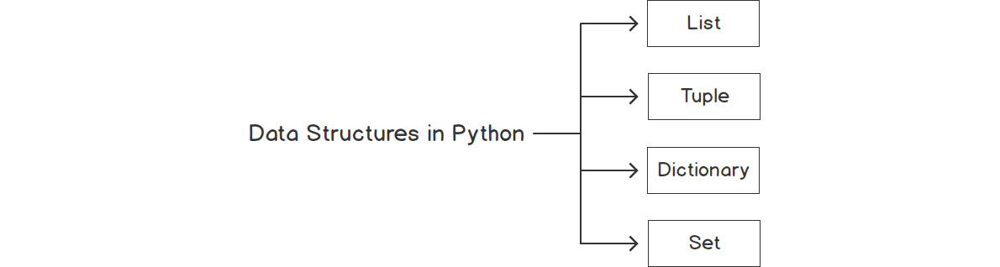
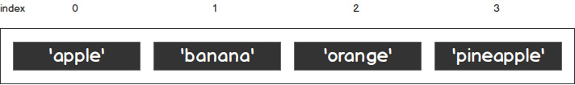
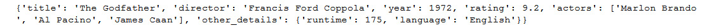
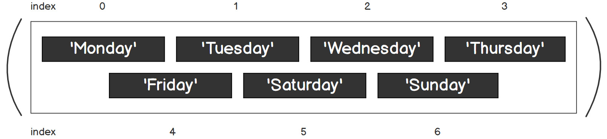
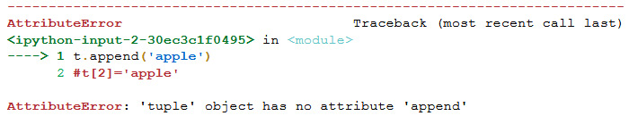

Lab 2. Python Structures
====================


In this lab, you are going to look at how to use data structures to
store more complex types of data that help to model the actual data and
represent it in the real world.

In programming languages, data structures refer to objects that can hold
some data together, which means they are used to store a collection of
related data.

For instance, you can use a list to store our to-do items for the day.
The following is an example to show you how lists are coded:


``` {.language-markup}
todo = ["pick up laundry", "buy Groceries", "pay electric bills"]
```

We can also use a dictionary object to store more complex information
such as subscribers\' details from our mailing list. Here is an example
code snippet, but don\'t worry, we will cover this later in this
lab:


``` {.language-markup}
User = { 
  "first_name": "Jack", 
  "last_name":"White", 
  "age": 41,
  "email": "jack.white@gmail.com"
}
```

There are four types of data structures in Python: `list`,
`tuple`, `dictionary`, and `set`.




The Power of Lists
==================


You will now look at the first type of data structure in Python: lists.

A list is a type of container in Python that is used to store multiple
data sets at the same time. Python lists are often compared to arrays in
other programming languages, but they do a lot more.




Exercise 21: Working with Python Lists
--------------------------------------

In this exercise, you will learn how to work with a Python list by
coding and creating a list and adding items. For example, this could
prove useful if, for instance, you have to use a list to store the items
that are in a shopping cart:

1.  Open a new Jupyter Notebook.

2.  Now enter the following code snippet:


    ```
    shopping = ["bread","milk", "eggs"]
    print(shopping)
    ```

    You should get the following output:


    ```
    ['bread', 'milk', 'eggs']
    ```

    You created a list called `shopping` and added items to
    your list (`bread`, `milk`, and
    `eggs`).

    Since a list is a type of iterable in Python, you can use a
    `for` loop to iterate over all of the elements inside a
    list.

3.  Now, enter and execute the code for a `for` loop and
    observe the output:


    ```
    for item in shopping:
      print(item) 
    ```

    You should get the following output:


    ```
    bread
    milk
    eggs
    ```

    Note

    Python lists are different from arrays used in other languages, such
    as Java and C\#. Python actually allows mixed types in a list, that
    is, `int` and `string`.

4.  Now use a `mixed` type of data within the list\'s content
    and enter the following code in a new cell:


    ```
    mixed = [365, "days", True]
    print(mixed) 
    ```

    You should get the following output:


    ```
    [365, 'days', True]
    ```

    But you might be wondering, in that case, shouldn\'t we be allowed
    to store a list of lists inside a list? Let\'s look at that in the
    next section. This is also known as a **nested list**, which can be
    used to represent a complex data structure.

In *Exercise 21*, *Working with Python Lists*, you were introduced to
the basics of Python lists.

Later in this lab, we will dive in deep and learn about the other
types of lists that Python provides.


Matrices as Nested Lists
------------------------

Most of the data we store in the real world is in the form of a tabular
data table, that is, **rows** and **columns**, instead of a
one-dimensional flat list. Such tables are called **matrices** or
**two-dimensional arrays**. Python (and most other programming
languages) does not provide a table structure out of the box.
Programming languages do not provide table structures as it is not the
role of a language to do so. A table structure is simply a way to
present data.

What you can do is to present the table structure shown in
using a list of lists; for example, if you want to store the following
fruit orders using a list:


Mathematically, you can present the information shown in figure 2.3
using a 2 x 3 (2 rows by 3 columns) matrix. This matrix would look like
this:


Caption: A matrix representation of data

Now you will see how you can store this matrix as a nested list in the
following exercise.


Exercise 22: Using a Nested List to Store Data from a Matrix
------------------------------------------------------------

In this exercise, you will look at working with a nested list, storing
values in it, and accessing it using a number of methods:

1.  Open a new Jupyter notebook.

2.  Enter the following code in a new cell:


    ```
    m = [[1, 2, 3], [4, 5, 6]]
    ```

    We can store the matrix as a series of lists inside a list which is
    called as a nested list.

3.  Now `print` list `m`:


    ```
    print(m[1][1])
    ```

    We can now access the elements using variable
    `[row][column]` notation.

    You should get the following output:


    ```
    5
    ```

    It prints the value of row 2, column 2, which is `5`
    (remember, we are using a zero-based index offset).

4.  Now, access each of the elements in the nested list matrix by
    retaining their reference index with two variables, `i`
    and `j`:


    ```
    for i in range(len(m)):
      for j in range(len(m[i])):
        print(m[i][j])
    ```

    The preceding code uses a `for` loop to iterate twice. In
    the outer loop (`i`), we iterate every single row in
    matrix `m`, and in the inner loop (`j`), we
    iterate every column in the row. Finally, we `print` the
    element in the corresponding position.

    You should get the following output:


    ```
    1
    2
    3
    4
    5
    6
    ```

5.  Use two `for`..`in` loops to print all the
    elements within the matrix:


    ```
    for row in m:
      for col in row:
        print(col)
    ```

    The `for` loop in the code used in step 4 iterates both
    the `row` and `col`. This type of notation does
    not require us to have prior knowledge of the matrix\'s dimensions.

    You should get the following output:


    ```
    1
    2
    3
    4
    5
    6
    ```

At the end of this exercise, you know how a nested list stored as a
matrix works. You have also got to know the different ways of accessing
values from nested lists. In *Activity 6, Using a Nested List to Store
Employee Data*, you will implement the concepts you have learned about
lists and nested lists to store employee data.


Activity 6: Using a Nested List to Store Employee Data
------------------------------------------------------

You are going to store table data using a nested list. Imagine this: you
are currently working in an IT company and are given the following list
of employees. You are asked by your manager to use Python to store this
data for further company use.


Follow these steps to complete this activity:

1.  Open a new Jupyter Notebook.
2.  Create a list and assign it to `employees`.
3.  Create three nested lists in `employees` to store the
    information of each employee, respectively.
4.  Print the `employees` variable.
5.  Print the details of all employees in a presentable format.
6.  Print only the details of `Lisa Crawford`.

By printing the details in a presentable format, you should get the
following output:


In the next topic, you will be discussing a bit more about matrixes and
their operations.


Matrix Operations
=================


You will continue to look at how to use nested lists for some basic
matrix operations. First, you look at how to add two matrices in Python.
Matrix addition requires both matrices to have the same dimensions; the
results will also be of the same dimensions.

In *Exercise 23*, *Implementing Matrix Operations (Addition and
Subtraction)*, you will be using the following matrix data,
`X` and `Y`, in figures 2.7 and 2.8:


Caption: Matrix data for matrix X


Caption: Matrix data for matrix Y


Exercise 23: Implementing Matrix Operations (Addition and Subtraction)
----------------------------------------------------------------------

In this exercise you will add and subtract the `X` and
`Y` matrixes using Python.

The following steps will enable you to complete the exercise:

1.  Open a new Jupyter Notebook.

2.  Create two nested lists, `X` and `Y`, to store
    the values:

    ```
    X = [[1,2,3],[4,5,6],[7,8,9]]
    Y = [[10,11,12],[13,14,15],[16,17,18]]
    ```

3.  Initialize a 3 x 3 zero matrix called `result` as a
    placeholder:

    ```
    # Initialize a result placeholder
    result = [[0,0,0], 
        [0,0,0], 
        [0,0,0]] 
    ```

4.  Now, implement the algorithm by iterating through the cells and
    columns of the matrix:


    ```
    # iterate through rows
    for i in range(len(X)):  
    # iterate through columns 
      for j in range(len(X[0])): 
        result[i][j] = X[i][j] + Y[i][j] 
        
    print(result)
    ```

    You\'ll use the nested list method. As you learned in the previous
    section, you first iterate the rows in matrix `X`, then
    iterate the columns. You do not have to iterate matrix `Y`
    again because both matrixes are of the same dimensions. The result
    of a particular row (denoted by `i`) and a particular
    column (denoted by `j`) equals the sum of the respective
    row and column in matrixes `X` and `Y`.

    You should get the following output:


    ```
    [[11, 13, 15], [17, 19, 21], [23, 25, 27]]
    ```

5.  You can also perform subtraction using two matrices using the same
    algorithm with a different operator. The idea behind this is exactly
    the same as in *step 3*, except you are doing subtraction. You can
    implement the following code to try out matrix subtraction:


    ```
    X = [[10,11,12],[13,14,15],[16,17,18]]
    Y = [[1,2,3],[4,5,6],[7,8,9]]
    # Initialize a result placeholder
    result = [[0,0,0], 
        [0,0,0], 
        [0,0,0]] 
    # iterate through rows 
    for i in range(len(X)):  
    # iterate through columns 
      for j in range(len(X[0])): 
        result[i][j] = X[i][j] - Y[i][j] 
        
    print(result)
    ```

    You should get the following output:


    ```
    [[9, 9, 9], [9, 9, 9], [9, 9, 9]]
    ```

In this exercise, you were able to perform basic addition and
subtraction using two matrices. In the next topic, you will be using
multiplication operators for matrixes.


Matrix Multiplication Operations
--------------------------------

You can look at how to use nested lists to perform matrix multiplication
for the two matrices shown in figures *2.9* and *2.10*:


Caption: The data of matrix X


Caption: The data of matrix Y

For a matrix multiplication operation, the number of columns in the
first matrix (X) must be equal the number of rows in the second matrix
(Y). The result will have the same number of rows as the first matrix
and the same number of columns as the second matrix. In this case, the
result matrix will be a 3 x 4 matrix.


Exercise 24: Implementing Matrix Operations (Multiplication)
------------------------------------------------------------

In this exercise, your end goal will be to multiply two matrixes,
`X` and `Y`, and get an output value. The following
steps will enable you to complete the exercise:

1.  Open a new Jupyter notebook.

2.  Create two nested lists, `X` and `Y`, to store
    the value of matrices `X` and `Y`:

    ```
    X = [[1, 2], [4, 5], [3, 6]]
    Y = [[1,2,3,4],[5,6,7,8]]
    ```

3.  Create a zero-matrix placeholder to store the result:

    ```
    result = [[0, 0, 0, 0], [0, 0, 0, 0], [0, 0, 0, 0]] 
    ```

4.  Implement the matrix multiplication algorithm to compute the result:


    ```
    # iterating by row of X 
    for i in range(len(X)): 
     
      # iterating by column by Y 
      for j in range(len(Y[0])): 
     
        # iterating by rows of Y
        for k in range(len(Y)): 
          result[i][j] += X[i][k] * Y[k][j] 
    ```

    You may have noticed that this algorithm is slightly different from
    the one you used in *Exercise 23*, *Implementing Matrix Operations
    (Addition and Subtraction),* step 3. This is because you need to
    iterate the rows of the second matrix, `Y`, as the
    matrixes have different shapes, which is what is mentioned in the
    preceding code snippet.

5.  Now, `print` the final result:


    ```
    for r in result: 
      print(r)
    ```

    You should get the following output:


Caption: Output of multiplying matrix X and matrix Y

Note

There are packages that data scientists use to perform matrix
calculations, such as NumPy. You can find out more at
<https://docs.scipy.org/doc/numpy/>.


List Methods
============


As discussed before, since a list is a type of sequence, it supports all
sequence operations and methods.

Lists are one of the best data structures to use. Python provides a set
of list methods that makes it easy for us to store and retrieve values
in order to maintain, update, and extract data. These common operations
are what Python programmers perform, including **slicing**, **sorting**,
**appending**, **searching**, **inserting**, and **removing** data.

The best way to understand this is to see them at work. You will learn
about these handy list methods in the following exercises.


Exercise 25: Basic List Operations
----------------------------------

In this exercise, you are going to use the basic functions of lists to
check the size of a list, combining lists and duplicating lists as well.
Follow these steps:

1.  Open a new Jupyter notebook.

2.  Type the following code

    ```
    shopping = ["bread","milk", "eggs"]
    ```

3.  The length of a list is found using the `len` function.


    ```
    print(len(shopping))
    ```

    Note

    The `len()` function returns the number of items in an
    object. When the object is a string, it returns the number of
    characters in the string.

    You should get the following output:


    ```
    3
    ```

4.  Now concatenate two lists using the `+` operator:


    ```
    list1 = [1,2,3]
    list2 = [4,5,6]
    final_list = list1 + list2
    print(final_list)
    ```

    You should get the following output:


    ```
    [1, 2, 3, 4, 5, 6]
    ```

    As you can see in the output, lists also support many string
    operations as well, one of which is concatenation, which is joining
    two or more lists together.

5.  Now use the `*` operator, which can be used for repetition
    in a list to duplicate elements:


    ```
    list3 = ['oi']
    print(list3*3)
    ```

    It will repeat \'`oi`\' three times, giving us the
    following output:


    ```
    ['oi', 'oi', 'oi']
    ```

You have now concluded this exercise; the purpose of this exercise was
to get you familiar with some common operations that Python programmers
use to interact with lists.


Accessing an Item from a List
-----------------------------

Just like other programming languages, in Python, you can use the
`indexer` method to access elements in a list. You should
complete the following exercise by continuing with the previous
notebook.


Exercise 26: Accessing an Item from Shopping List Data
------------------------------------------------------

In this exercise, you will work with lists and gain an understanding of
how you can access items from a list. The following steps will enable
you to complete the exercise:

1.  Open a new Jupyter Notebook.

2.  Enter the following code in a new cell:


    ```
    shopping = ["bread","milk", "eggs"]
    print(shopping[1])
    ```

    You should get the following output:


    ```
    milk
    ```

    As you can see, you have printed the value `milk` from the
    list `shopping` that has the index `1`, as the
    list begins from `0`.

3.  Now, access the `milk` element and replace it with
    `banana`:


    ```
    shopping[1] = "banana"
    print(shopping)
    ```

    You should get the following output:


    ```
    ['bread', 'banana', 'eggs']
    ```

4.  Type the following code in a new cell and observe the output:


    ```
    print(shopping[-1])
    ```

    You should get the following output:


    ```
    eggs
    ```

    The output will print `eggs` -- the last item.

    Note

    In Python, a positive index counts forward, and a negative index
    counts backward. You use a negative index to access an element from
    the back.

    What you have learned so far is more of a traditional way of
    accessing elements. Python lists also support powerful general
    indexing, called **slicing**. It uses the `:` notation in
    the format of `list[i:j]`, where `i` is the
    starting element, and `j` is the last element
    (non-inclusive).

5.  Enter the following code to try out a different type of slicing:


    ```
    print(shopping[0:2]) 
    ```

    This prints the first and second elements, producing the following
    output:


    ```
    ['bread', 'banana']
    ```

    Now, to print from the beginning of the list to the third element


    ```
    print(shopping[:3])
    ```

    You should get the following output:


    ```
    ['bread', 'banana', 'eggs']
    ```

    Similarly, to print from the second element of the list until the
    end


    ```
    print(shopping[1:])
    ```

    You should get the following output:


    ```
    ['banana', 'eggs']
    ```

Having completed this exercise, you are now able to access items from a
list in different ways.


Adding an Item to a List
------------------------

In the previous section and *Exercise 26*, *Accessing an Item from
Shopping List Data*, you learned how to access items from a list. Lists
are very powerful and are widely used in many circumstances. However,
you often won\'t know the data your users want to store beforehand, but
only after the program is running. Here, you are going to look at
various methods for adding items to and inserting items into a list.


Exercise 27: Adding Items to Our Shopping List
----------------------------------------------

The `append` method is the easiest way to add a new element to
the end of a list. You will use this method in this exercise to add
items to our `shopping` list. The following steps will enable
you to complete the exercise:

1.  In a new cell, type the following code to add a new element,
    `apple`, to the end of the list using the
    `append` method:


    ```
    shopping = ["bread","milk", "eggs"]
    shopping.append("apple")
    print(shopping)
    ```

    You should get the following output:


    ```
    ['bread', 'milk', 'eggs', 'apple']
    ```

    The `append` method is commonly used when you are building
    a list without knowing what the total number of elements will be.
    You will start with an empty list and continue to add items to build
    the list.

2.  Now create an empty list, `shopping`, and keep adding
    items one by one to this empty list:


    ```
    shopping = []
    shopping.append('bread')
    shopping.append('milk')
    shopping.append('eggs')
    shopping.append('apple')
    print(shopping)
    ```

    You should get the following output:


    ```
    ['bread', 'milk', 'eggs', 'apple']
    ```

    This way, you start off by initializing an empty list, and you
    extend the list dynamically. The end result is exactly the same as
    the list from the previous code. This is different from some
    programming languages that require array size to be fixed at the
    declaration stage.

3.  Now use the `insert` method to add elements to the
    `shopping` list:


    ```
    shopping.insert(2, 'ham') 
    print(shopping)
    ```

    You should get the following output:


    ```
    ['bread', 'milk', 'ham', 'eggs', 'apple']
    ```

    As you coded in step 3, you came across another way to add an
    element to a list, using the `insert` method. The
    `insert` method requires a positional index to indicate
    where the new element should be placed. A positional index is a
    zero-based number that indicates the position in a list. You can use
    the following code to insert an item, `ham`, in the third
    position.

    You can see that `ham` is inserted in the third position
    and shifts every other item one position to the right.

Having concluded this exercise, you are now able to `add`
elements to our list, which is shopping. This proves to be very useful
when you get data from a customer or client, allowing you to use the
methods you have mentioned and add items to your list.

In the next topic, you will work with and learn about dictionary keys
and values.


Dictionary Keys and Values
==========================


A Python dictionary is an unordered collection. Dictionaries are written
with curly brackets, and they have **keys** and **values**.

For instance, have a look at the following example, where you store the
details of an employee:


``` {.language-markup}
employee = {
  'name': "Jack Nelson",
  'age': 32,
  'department': "sales"
}
```

You might have noticed a certain resemblance between Python dictionaries
and JSON. Although you can load JSON directly into Python, a Python
dictionary is a complete data structure that implements its own
algorithms, and JSON is just a pure string written in a similar format..


The main difference between lists and dictionaries is how elements are
accessed. List elements are accessed by their position index, which is
\[0,1,2...\] while dictionary elements are accessed via keys.


Exercise 28: Using a Dictionary to Store a Movie Record
-------------------------------------------------------

In this exercise, you will be working with a dictionary to store movie
records, and you will also try and access the information in the
dictionary using a key. The following steps will enable you to complete
the exercise:

1.  Open a Jupyter Notebook.

2.  Enter the following code in a blank cell:


    ```
    movie = {
      "title": "The Godfather",
      "director": "Francis Ford Coppola",
      "year": 1972,
      "rating": 9.2
    }
    ```

    Here, you have created a movie dictionary with a few details, such
    as `title`, `director`, `year`, and
    `rating`.

3.  Access the information from the dictionary by using a key. For
    instance, you can use `'year'` to find out when the movie
    was first released:


    ```
    print(movie['year'])
    ```

    You should get the following output:


    ```
    1972
    ```

4.  Now update a dictionary value:


    ```
    movie['rating'] = (movie['rating'] + 9.3)/2
    print(movie['rating'])
    ```

    You should get the following output:


    ```
    9.25
    ```

    As you can see, a dictionary\'s values can also be updated in place.

5.  Construct a `movie` dictionary from scratch and extend it
    using key-value assignment:


    ```
    movie = {}
    movie['title'] = "The Godfather"
    movie['director'] = "Francis Ford Coppola"
    movie['year'] = 1972
    movie['rating'] = 9.2
    ```

    As you may have noticed, similar to a list, a dictionary is flexible
    in terms of size.

6.  You can also store a list inside a dictionary and store a dictionary
    within that dictionary:


    ```
    movie['actors'] = ['Marlon Brando', 'Al Pacino', 'James Caan']
    movie['other_details'] = {
      'runtime': 175,
      'language': 'English'
    }
    print(movie)
    ```

    You should get the following output:




Activity 7: Storing Company Employee Table Data Using a List and a Dictionary
-----------------------------------------------------------------------------

Remember the employee dataset, which you previously stored using a
nested list? Now that you have learned about lists and dictionaries, you
will see how you can store and access our data more effectively using
these two data types --- lists and dictionaries:


Caption: Employee data in a table

Follow these steps to complete this activity:

1.  Open a Jupyter notebook (you can create a new one or use an existing
    one).

2.  Create a list named `employees`.

3.  Create three dictionary objects inside `employees` to
    store the information of each `employee`.

4.  Print the `employees` variable.

5.  Print the details of all employees in a presentable format.

6.  Print only the details of `Sujan Patel`.

    You should get the following output:


Zipping and Unzipping Dictionaries Using zip()
----------------------------------------------

Sometimes, you obtain information from multiple lists. For instance, you
might have a list to store the names of products and another list just
to store the quantity of those products. What you can do is to aggregate
lists using the `zip()` method.

The `zip()` method maps a similar index of multiple
containers so that they can be used just as a single object. You will
try it out in the following exercise.


Exercise 29: Using the zip() Method to Manipulate Dictionaries
--------------------------------------------------------------

In this exercise, you will be working on the concept of dictionaries,
but you will be focusing on manipulating them by combining different
types of data structures. You will be using the `zip()` method
to manipulate the dictionary with our shopping list. The following steps
will help you to understand the `zip()` method:

1.  Open up a new Jupyter Notebook.

2.  Now create a new cell and type in the following code:


    ```
    items = ['apple', 'orange', 'banana']
    quantity = [5,3,2]
    ```

    Here, you have created a list of `items` and a list of
    `quantity`. Also, you have assigned values to these lists.

3.  Now, use the `zip()` function to combine the two lists
    into a list of tuples:


    ```
    orders = zip(items,quantity)
    print(orders)
    ```

    This gives us a `zip()` object with the following output:


    ```
    <zip object at 0x0000000005BF1088>
    ```

4.  Enter the following code to turn that zip object into a
    `list`:


    ```
    orders = zip(items,quantity)
    print(list(orders))
    ```

    You should get the following output:


    ```
    [('apple', 5), ('orange', 3), ('banana', 2)]
    ```

5.  You can also turn a `zip` object into a `tuple`:


    ```
    orders = zip(items,quantity)
    print(tuple(orders))
    ```

    You should get the following output:


    ```
    (('apple', 5), ('orange', 3), ('banana', 2))
    ```

6.  You can also turn a `zip()` object into a dictionary:


    ```
    orders = zip(items,quantity)
    print(dict(orders))
    ```

    You should get the following output:


    ```
    {'apple': 5, 'orange': 3, 'banana': 2}
    ```

Did you realize that you have to call
`orders = zip(items,quantity)` every time? In this exercise,
you will have noticed that a `zip()` object is an iterator
and, therefore, once it has been converted to a list, tuple, or
dictionary, it is considered a full iteration and it will not be able to
generate anymore values.


Dictionary Methods
==================


Now that you have learned about dictionaries and when you should use a
dictionary. You will now look at a few other dictionary methods. To
start with, you should follow the exercises from here onward to learn
how to access the values and other related operations of a dictionary in
Python.


Exercise 30: Accessing a Dictionary Using Dictionary Methods
------------------------------------------------------------

In this exercise, we will learn how to access a dictionary using
dictionary methods. The goal of the exercise is to print the order
values against the item while accessing the dictionary by using
dictionary methods:

1.  Open a new Jupyter Notebook.

2.  Enter the following code in a new cell:


    ```
    orders = {'apple':5, 'orange':3, 'banana':2}
    print(orders.values())
    print(list(orders.values()))
    ```

    You should get the following output:


    ```
    dict_values([5, 3, 2])
    [5, 3, 2]
    ```

    The `values()` method in this code returns an iterable
    object. In order to use the values straight away, you can wrap them
    in a list directly.

3.  Now, obtain a list of keys in a dictionary by using the
    `keys()` method:


    ```
    print(list(orders.keys()))
    ```

    You should get the following output:


    ```
    ['apple', 'orange', 'banana']
    ```

4.  As you can\'t directly iterate a dictionary, you first convert it to
    a list of tuples using the `items()` method, then iterate
    the resulting list and access it. This is mentioned in the following
    code snippet:


    ```
    for tuple in list(orders.items()):
      print(tuple)
    ```

    You should get the following output:


    ```
    ('apple', 5)
    ('orange', 3)
    ('banana', 2) 
    ```

In this exercise, you created a dictionary. In addition to this, you
were able to list the keys mentioned in the dictionary, and later, in
step 4, you were able to iterate the dictionary after converting the
list to a tuple.


Tuples
======


A tuple object is similar to a list, but it cannot be changed. Tuples
are immutable sequences, which means their values cannot be changed
after initialization. You use a tuple to represent fixed collections of
items:




Caption: A representation of a Python tuple with a positive index

For instance, you can define the weekdays using a list, as follows:


``` {.language-markup}
weekdays_list = ['Monday', 'Tuesday', 'Wednesday','Thursday','Friday','Saturday', 'Sunday']
```

However, this does not guarantee that the values will remain unchanged
throughout its lifetime because a list is **mutable**. What we can do is
to define it using a tuple, as shown in the following code:


``` {.language-markup}
weekdays_tuple = ('Monday', 'Tuesday', 'Wednesday','Thursday','Friday','Saturday', 'Sunday')
```

As tuples are immutable you can be certain that the values are
consistent throughout the entire program and will not be modified
accidentally or unintentionally. In *Exercise 31*, *Exploring Tuple
Properties in Our Shopping List*, we will explore the different
properties tuples provide a Python developer.


Exercise 31: Exploring Tuple Properties in Our Shopping List
------------------------------------------------------------

In this exercise, you will learn about the different properties of a
tuple:

1.  Open a Jupyter notebook.

2.  Type the following code in a new cell to initialize a new tuple,
    `t`:


    ```
    t = ('bread', 'milk', 'eggs')
    print(len(t))
    ```

    You should get the following output:


    ```
    3
    ```

    Note

    Remember, a tuple is immutable; therefore, we are unable to use the
    `append` method to add a new item to an existing tuple.
    You can\'t change the value of any existing tuple\'s elements,
    either because both of the following statements will raise an error.

3.  Now, as mentioned in the note, enter the following lines of code and
    observe the error:


    ```
    t.append('apple')
    t[2] = 'apple'
    ```

    You should get the following output:

    



    The only way to get around this is to create a new tuple by
    concatenating the existing tuple with other new items.

4.  Now use the following code to add two items, `apple` and
    `orange`, to our tuple, `t`. This will give us a
    new tuple. Take note that the existing `t` tuple remains
    unchanged:


    ```
    print(t + ('apple', 'orange'))
    print(t)
    ```

    You should get the following output:

    


    Caption: A concatenated tuple with new items

5.  Enter the following statements in a new cell and observe the output:


    ```
    t_mixed = 'apple', True, 3
    print(t_mixed)
    t_shopping = ('apple',3), ('orange',2), ('banana',5)
    print(t_shopping)
    ```

    Tuples also support mixed types and nesting, just like lists and
    dictionaries. You can also declare a tuple without using
    parentheses, as shown in the code you entered in *Step 5*.

    You should get the following output:

    


Caption: Nested and mixed items in a tuple


A Survey of Sets
================


So far, in this lab, you have covered lists, dictionaries, and
tuples. You can now have a look at sets, which are another type of
Python data structure.

Sets are a relatively new addition to the Python collection type. They
are unordered collections of unique and immutable objects that support
operations mimicking mathematical set theory. As sets do not allow
multiple occurrences of the same element, they can be used to
effectively prevent duplicate values.

A set is a collection of objects (called **members** or **elements**).
For instance, you can define set A as even numbers between 1 to 10, and
it will contain {2,4,6,8,10}, and set B can be odd numbers between 1 to
10, and it will contain {1,3,5,7,9}. In the following exercise, you will
get our hands on sets in Python:


Exercise 32: Using Sets in Python
---------------------------------

In this exercise, you will gain an understanding of sets in Python. A
set is a collection of objects:

1.  Open a Jupyter notebook.

2.  Initialize a set using the following code. You can pass in a list to
    initialize a set:


    ```
    s1 = set([1,2,3,4,5,6])
    print(s1)
    s2 = set([1,2,2,3,4,4,5,6,6])
    print(s2)
    s3 = set([3,4,5,6,6,6,1,1,2])
    print(s3)
    ```

    You should get the following output:

    


    Caption: A set initialized using a list

    You can see that the set is unique and unordered, so duplicate items
    and the original order are not preserved.

3.  Enter the following code in a new cell:


    ```
    s4 = {"apple", "orange", "banana"}
    print(s4)
    ```

    You can also initialize a set using curly brackets directly.

    You should get the following output:


    ```
    {'apple', 'orange', 'banana'}
    ```

4.  Sets are mutable. Type the following code and see how we add a new
    item, `pineapple`, to an existing set, `s4`:


    ```
    s4.add('pineapple')
    print(s4)
    ```

    You should get the following output:


    ```
    {'apple', 'orange', 'pineapple', 'banana'}
    ```

In this exercise, you were introduced to sets in Python. In the next
topic, you will dive in a bit deeper and understand the different set
operations that Python has to offer you.


Set Operations
--------------

Sets support common operations such as unions and intersections. A
`union` operation returns a single set that contains all the
unique elements in both set A and B; an `intersect` operation
returns a single set that contains unique elements that belong to set A
and also belongs to set B at the same time:


Caption: Set A in union with Set B

The following figure represents the intersect operation:


Caption: Set A intersects with Set B

Now you should look at how to implement these set operations in Python
in the following exercise:


Exercise 33: Implementing Set Operations
----------------------------------------

In this exercise, we will be implementing and working with set
operations:

1.  Open a new Jupyter notebook.

2.  In a new cell, type the following code to initialize two new sets:

    ```
    s5 = {1,2,3,4}
    s6 = {3,4,5,6}
    ```

3.  Use the `|` operator or the `union` method for a
    union operation:


    ```
    print(s5 | s6)
    print(s5.union(s6))
    ```

    You should get the following output:

    


    Caption: Output with the union operator

4.  Now use the `&` operator or the `intersection`
    method for an `intersection` operation:


    ```
    print(s5 & s6)
    print(s5.intersection(s6))
    ```

    You should get the following output:

    


    Caption: Output with the & operator

5.  Use the `–` operator or the `difference` method
    to find the `difference` between two sets:


    ```
    print(s5 - s6)
    print(s5.difference(s6))
    ```

    You should get the following output:

    


    Caption: Output with the difference operator

6.  Now enter the `<=` operator or the `issubset`
    method to check if one set is a subset of another:


    ```
    print(s5 <= s6)
    print(s5.issubset(s6))
    s7 = {1,2,3}
    s8 = {1,2,3,4,5}
    print(s7 <= s8)
    print(s7.issubset(s8))
    ```

    You should get the following output:

    


    Caption: Output with the issubset method

    The first two statements will return `false` because
    `s5` is not a subset of `s6`. The last two
    statements will return `True` because `s5` is a
    subset of `s6`. Do take note that `<=` operator
    is a test for the subset. A proper subset is the same as a general
    subset, except that the sets cannot be identical. You can try it out
    in a new cell with the following code.

7.  Check whether `s7` is a formal subset of `s8`,
    and check whether a set can be a proper subset of itself by entering
    the following code:


    ```
    print(s7 < s8)
    s9 = {1,2,3}
    s10 = {1,2,3}
    print(s9 < s10)
    print(s9 < s9)
    ```

    You should get the following output:

    


    Caption: Output if s7 is a formal subset of s8

    We can see that `s7` is a proper subset of `s8`
    because there are other elements in `s8` apart from all
    the elements of `s7`. But `s9` is not a subset
    of `s10` because they are identical. Therefore, a set is
    not a subset of itself.

8.  Now use the `>=` operator or the `issuperset`
    method to check whether one set is the superset of another. Try it
    using the following code in another cell:


    ```
    print(s8 >= s7)
    print(s8.issuperset(s7))
    print(s8 > s7)
    print(s8 > s8)
    ```

    You should get the following output:

[](./images/C13963_02_30.jpg)


Summary
=======


To summarize, you need to remember that Python data structures
include lists, tuples, dictionaries, and sets.
Python provides these structures to enable you to code better as a
developer. In this lab, you have covered lists, which are one of the
important data types in Python that store multiple objects, and also
other data types, such as dictionaries, tuples, and sets. Each of these
data types helps us to store and retrieve data effectively.

Next up, we are going to learn how to use functions to write modular and
understandable code that follows the **DRY (Don\'t Repeat Yourself)**
principle.
