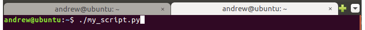
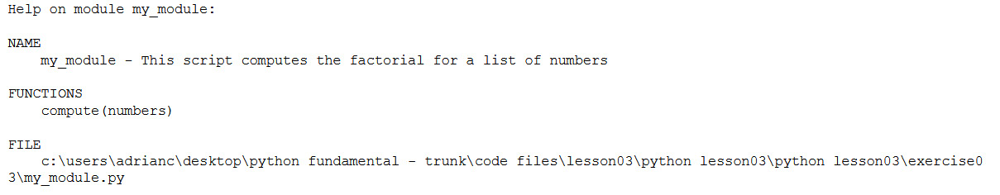
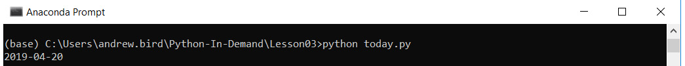
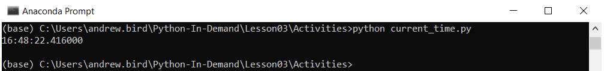
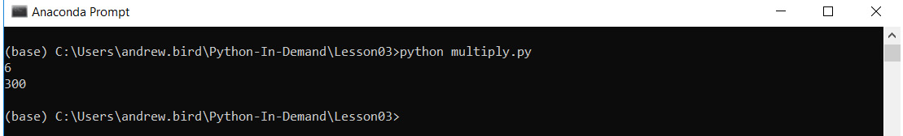
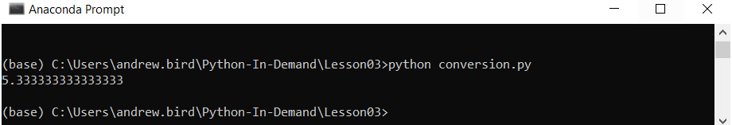
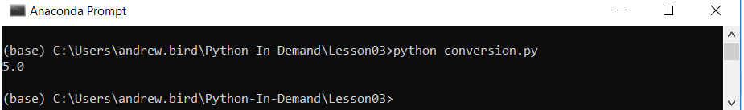
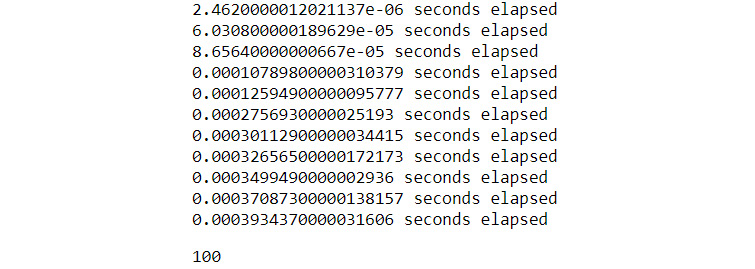
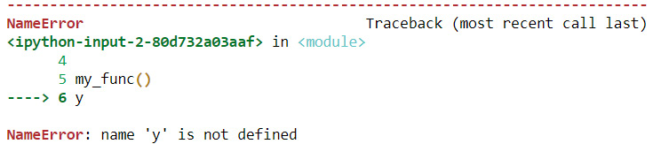

Lab 3. Executing Python -- Programs, Algorithms, and Functions
==========================================================

Overview

By the end of this lab, you will be able to write and execute Python
scripts from the command line; write and import Python modules; document
your code with docstrings; implement basic algorithms in Python,
including bubble sort and binary search; write functions utilizing
iterative, recursive, and dynamic programming algorithms; modularize
code to make it structured and readable and use helper functions and
lambda functions.

This lab will leave you empowered to write more powerful and concise
code through an increased appreciation of well-written algorithms and an
understanding of functions.


Exercise 34: Writing and Executing Our First Script
---------------------------------------------------

In this exercise, you will create a script called
`my_script.py` and execute it on the command line. You will be
then finding the sum of the factorials of three numbers:

1.  Using your favorite text editor, create a new file called
    `my_script.py`. You can also use Jupyter
    (`New | Text File`).

2.  Import the `math` library:

    ```
    import math
    ```

3.  Suppose that you had a list of numbers and you wanted to print the
    sum of the factorials of these numbers. Recall that a factorial is
    the product of all the integers up to and equal to a given number.

    For instance, the factorial of `5` is calculated as 5! =
    5 \* 4 \* 3 \* 2 \* 1 = 120.

    In the following code snippet, you are going to find the sum of
    factorials of `5`,`7` and `11`.


    ```
    numbers = [5, 7, 11]
    ```

4.  Using the `math.factorial` function and list
    comprehension, compute and print `result`:

    ```
    result = sum([math.factorial(n) for n in numbers])
    print(result)
    ```

5.  Save the file.

6.  Open a Terminal or a Jupyter Notebook and ensure that your current
    directory is the same as the one with the `my_script.py`
    file. To check this, if you run `dir` in the Terminal, you
    should see `my_script.py` in the list of files. If not,
    navigate to the correct directory using the `cd` command.

7.  Run `python my_script.py` to execute your script.

    You should get the following output:


    ```
    39921960
    ```

In this exercise, you successfully created and executed a file by
navigating to the correct directory from the Terminal or Jupyter
Notebook.


Exercise 35: Writing and Importing Our First Module
---------------------------------------------------

In this exercise, as in *Exercise 34*, *Writing and Executing Our First
Script,* you will be finding the factorials of three numbers. However,
you will now create a module called `my_module.py`, and import
it into a Python shell:

1.  Using your favorite text editor, create a new file called
    `my_module.py`. You can also use Jupyter
    (`New | Text File`).

2.  Add a function that prints the result of the computation in
    *Exercise 34*, *Writing and Executing Our First Script*. You will
    learn more about this function notation in the upcoming section on
    basic functions:

    ```
    import math
    def compute(numbers):
        return([math.factorial(n) for n in numbers])
    ```

3.  Save the file.

4.  Open a Python shell or Jupyter Notebook and execute the following:


    ```
    from my_module import compute
    compute([5, 7, 11])
    ```

    You should get the following output:


    ```
    [120, 5040, 39916800]
    ```

    Note

    Writing this code as a module is useful if you want to reuse our
    `welcome` function in another script or module. However,
    if you just want to execute the `print` statement once,
    and you don\'t want to have to import our function to a shell, the
    script is more convenient.

In this exercise, you created a module file called
`my_module.py` and imported this module file to get the
expected output on Jupyter or the Python shell.


Shebangs in Ubuntu
------------------

The first line of a Python script will often be:


``` {.language-markup}
#!/usr/bin/env python
```

As additional information, if you are using a Windows operating system,
you can ignore this line. However, it is worth understanding its
function. This path specifies the program that the computer should use
to execute this file. In the previous example, you had to tell the
Command Prompt to use Python to execute our `my_script.py`
script. However, on UNIX systems (such as Ubuntu or macOS X), if your
script has a shebang, you can execute it without specifying that the
system should use Python. For example, using Ubuntu, you will simply
write:




Docstrings
----------

A docstring which was mentioned in the *Lab 1*, *Vital Python: Math,
Strings, Conditionals, and Loops* is a string appearing as the first
statement in a script, function, or class. The docstring becomes a
special attribute of the object, accessible with `__doc__`.
Docstrings are used to store **descriptive information** to explain to
the user what the code is for, and some high-level information on how
they should use it.


Exercise 36: Adding a Docstring to my\_module.py
------------------------------------------------

In this exercise, you extend our `my_module.py` module from
*Exercise 35*, *Writing and Importing Our First Module,* by adding a
docstring:

1.  Open `my_module.py` in Jupyter or a text editor.

2.  Add a docstring to the script (as the first line before beginning
    with your code as mentioned in the following code snippet):

    ```
    """ This script computes the sum of the factorial of a list of numbers"""
    ```

3.  Open a Python console in the same directory as your
    `my_module.py` file.

4.  Import the `my_module` module:

    ```
    import my_module
    ```

5.  Call the `help` function on our `my_module`
    script to view the docstring. The `help` function can be
    used to obtain a summary of any available information regarding a
    module, function, or class in Python. You can also call it without
    an argument, that is, as `help()`, to start an interactive
    series of prompts:


    ```
    help(my_module)
    ```

    You should get the following output:

    



    Caption: The output of the help function

6.  View the `__doc__` property of `my_module` as a
    second way of viewing the docstring:


    ```
    my_module.__doc__
    ```

    You should get the following output:


Caption: Viewing the docstring

Docstrings can span one line, such as in the preceding example, or
multiple lines. The following is an example of a Docstring:


``` {.language-markup}
"""
This script computes the sum of the factorial of a list of numbers.
"""
```


Imports
-------

After the optional shebang statement and docstring, Python files
typically import classes, modules, and functions from other libraries.
For example, if you wanted to compute the value of `exp(2)`,
you could import the `math` module from the standard library
(you will learn more about the standard library in *Lab 6, The
Standard Library*):


``` {.language-markup}
import math
math.exp(2)
```

You should get the following output:


``` {.language-markup}
7.38905609893065
```

In the preceding example, you imported the `math` module and
called an `exp` function that exists within the module.
Alternatively, you could import the function itself from the
`math` module:


``` {.language-markup}
from math import exp
exp(2)
```

You should get the following output:


``` {.language-markup}
7.38905609893065
```

Note that there is a third way of importing, which should generally be
avoided unless necessary:


``` {.language-markup}
from math import *
exp(2)
```

You should get the following output:


``` {.language-markup}
7.38905609893065
```

The `import *` syntax simply imports everything in the module.
It is considered undesirable primarily because you end up with
references to too many objects, and there\'s a risk that the names of
these objects will clash. It\'s also harder to see where certain objects
are imported from if there are multiple `import *` statements.

You can also rename modules or imported objects in the
`import` statement itself:


``` {.language-markup}
from math import exp as exponential
exponential(2)
```

You should get the following output:


``` {.language-markup}
7.38905609893065
```

This is sometimes useful if you simply find the name of the object to be
unwieldy, making your code less readable. Or, it could be necessary
where you want to use two modules that happen to have the same name.


Exercise 37: Finding the System Date
------------------------------------

In this exercise, you write a script that prints the current system date
to the console by importing the `datetime` module:

1.  Create a new script called `today.py` in the Python
    Terminal.
2.  Add a docstring to the script:

    ```
    """
    This script prints the current system date.
    """
    ```
3.  Import the `datetime` module:

    ```
    import datetime 
    ```
4.  Print out the current date using the `now()` property of
    `datetime.date`:

    ```
    print(datetime.date.today())
    ```
5.  Run the script from the command line as shown in the image below.




Caption: The command-line output

In this exercise, you were able to write a script that prints the date
and time using the `datetime` module. Hence, you can see how
modules can be helpful.


The if \_\_name\_\_ == \"\_\_main\_\_\" Statement
-------------------------------------------------

You will often see this cryptic statement in Python scripts. You won\'t
cover this concept in-depth, but it\'s worth understanding. It is used
when you want to be able to execute the script by itself, but also be
able to import objects from the script as though it were a regular
module.

For example, suppose you wanted to get the sum of the numbers from
`1` to `10`. If you execute the function from the
command line, you want the result printed to the console. However, you
also want to be able to import the value to use it elsewhere in our
code.

You may be tempted to write something like this:


``` {.language-markup}
result = 0
for n in range(1, 11):  # Recall that this loops through 1 to 10, not including 11
    result += n
print(result)
```

If you execute this program from the command line, it will print the
output `55`, as expected. However, if you try importing the
result in a Python console, it will print the result again. When
importing the result, you just want the variable; you don\'t expect it
to print to the console:


``` {.language-markup}
from sum_to_10 import result
```

You should get the following output:


``` {.language-markup}
55
```

To fix this, you only call the `print` function in the case
where `__name__ == '__main__'`:


``` {.language-markup}
result = 0
for n in range(1, 11):  # Recall that this loops through 1 to 10, not including 11
    result += n
if __name__ == '__main__':
    print(result)
```

When executing from the command line, the Python interpreter sets the
special `__name__` variable equal to the
`'__main__'` string, such that when you get to the end of your
script, the result is printed. However, when importing
`result`, the `print` statement is never reached:


``` {.language-markup}
from sum_to_10 import result
result * 2
110
```


Activity 8: What\'s the Time?
-----------------------------

You are asked to build a Python script that tells you the current time.

In this activity, you will use the `datetime` module to build
the `current_time.py` script that outputs the current system
time, and then you will import the `current_time.py` script
into a Python console.

The steps to do this are as follows:

1.  Create a new script called `current_time.py` in Jupyter or
    a text editor.
2.  Add a `docstring` to the script to explain what it does.
3.  Import the `datetime` module.
4.  Get the current time using `datetime.now()`.
5.  Print the result, but only if the script is to be executed.
6.  Execute the script from Command Prompt to check it prints the time.
7.  Import the time into a Python console and check if the console
    output does not print the time.
8.  The output from the Command Prompt will be as follows:




Caption: Printing the time to the command line

The output from a Python console should look like this:


``` {.language-markup}
from current_time import time
time
```

You should get the following output:


Exercise 38: The Maximum Number
-------------------------------

In this exercise, you will implement the pseudocode to find the maximum
from a list of positive numbers:

1.  Create a list of numbers:

    ```
    l = [4, 2, 7, 3]
    ```

2.  Set the `maximum` variable equal to `0`:

    ```
    maximum = 0 
    ```

3.  Look through each number, and compare it to `maximum`:

    ```
    for number in l:
        if number > maximum:
            maximum = number
    ```

4.  Check the result:


    ```
    print(maximum)
    ```

    You should get the following output:


    ```
    7
    ```

In this exercise, you successfully implemented the pseudocode given and
found the maximum in a list of numbers.


Exercise 39: Using Bubble Sort in Python
----------------------------------------

In this exercise, you will implement the bubble sort algorithm in Python
with a list of numbers:

1.  Start with a list of numbers:

    ```
    l = [5, 8, 1, 3, 2]
    ```

2.  Create an indicator that will tell us when you can stop looping
    through the array:

    ```
    still_swapping = True
    ```

3.  Look through each number, and compare it to `maximum`:

    ```
    while still_swapping:
        still_swapping = False
        for i in range(len(l) - 1):
            if l[i] > l[i+1]:
                l[i], l[i+1] = l[i+1], l[i]
                still_swapping = True
       
    ```

4.  Check the result:


    ```
    l
    ```

    You should get the following output:


    ```
    [1, 2, 3, 5, 8]
    ```

Bubble sort is a very simple but inefficient sorting algorithm. Its time
complexity is `O(n^2)`, meaning that the number of steps
required is proportional to the square of the size of the list.


Searching Algorithms
--------------------

Another important family of algorithms is the searching algorithm. In a
world where you are producing an exponentially increasing amount of
data, these algorithms have a huge impact on our day-to-day lives.
Simply considering the size of Google should give you an appreciation of
the importance (and complexity) of these algorithms. Of course, you
encounter the need for these algorithms just about every time you pick
up a phone or open a laptop:

-   Searching your contacts list to send a message
-   Searching your computer for a specific application
-   Searching for an email containing a flight itinerary

With any of these examples, you can apply the simplest form of search,
that is, a linear search. This will involve simply looping through all
possible results and checking whether they match the search criteria.
For example, if you were searching your contacts list, you would look
through each contact one by one, and check whether that contact met the
search criteria. If so, return the position of the result. This is a
simple but inefficient algorithm, with time complexity of
`O(n)`.


Exercise 40: Linear Search in Python
------------------------------------

In this exercise, you will implement the linear search algorithm in
Python using a list of numbers:

1.  Start with a list of numbers:

    ```
    l = [5, 8, 1, 3, 2]
    ```

2.  Specify a value to `search_for`:

    ```
    search_for = 8
    ```

3.  Create a `result` variable that has a default value of
    `-1`. If the search is unsuccessful, this value will
    remain `-1` after the algorithm is executed:

    ```
    result = -1 
    ```

4.  Loop through the list. If the value equals the search value, set the
    `result`, and exit the loop:

    ```
    for i in range(len(l)):
        if search_for == l[i]:
            result = i
            break
    ```

5.  Check the `result`:


    ```
    print(result)
    ```

    You should get the following output:


    ```
    1
    ```

    Note

    This means that the search found the required value at position 1 in
    the list (which is the second item in the list, as indices start
    from 0 in Python).

Another common sorting algorithm is called a **binary search**. The
binary search algorithm takes a sorted array and finds the position of
the target value. Suppose that you were trying to find the position of
the number 11 in the following list:


Caption: A simple problem for a search algorithm to solve

The binary search algorithm will be explained as follows:

1.  Take the midpoint of the list. If this value is less than the target
    value, discard the left half of the list, and vice versa. In this
    case, our target value of 11 is greater than 8, so you know that you
    can restrict our search to the right side of the list (since you
    know the array is sorted):

    


    Caption: Splitting the list at the midpoint, 8

    Note

    If there is an even number of items on the list, simply take one of
    the two middle numbers, it doesn\'t matter which.

2.  You repeat this process with the right side of the list, picking the
    midpoint of the remaining values. Since the target value, 11 is less
    than the midpoint 12, and you discard the right side of our sublist:

    


3.  This leaves you with the value that you were searching for:


Caption: Reaching the final result


Exercise 41: Binary Search in Python
------------------------------------

In this exercise, you will implement the binary search algorithm in
Python:

1.  Start with a list of numbers:

    ```
    l = [2, 3, 5, 8, 11, 12, 18]
    ```

2.  Specify the value to `search_for`:

    ```
    search_for = 11
    ```

3.  Create two variables that will represent the start and end locations
    of the sublist you are interested in. Initially, it will represent
    the start and end indices for the entire list:

    ```
    slice_start = 0
    slice_end = len(l) - 1 
    ```

4.  Add a variable to indicate whether the search was successful:

    ```
    found = False
    ```

5.  Find the midpoint of the list, and check whether the value is
    greater or less than the search term. Depending on the outcome of
    the comparison, either finish the search or update the locations for
    the start/end of the sublist:

    ```
    while slice_start <= slice_end and not found:
        location = (slice_start + slice_end) // 2
        if l[location] == search_for:
            found = True
        else:
            if search_for < l[location]:
                slice_end = location - 1
            else:
                slice_start = location + 1
    ```

6.  Check the results:


    ```
    print(found)
    print(location)
    ```

    You should get the following output:


    ```
    True
    4
    ```

In this exercise, you successfully implemented the binary search
algorithm on a list of numbers.


Basic Functions
===============


A function is a reusable piece of code that is only run when it is
called. Functions can have inputs, and they usually return an output.
For example, using a Python shell, you can define the following function
that takes two inputs and returns the sum:


``` {.language-markup}
def add_up(x, y):
    return x + y
add_up(1, 3)
```

You should get the following output:


``` {.language-markup}
4
```


Exercise 42: Defining and Calling the Function in Shell
-------------------------------------------------------

In this exercise, you create a function that will return the second
element of a list if it exists:

1.  In a Python shell, enter the function definition. Note that the tab
    spacing needs to match the following output:


    ```
    def get_second_element(mylist):
        if len(mylist) > 1:
            return mylist[1]
        else:
            return 'List was too small'
    ```

    Here you are calling `print` logs the parsed message to
    the standard output.

2.  Try running the function on a small list of integers:


    ```
    get_second_element([1, 2, 3])
    ```

    You should get the following output:


    ```
    2
    ```

3.  Try running the function on a list with only one element:


    ```
    get_second_element([1])
    ```

    You should get the following output:


Defining functions in a shell can be difficult, as the shell isn\'t
optimized for editing multiple lines of code blocks. Instead, it\'s
preferable for our functions to live inside a Python script.


Exercise 43: Defining and Calling the Function in Python Script
---------------------------------------------------------------

In this exercise, you will define and call a function in a
`multiply.py` Python script and execute it from Command
Prompt:

1.  Create a new file using a text editor called
    `multiply.py`:

    ```
    def list_product(my_list): 
        result = 1
        for number in my_list: 
            result = result * number
        return result
    print(list_product([2, 3]))
    print(list_product([2, 10, 15]))
    ```
2.  Using Command Prompt, execute this script, ensuring that your
    Command Prompt is in the same folder as the `multiply.py`
    file:




Caption: Running from the command line

In this exercise, you worked on defining and calling a function within a
Python script.


Exercise 44: Importing and Calling the Function from the Shell
--------------------------------------------------------------

In this exercise, you will import and call the `list_product`
function you defined in `multiply.py`:

1.  In a Python shell, import our `list_product` function:


    ```
    from multiply import list_product
    ```

    You should get the following output:


    ```
    6
    300
    ```

    One unintended consequence is that your `print` statements
    in `multiply.py` were also executed:
    `introduce __name__ == 'main'`.

2.  Call the function with a new list of numbers:


    ```
    list_product([-1, 2, 3])
    ```

    You should get the following output:


    ```
    –6
    ```

Now that you\'ve completed this exercise, you have gained an
understanding of how to import and call a function. You created the
`multiply.py` file in *Exercise 43*, *Defining and Calling the
Function in Python Script*, and imported and used this function in this
exercise.


Positional Arguments
--------------------

The preceding examples have all included positional arguments. In the
following example, there are two positional arguments, `x` and
`y`, respectively. When you call this function, the first
value you pass in will be assigned to `x`, and the second
value will be assigned to `y`:


``` {.language-markup}
def add_up(x, y):
    return x + y
```

You can also specify functions without any arguments:


``` {.language-markup}
from datetime import datetime
def get_the_time():
    return datetime.now()
print(get_the_time())
```

You should get the following output:


Caption: The current date and time


Keyword Arguments
-----------------

Keyword arguments, also known as named arguments, are optional inputs to
functions. These arguments have a default value that is taken when the
function is called without the keyword argument specified.


Exercise 45: Defining the Function with Keyword Arguments
---------------------------------------------------------

In this exercise, you will use the Python shell to define an
`add_suffix` function that takes an optional keyword argument:

1.  In a Python shell, define the `add_suffix` function:

    ```
    def add_suffix(suffix='.com'):
        return 'google' + suffix
    ```

2.  Call the `add_suffix` function without specifying the
    `suffix` argument:


    ```
    add_suffix()
    ```

    You should get the following output:


    ```
    'google.com'
    ```

3.  Call the function with a specific `suffix` argument:


    ```
    add_suffix('.co.uk')
    ```

    You should get the following output:


    ```
    'google.co.uk'
    ```


Exercise 46: Defining the Function with Positional and Keyword Arguments
------------------------------------------------------------------------

In this exercise, you use the Python shell to define a
`convert_usd_to_aud` function that takes a positional argument
and an optional keyword argument:

1.  In a Python shell, define the `convert_usd_to_aud`
    function:

    ```
    def convert_usd_to_aud(amount, rate=0.75):
        return amount / rate 
    ```

2.  Call the `convert_usd_to_aud` function without specifying
    the exchange rate argument:


    ```
    convert_usd_to_aud(100)
    ```

    You should get the following output:


    ```
    133.33333333333334
    ```

3.  Call the `convert_usd_to_aud` function with a specific
    exchange rate argument:


    ```
    convert_usd_to_aud(100, rate=0.78)
    ```

    You should get the following output:


    ```
    128.2051282051282
    ```

The rule of thumb is to simply use positional arguments for required
inputs that must be provided each time the function is called, and
keyword arguments for optional inputs.

You will sometimes see functions that accept a mysterious-looking
argument: \*\*kwargs. This allows the function to accept any keyword
arguments when it\'s called, and these can be accessed in a dictionary
called \"kwargs\". Typically, this is used when you want to pass
arguments through to another function.


Exercise 47: Using \*\*kwargs
-----------------------------

In this exercise, you will write a Python script to pass named arguments
through a `convert_usd_to_aud` function:

1.  Using a text editor, create a file called `conversion.py`.

2.  Enter the `convert_usd_to_aud` function defined in the
    previous exercise:

    ```
    def convert_usd_to_aud(amount, rate=0.75):
        return amount / rate
    ```

3.  Create a new `convert_and_sum_list` function that will
    take a list of amounts, convert them to AUD, and return the sum:

    ```
    def convert_and_sum_list(usd_list, rate=0.75):
        total = 0
        for amount in usd_list:
            total += convert_usd_to_aud(amount, rate=rate)
        return total
    print(convert_and_sum_list([1, 3]))
    ```

4.  Execute this script from Command Prompt:

    



    Caption: Converting a list of USD amounts to AUD

    Note that the `convert_and_sum_list` function didn\'t need
    the rate argument. It simply needed to pass it through to the
    `convert_usd_to_aud` function. Imagine that, instead of
    one argument, you had 10 that needed to be passed through. There
    will be a lot of unnecessary code. Instead, you will use the
    `kwargs` dictionary.

5.  Add the following function to `conversion.py`:

    ```
    def convert_and_sum_list_kwargs(usd_list, **kwargs):
        total = 0
        for amount in usd_list:
            total += convert_usd_to_aud(amount, **kwargs)
        return total
    print(convert_and_sum_list_kwargs([1, 3], rate=0.8))
    ```

6.  Execute this script from Command Prompt:




Caption: Altering the result by specifying the kwarg rate


Activity 9: Formatting Customer Names
-------------------------------------

Suppose that you are building a **Customer Relationship Management**
(**CRM**) system, and you want to display a user record in the following
format: `John Smith (California)`. However, if you don\'t have
a location in your system, you just want to see \"John Smith.\"

Create a `format_customer` function that takes two required
positional arguments, `first_name` and `last_name`,
and one optional keyword argument, `location`. It should
return a string in the required format.

The steps are as follows:

1.  Create the `customer.py` file.

2.  Define the `format_customer` function.

3.  Open a Python shell and import your `format_customer`
    function.

4.  Try running a few examples. The outputs should look like this:


    ```
    from customer import format_customer
    format_customer('John', 'Smith', location='California')
    ```

    You should get the following output:


Caption: The formatted customer name


``` {.language-markup}
format_customer('Mareike', 'Schmidt')
```

You should get the following output:


Iterative Functions
===================


In the *For Loops* section in *Lab 1*, *Vital Python -- Math,
Strings, Conditionals, and Loops*, you were introduced to the syntax for
looping over objects in Python. As a refresher, here is an example where
you perform five iterations and print the `i` variable in each
loop:


``` {.language-markup}
for i in range(5):
    print(i)
```

You should get the following output:


``` {.language-markup}
0
1
2
3
4
```

For loops can also be placed within functions.


Exercise 48: A Simple Function with a for Loop
----------------------------------------------

In this exercise, you create a `sum_first_n` function that
sums up the first `n` integers. For example, if you pass the
`n=3` function, it should return 1 + 2 + 3 = 6:

1.  In a Python shell, enter the function definition. Note that the tab
    spacing needs to match the following output:

    ```
    def sum_first_n(n):
        result = 0
        for i in range(n):
            result += i + 1
        return result
       
    ```

2.  Test the `sum_first_n` function on an example:


    ```
    sum_first_n(100)
    ```

    You should get the following output:


    ```
    5050
    ```

In this exercise, you successfully implemented a simple
`sum_first_n` function with a `for` loop to find the
total sum of `n` numbers.


Exiting Early
-------------

You can exit the function at any point during the iterations. For
instance, you might want the function to return a value once a certain
condition is met.


Exercise 49: Exiting the Function During the for Loop
-----------------------------------------------------

In this exercise, you will create a function that (inefficiently) checks
whether a certain number `x` is a prime. The function does
this by looping through all the numbers from `2` to
`x` and checks whether `x` is divisible by it. If it
finds a number that `x` is divisible by, the iteration will
stop and return `False`, as it has ascertained that
`x` is not prime:

1.  In a Python shell, enter the function definition. Note that the tab
    spacing needs to match the following output:

    ```
    def is_prime(x):
        for i in range(2, x):
            if (x % i) == 0:
            return False
        return True
    ```

2.  Test the function on a couple of examples:


    ```
    is_prime(7)
    ```

    You should get the following output:


    ```
    True
    ```

    Now, find out if 1000 is a prime number or not.


    ```
    is_prime(1000)
    ```

    You should get the following output:


    ```
    False
    ```

In this exercise, you successfully implemented a code that checks
whether the `x` variable is prime by looping through numbers.
In the case that it is divisible, it will exit the loop and provide the
output as `False`.


Activity 10: The Fibonacci Function with an Iteration
-----------------------------------------------------

You work in an IT firm, and your colleague has realized that being able
to quickly compute elements of the Fibonacci sequence will reduce the
time taken to execute the testing suite on one of your internal
applications. You will use an iterative approach to create a
`fibonacci_iterative` function that returns the nth value in
the Fibonacci sequence.

The steps are as follows:

1.  Create a `fibonacci.py` file.

2.  Define a `fibonacci_iterative` function that takes a
    single positional argument representing which number term in the
    sequence you want to return.

3.  Run the following code:


    ```
    from fibonacci import fibonacci_iterative
    fibonacci_iterative(3)
    ```

    You should get the following output:


    ```
    2
    ```

    Another example to test your code can be as mentioned in the
    following code snippet:


    ```
    fibonacci_iterative(10)
    ```

    You should get the following output:


    ```
    55
    ```


Recursive Functions
===================


When a function calls itself, it is known as a Recursive Function. This
is like `for` loops. However, sometimes it allows you to write
more elegant and terse functions than can be achieved with a loop.

You can imagine that a function that calls itself might end up in an
infinite loop; it is true that you can write a recursive function that
will keep running indefinitely:


``` {.language-markup}
def print_the_next_number(start):
        print(start + 1)
        return print_the_next_number(start + 1)
print_the_next_number(5)
```

You should get the following output:


``` {.language-markup}
6
7
8
9
10
11
```

Note

The output mentioned above is truncated.

If you run this code in a Python shell, it will
continue printing integers until you interrupt the interpreter (**Ctrl +
C**). Take a look at the preceding code and ensure you understand why it
behaves in this manner. The function executes the following steps:

-   The function is called with `start = 5`.
-   It prints `6` to the console, that is
    (`5 + 1 = 6`).
-   It then calls itself, this time passing in the argument start =
    `6`.
-   The function starts again, this time printing `7`, that is
    (`6 + 1 = 7`).


A Terminating Case
------------------

To avoid being stuck in an infinite loop, a recursive function will
typically have a Terminating Case, such as a point where the chain of
recursion is broken. In our previous example, you could make it stop
once the `start` parameter is greater than or equal to
`7`:


``` {.language-markup}
def print_the_next_number(start):
    print(start + 1)
    if start >= 7:
        return "I'm bored"
    return print_the_next_number(start + 1)
print_the_next_number(5)
```

You should get the following output:


Caption: Terminating the loop


Exercise 50: Recursive Countdown
--------------------------------

In this exercise, you will create a `countdown` function that
recursively counts down from integer `n` until we hit
`0`:

1.  In Jupyter Notebook, enter the function definition. Note that the
    tab spacing needs to match the output that follows:

    ```
    def countdown(n):
        if n == 0:
            print('liftoff!')
        else:
            print(n)
            return countdown(n - 1)
    ```
2.  Test the function:

    ```
    countdown(3)
    ```
3.  You should get the following output:


Caption: Counting down with recursion

In this exercise, you successfully implemented a termination statement
after number 1, with the term `liftoff`. This shows us that
the recursive countdown has ended.


Exercise 51: Factorials with Iteration and Recursion
----------------------------------------------------

In this exercise, you create a `factorial_iterative` function
that takes an integer and returns the factorial using both an iterative
and a recursive approach. Recall that a factorial is the product of all
integers up to and equal to the number.

For instance, the factorial of 5 is calculated as 5! = 5 \* 4 \* 3 \* 2
\* 1 = 120.

1.  In a Jupyter Notebook, enter the following function to compute
    factorials using iteration:

    ```
    def factorial_iterative(n):
            result = 1
            for i in range(n):
                result *= i + 1
            return result
    ```

2.  Test the function:


    ```
    factorial_iterative(5):
    ```

    You should get the following output:


    ```
    120
    ```

3.  Note that you can express n! = n \* (n -- 1)!; for instance, 5! =
    5 \* 4!. This means we can write the function with recursion as
    follows:

    ```
    def factorial_recursive(n):
            if n == 1:
                return 1
            else:
                return n * factorial_recursive(n - 1)    
    ```

4.  Test the function:


    ```
    factorial_recursive(5):
    ```

    You should get the following output:


    ```
    120
    ```

In this exercise, you successfully implemented and used both iteration
and recursion to find the factorial of `n` numbers.


Activity 11: The Fibonacci Function with Recursion
--------------------------------------------------

Suppose that your colleague has told you that the iterative function you
designed in *Activity 10*, *The Fibonacci Function with an Iteration*,
is not elegant and should be written with fewer lines of code. Your
colleague mentions that a recursive solution will be able to achieve
this.

In this activity, you will use recursion to write a terse (but
inefficient) function for computing the nth term of the Fibonacci
sequence.

The steps are as follows:

1.  Open the `fibonacci.py` file created in *Activity 10*,
    *The Fibonacci Function with an Iteration*.

2.  Define a `fibonacci_recursive` function, which takes a
    single positional argument representing which number term in the
    sequence we want to return.

3.  Try running a few examples in a Python shell:


    ```
    from fibonacci import fibonacci_recursive
    ```

    To find the fibonacci recursive for the value 3.


    ```
    fibonacci_recursive(3)
    ```

    You should get the following output:


    ```
    2
    ```

    You can run the following code and find the fibonacci recursive for
    the value 10.


    ```
    fibonacci_recursive(10)
    ```

    You should get the following output:


    ```
    55
    ```


Dynamic Programming
===================


Our recursive algorithm for computing Fibonacci numbers may look
elegant, but that doesn\'t mean it\'s efficient. For example, when
computing the fourth term in the sequence, it calculates the value for
both the second and third terms. Likewise, when calculating the value of
the third term in the sequence, it calculates the value for the first
and second terms. This isn\'t ideal, as the second term in the sequence
was already being calculated in order to get the fourth term. Dynamic
programming will help us to address this problem by ensuring you break
down the problem into the appropriate subproblems, and never solve the
same subproblem twice.


Exercise 52: Summing Integers
-----------------------------

In this exercise, you write a `sum_to_n` function to sum
integers up to `n`. You store the results in a dictionary, and
the function will use the stored results to return the answer in fewer
iterations. For example, if you already know the sum of integers up to 5
is 15, you should be able to use this answer when computing the sum of
integers up to 6:

1.  Create a new `dynamic.py` Python file.

2.  Write a `sum_to_n` function that starts with
    `result = 0`, and an empty dictionary for saving results:

    ```
    stored_results = {}
    def sum_to_n(n):
        result = 0
    ```

3.  Add in a loop that computes the sum, returns the result, and stores
    the result in our dictionary:

    ```
    stored_results = {}
    def sum_to_n(n):
        result = 0
        for i in reversed(range(n)):
            result += i + 1
        stored_results[n] = result
        return result
    ```

4.  Finally, extend the function further by checking in each loop
    whether you already have a result for this number; if so, use the
    stored result and exit the loop:

    ```
    stored_results = {}
    def sum_to_n(n):
        result = 0
        for i in reversed(range(n)):
            if i + 1 in stored_results:
                print('Stopping sum at %s because we have previously computed it' % str(i + 1))
                result += stored_results[i + 1]
                break
            else:
                result += i + 1
        stored_results[n] = result
        return result
    ```

5.  Test the function in a Python shell to find the sum of integers up
    to 5:


    ```
    sum_to_n(5)
    ```

    You should get the following output:


    ```
    15
    ```

    Now, test the function once again to find the sum of integers up
    to 6.


    ```
    sum_to_n(6)
    ```

    You should get the following output:


Caption: Stopping early with saved results

In this exercise, you were able to reduce the number of steps in our
code using dynamic programming to find the sum of integers up to
`n`. The results were stored in a dictionary, and the function
uses the stored result to output the answer in fewer iterations.


Timing Your Code
----------------

One measure of code efficiency is the actual time taken for your
computer to execute it. In the examples given so far in this lab,
the code will execute too quickly to gauge any difference in the various
algorithms. There are a few methods with which we can time programs in
Python; you will focus on using the `time` module from the
standard library.


Exercise 53: Timing Your Code
-----------------------------

In this exercise, you will calculate the time taken to execute the
function in the previous exercise:

1.  Open the `dynamic.py` file created in the previous
    exercise.

    Add the following import at the top of the file:


    ```
    import time
    ```

2.  Modify the function to calculate the time at the start, and print
    out the time elapsed at the end:

    ```
    stored_results = {}
    def sum_to_n(n):
        start_time = time.perf_counter()
        result = 0
        for i in reversed(range(n)):
            if i + 1 in stored_results:
                print('Stopping sum at %s because we have previously computed it' % str(i + 1))
                result += stored_results[i + 1]
                break
            else:
                result += i + 1
        stored_results[n] = result
        print(time.perf_counter() - start_time, "seconds")
    ```

3.  Open a Python shell, import your new function, and try running an
    example with a large number:


    ```
    sum_to_n(1000000)
    ```

    You should get the following output:

    


    Caption: Timing our code

4.  Rerun the same code in the shell:


    ```
    sum_to_n(1000000)
    ```

    You should get the following output:


Caption: Speeding up the execution with dynamic programming

Note

In the preceding example, the function returned the value faster by
simply looking up the stored value in the dictionary.


Activity 12: The Fibonacci Function with Dynamic Programming
------------------------------------------------------------

Your colleague has tried to use the code written in *Activity 11*, *The
Fibonacci Function with Recursion*, and they notice that it is too slow
when computing large Fibonacci numbers. They ask you to write a new
function that can compute large Fibonacci numbers quickly.

In this activity, you will use dynamic programming to avoid the
inefficient recursive loops that you implemented in *Activity 11, The
Fibonacci Function with Recursion*.

The steps to do this are as follows:

1.  Open the `fibonacci.py` file created in *Activity 10*,
    *The Fibonacci Function with Iteration*.

2.  Define a `fibonacci_dynamic` function, which takes a
    single positional argument representing the number in the sequence
    that you want to return. Try starting with the
    `fibonacci_recursive` function from the previous activity
    and storing the results in a dictionary as the recursions are
    performed.

3.  Try running a few examples in a Python shell:


    ```
    from fibonacci import fibonacci_recursive
    fibonacci_dynamic(3)
    ```

    You should get the following output:


    ```
    2
    ```

4.  Note that if you try to use our recursive or iterative functions to
    compute the 100th Fibonacci number, they will be too slow and will
    never finish executing (unless you\'re willing to wait a few years).


Helper Functions
================


A helper function performs part of the computation of another function.
It allows you to reuse common code without repeating ourselves. For
instance, suppose you had a few lines of code that printed out the
elapsed time at various points in a function:


``` {.language-markup}
import time
def do_things():
    start_time = time.perf_counter()
    for i in range(10):
        y = i ** 100
        print(time.perf_counter() - start_time, "seconds elapsed")
    x = 10**2
    print(time.perf_counter() - start_time, "seconds elapsed")
    return x
   
do_things()
```

You should get the following output:




Caption: Timing our helper functions

The `print` statement is repeated twice in the preceding code,
and will be better expressed as a helper function, as follows:


``` {.language-markup}
import time
def print_time_elapsed(start_time):
    print(time.perf_counter() - start_time, "seconds elapsed")
def do_things():
    start_time = time.perf_counter()
    for i in range(10):
        y = i ** 100
        print_time_elapsed(start_time)
    x = 10**2
    print_time_elapsed(start_time)
    return x
```


Don\'t Repeat Yourself
----------------------

The preceding example encapsulates the Don\'t Repeat Yourself (DRY)
programming principle. In other words, \"*Every piece of knowledge or
logic must have a single, unambiguous representation within a system.*\"
If you want to do the same thing multiple times in your code, it should
be expressed as a function, and called wherever it is needed.


Exercise 54: Helper Currency Conversion
---------------------------------------

In this exercise, you will take a function that computes the total USD
for a transaction and use a `helper` function to apply the DRY
principle. You also want to add an optional margin into the currency
conversion that should default to `0`:


``` {.language-markup}
def compute_usd_total(amount_in_aud=0, amount_in_gbp=0):
    total = 0
    total += amount_in_aud * 0.78
    total += amount_in_gbp * 1.29
    return total
compute_usd_total(amount_in_gbp=10)
```

You should get the following output:


``` {.language-markup}
12.9
```

1.  Create a currency conversion function with an optional
    `margin`:

    ```
    def convert_currency(amount, rate, margin=0):
         return amount * rate * (1 + margin)
    ```

2.  Modify the original function to use the `helper` function:

    ```
    def compute_usd_total(amount_in_aud=0, amount_in_gbp=0):
        total = 0
        total += convert_currency(amount_in_aud, 0.78)
        total += convert_currency(amount_in_gbp, 1.29)
        return total
    ```

3.  Check the result:


    ```
    compute_usd_total(amount_in_gbp=10)
    ```

    You should get the following output:


    ```
    12.9
    ```

4.  Suppose that the business has decided to add a 1% margin for the
    conversion of the GBP component. Modify the function accordingly:

    ```
    def compute_usd_total(amount_in_aud=0, amount_in_gbp=0):
        total = 0
        total += convert_currency(amount_in_aud, 0.78)
        total += convert_currency(amount_in_gbp, 1.29, 0.01)
        return total   
    ```

5.  Check the result:


    ```
    compute_usd_total(amount_in_gbp=10)
    ```

    You should get the following output:


    ```
    13.029
    ```

Note that it\'s possible to get ahead of yourself when applying the DRY
principle in writing reusable code. In the currency example, if our
application really did just require converting currency once, then it
probably shouldn\'t be written as a separate function. It may be
tempting to think that generalizing our code is always good because it
insures us against the possibility of needing to repeat the same code
later; however, this attitude is not always optimal. You can end up
spending a lot of time writing more abstract code than is necessary,
and, often, this code can be less readable and may introduce unnecessary
complexity to our codebase. Typically, the time to apply the DRY
principle is when you find yourself writing the code for the second
time.


Variable Scope
==============


Variables are only available in the area where they are defined. This
area is called the scope of the variable. Depending on how and where a
variable is defined, it may or may not be accessible in certain parts of
your code. Here, you will discuss what variables in Python represent,
the difference in defining them inside or outside a function, and how
the global and nonlocal keywords can be used to override these default
behaviors.


Variables
---------

A variable is a mapping between a name and an object at a certain
location in the computer\'s memory. For example, if you set
`x = 5`, then `x` is the variable\'s name, and the
value `5` is stored in memory. Python keeps track of the
mapping between the name `x` and the location of the value
using namespaces. Namespaces can be thought of as dictionaries, with the
names as the keys of the dictionary, and locations in memory as the
values.

Note that when a variable is assigned to the value of another variable,
this just means they are pointing to the same value, not that their
equality will be maintained when one of the variables is updated:


``` {.language-markup}
x = 2
y = x
x = 4
print("x = " + str(x))
```

You should get the following output:


``` {.language-markup}
x = 4
print("y = " + str(y))
```

You should get the following output:


``` {.language-markup}
y = 2
```

In this example, both `x` and `y` are initially set
to point to integer `2`. Note that the line `y = x`
here is equivalent to writing `y = 2`. When `x` is
updated, it is updated to bind to a different location in memory, and
`y` remains bound to the integer `2`.


Defining inside versus outside a Function
-----------------------------------------

When you define a variable at the start of a script, it will be a global
variable, accessible from anywhere in the script. This includes within
the functions themselves:


``` {.language-markup}
x = 5
def do_things():
    print(x)
do_things()
```

With this code, you should get the following output:


``` {.language-markup}
5
```

However, if you define a variable within a function, it is only
accessible within that function:


``` {.language-markup}
def my_func():
    y = 5
    return 2
my_func()
```

You should get the following output:


``` {.language-markup}
2
```

Now, enter the value y and observe the output


``` {.language-markup}
y
```

You should get the following output:




Caption: We are unable to access the local variable y

Note that if you define a variable within a function that has already
been defined globally, the value will change depending on where the
variable is accessed. In the following example, `x` is defined
globally as `3`. However, it is defined within the function as
`5`, and when accessed within the function, you can see it
takes the value of `5`.


``` {.language-markup}
x = 3
def my_func():
    x = 5
    print(x)
   
my_func()
```

You should get the following output:


``` {.language-markup}
5
```

However, when it is accessed outside of the function, it takes the
global value, `3`.

This means you need to take care when updating global variables. For
instance, can you see why the following fails to work? Take a look:


``` {.language-markup}
score = 0
def update_score(new_score):
    score = new_score
update_score(100)
print(score)
```

You should get the following output:


``` {.language-markup}
0
```

Within the function, the `score` variable is indeed updated to
be equal to `100`. However, this variable is only local to the
function, and outside the function the global score variable is still
equal to `0`. However, you can get around this with the
`global` keyword.


The Global Keyword
------------------

The `global` keyword simply tells Python to use the existing
globally defined variable, where the default behavior will be to define
it locally. You can do this using the same example as before:


``` {.language-markup}
score = 0
def update_score(new_score):
    global score
score = new_score
print(score)
```

You should get the following output:


``` {.language-markup}
0
```

Now, you update the score to 100 as shown in the following code snippet:


``` {.language-markup}
update_score(100)
```

Now, to print the scores


``` {.language-markup}
print(score)
```

You should get the following output:


``` {.language-markup}
100
```


The Nonlocal Keyword
--------------------

The `nonlocal` keyword behaves in a similar way to the
`global` keyword, in that it does not define the variable
locally, and instead picks up the existing variable definition. However,
it doesn\'t go straight to the global definition. It first looks at the
closest enclosing scope; that is, it will look \"one level up\" in the
code.

For example, consider the following:


``` {.language-markup}
x = 4
def myfunc():
    x = 3
    def inner():
        nonlocal x
        print(x)
    inner()
myfunc()
```

You should get the following output:


``` {.language-markup}
3
```

In this example, the `inner` function takes the variable
definition\'s `x` from `myfunc`, and not the
`global` keyword\'s `x`. If you instead write
`global x`, then the integer `4` will be printed.


Lambda Functions
================


Lambda functions are small, anonymous functions that can be defined in a
simple one-line syntax:


``` {.language-markup}
lambda arguments : expression
```

For example, take the following function that returns the sum of two
values:


``` {.language-markup}
def add_up(x, y):
    return x + y
print(add_up(2, 5))
7
```

This function can equivalently be written using the lambda function
syntax, as follows:


``` {.language-markup}
add_up = lambda x, y: x + y
print(add_up(2, 5)) 
```

You should get the following output:


``` {.language-markup}
7
```

Note that the main restriction of a lambda function is that it can only
contain a single expression. That is, you need to be able to write the
expression to return the value in a single line of code. This makes
lambda functions convenient only in situations where the function is
sufficiently simple such that it can be expressed in a single statement.


Exercise 55: The First Item in a List
-------------------------------------

In this exercise, you will write a lambda function,
`first_item`, to select the first item in a list containing
the items of the `cat`, `dog`, and
`mouse`:

1.  Create the `lambda` function:

    ```
    first_item = lambda my_list: my_list[0]
    ```

2.  Test the function:


    ```
    first_item(['cat', 'dog', 'mouse'])
    ```

    You should get the following output:


    ```
    'cat'
    ```

Lambda functions can be particularly useful in passing custom functions
to a map, as you can quickly define a function on the fly without
assigning it to a variable name. The next two sections look at contexts
where this is particularly useful.


Mapping with Lambda Functions
-----------------------------

`map` is a special function in Python that applies a given
function to all items in a list. For instance, suppose that you had a
list of names and you wanted to get the average number of characters:


``` {.language-markup}
names = ['Magda', 'Jose', 'Anne']
```

For each name in the list, you want to apply the `len`
function, which returns the number of characters in a string. One option
will be to iterate manually over the names, and add the lengths to a
list:


``` {.language-markup}
lengths = []
for name in names:
    lengths.append(len(name))
```

The alternative is to use the `map` function:


``` {.language-markup}
lengths = list(map(len, names))
```

The first argument is the function to be applied, and the second
argument is an iterable (in this case, a list) of names. Note that the
`map` function returns a generator object, not a list, so you
convert it back to a list.

Finally, you take the average length of the list:


``` {.language-markup}
sum(lengths) / len(lengths)
4.33333333333
```


Exercise 56: Mapping with a Logistic Transform
----------------------------------------------

In this exercise, you use `map` with a lambda function to
apply the logistic function to a list of values.

The logistic function is often used in predictive modeling when dealing
with binary response variables. It is defined as follows:


Caption: The logistic function

1.  Import the `math` module as needed for the exponential
    function:

    ```
    import math
    ```

2.  Create a list of values:

    ```
    nums = [-3, -5, 1, 4] 
    ```

3.  Use a lambda function to map the list of values using a logistic
    transform:


    ```
    list(map(lambda x: 1 / (1 + math.exp(-x)), nums))
    ```

    You should get the following output:


Caption: Applying the logistic function to a list

In this exercise, you used the `lambda` function to find the
list of values by using `map`.


Filtering with Lambda Functions
-------------------------------

The `filter` is another special function that, like
`map`, takes a function and iterables (for example, a list) as
inputs. It returns the elements for which the function returns
`True`.

For example, suppose that you had a list of names and wanted to find
those that were three letters long:


``` {.language-markup}
names = ['Karen', 'Jim', 'Kim']
list(filter(lambda name: len(name) == 3, names))
```

You should get the following output:


Caption: The filtered list


Exercise 57: Using the Filter Lambda
------------------------------------

Consider a list of all-natural numbers below 10 that are multiples of 3
or 7. The multiples will be 3, 6, 7, and 9, and the sum of these when
multiplied is 25.

In this exercise, you will be calculating the sum of all the multiples
of 3 or 7 below 1,000:

1.  Create a list of numbers from 0 to 999:

    ```
    nums = list(range(1000))
    ```

2.  Use a `lambda` function to filter the values that are
    divisible by 3 or 7:


    ```
    filtered = filter(lambda x: x % 3 == 0 or x % 7 == 0, nums)
    ```

    Recall that the `%` (`modulo`) operator returns
    the remainder from the division of the first argument by the second.
    So, `x % 3 == 0` is checking that the remainder of
    `x` divided by `3` is `0`.

3.  `sum` the list to get the result:


    ```
    sum(filtered)
    ```

    You should get the following output:


    ```
    214216
    ```

In this exercise, you successfully used filter lambdas that took a
function as an input, in this case, `filtered`, and then
returned the output as the sum of `filtered`.


Sorting with Lambda Functions
-----------------------------

Another useful function that lambdas are often used with is
`sorted`. This function takes an iterable, such as a list, and
sorts them according to a function.

For example, suppose that you had a list of names, and wanted them
sorted by length:


``` {.language-markup}
names = ['Ming', 'Jennifer', 'Andrew', 'Boris']
sorted(names, key=lambda x : len(x))
```

You should get the following output:


Caption: Sorting using the lambda function

Recall that the `%` (`modulo`) operator returns the
remainder from the division of the first list.


Summary
=======


In this lab, you were introduced to a few of the fundamental tools
in Python for formalizing your knowledge. You learned how to write
scripts and modules instead of using the interactive shell. You were
introduced to functions and several different popular ways of writing
functions. Additionally, common algorithms that are discussed in basic
computer science were presented, including bubble sort and binary
search. You also learned about the importance of the DRY principle. You
learned how functions help us to adhere to this principle, and how
helper functions allow us to express the logical components of our code
succinctly.

In the next lab, you will turn to the practical tools that you will
need in your Python toolkit, such as how to read and write files, and
how to plot visual graphs of data.
