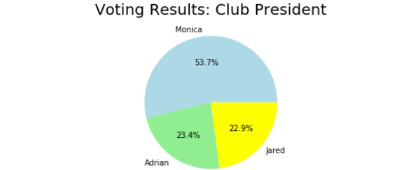

Lab 4. Extending Python, Files, Errors, and Graphs
==============================================

Overview

By the end of this lab, you will be able to read and write to files
using Python; use defensive programming techniques, such as assertions,
to debug your code; use exceptions, assertions, and tests with a
defensive mindset and plot, draw and create graphs as outputs using
Python.

We will cover the basic input/output (I/O) operations for Python and how
to use the matplotlib and seaborn libraries to create visualizations.


Exercise 58: Reading a Text File Using Python
---------------------------------------------

In this exercise, you will be downloading a sample data file online and
reading data as the output:

1.  Open a new Jupyter Notebook.

2.  Text file <http://www.gutenberg.org/cache/epub/37431/pg37431.txt> has been downloaded in a local folder:
    `pg37431.txt`

3.  Verify by opening file in jupyter browser.

    


4.  Now, you should extract the content of the file using Python code.
    Open a new Jupyter notebook file and type the following code into a
    new cell. You will be using the `open()` function in this
    step; don\'t worry too much about this, as you will be explained
    about this in more detail later:


    ```
    f = open('pg37431.txt')
    text = f.read()
    print(text)
    ```

    You should get the following output:

    


    Caption: Output showing the extracted content from the file

    Note that you can scroll within the cell and check the entire
    content.

5.  Now, in a new cell, type `text` only, without the
    `print` command, and you will get the following output:

    ```
    text
    ```


Caption: Output with the text-only command


Exercise 59: Reading Partial Content from a Text File
-----------------------------------------------------

In this exercise, you will be using the same sample data file from
*Exercise 58*, *Reading a Text File Using Python*. Here, however, you
will only be partially reading the content from the text file:

1.  Open a new Jupyter Notebook.

2.  Copy the `pg37431.txt` text file that you used in
    *Exercise 58* and save it in a separate folder that will be used to
    execute this exercise.

3.  Write the following code in a new cell to read the first
    `5` characters:


    ```
    with open("pg37431.txt") as f:
        print(f.read(5))
    ```

    You should get the following output:


    ```
    The P
    ```

    In this way, you include an argument to tell Python to read the
    first `5` characters each time.

    Notice that you use a `with` statement here. The
    `with` statement is a control flow structure of Python. It
    guarantees that the preceding file object, `f`, will close
    automatically after the code block exits, no matter how the nested
    block exits.

    If an exception occurs before the end of the block, it will still
    close the file before the exception is caught. Of course, it will
    close the file even if the nested block runs successfully.

4.  Now, access the `text` file by reading it line by line
    using the `.readline` function for which you need to enter
    the following code in a new cell on your notebook:


    ```
    with open("pg37431.txt") as f:
        print(f.readline())
    ```

    You should get the following output of the very first line in the
    text file:


Caption: Output accessing the text line by line

By completing this exercise, you have learned the use of the control
structure that is used in Python to close a code block automatically.
Doing so, you were able to access the raw data text file and read it one
line at a time.


**Writing Files**

You will still be using the `open()` method to write to a
file, except when it requires an extra argument to indicate how you want
to access and write to the file.

For instance, consider the following:


``` {.language-markup}
f = open("log.txt","w+")
```

The preceding code snippet allows us to open a file in `w+`, a
mode that supports both **reading** and **writing**, that is updating
the file. Other modes in Python include the following:

-   `R`: The default mode. This opens a file for reading.
-   `W`: The write mode. This opens a file for writing,
    creates a new file if the file does not exist, and overwrites the
    content if the file already exists.
-   `X`: This creates a new file. The operation fails if the
    file exists.
-   `A`: This opens a file in `append` mode, and
    creates a new file if a file does not exist.
-   `B`: This opens a file in `binary` mode.

Now, you should take a look at the following exercise to write content
to a file:


Exercise 60: Creating and Writing Content to Files to Record the Date and Time in a Text File
---------------------------------------------------------------------------------------------

In this exercise, you will be writing content to a file. We are going to
create a `log` file, which records the value of our counter
every second:

1.  Open a new Jupyter Notebook.

2.  In a new cell, type the following code:


    ```
    f = open('log.txt', 'w')
    ```

    From the code mentioned in this step of this exercise, you open the
    `log.txt` file in `write` mode, which you will
    be using to write our values.

3.  Now, in the next cell of your notebook, type the following code:


    ```
    from datetime import datetime
    import time
    for i in range(0,10):
        print(datetime.now().strftime('%Y%m%d_%H:%M:%S - '),i)
        f.write(datetime.now().strftime('%Y%m%d_%H:%M:%S - '))
        time.sleep(1)
        f.write(str(i))
        f.write("\n")
    f.close()
    ```

    In this code block, you are importing the `datetime` and
    `time` modules that Python provides us with. You are also
    using a `for` loop to print the year, month, and day, as
    well as the hour, minutes, and seconds. You are using the
    `write()` function here to add on to the previous
    condition; that is, every time the loop exits, the `write`
    command prints a number in place of `i`.

    You should get the following output:

    


    Caption: Output with the write() function in use

4.  Now, go back to the main page of your Jupyter Notebook, or browse to
    your Jupyter Notebook folder using `Windows Explorer` or
    `Finder` (if you are using a Mac). You will see the newly
    created `log.txt` file present:

    


    Caption: The log file is created

5.  Open the file inside Jupyter Notebook or your favorite text editor
    (for example, Visual Studio Code or Notepad), and you should see
    content that is similar to the following:


Caption: Content added to the log.txt file

You have now created your first `text` file. The example shown
in this exercise is very common in most data science processing tasks;
for instance, recording the readings of sensors and the progress of a
long-running process.

The `close()` method at the very end makes sure that the file
is closed properly and that all content in the buffer is written to the
file.


Writing Assertions
------------------

The first thing you need to learn about writing defensive code is how to
write an assertion. Python provides a built-in `assert`
statement to use the `assertion` condition in the program. The
`assert` statement assumes the condition always to be true. It
halts the program and raises an `AssertionError` message if it
is false.

The simplest code to showcase `assert` is mentioned in the
following code snippet:


``` {.language-markup}
x = 2
assert x < 1, "Invalid value"
```

Here, since `2` is not smaller than `1`, and the
statement is false, it raises an `AssertionError` message as
follows:


Caption: Output showing AssertionError

Note

You can also write the `assert` function without the optional
error message.

Next, you will take a look at how to use `assert` in a
practical example.


Exercise 61: Working with Incorrect Parameters to Find the Average Using Assert with Functions
----------------------------------------------------------------------------------------------

In this exercise, you will be using the assertion error with functions
to check the error message when you enter incorrect parameters to
calculate the average marks of students:

1.  Continue in the previous Jupyter notebook.

2.  Type the following code into a new cell:


    ```
    def avg(marks):
        assert len(marks) != 0
        return round(sum(marks)/len(marks), 2)
    ```

    Here, you created an `avg` function that calculates the
    average from a given list, and you have used the `assert`
    statement to check for any incorrect data that will throw the assert
    error output.

3.  In a new cell, type the following code:


    ```
    sem1_marks = [62, 65, 75]
    print("Average marks for semester 1:",avg(sem1_marks))
    ```

    In this code snippet, you provide a list and calculate the average
    marks using the `avg` function.

    You should get the following output:


    ```
    Average marks for semester 1: 67.33
    ```

4.  Next, test whether the `assert` statement is working by
    providing an empty list. In a new cell, type the following code:


    ```
    ranks = []
    print("Average of marks for semester 1:",avg(ranks))
    ```

    You should get the following output:


Caption: Assertion fails when we pass in an empty list

In the cell with the code where you provide 3 scores, the
`len(marks) !=0` statement returns `true`, and
therefore no `AssertionError` will be raised. However, in the
next cell, you did not provide any marks, and therefore it raises an
`AssertionError` message


Plotting Techniques
===================


Unlike machines, humans are terrible at understanding data without
graphics. Various visualization techniques have been invented to make
humans understand different datasets. There are various types of graphs
that you can plot, each with its own strengths and weakness.


You will plot graphs in the following exercises and
observe the changes in these graphs.


Exercise 62: Drawing a Scatter Plot to Study the Data between Ice Cream Sales versus Temperature
------------------------------------------------------------------------------------------------

In this exercise, you will be aiming to get scatter plots as the output
using sample data from the ice cream company to study the growth in the
sale of ice cream against varying temperature data:

1.  Begin by opening a new Jupyter Notebook file.

2.  Enter the following code to import the `matplotlib`,
    `seaborn`, and `numpy` libraries with the
    following alias:


    ```
    import matplotlib.pyplot as plt
    import seaborn as sns
    import numpy as np
    ```

    You should take a look at the following example. Imagine you are
    assigned to analyze the sales of a particular ice cream outlet with
    a view to studying the effect of temperature on ice cream sales.

3.  Prepare the dataset, as specified in the following code snippet:

    ```
    temperature = [14.2, 16.4, 11.9, 12.5, 18.9, 22.1, 19.4, 23.1, 25.4, 18.1, 22.6, 17.2]
    sales = [215.20, 325.00, 185.20, 330.20, 418.60, 520.25, 412.20, 614.60, 544.80, 421.40, 445.50, 408.10]
    ```

4.  Plot the lists using the `scatter` plot:


    ```
    plt.scatter(temperature, sales, color='red')
    plt.show()
    ```

    You should get the following output:

    


    Our plot looks fine, but only to our eyes. Anyone who has just seen
    the chart will not have the context and will not understand what the
    chart is trying to tell them. Before we go on to introduce other
    plots, it is useful for you to learn how to edit your plots and
    include additional information that will help your readers to
    understand it.

5.  Add a `title` command to your plot, as well as the x-axis
    (horizontal) and y-axis (vertical) labels. Then, add the following
    lines before the `plt.show()` command:


    ```
    plt.title('Ice-cream sales versus Temperature')
    plt.xlabel('Sales')
    plt.ylabel('Temperature')
    plt.scatter(temperature, sales, color='red')
    plt.show()
    ```

    You should get the following output:


Our chart is now easier to understand. In this exercise, you used the
sample ice cream sales versus temperature dataset and used the data to
create a scatter plot that will be easier to understand for another
user.


Exercise 63: Drawing a Line Chart to Find the Growth in Stock Prices
--------------------------------------------------------------------

In this exercise, you will be plotting the stock prices of a well-known
company. You will be plotting this as a line chart that will be plotted
as the number of days against the growth in price.

1.  Open a new Jupyter Notebook.

2.  Enter the following code in a new cell to initialize our data as a
    list:

    ```
    stock_price = [190.64, 190.09, 192.25, 191.79, 194.45, 196.45, 196.45, 196.42, 200.32, 200.32, 200.85, 199.2, 199.2, 199.2, 199.46, 201.46, 197.54, 201.12, 203.12, 203.12, 203.12, 202.83, 202.83, 203.36, 206.83, 204.9, 204.9, 204.9, 204.4, 204.06]
    ```

3.  Now, use the following code to plot the chart, configure the chart
    title, and configure the titles of the axes:


    ```
    import matplotlib.pyplot as plt
    plt.plot(stock_price)
    plt.title('Opening Stock Prices')
    plt.xlabel('Days')
    plt.ylabel('$ USD')
    plt.show()
    ```

    In the preceding code snippet, you are adding a title to the graph,
    and adding the number of days to the x axis and the price to the y
    axis.

    Execute the cell **twice**, and you should see the following chart
    as the output:

    


    Caption: Line chart for opening stock prices

    If you\'ve noticed that the number of days in our line plot starts
    at `0`, you have sharp eyes. Usually, you start your axes
    at `0`, but in this case, it represents the day, so you
    have to start from `1` instead. You can fix these issues.

4.  You can fix this by creating a list that starts with `1`
    to `31`, representing the days in March:

    ```
    t = list(range(1, 31))
    ```

5.  Plot this together with the data. You can also define the numbers on
    the x axis using `xticks`:


    ```
    plt.plot(t, stock_price, marker='.', color='red')
    plt.xticks([1, 8, 15, 22, 28]) 
    ```

    The complete code with the underlined changes is shown here:


    ```
    stock_price = [190.64, 190.09, 192.25, 191.79, 194.45, 196.45, 196.45, 196.42, 200.32, 200.32, 200.85, 199.2, 199.2, 199.2, 199.46, 201.46, 197.54, 201.12, 203.12, 203.12, 203.12, 202.83, 202.83, 203.36, 206.83, 204.9, 204.9, 204.9, 204.4, 204.06]
    t = list(range(1, 31))
    import matplotlib.pyplot as plt
    plt.title('Opening Stock Prices')
    plt.xlabel('Days')
    plt.ylabel('$ USD')
    plt.plot(t, stock_price, marker='.', color='red')
    plt.xticks([1, 8, 15, 22, 28]) 
    plt.show()
    ```

    You should get the following output:


In this exercise, you learned how to generate a line graph that displays
the output based on time. In the next exercise, you will learn how to
plot bar graphs, which is another useful visualization for displaying
categorical data.


Exercise 64: Plotting Bar Plots to Grade Students
-------------------------------------------------

A bar plot is a straightforward chart type. It is great for visualizing
the count of items in different categories. When you get the final
output for this exercise, you may think that histograms and bar plots
look the same. But that\'s not the case. The main difference between a
histogram and a bar plot is that there is no space between the adjacent
columns in a histogram. You will take a look at how to plot a bar graph.

In this exercise, you will draw bar charts to display the data of
students and corresponding bar plots as a visual output.

1.  Open a new Jupyter Notebook file.

2.  Type the following code into a new cell, to initialize the dataset:

    ```
    grades = ['A', 'B', 'C', 'D', 'E', 'F']
    students_count = [20, 30, 10, 5, 8, 2]
    ```

3.  Plot the bar chart with our dataset and customize the
    `color` command:


    ```
    import matplotlib.pyplot as plt
    plt.bar(grades, students_count, color=['green', 'gray', 'gray', 'gray', 'gray', 'red'])
    ```

    Execute the cell **twice**, and you should get the following output:

    


    Here, you define two lists: the `grades` list stores the
    grades, which you use as the x-axis, and the
    `students_count` list stores the number of students who
    score a respective grade. Then, you use the `plt` plotting
    engine and the `bar` command to draw a bar chart.

4.  Enter the following code to add the main title and the axis titles
    to our chart for better understanding. Again, you use the
    `show()` command to display the rendered chart:


    ```
    plt.title('Grades Bar Plot for Biology Class')
    plt.xlabel('Grade')
    plt.ylabel('Num Students')
    plt.bar(grades, students_count, color=['green', 'gray', 'gray', 'gray', 'gray', 'red'])
    plt.show()
    ```

    Execute the cell, and you will get the following chart as the
    output:

    


    Sometimes, it is easier to use horizontal bars to represent
    relationships. What you have to do is to change the bar function to
    `.barh`.

5.  Enter the following code in a new cell and observe the output:


    ```
    plt.barh(grades, students_count, color=['green', 'gray', 'gray', 'gray', 'gray', 'red'])
    ```

    You should get the following output:


Exercise 65: Creating a Pie Chart to Visualize the Number of Votes in a School
------------------------------------------------------------------------------

In this exercise, you will plot a pie chart on the number of votes for
each of the three candidates in an election for club president:

1.  Open a new Jupyter Notebook.

2.  Type the following code into a new cell by setting up our data:

    ```
    # Plotting
    labels = ['Monica', 'Adrian', 'Jared']
    num = [230, 100, 98] # Note that this does not need to be percentages
    ```

3.  Draw a pie chart by using the `pie()` method, and then set
    up `colors`:

    ```
    import matplotlib.pyplot as plt
    plt.pie(num, labels=labels, autopct='%1.1f%%', colors=['lightblue', 'lightgreen', 'yellow'])
    ```

4.  Add `title` and display the chart:


    ```
    plt.title('Voting Results: Club President', fontdict={'fontsize': 20})
    plt.pie(num, labels=labels, autopct='%1.1f%%', colors=['lightblue', 'lightgreen', 'yellow'])
    plt.show()
    ```

    You should get the following output:




Exercise 66: Generating a Heatmap to Visualize the Grades of Students
---------------------------------------------------------------------

In this exercise, you will be generating a heatmap:

1.  Open a new Jupyter Notebook.

2.  Now, type in the following code snippet to define a
    `heatmap` function. First, you prepare the plot:

    ```
    def heatmap(data, row_labels, col_labels, ax=None, cbar_kw={}, cbarlabel="", **kwargs):
        if not ax:
            ax = plt.gca()
        im = ax.imshow(data, **kwargs)
    ```

3.  Define the color bar as `colorbar`, as mentioned in the
    following code snippet:

    ```
        cbar = ax.figure.colorbar(im, ax=ax, **cbar_kw)
        cbar.ax.set_ylabel(cbarlabel, rotation=-90, va="bottom")
    ```

4.  Show all `ticks` and label them with their respective list
    entries:

    ```
        ax.set_xticks(np.arange(data.shape[1]))
        ax.set_yticks(np.arange(data.shape[0]))
        ax.set_xticklabels(col_labels)
        ax.set_yticklabels(row_labels)
    ```

5.  Configure the horizontal axes for the labels to appear on top of the
    plot:

    ```
        ax.tick_params(top=True, bottom=False,
                       labeltop=True, labelbottom=False)
    ```

6.  Rotate the tick labels and set their alignments:

    ```
        plt.setp(ax.get_xticklabels(), rotation=-30, ha="right",
                 rotation_mode="anchor")
    ```

7.  Turn off `spine` and create a white grid for the plot, as
    mentioned in the following code snippet:

    ```
        for edge, spine in ax.spines.items():
            spine.set_visible(False)
        ax.set_xticks(np.arange(data.shape[1]+1)-.5, minor=True)
        ax.set_yticks(np.arange(data.shape[0]+1)-.5, minor=True)
        ax.grid(which="minor", color="w", linestyle='-', linewidth=3)
        ax.tick_params(which="minor", bottom=False, left=False)
    ```

8.  Return the heatmap:


    ```
        return im, cbar
    ```

    This is the code you obtain directly from the `matplotlib`
    documentation. The heatmap functions help to generate a heatmap.

9.  Execute the cell, and, in the next cell, enter and execute the
    following code. You define a `numpy` array to store our
    data and plot the heatmap using the functions defined previously:


    ```
    import numpy as np
    import matplotlib.pyplot as plt
    data = np.array([
        [30, 20, 10,],
        [10, 40, 15],
        [12, 10, 20]
    ])
    im, cbar = heatmap(data, ['Class-1', 'Class-2', 'Class-3'], ['A', 'B', 'C'], cmap='YlGn', cbarlabel='Number of Students')
    ```

    You can see that the heatmap is quite plain without any textual
    information to help our readers understand the plot. You will now
    continue the exercise and add another function that will help us to
    annotate our `heatmap` visualization.

10. Type and execute the following code in a new cell:

    Exercise66.ipynb


    ```
    def annotate_heatmap(im, data=None, valfmt="{x:.2f}",
                        textcolors=["black", "white"],
                        threshold=None, **textkw):
        import matplotlib
        if not isinstance(data, (list, np.ndarray)):
            data = im.get_array()
        if threshold is not None:
            threshold = im.norm(threshold)
        else:
            threshold = im.norm(data.max())/2.
        kw = dict(horizontalalignment="center",
                  verticalalignment="center")
        kw.update(textkw)
        if isinstance(valfmt, str):
            valfmt = matplotlib.ticker.StrMethodFormatter(valfmt)
    ```


11. In the new cell, type and execute the following
    code:


    ```
    im, cbar = heatmap(data, ['Class-1', 'Class-2', 'Class-3'], ['A', 'B', 'C'], cmap='YlGn', cbarlabel='Number of Students')
    texts = annotate_heatmap(im, valfmt="{x}")
    ```

    This will annotate the heatmap and give us the following output:


Caption: Heatmap output from the sample data

Note that you put our data in a `numpy` array
(`np.array`). This is because the methods you are going to
call expect a `numpy` array.

Next, you plotted our heatmap using the `heatmap` method. You
passed in our `data`, the `row` labels,
`['Class-1', 'Class-2', 'Class-3']`, and then our
`column` labels, `['A', 'B', 'C']`. You also pass in
`YlGn` as `cmap`, which means you want to use the
color yellow for small values, and the color green for big values. You
pass in `cbarlabel` as `Number of Students` to
denote that the values we are plotting represent the number of students.
Lastly, you annotate our heatmap with the data (`30`,
`20`, `10`...).

So far, you have learned how to visualize discrete categorical variables
using heatmaps and bar plots. But what if you want to visualize a
continuous variable? For example, instead of the grades of students, you
want to plot the distribution of scores. For this type of data, you
should use a density distribution plot, which you will look at in the
next exercise.


Exercise 67: Generating a Density Plot to Visualize the Score of Students
-------------------------------------------------------------------------

In this exercise, you will be generating a density plot from a list of
sample data:

1.  Begin by continuing from the previous Jupyter Notebook file.

2.  Enter the following code into a new cell, set up the data, and
    initialize the plot:


    ```
    import seaborn as sns
    data = [90, 80, 50, 42, 89, 78, 34, 70, 67, 73, 74, 80, 60, 90, 90]
    sns.distplot(data)
    ```

    You have imported the `seaborn` module, which is explained
    later in this exercise, and then created a list as data.
    `sns.displot` is used to plot the data as a density plot.

3.  Configure the `title` and axes labels:


    ```
    import matplotlib.pyplot as plt
    plt.title('Density Plot')
    plt.xlabel('Score')
    plt.ylabel('Density')
    sns.distplot(data)
    plt.show()
    ```

    You should get the following output:


So far, in this exercise, you have used the `seaborn` library,
which is a data visualization library based on `matplotlib`.
It provides a high-level interface for drawing appealing visual graphs
and supports chart types that do not come with `matplotlib`.
For example, you use the `seaborn` library for density plots
simply because it is not available in `matplotlib`.


In the next exercise, you will be implementing contour plots. Contour
plots are suitable for visualizing large and continuous datasets. A
contour plot is like a density plot with two features. In the following
exercise, you will examine how to plot a contour plot using sample
weight data.


Exercise 68: Creating a Contour Plot
------------------------------------

In this exercise, you will be using the sample dataset of the different
weights of people to output a contour plot:

1.  Open a new Jupyter Notebook.
2.  Initialize the `weight` recording data using the following
    code in a new cell:

    ```
    weight=[85.08,79.25,85.38,82.64,80.51,77.48,79.25,78.75,77.21,73.11,82.03,82.54,74.62,79.82,79.78,77.94,83.43,73.71,80.23,78.27,78.25,80.00,76.21,86.65,78.22,78.51,79.60,83.88,77.68,78.92,79.06,85.30,82.41,79.70,80.16,81.11,79.58,77.42,75.82,74.09,78.31,83.17,75.20,76.14]
    ```
3.  Now, draw the plot using the following code. Execute the cell twice:

    ```
    import seaborn as sns
    sns.kdeplot(list(range(1,45)),weight, kind='kde', cmap="Reds", )
    ```
4.  Add `legend`, `title`, and `axis`
    labels to the plot:

    ```
    import matplotlib.pyplot as plt
    plt.legend(labels=['a', 'b'])
    plt.title('Weight Dataset - Contour Plot')
    plt.ylabel('height (cm)')
    plt.xlabel('width (cm)')
    sns.kdeplot(list(range(1,45)),weight, kind='kde', cmap="Reds", )
    ```
5.  Execute the code and you will see the following output:


Caption: Contour plot output using the weight dataset

By the end of this exercise, you learned to output a contour graph from
a dataset.

Compare this with the scatter plot that we have implemented before in
*Exercise 62*, *Drawing a Scatter Plot*. Which chart type do you think
is easier for us to visualize the data?


Extending Graphs
----------------

Sometimes, you will need to show multiple charts in the same figure for
comparison purposes, or to extend the depth of the story that you are
telling. For instance, in an election, you want one chart that shows the
percentage, and another chart that shows the actual votes. You will now
take a look at how you can use subplots in `matplotlib` in the
following example.

Note that the following code is shown in multiple plots.

Note

You will use `ax1` and `ax2` to plot our charts now,
instead of `plt`.

To initialize the figure and two axis objects, execute the following
command:


``` {.language-markup}
import matplotlib.pyplot as plt
# Split the figure into 2 subplots
fig = plt.figure(figsize=(8,4))
ax1 = fig.add_subplot(121) # 121 means split into 1 row , 2 columns, and put in 1st part.
ax2 = fig.add_subplot(122) # 122 means split into 1 row , 2 columns, and put in 2nd part.
```

The following code plots the first subplot, which is a pie chart:


``` {.language-markup}
labels = ['Adrian', 'Monica', 'Jared']
num = [230, 100, 98]ax1.pie(num, labels=labels, autopct='%1.1f%%', colors=['lightblue', 'lightgreen', 'yellow'])
ax1.set_title('Pie Chart (Subplot 1)')
```

Now, plot the second subplot, which is a bar chart:


``` {.language-markup}
# Plot Bar Chart (Subplot 2)
labels = ['Adrian', 'Monica', 'Jared']
num = [230, 100, 98]
plt.bar(labels, num, color=['lightblue', 'lightgreen', 'yellow'])
ax2.set_title('Bar Chart (Subplot 2)')
ax2.set_xlabel('Candidate')
ax2.set_ylabel('Votes')
fig.suptitle('Voting Results', size=14) 
```

This will produce the following output:


Note

If you want to try out the previously mentioned code example, be sure to
put all the code in a single input field in your Jupyter Notebook in
order for both the outputs to be shown next to one another.

In the following exercise, you will be using `matplotlib` to
output 3D plots.


Exercise 69: Generating 3D plots to Plot a Sine Wave
----------------------------------------------------

Matplotlib supports 3D plots. In this exercise, you will plot a 3D sine
wave using sample data:

1.  Open a new Jupyter Notebook file.

2.  Now, type the following code into a new cell and execute the code:


    ```
    from mpl_toolkits.mplot3d import Axes3D
    import numpy as np
    import matplotlib.pyplot as plt
    import seaborn as sns
    X = np.linspace(0, 10, 50)
    Y = np.linspace(0, 10, 50)
    X, Y = np.meshgrid(X, Y)
    Z = (np.sin(X))
    # Setup axis
    fig = plt.figure(figsize=(7,5))
    ax = fig.add_subplot(111, projection='3d')
    ```

    First, you import the `mplot3d` package. The
    `mplot3d` package adds 3D plotting capabilities by
    supplying an axis object that can create a 2D projection of a 3D
    scene. Next, you will be initializing data and setting up our
    drawing axis.

3.  You will use the `plot_surface()` function to plot the 3D
    surface chart and configure the title and axes labels:


    ```
    ax.plot_surface(X, Y, Z)
    # Add title and axes labels
    ax.set_title("Demo of 3D Plot", size=13)
    ax.set_xlabel('X')
    ax.set_ylabel('Y')
    ax.set_zlabel('Z')
    ```

    Execute the cell twice, and you should get the following output:


Caption: 3D plot of demo data using matplotlib

In this exercise, you were successfully able to implement a very
interesting feature provided by `matplotlib`; that is, the 3D
plot, which is an added feature in Python visualizations.


The Don\'ts of Plotting Graphs
==============================


In newspapers, blogs, or social media there are a lot of misleading
graphs that make people misunderstand the actual data. You will be going
through some of these examples and learn how to avoid them.


Manipulating the Axis
---------------------

Imagine you have three students with three different scores from an
exam. Now, you have to plot their scores on a bar chart. There are two
ways to do this: the misleading way, and the right way:


Caption: Chart A (starts from 80) and Chart B (starts from 0)

Looking at **Chart A**, it will be interpreted that the score of student
**A** is about 10 times higher than student **B** and student **C**.
However, that is not the case. The scores for the students are 96, 81,
and 80, respectively. **Chart A** is misleading because the y-axis
ranges from 80 to 100. The correct y-axis should range from 0 to 100, as
in **Chart B**. This is simply because the minimum score a student can
get is 0, and the maximum score a student can get is 100. The scores of
students **B** and **C** are actually just slightly lower compared to
student **A**.


Cherry Picking Data
-------------------

Now, you will have a look at the opening stock prices:


**Chart A**, with the title **AAPL Opening Stock Prices (April 2019)**,
shows a declining trend on Apple® stock prices. However, the chart is
only showing the last 7 days of April. The title of the chart is
mismatched with the chart. **Chart B** is the correct chart, as it shows
a whole month of stock prices. As you can see, cherry-picking the data
can give people a different perception of the reality of the data.


Wrong Graph, Wrong Context
--------------------------

You can have a look at two graphs that show a survey to demolish an old
teaching building:


Caption: A pie chart versus a column chart

Using the wrong graph can give readers the wrong context to understand
the data. Here, **Chart A** uses a pie chart to make readers think that
the students want to demolish the old teaching building. However, as you
can see in **Chart B**, the majority (95%) of the students voted to not
demolish the old teaching building. The pie chart should only be used
when every piece of the pie adds up to 100%. In this case, a bar chart
is better at visualizing the data.


Activity 13: Visualizing the Titanic Dataset Using a Pie Chart and Bar Plots
----------------------------------------------------------------------------

Charts are not only a useful visualization device in presentations and
reports; they also play a crucial role in Exploratory Data Analysis
(EDA). In this activity, you will learn how to explore a dataset using
visualizations.

In this activity, you will be using the famous Titanic dataset. Here,
you will focus on plotting the expected data. The steps to load the
dataset will be covered in the later labs of this course. For this
activity, the steps that you need to complete are as follows.

Note

In this activity, we will be using the Titanic dataset. This
`titanic_train.csv` dataset `CSV` file is present in the lab environment.

Follow these steps to complete this activity:

1.  Load the `CSV` file.

    To load the CSV file, add in the code, as mentioned in the following
    code snippet:


    ```
    import csv
    lines = []
    with open('titanic_train.csv') as csv_file:
        csv_reader = csv.reader(csv_file, delimiter=',')
        for line in csv_reader:
            lines.append(line)
    ```

2.  Prepare a data object that stores all the `passengers`
    details using the following variables:

    ```
    data = lines[1:]
    passengers = []
    headers = lines[0]
    ```

3.  Now, create a simple `for` loop for the `d`
    variable in `data`, which will store the values in a list.

4.  Extract the following fields into their respective lists:
    `survived`, `pclass`, `age`, and
    `gender` for the passengers who survived:

    ```
    survived = [p['Survived'] for p in passengers]
    pclass = [p['Pclass'] for p in passengers]
    age = [float(p['Age']) for p in passengers if p['Age'] != '']
    gender_survived = [p['Sex'] for p in passengers if int(p['Survived']) == 1]
    ```

5.  Based on this, your main goal and output will be to generate plots
    according to the requirements mentioned here:
    -   Visualize the proportion of passengers that survived the
        incident (in a pie chart).

        You should get the following output:


Caption: A pie chart showing the survival rate of the passengers

-   Compare the gender of passengers who survived the incident (in a bar
    plot).

    You should get the following output:


Summary
=======


In this lab, you looked at how to read and write to a text file
using Python, followed by using assertions in defensive programming,
which is a way of debugging your code. Finally, you explored different
types of graphs and charts to plot data. You discussed the suitability
of each plot for different scenarios and datasets, giving suitable
examples along the way. You also discussed how to avoid plotting charts
that could be misleading.

In the next lab, you will learn how to use Python to write
**Object-Oriented Programming (OOP)** codes. This includes creating
classes, instances, and using `write` subclasses that inherit
the property of the parent class and extending functionalities using
methods and properties.
