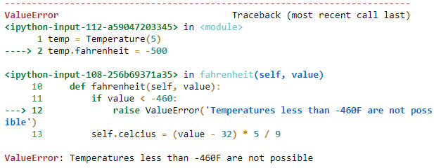

Lab 5. Constructing Python -- Classes and Methods
=============================================

Overview

By the end of this lab, you will be able to Use class and instance
attributes to distinguish between attributes; use instance methods to
perform calculations based on the instance attributes of an object; use
static methods to write small utility functions to refactor code in a
class to avoid repetition; use property setters to handle the assignment
of values to computed properties and perform validation and create
classes that inherit methods and attributes from other classes.


Classes and Objects
===================


Create a new integer object called `x` in a Python console:


``` {.language-markup}
>>> x = 10
>>> x
10
```

You can see the class that `x` was created from by calling the
`type` function:


``` {.language-markup}
>>> type(x)
<class 'int'>
```

The integer class doesn\'t just let you store a single number -- our
`x` object has other properties, too:


``` {.language-markup}
>>> x.bit_length()
4
```

This method computes the number of binary digits needed to represent
`x` as a binary number (1010).

As you learned in *Lab 3*, *Executing Python -- Programs,
Algorithms, and Functions*, you can also view the docstring to read
about this object and its class:


``` {.language-markup}
>>> print(x.__doc__)
int([x]) -> integer
int(x, base=10) -> integer
```

Convert a number or string to an integer, or return 0 if no arguments
are given. If **x** is a number, return `x.__int__()`. For
floating point numbers, this truncates towards zero.


Exercise 70: Exploring Strings
------------------------------

Many of our examples and exercises so far have involved strings. In this
exercise, you go beyond the text that a string object can store and look
at the other properties and methods available in this class.

The aim of the exercise is to demonstrate that the string objects you
are already familiar with have many other methods and properties that
you might not have been aware of. This exercise can be performed in a
Jupyter Notebook:

1.  Define a new string:

    ```
    my_str = 'hello World!' 
    ```

2.  Check what class our object has:


    ```
    type(my_str)
    ```

    You should get the following output:


    ```
    str
    ```

3.  View the docstring of the `str` class:


    ```
    print(my_str.__doc__)
    ```

    You should get the following output:

    


    Caption: The docstring of the str class

4.  View the full list of properties and methods of `my_str`:


    ```
    my_str.__dir__()
    ```

    You should get the following output:

    


    Caption: Complete list of the properties and methods of my\_str

    Note

    The output in the preceding figure is truncated.

5.  You will see the results of a few of the preceding methods:


    ```
    my_str.capitalize()
    ```

    You should get the following output:


    ```
    'Hello world!'
    ```

    Now to get the output in the uppercase:


    ```
    my_str.upper()
    ```

    You should get the following output:


    ```
    'HELLO WORLD!'
    ```

    Now to get the output in the lowercase without any spacing:


    ```
    my_str.replace(' ', '')
    ```

    You should get the following output:


    ```
    'helloworld!'
    ```

In this exercise, you explored the various properties of a string object
in Python. The purpose here was to illustrate that you are already
working with objects that don\'t just represent simple data types but
have more complex definitions. You will now turn to creating templates
to build our own custom objects using classes.


Defining Classes
================


Built-in classes and classes imported from Python packages are sometimes
sufficient for our requirements. However, often you want to invent a new
type of object because there isn\'t an object in the standard libraries
that has the properties/methods that you require. Recall that a class is
like a template for creating a new object.

For example, create a new class called `Australian`:


``` {.language-markup}
>>> class Australian():
    is_human = True
    enjoys_sport = True 
```

You now have a new template for creating `Australian` objects
(or people, if you prefer). Our code assumes that all new Australians
will be human and enjoy sport.

You will firstly create a new Australian:


``` {.language-markup}
>>> john = Australian()
```

Check the class of our Australian:


``` {.language-markup}
>>> type(john)
<class '__main__.Australian'>
```

You will also view some of John\'s attributes:


``` {.language-markup}
>>> john.is_human
True
>>> john.enjoys_sport
True
```

The `is_human` and `enjoys_sport` attributes are
called class attributes. **Class attributes** do not change between
objects of the same class. For example, let\'s create another
Australian:


``` {.language-markup}
>>> ming = Australian()
```

Ming is also human and enjoys sport. We will soon learn about instance
attributes, which can vary between objects created by a class.


Exercise 71: Creating a Pet Class
---------------------------------

The aim of this exercise is to create our first class. You will create a
new class called `Pet` with class attributes and a docstring.
You will also create instances of this class:

1.  Define a `Pet` class with two class attributes and a
    docstring:

    ```
    class Pet():
        """
        A class to capture useful information regarding my pets, just incase
        I lose track of them.
        """
        is_human = False
        owner = 'Michael Smith' 
    ```

2.  Create an instance of this class:

    ```
    chubbles = Pet()
    ```

3.  Check the `is_human` properties of our new pet,
    `chubbles`:


    ```
    chubbles.is_human
    ```

    You should get the following output:


    ```
    False
    ```

4.  Check the owner:


    ```
    chubbles.owner 
    print(chubbles.__doc__)
    ```

    You should get the following output:


In this exercise, you created our first class and examined the
properties of an object created with our new class.


The \_\_init\_\_ method
=======================


In *Exercise 71,* *Creating a Pet Class*, you used our `Pet`
class to create a `Pet` object called `chubbles` in
the following manner:


``` {.language-markup}
chubbles = Pet()
```

Here, you\'ll explore more about what happens when you create objects
from a class in this manner.

Python has a special method called `__init__`, which is called
when you initialize an object from one of our class **templates**. For
example, building on the previous exercise, suppose you wanted to
specify the height of our `Pet`. We would add an
`__init__` method as follows:


``` {.language-markup}
class Pet():
    """
    A class to capture useful information regarding my pets, just incase
    I lose track of them.
    """
    def __init__(self, height):
        self.height = height
    
    is_human = False
    owner = 'Michael Smith'  
```

The `init` method takes the height value and assigns it as an
attribute of our new object. You can test this as follows:


``` {.language-markup}
chubbles = Pet(height=5) 
chubbles.height
out: 5
```


Exercise 72: Creating a Circle Class
------------------------------------

The aim of this exercise is to use the `init` method. You
create a new class called `Circle` with an `init`
method that allows us to specify the radius and color of a new
`Circle` object. You then use this class to create two
circles:

1.  Create a `Circle` class with a class attribute called
    `is_shape`:

    ```
    class Circle():
        is_shape = True
    ```

2.  Add an `init` method to our class, allowing us to specify
    the radius and color of the specific circle:

    ```
    class Circle():
        is_shape = True
        
        def __init__(self, radius, color):
            self.radius = radius
            self.color = color
    ```

3.  Initialize two new `Circle` objects with different radii
    and colors:


    ```
    first_circle = Circle(2, 'blue')
    second_circle = Circle(3, 'red')
    ```

    You should have a look at some of the attributes of the
    `Circle` objects:


Caption: Checking the attributes of our circles

In this exercise, you learned how to use the `init` method to
set instance attributes.

Note

Any `Circle` objects created from our `Circle` class
will always have `is_shape = True`, but may have different
radii and colors. This is because `is_shape` is a class
attribute defined outside of the `init` method, and
`radius` and `color `are instance attributes set in
the `init` method.


Keyword Arguments
-----------------

As we learned in *Lab 3,* *Executing Python -- Programs, Algorithms,
and Functions*, in the *Basic Functions* section, there are two types of
arguments that can go into functions: **positional** arguments and
**keyword** arguments (kwarg). Recall that positional arguments are
listed first, and must be specified when calling the function, whereas
keyword arguments are optional:


Caption: Args and Kwargs

The examples so far in this lab have just contained positional
arguments. However, you may want to provide a default value for an
instance attribute. For example, you can take your previous example and
add a default value for `color`:


``` {.language-markup}
class Circle():
    is_shape = True
    
    def __init__(self, radius, color='red'):
        self.radius = radius
        self.color = color
```

Now, if you initialize a circle without specifying a color, it will
default to red:


``` {.language-markup}
my_circle = Circle(23)
my_circle.color
```

You should get the following output:


``` {.language-markup}
'red'
```


Exercise 73: The Country Class with Keyword Arguments
-----------------------------------------------------

The aim of this exercise is to use keyword arguments to allow optional
instance attribute inputs to be specified in the `init`
function.

You create a class called `Country`, where there are three
optional attributes that can be passed in the `init` method:

1.  Create the `Country` class with three keyword arguments to
    capture details about the `Country` object:

    ```
    class Country():
        def __init__(self, name='Unspecified', population=None, size_kmsq=None):
            self.name = name
            self.population = population
            self.size_kmsq = size_kmsq
    ```

2.  Initialize a new `Country`, noting that the order of
    parameters does not matter because you are using named arguments:


    ```
    usa = Country(name='United States of America', size_kmsq=9.8e6)
    ```

    Note

    Here \'e\' is shorthand for \'10 to the power of\'. For instance,
    2e4 == 2 \* 10 \^ 4 == 20000

3.  Use the `__dict__` method to view a list of the attributes
    of the `usa` object:


    ```
    usa.__dict__
    ```

    You should get the following output:


Caption: Dictionary output of our usa object

In this exercise, you learned how keyword arguments can be used when
initializing an object with a class.


Methods
=======


You have already come across one special method, the `init`
method. However, the power of classes will start to become more obvious
to you as you begin writing our own custom methods. There are three
types of methods you will explore in the following sections:

-   Instance methods
-   Static methods
-   Class methods


Instance Methods
----------------

Instance methods are the most common type of method you will need to
use. They always take self as the first positional argument. The
`__init__` method discussed in the previous section is an
example of an instance method.

Here is another example of an instance method, extending our
`Circle` class from *Exercise 72*, *Creating a Circle Class*:


``` {.language-markup}
import math
class Circle():
    is_shape = True
    
    def __init__(self, radius, color='red'):
        self.radius = radius
        self.color = color
    
    def area(self):
        return math.pi * self.radius ** 2
```

The `area` method will use the `radius` attribute of
the circle to compute the area of the circle using the following
formula, which you may recall from math classes:


Caption: Formula to calculate the area of a circle

You can now test the `area` method:


``` {.language-markup}
circle = Circle(3)
circle.area()
```

You should get the following output:


``` {.language-markup}
28.274333882308138
```

As you may have realized by now, `self` represents the
instance (that is, the object) within the method. This is always the
first positional argument of an instance method, and Python passes it to
the function without you needing to do anything. So, in the preceding
example, when you call the `area` function, behind the scenes,
Python passes the circle object through as the first argument.

This is necessary because it allows you to access other attributes and
methods of our `Circle` object within the method.

Note the elegance of being able to change the radius of our circle
without needing to worry about updating the area.

For example, taking our previously defined `circle` object,
let\'s change the radius from `3` to `2`:


``` {.language-markup}
circle.radius = 2
circle.area()
```

You should get the following output:


``` {.language-markup}
12.566370614359172
```

If you had set `area` as an attribute of `Circle`,
you would need to update it each time the radius changed. However,
writing it as a method where it is expressed as a function of the radius
makes your code more maintainable.


Exercise 74: Adding an Instance Method to Our Pet Class
-------------------------------------------------------

The aim of this exercise is to add our first instance method to a class
in order to determine whether or not our pet should be considered tall.

You will continue and add an instance method to the `Pet`
class created in *Exercise 71, Creating a Pet Class*:

1.  Start with your previous definition of `Pet`:

    ```
    class Pet():
        def __init__(self, height):
            self.height = height
        
        is_human = False
        owner = 'Michael Smith'
    ```

2.  Add a new method that allows you to check whether your pet is tall
    or not, where your definition of tall is where `Pet` has a
    height of at least `50`:

    ```
    class Pet():
        def __init__(self, height):
            self.height = height
        
        is_human = False
        owner = 'Michael Smith' 
        
        def is_tall(self):
            return self.height >= 50
    ```

3.  Now, create a `Pet` and check whether he is tall:


    ```
    bowser = Pet(40)
    bowser.is_tall()
    ```

    You should get the following output:


    ```
    False
    ```

4.  Now suppose that Bowser grows. Then you need to update his height
    and check again whether he is tall:


    ```
    bowser.height = 60
    bowser.is_tall()
    ```

    You should get the following output:


    ```
    True
    ```


Adding Arguments to Instance Methods
------------------------------------

The preceding example showed an instance method that took only the
positional `self` parameter. Often, you need to specify other
inputs to compute our methods. For instance, in *Exercise 74*, *Adding
an Instance Method to Our Pet Class*, you hardcoded the definition of
\"tall\" as any pet with a height greater than or equal to 50. Instead,
you could allow that definition to be passed in via the method in the
following manner:


``` {.language-markup}
class Pet():
    def __init__(self, height):
        self.height = height
    
    is_human = False
    owner = 'Michael Smith' 
    
    def is_tall(self, tall_if_at_least):
        return self.height >= tall_if_at_least
```

You can then create a pet and check whether its height exceeds some
arbitrary benchmark that you specify:


``` {.language-markup}
bowser = Pet(40)
bowser.is_tall(30)
```

You should get the following output:


``` {.language-markup}
True
```

Now changing the height to 50 as mention below:


``` {.language-markup}
bowser.is_tall(50)
```

You should get the following output:


``` {.language-markup}
False
```


Exercise 75: Computing the Size of Our Country
----------------------------------------------

The aim of this exercise is to use a keyword argument in the context of
an instance method.

You create a `Country` class and add a method to calculate the
area of the country in square miles:

1.  Start with the following definition of `Country`, which
    allows the name, population, and size in square kilometers to be
    specified:

    ```
    class Country():
        def __init__(self, name='Unspecified', population=None, size_kmsq=None):
            self.name = name
            self.population = population
            self.size_kmsq = size_kmsq
    ```

2.  There are 0.621371 miles in a kilometer. Use this constant to write
    a method that returns the size in square miles. The class should now
    look like this:

    ```
    class Country():
        def __init__(self, name='Unspecified', population=None, size_kmsq=None):
            self.name = name
            self.population = population
            self.size_kmsq = size_kmsq
        
        def size_miles_sq(self, conversion_rate=0.621371):
            return self.size_kmsq * conversion_rate ** 2
    ```

3.  Create a new `Country` and check the conversion:

    ```
    algeria = Country(name='Algeria', size_kmsq=2.382e6)
    algeria.size_miles_sq()
    919694.772584862
    ```

4.  Suppose someone told you the conversion rate was incorrect, and that
    there are 0.6 miles in a kilometer. Without changing the default
    parameter, recalculate the size of Algeria in square miles using the
    new rate:


    ```
    algeria.size_miles_sq(conversion_rate=0.6)
    ```

    You should get the following output:


    ```
    857520.0
    ```

In this exercise, you learned how to allow optional keyword arguments to
be passed into instance methods to alter the calculation performed.


The \_\_str\_\_ method
----------------------

Like `__init__`, the `__str__` method is another
special instance method that you need to know about. This is the method
that is called whenever the object is rendered as a string.

For example, it is what is displayed when you print the object to the
console. You can explore this in the context of our `Pet`
class. Suppose you have a `Pet` class in which you can assign
a height and name to the `Pet` instance:


``` {.language-markup}
class Pet():
    def __init__(self, height, name):
        self.height = height
        self.name = name
    
    is_human = False
    owner = 'Michael Smith'
```

Now you create a pet and print it to the console:


``` {.language-markup}
my_pet = Pet(30, 'Chubster')
print(my_pet)
```

You should get the following output:


Caption: An unhelpful string representation of the Pet object

This is not a very helpful representation of our pet. So, we need to add
an `__str__` method:


``` {.language-markup}
class Pet():
    def __init__(self, height, name):
        self.height = height
        self.name = name
    
    is_human = False
    owner = 'Michael Smith' 
    
    def __str__(self):
        return '%s (height: %s cm)' % (self.name, self.height)
```

Like any instance method, our `__str__` method takes
`self` as the first argument in order to access attributes and
other methods of the `Pet` object. You can create another pet:


``` {.language-markup}
my_other_pet = Pet(40, 'Rudolf')
print(my_other_pet)
```

You should get the following output:


Caption: A much nicer string representation of the object

This is a much nicer representation of our `Pet` object and
makes it easier to quickly inspect objects without diving into the
individual attributes. It also makes it easier for someone to import
your code into their work and be able to understand what the various
objects represent.


Exercise 76: Adding an \_\_str\_\_ Method to the Country Class
--------------------------------------------------------------

The aim of this exercise is to learn how to add string methods in order
to give more helpful string representations of objects when printed to
the console.

You extend the `Country` class from *Exercise 75*, *Computing
the Size of Our Country* by adding an `__str__` method to
customize how the object is rendered as a string:

1.  Start with our previous definition of `Country`:

    ```
    class Country():
        def __init__(self, name='Unspecified', population=None, size_kmsq=None):
            self.name = name
            self.population = population
            self.size_kmsq = size_kmsq
    ```

2.  Add a simple string method that returns the name of the country:

    ```
        def __str__(self):
            return self.name
    ```

3.  Create a new country and test the string method:


    ```
    chad = Country(name='Chad')
    print(chad)
    ```

    You should get the following output:


    ```
    Chad
    ```

4.  You now try adding more complex string method that displays the
    other information regarding our country, but only if that
    information is available:

    ```
        def __str__(self):
            label = self.name
            if self.population:
              label = '%s, population: %s' % (label, self.population)
        if self.size_kmsq:
              label = '%s, size_kmsq: %s' % (label, self.size_kmsq)
            return label
    ```

5.  Create a new country and test the string method:


    ```
    chad = Country(name='Chad', population=100)
    print(chad)
    ```

    You should get the following output:


    ```
    Chad, population: 100
    ```

In this exercise, you learned how to add a string method to improve the
string representation of objects when printed to the console.


Static Methods
--------------

Static methods are similar to instance methods, except that they do not
implicitly pass the positional `self` argument. Static methods
aren\'t used as frequently as instance methods, so they only warrant a
brief mention here. Static methods are defined by using the
`@staticmethod` decorator. Decorators allow us to alter the
behavior of functions and classes.

Here is an example of a static method added to our `Pet`
class:


``` {.language-markup}
class Pet():
    def __init__(self, height):
        self.height = height
    
    is_human = False
    owner = 'Michael Smith'
    
    @staticmethod
    def owned_by_smith_family():
        return 'Smith' in Pet.owner
nibbles = Pet(100)
nibbles.owned_by_smith_family()
```

You should get the following output:


``` {.language-markup}
True
```

The `@staticmethod` notation is how decorators are added to
functions in Python. Technically, this is actually passing the
`owned_by_smith_family` function to a higher-order function
that alters its behavior. However, for now, just think of it as allowing
us to avoid having the positional `self` argument. This method
should not be written as an instance method, because it does not rely on
any instance attributes of the `Pet` object. That is, the
result will be the same for all pets created from the class. Of course,
you could alternatively write this as a class attribute, that is,
`owned_by_smith_family = True`.

However, generally, you prefer to avoid writing code that needs to be
updated in two places when one piece of underlying information changes.
If you changed the pet owner to `Ming Xu`, you would also need
to remember to update the `owned_by_smith`\_family attribute
to `False`. The preceding implementation avoids this problem,
as the `owned_by_smith_family` static method is a function of
the current owner.


Exercise 77: Refactoring Instance Methods Using a Static Method
---------------------------------------------------------------

Static methods are used to store utilities related to a class. In this
exercise, you create a `Diary` class and show how you can use
a static method to apply the **Do Not Repeat Yourself** (**DRY**)
principle (refer to *Lab 3, Executing Python -- Programs,
Algorithms, and Functions* which discussed *helper functions*) to
refactor our code:

1.  Create a simple `Diary` class that stores two dates:

    ```
    import datetime
    class Diary():
        def __init__(self, birthday, christmas):
            self.birthday = birthday
            self.christmas = christmas
    ```

2.  Suppose you want to be able to view the dates in a custom date
    format. Add two instance methods that print out the dates in
    `dd-mm-yy` format:

    ```
        def show_birthday(self):
            return self.birthday.strftime('%d-%b-%y')
        def show_christmas(self):
            return self.christmas.strftime('%d-%b-%y')
    ```

3.  Create a new `Diary` object and test one of the methods:


    ```
    my_diary = Diary(datetime.date(2020, 5, 14), datetime.date(2020, 12, 25))
    my_diary.show_birthday()
    ```

    You should get the following output:


    ```
    '14-May-20'
    ```

4.  Imagine you had a more complex `Diary` class, where you
    needed to format dates in this custom manner throughout our code.
    You would have the line `strftime('%d-%b-%y')` appearing
    many times in our code. If someone came to you and asked you to
    update the display format throughout the entire code base, you would
    need to change the code in lots of places. Instead, you could create
    a `format_date` static method utility to store this logic
    once:

    ```
    class Diary():
        def __init__(self, birthday, christmas):
            self.birthday = birthday
            self.christmas = christmas
        
        @staticmethod
        def format_date(date):
            return date.strftime('%d-%b-%y')
        
        def show_birthday(self):
            return self.format_date(self.birthday)
        def show_christmas(self):
            return self.format_date(self.christmas)
    ```

Now, if someone asks you to update the date format, there is a single
location in the code that is your source of truth.


Class Methods
-------------

The third type of method you will explore is class methods. Class
methods are like instance methods, except that instead of the instance
of an object being passed as the first positional **self** argument, the
class itself is passed as the first argument. As with static methods,
you use a decorator to designate a class method. For example, you can
take our `Australian` class and add a class method:


``` {.language-markup}
class Australian():
    is_human = True
    enjoys_sport = True
    
    @classmethod
    def is_sporty_human(cls):
        return cls.is_human and cls.enjoys_sport    
```

Note the first positional argument of this method is `cls`,
not **self**. You can call this method on the class itself:


``` {.language-markup}
Australian.is_sporty_human()
```

You should get the following output:


``` {.language-markup}
True
```

Alternatively, you can also call it on an instance of the class:


``` {.language-markup}
aussie = Australian()
aussie.is_sporty_human()
```

You should get the following output:


``` {.language-markup}
True
```

Another way class methods are used is to provide nice utilities for
creating new instances.

For example, you should take our `Country` class, as defined
earlier:


``` {.language-markup}
class Country():
    def __init__(self, name='Unspecified', population=None, size_kmsq=None):
        self.name = name
        self.population = population
        self.size_kmsq = size_kmsq
```

Suppose you want to avoid a situation where you create a country where
people can specify the size in square miles rather than square
kilometers. You could use a class method that takes the square mile
input from the user and converts it to square kilometers, before
initializing an instance of the class:


``` {.language-markup}
    @classmethod
    def create_with_msq(cls, name, population, size_msq):
        size_kmsq = size_msq / 0.621371 ** 2
        return cls(name, population, size_kmsq)
```

Now suppose you want to create a `mexico` object, and you know
it has an area of 760,000 square miles:


``` {.language-markup}
mexico = Country.create_with_msq('Mexico', 150e6, 760000)
mexico.size_kmsq
```

You should get the following output:


``` {.language-markup}
1968392.1818017708
```


Exercise 78: Extending Our Pet Class with Class Methods
-------------------------------------------------------

In this exercise, you show two common uses of class methods in the
context of our `Pet` class:

1.  Start with the following definition of the `Pet` class:

    ```
    class Pet():
        def __init__(self, height):
            self.height = height
        
        is_human = False
        owner = 'Michael Smith'
    ```

2.  Add a class method that returns whether the pet is owned by a member
    of the `Smith` family:

    ```
        @classmethod
        def owned_by_smith_family(cls):
            return 'Smith' in cls.owner
    ```

3.  Now suppose that you want a way of producing pets with various
    random heights. Perhaps you\'re performing some simulations
    regarding buying 100 pets, and you want to see what the average
    height might be. Firstly, import the `random` module:

    ```
    import random
    ```

4.  Next, add a class method that picks a random number from
    `0` to `100`, and assigns it to the
    `height` property of a new pet:

    ```
        @classmethod
        def create_random_height_pet(cls):
            height = random.randrange(0, 100)
            return cls(height)
    ```

5.  Lastly, you create `5` new pets and see what their heights
    are:


    ```
    for i in range(5):
        pet = Pet.create_random_height_pet()
        print(pet.height)
    ```

    You should get the following output:


    ```
    99
    61
    26
    92
    53
    ```

In this exercise, you learned how class methods can be used to customize
the creation of new objects and how to perform a basic calculation based
on a class attribute.

Note

Your output may look different because these are random numbers between
0 and 100.


Properties
==========


Properties are used to manage the attributes of objects. They are an
important and powerful aspect of object-oriented programming but can be
challenging to grasp at first. For example, suppose you have an object
that has a `height` attribute and a `width`
attribute. You might also want such an object to have an
`area` property, which is simply the product of the
`height` and `width` attributes. You would prefer
not to save the area as an attribute of the shape because the area
should update whenever the height or width changes. In this sort of
scenario, you will want to use a property.

You will start by exploring the property decorator and then discuss the
getter/setter paradigm.


The Property Decorator
----------------------

The property decorator looks similar to the static methods and class
methods that you have already encountered. It simply allows a method to
be accessed as an attribute of an object rather than needing to call it
like a function with `()`.

To understand the need for this decorator, consider the following class,
which stores information about the temperature:


``` {.language-markup}
class Temperature():
    def __init__(self, celsius, fahrenheit):
        self.celsius = celsius
        self.fahrenheit = fahrenheit
```

Let\'s create a new temperature and check the `fahrenheit`
attribute:


``` {.language-markup}
freezing = Temperature(0, 32)
freezing.fahrenheit
```

You should get the following output:


``` {.language-markup}
32
```

Now, suppose you decide it would be better to just store the temperature
in Celsius, and convert to Fahrenheit when needed:


``` {.language-markup}
class Temperature():
    def __init__(self, celsius):
        self.celsius = celsius
    
    def fahrenheit(self):
        return self.celsius * 9 / 5 + 32
```

This is nicer because if the value of the temperature in Celsius is
updated, you won\'t need to worry about updating `fahrenheit`
as well:


``` {.language-markup}
my_temp = Temperature(0)
print(my_temp.fahrenheit())
my_temp.celsius = -10
print(my_temp.fahrenheit())
```

You should get the following output:


``` {.language-markup}
32.0
14.0
```

In the preceding code, you can see you need to call the
`fahrenheit` instance method with `()`, whereas when
you were accessing the attribute before, no parentheses were necessary.

This could be a problem if the previous version of this code was being
used elsewhere or by other people. All references to
`fahrenheit` would have to have parentheses appended. Instead,
you could turn `fahrenheit` into a property, which allows us
to access it like an attribute, despite it being a method of the class.
To do this, you simply add the property decorator:


``` {.language-markup}
class Temperature():
    def __init__(self, celsius):
        self.celsius = celsius
    
    @property
    def fahrenheit(self):
        return self.celsius * 9 / 5 + 32
```

You can now access the `fahrenheit` property in the following
manner:


``` {.language-markup}
freezing = Temperature(100)
freezing.fahrenheit
```

You should get the following output:


``` {.language-markup}
212.0
```


Exercise 79: The Full Name Property
-----------------------------------

The aim of this exercise is to use the property decorator to add object
properties.

In this exercise, you create a `Person` class and show how to
use a property to display their full name:

1.  Create a `Person` class with two instance attributes, the
    first and last names:

    ```
    class Person():
        def __init__(self, first_name, last_name):
            self.first_name = first_name
            self.last_name = last_name
    ```

2.  Add a `full_name` property with the `@property`
    decorator:

    ```
        @property
        def full_name(self):
            return '%s %s' % (self.first_name, self.last_name)
    ```

3.  Create a `customer` object and test the
    `full_name` property:


    ```
    customer = Person('Mary', 'Lou')
    customer.full_name
    ```

    You should get the following output:


    ```
    'Mary Lou'
    ```

4.  Suppose someone was using your code and decided to update the name
    of this customer in the following manner:


    ```
    customer.full_name = 'Mary Schmidt'
    ```

    They would see the following error:


The following section introduces the concept of setters, which allows
you to customize how the input is handled when you try to assign
attributes in this way.


The Setter Method
-----------------

The setter method will be called whenever a user assigns a value to a
property. This will allow us to write code where the user doesn\'t need
to think about which attributes of an object are stored as instance
attributes rather than computed by functions. Here is an example of what
*Exercise 79*, *Full Name Property*, would look like if we added a full
name setter:


``` {.language-markup}
class Person():
    def __init__(self, first_name, last_name):
        self.first_name = first_name
        self.last_name = last_name
    
    @property
    def full_name(self):
        return '%s %s' % (self.first_name, self.last_name)
    
    @full_name.setter
    def full_name(self, name):
        first, last = name.split(' ')
        self.first_name = first
        self.last_name = last
```

Note the following conventions:

-   The decorator should be the method name, followed by
    `.setter`.
-   It should take the value being assigned as a single argument (after
    `self`).
-   The name of the setter method should be the same as the name of the
    property.

Now you can create the same customer, but this time you can update their
first and last names simultaneously by assigning a new value to the
`full_name` property:


``` {.language-markup}
customer = Person('Mary', 'Lou')
customer.full_name = 'Mary Schmidt'
customer.last_name
```

You should get the following output:


``` {.language-markup}
'Schmidt'
```


Exercise 80: Writing a Setter Method
------------------------------------

The aim of this exercise is to use a setter method to customize the way
values are assigned to properties.

You extend our `Temperature` class by allowing the user to
assign a new value for `fahrenheit` directly to the property:

1.  Start with our `Temperature` class from earlier:

    ```
    class Temperature():
        def __init__(self, celsius):
            self.celsius = celsius
        
        @property
        def fahrenheit(self):
            return self.celsius * 9 / 5 + 32
    ```

2.  Add a `@fahrenheit.setter` function that converts the
    `fahrenheit` value to Celsius and stores it in the
    `celsius` instance attribute:

    ```
        @fahrenheit.setter
        def fahrenheit(self, value):
            self.celsius = (value - 32) * 5 / 9
    ```

3.  Create a new temperature and check the `fahrenheit`
    property:


    ```
    temp = Temperature(5)
    temp.fahrenheit
    ```

    You should get the following output:


    ```
    41.0
    ```

4.  Update the `fahrenheit` property and check the
    `celsius` attribute:


    ```
    temp.fahrenheit = 32
    temp.celsius
    ```

    You should get the following output:


    ```
    0.0
    ```

In this exercise, you wrote our first setter method, allowing you to
customize how values are set to properties.


Validation via the Setter Method
--------------------------------

Another common use of the setter method is to prevent the user from
setting values that shouldn\'t be allowed. If you consider our previous
example with the `Temperature` class, the minimum temperature
theoretically possible is approximately -460 degrees Fahrenheit. It
seems prudent that you prevent people from creating temperatures that
are lower than this value. You can update the setter method from the
previous exercise as follows:


``` {.language-markup}
    @fahrenheit.setter
    def fahrenheit(self, value):
        if value < -460:
            raise ValueError('Temperatures less than -460F are not possible')
    self.celsius = (value - 32) * 5 / 9
```

Now if the user attempts to update the temperature to an impossible
value, the code will throw an exception:


``` {.language-markup}
temp = Temperature(5)
temp.fahrenheit = -500
```

You should get the following output:




Caption: Demonstrating validation as part of the setter property


Inheritance
===========


Class inheritance allows attributes and methods to be passed from one
class to another. For example, suppose there is already a class
available in a Python package that does almost everything you want.
However, you just wish it had one extra method or attribute that would
make it right for your purpose. Instead of rewriting the entire class,
you could inherit the class and add additional properties, or change
existing properties.


The DRY Principle Revisited
---------------------------

Recall the DRY principle: \"*Every piece of knowledge or logic must have
a single, unambiguous representation within a system*.\" So far in this
lab, we have seen how classes allow us to more elegantly encapsulate
logic about what objects represent. This has already moved us further
along the path to writing clean, modularized code. Inheritance is the
next step in this journey. Suppose we wanted to create two classes, one
representing cats and the other, dogs.

Our `Cat` class may look like this:


``` {.language-markup}
class Cat():
    is_feline = True
    
    def __init__(self, name, weight):
        self.name = name
        self.weight = weight
```

Similarly, our `Dog` class would look the same, except that it
would have a different value for the `is_feline` class
attribute:


``` {.language-markup}
class Dog():
    is_feline = False
    
    def __init__(self, name, weight):
        self.name = name
        self.weight = weight
```

You can probably already see that this is a violation of the DRY
principle. A lot of the preceding code is identical in the two classes.
However, suppose that, in our program, cats and dogs are sufficiently
different to require separate class definitions. You need a way to
capture the common information about cats and dogs, without repeating it
in both class definitions --- enter inheritance.


Single Inheritance
------------------

Single inheritance, also known as sub-classing, involves creating a
child class that inherits the attributes and methods of a single parent
class. Taking the preceding example of cats and dogs, we can instead
create a `Pet` class that represents all the common parts of
the `Cat` and `Dog` classes:


``` {.language-markup}
class Pet():
    def __init__(self, name, weight):
        self.name = name
        self.weight = weight
```

The `Cat` and `Dog` classes can now be created by
sub-classing the parent class, `Pet`:


``` {.language-markup}
class Cat(Pet):
    is_feline = True
    
class Dog(Pet):
    is_feline = False
```

You can check whether this is working as expected:


``` {.language-markup}
my_cat = Cat('Kibbles', 8)
my_cat.name
```

You should get the following output:


``` {.language-markup}
'Kibbles'
```

Now the logic in the `init` method is specified only once, and
our `Cat` and `Dog` classes simply inherit it from
the parent class, `Pet`. Now, if you decide to change the
logic in the `init` method, you don\'t need to change it in
two places, making our code easier to maintain. Likewise, it will be
easier in the future to create different types of `Pet`
classes. Additionally, you could create further subclasses of the
`Dog` class if you wanted to create different types of
`Dog` classes depending on breed. You can show the structure
of our classes as a hierarchy, much like a family tree:


Caption: Class inheritance


Exercise 81: Inheriting from the Person Class
---------------------------------------------

The goal of this exercise is to see how methods and attributes are
inherited by child classes from parent classes.

In this exercise, you will create a `Baby` class and an
`Adult` class, which will both inherit from a common
`Person` class:

1.  Start with the following `Person` class definition, which
    takes a first and last name as inputs in the `init`
    function:

    ```
    class Person():
        def __init__(self, first_name, last_name):
            self.first_name = first_name
            self.last_name = last_name
    ```

2.  Create a `Baby` class that inherits from
    `Person`, and add a `speak` instance method:

    ```
    class Baby(Person):
        def speak(self):
            print('Blah blah blah')
    ```

3.  Do the same for an `Adult` class:

    ```
    class Adult(Person):
        def speak(self):
            print('Hello, my name is %s' % self.first_name)
    ```

4.  Create a `Baby` and an `Adult` object, and make
    them speak:


    ```
    jess = Baby('Jessie', 'Mcdonald')
    tom = Adult('Thomas', 'Smith')
    jess.speak()
    tom.speak()
    ```

    You should get the following output:


Caption: Our baby and adult speaking

In this exercise, you learned how to inherit attributes and methods
between classes.


Sub-Classing Classes from Python Packages
-----------------------------------------

In our examples so far, you have written the parent class ourselves.
However, often, the reason for sub-classing is that a class already
exists in a third-party package, and you just want to extend the
functionality of that class with a few custom methods.

For example, suppose you wanted to have an integer object where you
could check whether it was divisible by another number. You could create
our own integer class and add a custom instance method as follows:


``` {.language-markup}
class MyInt(int):
    def is_divisible_by(self, x):
        return self % x == 0
```

You could then use this class to create integer objects that have this
useful method:


``` {.language-markup}
a = MyInt(8)
a.is_divisible_by(2)
```

You should get the following output:


``` {.language-markup}
True
```


Exercise 82: Sub-Classing the datetime.date Class
-------------------------------------------------

The aim of this exercise is to show how you can inherit from classes in
external libraries.

In this exercise, you create our own custom date class by inheriting
from the `datetime` module. You add our own custom method that
allows us to increment the date by a given number of days:

1.  Import the `datetime` module:

    ```
    import datetime
    ```

2.  Create a `MyDate` class that inherits from
    `datetime.date`. Create an `add_days` instance
    method that uses a `timedelta` object to increment the
    date:

    ```
    class MyDate(datetime.date):
        def add_days(self, n):
            return self + datetime.timedelta(n)
    ```

3.  Create a new object using the `MyDate` class, and try out
    your custom `add_days` method:


    ```
    d = MyDate(2019, 12, 1)
    print(d.add_days(40))
    print(d.add_days(400))
    ```

    You should get the following output:


Caption: Adding days to a date

In this exercise, you learned how to inherit from classes in external
libraries. This will often be useful, as external libraries may get you
90% of the way to solving the problem, but they\'re rarely built exactly
for your own use case.


Overriding Methods
------------------

When inheriting classes, you often do so in order to change the behavior
of the class, not just to extend the behavior. The custom methods or
attributes you create on a child class can be used to override the
method or attribute that was inherited from the parent.

For example, suppose the following `Person` class was provided
by a third-party library:


``` {.language-markup}
class Person():
    def __init__(self, first_name, last_name):
        self.first_name = first_name
        self.last_name = last_name
    
    @property
    def full_name(self):
        return '%s %s' % (self.first_name, self.last_name)
    
    @full_name.setter
    def full_name(self, name):
        first, last = name.split(' ')
        self.first_name = first
        self.last_name = last
```

Perhaps you are using this class, but you have problems when setting the
names of people whose full name consists of three parts:


``` {.language-markup}
my_person = Person('Mary', 'Smith')
my_person.full_name = 'Mary Anne Smith'
```

You should get the following output:


Caption: Failing to set a property

Suppose that in cases where there are three or more names that make up
the full name, you want to assign the first part of the name to the
`first_name` attribute, and the rest of the names to the
`last_name` attribute. You could subclass `Person`
and override the method as follows:

1.  Start by creating a `BetterPerson` class that inherits
    from `Person`:

    ```
    class BetterPerson(Person):
    ```

2.  Add a full name property that combines the first and last names:

    ```
        @property
        def full_name(self):
            return '%s %s' % (self.first_name, self.last_name)
    ```

3.  Add `full_name.setter` to firstly split the full name into
    its components, then set the first name equal to the first part of
    the name and set the last name equal to the second part of the name.
    The code also deals with cases where there are more than two
    components to the name, and it puts everything except the first name
    into the last name:

    ```
        @full_name.setter
        def full_name(self, name):
            names = name.split(' ')
            self.first_name = names[0]
            if len(names) > 2:
              self.last_name = ' '.join(names[1:])
            elif len(names) == 2:
              self.last_name = names[1]
    ```

4.  Now create a `BetterPerson` instance and see it in action:


    ```
    my_person = BetterPerson('Mary', 'Smith')
    my_person.full_name = 'Mary Anne Smith'
    print(my_person.first_name)
    print(my_person.last_name)
    ```

    You should get the following output:


    ```
    Mary
    Anne Smith
    ```


Calling the Parent Method with super()
--------------------------------------

Suppose the parent class has a method that is almost what you want it to
be, but you need to make a small alteration to the logic. If you
override the method as you did previously, you\'ll need to specify the
entire logic of the method again, which may become a violation of the
DRY principle. When building an application, you often require code from
third-party libraries, and some of this code can be quite complex. If a
certain method has 100 lines of code, you wouldn\'t want to include all
that code in your repository in order to simply change one of those
lines.

For example, suppose you have the following `Person` class:


``` {.language-markup}
class Person():
    def __init__(self, first_name, last_name):
        self.first_name = first_name
        self.last_name = last_name
    
    def speak(self):
        print('Hello, my name is %s' % self.first_name)
```

Now, suppose you want to create a sub-class to make the person say more
things in the `speak` method. One option would be to do so as
follows:


``` {.language-markup}
class TalkativePerson(Person):
    def speak(self):
        print('Hello, my name is %s' % self.first_name)
        print('It is a pleasure to meet you!')
john = TalkativePerson('John', 'Tomic')
john.speak()
```

You should get the following output:


Caption: Our talkative person speaking

This implementation is okay, though it isn\'t ideal that you\'ve copied
the \"Hello, my name is John\" line from the `Person` class.
All you wanted to do was add additional things for
`TalkativePerson` to say; you didn\'t need to change the way
they say their name. Perhaps the `Person` class will be
updated in the future to say something slightly different, and you want
our `TalkativePerson` class to also reflect those changes.
This is where the `super()` method comes in handy.
`super()` allows you to access the parent class without
explicitly referring to it by name. In the preceding example, you can
use `super()` as follows:


``` {.language-markup}
class TalkativePerson(Person):
    def speak(self):
        super().speak()
        print('It is a pleasure to meet you!')
john = TalkativePerson('John', 'Tomic')
john.speak()
```

You should get the following output:


Caption: Using the super() method to write cleaner code

The `super()` method allows you to access the parent class,
`Person`, and call the corresponding `speak` method.
Now, if any updates were made to the `Person` class\'s
`speak` method, it would be reflected in what our
`TalkativePerson` says as well.


Exercise 83: Overriding Methods Using super()
---------------------------------------------

The aim of this exercise is to learn how to override methods using the
**super** function. You subclass our previously created
`Diary` class and show how `super` can be used to
modify the behavior of a class without unnecessarily repeating code:

1.  Import the `datetime` module:

    ```
    import datetime
    ```

2.  Start with the `Diary` class, as defined previously:

    ```
    class Diary():
        def __init__(self, birthday, christmas):
            self.birthday = birthday
            self.christmas = christmas
        
        @staticmethod
        def format_date(date):
        return date.strftime('%d-%b-%y')
        
        def show_birthday(self):
            return self.format_date(self.birthday)
        def show_christmas(self):
            return self.format_date(self.christmas)
    ```

3.  Suppose you\'re unhappy with the fact that the hardcoded datetime
    format is in the `format_date` method, and you would
    prefer that a custom format can be specified for each
    `diary` object separately. One temptation would be to
    simply copy the whole class and start making modifications. However,
    when dealing with more complex classes, this is almost never a good
    option. Instead, let\'s subclass `Diary` and start by
    allowing it to be initialized with a custom `date_format`
    string:

    ```
    class CustomDiary(Diary):
        def __init__(self, birthday, christmas, date_format):
            self.date_format = date_format
            super().__init__(birthday, christmas)
    ```

4.  You also want to override the `format_date` method to use
    your new `date_format` attribute:

    ```
        def format_date(self, date):
            return date.strftime(self.date_format)
    ```

5.  Now when you create `diary` objects, each object can have
    a different string representation of the dates:


    ```
    first_diary = CustomDiary(datetime.date(2018,1,1), datetime.date(2018,3,3), '%d-%b-%Y')
    second_diary = CustomDiary(datetime.date(2018,1,1), datetime.date(2018,3,3), '%d/%m/%Y')
    print(first_diary.show_birthday())
    print(second_diary.show_christmas())
    ```

    You should get the following output:


Caption: Viewing our diary dates

In this exercise, you learned how to override methods using the super
function. This allows you to more carefully override methods in the
parent classes you inherit from.


Multiple Inheritance
--------------------

You often think of inheritance as allowing us to reuse common methods
and attributes between related child classes. For example, a typical
class structure could look like this:


Caption: Single inheritance

Each child class is inheriting from a single parent class,
`Person`.

However, it\'s also possible to inherit from more than one parent class.
Often, there are elements of multiple classes that you want to combine
to create a new class. For example, you might combine an
`Adult` class with a `Calendar` class to make an
`OrganizedAdult` class:


Caption: Multiple inheritance


Exercise 84: Creating a Consultation Appointment System
-------------------------------------------------------

Suppose you are running a hospital and building a consultation
appointment system. You want to be able to schedule appointments for
various types of patients.

In this exercise, you start with our previously defined
`Adult` and `Baby` classes and create
`OrganizedAdult` and `OrganizedBaby` classes by
inheriting from a second parent class, `Calendar`:

1.  Import the `datetime` module:

    ```
    import datetime
    ```

2.  Start with the `Baby` and `Adult` classes, as
    defined previously:

    ```
    class Person():
        def __init__(self, first_name, last_name):
            self.first_name = first_name
            self.last_name = last_name
    class Baby(Person):
        def speak(self):
            print('Blah blah blah')
    class Adult(Person):
        def speak(self):
            print('Hello, my name is %s' % self.first_name)
    ```

3.  Create a `Calendar` class that you can use to help our
    adults and babies become more organized:

    ```
    class Calendar():
        def course_appointment(self, date):
            print('Booking appointment for date %s' % date)
    ```

4.  Create `OrganizedBaby` and `OrganizedAdult`
    classes that inherit from multiple parent classes:


    ```
    class OrganizedAdult(Adult, Calendar):
        pass
    class OrganizedBaby(Baby, Calendar):
        pass
    ```

    Note

    If you want to define a class without adding or customizing its
    methods/attributes, you simply write `pass`.

5.  Create some objects from your new classes and test their methods:


    ```
    andres = OrganizedAdult('Andres', 'Gomez')
    boris = OrganizedBaby('Boris', 'Bumblebutton')
    andres.speak()
    boris.speak()
    boris.course_appointment(datetime.date(2018,1,1))
    ```

    You should get the following output:

    


    Caption: Booking an appointment

6.  Suppose you wanted to warn the user when they try to course an
    appointment with a baby. You could override the
    `course_appointment` method, using the `super()`
    method to run the `course_appointment` method on the
    `Calendar` class:

    ```
    class OrganizedBaby(Baby, Calendar):
        def course_appointment(self, date):
            print('Note that you are courseing an appointment with a baby.')
            super().course_appointment(date)
    ```

7.  Now test whether it works:


    ```
    boris = OrganizedBaby('Boris', 'Bumblebutton')
    boris.course_appointment(datetime.date(2018,1,1))
    ```

    You should get the following output:


Note that it\'s not always necessary to use inheritance when building
your classes. If you only have one child class, having a parent class is
often unnecessary. In fact, your code may be more readable if it\'s all
stored in one class. Sometimes, the job of a good programmer is to
consider the future and answer the question, \"Will it become useful at
some point to have built this with multiple inherited classes?\"
Answering this question simply becomes easier with experience.


Method Resolution Order
-----------------------

Suppose you were inheriting from two parent classes, both of which have
a method of the same name. Which would be used when calling the method
on the child class? Which would be used when calling it via
`super()`? You should find this out through an example.
Suppose you have `Dog` and `Cat` classes, and you
combine them to make a monstrosity, `DogCat`:


``` {.language-markup}
class Dog():
    def make_sound(self):
        print('Woof!')
    
class Cat():
    def make_sound(self):
        print('Miaw!')
class DogCat(Dog, Cat):
    pass
```

What sort of sounds would such a creature make?


``` {.language-markup}
my_pet = DogCat()
my_pet.make_sound()
```

You should get the following output:


``` {.language-markup}
Woof!
```

So, you can see that Python first checks for the existence of the
`make_sound` method on the `Dog` class, and since it
is implemented, you don\'t end up calling the `make_sound`
method of the `Cat` class. Simply, Python reads from left to
right in the list of classes. If you switched the order of
`Dog` and `Cat`, our DogCat would miow:


``` {.language-markup}
class DogCat(Cat, Dog):
    pass
my_pet = DogCat()
my_pet.make_sound()
```

You should get the following output:


``` {.language-markup}
Miaw!
```

Suppose you wanted to override the method on `DogCat` and use
the `super()` method. The same method resolution order would
apply:


``` {.language-markup}
class DogCat(Dog, Cat):
    def make_sound(self):
        for i in range(3):
            super().make_sound()
my_pet = DogCat()
my_pet.make_sound()
```

You should get the following output:


``` {.language-markup}
Woof!
Woof!
Woof!
```


Activity 14: Creating Classes and Inheriting from a Parent Class
----------------------------------------------------------------

Suppose you are writing a computer game where the graphics are made up
of various types of shapes. Each shape has certain properties, such as
the number of edges, area, color, and so on. The shapes also behave in
different ways. You want to be able to customize the way each shape
behaves independently, while also not duplicating any code between the
definition of each shape.

The aim of this activity is to create classes that can be used to
represent a rectangle and a square. These two classes will inherit from
a parent class called `Polygon`. The `Rectangle` and
`Square` classes will have a property for computing the number
of sides, perimeter, and area of the shape:

1.  Add a `num_sides` property to the `Polygon`
    class that returns the number of sides.

2.  Add a `perimeter` property to the `Polygon`
    class.

3.  Add a `docstring` to the `Polygon` class.

4.  Add a `__str__` method to the `Polygon` class
    that represents the polygon as \"Polygon with X sides\", where
    `X` is the actual number of sides of the
    `Polygon` instance.

5.  Create a child class called `Rectangle`, which accepts two
    arguments from the user in the `init` method:
    `height` and `width`.

6.  Add an area property to `Rectangle`.

7.  Create a `Rectangle` object and check the computation of
    the area and perimeter.

    You should get the following output:


    ```
    (5, 12)
    ```

8.  Create a child class called `Square` that inherits from
    `Rectangle`. You should only take one argument from the
    user when initializing a square.

9.  Create a `Square` object and check the computation of the
    area and perimeter. You should get the following output:


    ```
    (25, 20)
    ```

Summary
=======


In this lab, you have begun our journey into a cornerstone of
object-oriented programming: classes. You have learned how classes allow
you to write more elegant, reusable, and DRY code. You learned about the
importance of and distinction between class and instance attributes, and
how to set them in the class definition. You also explored various types
of methods and when to use them. You explored the concept of a property
and the Pythonic implementation of getters and setters. Lastly, you
learned how to share methods and attributes between classes via single
and multiple inheritance.

In the next lab, you will explore the Python standard library and
the various tools you can avail yourself of before needing to turn to
third-party modules.
