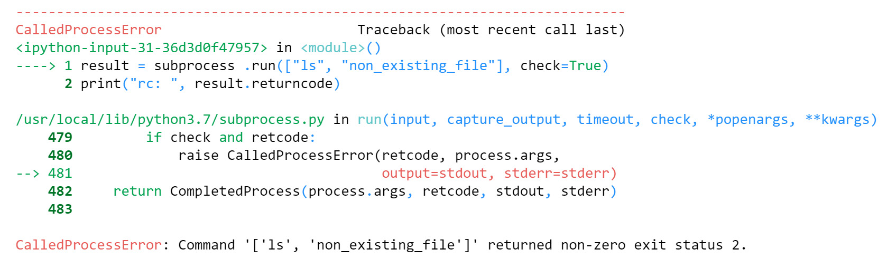

Lab 6. The Standard Library
=======================

Overview

By the end of this lab, you will be able to utilize Python\'s
standard library to write efficient code; use multiple standard
libraries to write code; create and manipulate files by interacting with
the OS filesystem; evaluate dates and times efficiently without falling
into the most common mistakes and set up applications with logs to
facilitate future troubleshooting.


High-Level Modules
------------------

Let's use an high-level module `argparse` as an
example and see how it can be used to create a command-line interface
that echoes words passed in and, optionally, capitalizes them in a few
lines of code. This can be executed in the Python terminal:


``` {.language-markup}
>>> import argparse
>>> parser = argparse.ArgumentParser()
>>> parser.add_argument("message", help="Message to be echoed")
>>> parser.add_argument("-c", "--capitalize", action="store_true")
>>> args = parser.parse_args()
>>> if args.capitalize:
        print(args.message.capitalize())
    else:
        print(args.message)
```

This code example creates an instance of the `ArgumentParser`
class, which helps you to create command-line interface applications.

It then defines two arguments in lines 3 and 4: `message` and
`capitalize`.

Note that `capitalize` can also be referred to as
`-c`, and we make it a Boolean flag option by changing the
default action to `store_true`. At that point, you can just
call `parse_args`, which will take the arguments passed in the
command line, validate them, and expose them as attributes of
`args`.

The code then takes the input message and chooses whether to capitalize
it based on the flag.

You can now interact with this file, named `echo.py`, as shown
in output :


Note

We will be using this capitalize tool in *Exercise 86, Extending the echo.py Example*.


Exercise 85: Using the dataclass Module
---------------------------------------

In this exercise, you will create a class to hold data for a
geographical point. This is a simple structure with two coordinates,
`x` and `y`.

These coordinate points, `x` and `y`, are used by
other developers who need to store geographical information. They will
be working daily with these points, so they need to be able to create
them with an easy constructor and be able to print them and see their
values --- converting them into a dictionary to save them into their
database and share it with other people.

This exercise can be performed in the Jupyter notebook:

1.  Import the `dataclass` module:


    ```
    import dataclasses
    ```

    This line brings the `dataclasses` module to the local
    namespace, allowing us to use it.

2.  Define a `dataclass`:


    ```
    @dataclasses.dataclass
    class Point:
        x: int
        y: int
    ```

    With these four lines, you have defined a `dataclass` by
    its most common methods. You can now see how it behaves differently
    from a standard class.

3.  Create an instance, which is the data for a geographical point:


    ```
    p = Point(x=10, y=20)
    print(p)
    ```

    The output will be as follows:


    ```
    Point(x=10, y=20)
    ```

4.  Now, compare the data points with another `Point` object:


    ```
    p2 = Point(x=10, y=20)
    p == p2
    ```

    The output will be as follows:


    ```
    True
    ```

5.  Serialize the data:


    ```
    dataclasses.asdict(p)
    ```

    The output will be as follows:


    ```
    {'x': 10, 'y': 20}
    ```

You now know how to use data classes to create value semantic types!


Exercise 86: Extending the echo.py Example
------------------------------------------

Note

In this exercise, you will be using the previously mentioned
`capitalize` tool with help messages and a variable number of
arguments.

After the creation of the `capitalize` tool that you saw
earlier in this topic, you can implement an enhanced version of the
`echo` tool in Linux, which is used in some embedded systems
that have Python. You will, use the previous code for
`capitalize` and enhance it to have a nicer description. This
will allow the echo comman to repeat the word passed in and to take more
than one word.

When you execute the code, it should generate the following
`help` message:


Caption: Expected output from the Exercise 86 help command

It should produce the following output when running with these
arguments:


Caption: Expected output of running the Exercise 86 script

1.  Add a description to the `echo` command.

    Start by adding a description to the `echo.py` script
    command. You can do so by passing it as an argument to the
    `ArgumentParser` class:


    ```
    parser = argparse.ArgumentParser(description="""
    Prints out the words passed in, capitalizes them if required
    and repeats them in as many lines as requested.
    """)
    ```

    The description passed in as an argument of the
    `ArgumentParser` class will be used as the help message
    when the user either runs the tools incorrectly or asks for help on
    how to use the tool.

    Note

    Notice how you can split the description into multiple lines to
    easily format our code, but the output appears as if all lines were
    together.

2.  Configure an argument to take multiple messages.

    The next step is to allow multiple messages rather than a single
    message. You can do so by using the `nargs` keyword
    argument when adding a positional parameter:


    ```
    parser.add_argument("message", help="Messages to be echoed", nargs="+")
    ```

    By passing `nargs="+"`, you tell `argparse` that
    we require at least one `message` to be passed in. Other
    options include `?` for optional, and `*` for 0
    or more. You can also use any natural number to require a specific
    number of parameters.

3.  Add a `repeat` flag with a `default` value.

    Finally, you need to add a new option with a default value to
    control the number of times the message is repeated:


    ```
    parser.add_argument("--repeat", type=int, default=1)
    ```

    This adds a new option, `repeat`, which allows us to pass
    an integer that defaults to one, and that will control the number of
    times the words are repeated.

    Note

    Notice how you pass a type, which is just a callable. This will be
    used to transform and validate the argument passed in, and you
    indicate what the default value is if a user does not specify the
    option. Alternatively, you could have marked it as
    `required=True` to force the user to always pass a value.

    Altogether, the code and implementation will be as shown in the
    following code snippet:


    ```
    import argparse
    parser = argparse.ArgumentParser(description="""
    Prints out the words passed in, capitalizes them if required
    and repeat them in as many lines as requested.
    """)
    parser.add_argument("message", help="Messages to be echoed", nargs="+")
    parser.add_argument("-c", "--capitalize", action="store_true")
    parser.add_argument("--repeat", type=int, default=1)
    args = parser.parse_args()
    if args.capitalize:
        messages = [m.capitalize() for m in args.message]
    else:
        messages = args.message
    for _ in range(args.repeat):
        print(" ".join(messages))
    ```

You just created a CLI application that allows you to echo messages with
an intuitive interface. You can now use the `argparse` module
to create any other CLI application.

Quite often, the standard library in Python has answers to developers\'
most common questions. By having a general knowledge of the different
modules in Python and always questioning what can be used from the
standard library, you will write better Python code that uses
easy-to-read, well-tested, and efficient utilities.


Dates and Times
===============


Many programs will need to deal with dates and times, and Python comes
with multiple modules to help you handle those effectively. The most
common module is the `datetime` module. The
`datetime` module comes with three types that can be used to
represent dates, times, and timestamps. There are also other modules,
such as the `time` module, or the `calendar` module,
which can be used for some other use cases.

`datetime.date` can be used to represent any date between the
years 1 and 9999. For any date/time outside of this range, you would
need to use more specialized libraries, such as the `astropy`
library.

You can create a `datetime.date` by passing the year, month,
and day, or get today by just calling `datetime.date.today()`:


``` {.language-markup}
import datetime
datetime.date.today()
```

The output is as follows:


Caption: Representation of a date object

The output format for time is similar; it takes hour, minute, second,
and microsecond. All of them are optional and are initialized at 0 if
not provided. This can also be created with `tzinfo`, but you
will see more about that attribute in the `datetime.datetime`
section.

Within the `datetime` module, you have what is probably the
most frequently used class, the `datetime.datetime` class. It
can represent a combination of a date and a time, and it actually
inherits from `datetime.date`. But before you start to explore
the `datetime` class within the `datetime` module,
you need to better understand the concept of time and how you represent
it.

There are usually two kinds of **time** that you need to represent. They
are commonly referred to as timestamps and wall time.

The first, timestamps, can be seen as a unique point in time independent
from any human interpretation of it. It is an absolute point in the line
of time that is not relative to any geographical location or country.
This is used for astronomical events, log records, and the
synchronization of machines, among other things.

The second, wall time, refers to the time *on the wall* at a specific
location. This is the time humans use, and you synchronize your time
using it. This time is the \"legal\" time as it is dictated by the
country and is related to a time zone. This is used for meetings, flight
schedules, working hours, and so on. The interval of time can change at
any point due to legislation. As an example, think of countries that
observe daylight saving time (DST) and change their standard clock
accordingly.

Note

If you need to work extensively with time, it is important to read about
UTC and the history of how you measure time to avoid more complex
issues, but you will go through a quick overview of good practices when
handling time in this topic to avoid the most common mistakes.

When you are working with wall time, you just need to treat
`datetime.datetime` objects as a mere combination of a date
and a time at a location. But you should usually attach a time zone to
it to be more precise and get proper semantics for time comparison and
basic arithmetic. The two most commonly used libraries to handle time
zones are `pytz` and `dateutil`.

You must use `dateutil` when using wall times;
`pytz` has a time model that will lead the inexperienced user
to make mistakes more often than not. To create a `datetime`
with a time zone, you just need to pass it through the
`tzinfo` argument:


``` {.language-markup}
import datetime
from dateutil import tz
datetime.datetime(1989, 4, 24, 10, 11, 
                      tzinfo=tz.gettz("Europe/Madrid"))
```

This creates a `datetime` with that time zone information
attached.


Exercise 87: Comparing datetime across Time Zones
-------------------------------------------------

The goal of this exercise is to create two different
`datetime` and compare them when they are in different time
zones:

1.  Import the `datetime` and `tz` modules from
    `dateutil`:


    ```
    import datetime
    from dateutil import tz
    ```

    Note

    `Dateutil` is not a module from the standard library,
    though it is the one recommended by the standard library.

2.  Create the first `datetime` for `Madrid`:


    ```
    d1 = datetime.datetime(1989, 4, 24, hour=11,
                             tzinfo=tz.gettz("Europe/Madrid"))
    ```

    With this line, you create a `datetime` for April 24,
    1989, at 11 a.m. in Madrid.

3.  Create the second `datetime` for `Los_Angeles`:


    ```
    d2 = datetime.datetime(1989, 4, 24, hour=8,
                             tzinfo=tz.gettz("America/Los_Angeles"))
    ```

    This creates a `datetime` object that seems to have a
    difference of 3 hours less and a different time zone.

4.  Now, compare them:


    ```
    print(d1.hour > d2.hour)
    print(d1 > d2)
    ```

    The output is as follows:

    


    When you compare the two `datetime` objects, you can see
    that even though the first `datetime` has a higher hour
    than the second (that is, the first is at 11 and the second is at
    8), the first is not greater, and is, therefore later than the
    second, as the time zone is different, and 8 in Los Angeles happens
    after 11 in Madrid.

5.  Now, convert the `datetime` object to a different time
    zone.

    You can convert a `datetime` from one time zone to
    another. You should do that to see what time the second
    `datetime` would show if it was in Madrid:


    ```
    d2_madrid = d2.astimezone(tz.gettz("Europe/Madrid"))
    print(d2_madrid.hour)
    ```

    The output is as follows:


    ```
    17
    ```

It is 5 p.m. Now, it is obvious that the second `datetime` is
later than the first.

At other times, you might work just with timestamps, with time not
related to any location. The easiest way to do this is to use UTC, with
0 as the offset. UTC is Coordinated Universal Time and is a system that
provides a universal way of coordinating time across locations --- you
have most likely already used it. It is *the most common standard* for
the time. The time zones you saw in the previous exercises define
offsets from UTC that allow the library to identify what time
corresponds to time from one location to another.

To create a `datetime` with an offset of 0, also known as a
`datetime` in UTC, you can use
`datetime.timezone.utc` as the `tzinfo` argument.
This will then represent an absolute point in the line of time. You can
safely add, subtract, and compare `datetimes` without any
issue when using UTC. On the other hand, if you use any specific time
zone, you should be aware that nations might change the time at any
point, which could make any of your calculations invalid.

You now know how to create datetimes, compare them, and convert them
across time zones. This is a common exercise when developing
applications that deal with time.

In the next exercise, you\'ll look at the time delta between two
`datetime` objects. Here, the delta is the difference.


Exercise 88: Calculating the Time Delta between Two datetime Objects
--------------------------------------------------------------------

In this exercise, you will subtract two `datetime` objects to
calculate the delta between the two timestamps.

Quite often, when you work with `datetime`, what really
matters is the difference between them; that is, the delta in time
between two specific dates. Here, you will find out the difference in
seconds between two important events that happened in your company, one
on February 25, 2019, at 10:50, and the other on February 26 at 11:20.
Both these times are in UTC. This exercise can be performed in a Jupyter
notebook:

1.  Import the `datetime` module:


    ```
    import datetime as dt
    ```

    Quite often, developers import the `datetime` module
    through an alias, `dt`. This is done in many codebases to
    differentiate the `datetime` module from the
    `datetime` class.

2.  Create two `datetime` objects.

    You now create two dates:


    ```
    d1 = dt.datetime(2019, 2, 25, 10, 50,
                     tzinfo=dt.timezone.utc)
    d2 = dt.datetime(2019, 2, 26, 11, 20,
                     tzinfo=dt.timezone.utc)
    ```

    We created two `datetime` objects as
    `dt.datetime`, and you now have two `datetime`
    objects.

3.  Subtract `d1` from `d2`.

    You can subtract two `datetime` to get a time delta back
    or add a time delta to a `datetime`.

    Adding two `datetime` makes no sense, and the operation
    will, therefore, output an error with an exception. Hence, you
    subtract the two `datetime` to get the delta:


    ```
    d2 – d1
    ```

    The output is as follows:

    


    Caption: Output with the delta between 2 days and seconds

4.  You can see that the delta between the two `datetime` is 1
    day and 1,800 seconds, which can be translated to the total number
    of seconds by calling `total_seconds` in the time delta
    object that the subtraction returns:


    ```
    td = d2 - d1
    td.total_seconds()
    ```

    The output is as follows:


    ```
    88200.0
    ```

5.  It happens quite often that you need to send `datetime`
    objects in formats such as JSON or others that do not support native
    datetimes. A common way to serialize `datetime` is by
    encoding them in a string using the ISO 8601 standard.

    This can be done by using `isoformat`, which will output a
    string, and parsing them with the `fromisoformat` method,
    which takes a `datetime` serialized to a string with
    `isoformat` and transforms it back to a
    `datetime`:


    ```
    d1 = dt.datetime.now(dt.timezone.utc)
    d1.isoformat()
    ```

    The output is as follows:


Another module that you use when dealing with time is the
`time` module. In the `time` module, you can get the
Unix time through `time.time`. This will return the number of
seconds since the Unix epoch is without leap seconds. This is known as
**Unix time** or **POXIS time**.


You now understand the basics of time arithmetic and know how to
calculate the time delta between two timestamps.


Exercise 89: Calculating the Unix Epoch Time
--------------------------------------------

In this exercise, you will use the `datetime` and
`time` modules to calculate Unix Epoch time.

If you can just look it up, you can also calculate the Unix epoch. As
`time.time` gives us the number of seconds since the epoch,
you can create a time delta with it and subtract it from a
`datetime` you\'ve created. You will see how to perform that
in this exercise.

This exercise can be performed in a Jupyter notebook:

1.  Import the `time` and `datetime` modules and get
    them to the current namespace:

    ```
    import datetime as dt
    import time
    ```

2.  Get the current time. You use both `datetime` and
    `time` to do this:


    ```
    time_now = time.time()
    datetime_now = dt.datetime.now(dt.timezone.utc)
    ```

    Note

    You use the UTC time zone when getting time with
    `datetime`. This is necessary because
    `time.time` returns Unix time, which uses an
    `epoch` that is in UTC.

3.  You can now calculate the epoch by subtracting `datetime`
    and a time delta, which you get from the current time since you said
    that these are the number of seconds since the `epoch`:


    ```
    epoch = datetime_now - dt.timedelta(seconds=time_now)
    print(epoch)
    ```

    The output is as follows:


Caption: Calculating the epoch

The result is the Unix epoch --- January 1, 1970.


Now have a look at an example where you create a calendar and get all of
the days in a month as follows:


``` {.language-markup}
import calendar
c = calendar.Calendar()
list(c.itermonthdates(2019, 2))
```

The output is as follows:


Caption: Output showing month 1 and its days as a calendar

Note

Though the function returns all date instances for all the weeks in the
month, if you want to get only the days that belong to the specific
month, you need to filter them.


``` {.language-markup}
list(d for d in c.itermonthdates(2019, 2)
        if d.month == 2)
```

You should get the following output:


Activity 15: Calculating the Time Elapsed to Run a Loop
-------------------------------------------------------

You are part of an IT department, and you are asked to inspect an
application that outputs random numbers but with a delay. In order to
investigate this delayed output, you check the code as there have been
updates to the application where the development team has added a new
line of code to get a list of random numbers. You are asked to confirm
this by checking the time it takes to run that line of code using the
`time` module.

Note

To perform this activity, you can just record the time by using
`time.time` to compute the difference in time since, before,
and after the function. If you want to be more precise and use the time
in nanoseconds, you can use `time_ns`.

You will see in the topic about profiling in a later lab how to
measure performance in a more precise way.

This was the line of code that was added in by the development team:


``` {.language-markup}
l = [random.randint(1, 999) for _ in range(10 * 3)]
```

While it is possible to run the code and use `time.time` to
calculate the elapsed time, is there any better function in the time
module to do this?

Steps:

1.  Record the time before running the code mentioned above in a hint
    with the `time.time` function.

2.  Record the time after running the code mentioned above in a hint
    with the `time.time` function.

3.  Find the difference between the two.

4.  Repeat the steps using `time.time_ns`.

    You should get the following output:


    ```
    187500
    ```


Interacting with the OS
=======================


One of the most common uses of Python is to write code that interacts
with the OS and its filesystem. Whether you are working with files or
you just need some basic information about the OS, this topic will cover
the essentials of how to do it in a multiplatform way through the
`os`, `sys`, `platform`, and
`pathlib` modules of the standard library.


Exercise 90: Inspecting the Current Process Information
-------------------------------------------------------

The goal of this exercise is to use the standard library to report
information about the running process and the platform on your system:

1.  Import the `os`, `platform`, and `sys`
    modules:

    ```
    import platform
    import os
    import sys
    ```

2.  Get basic process information:

    To obtain information such as the `Process id`,
    `Parent id` you can use the `os` module:


    ```
    print("Process id:", os.getpid())
    print("Parent process id:", os.getppid())
    ```

    The output is as follows:


    This gives us the process ID and the parent process ID. This
    constitutes a basic step when you try to perform any interaction
    with the OS that involves your process and is the best way to
    uniquely identify the running process. You can try restarting the
    kernel or the interpreter and see how the `pid` changes,
    as a new process ID is always assigned to a running process in the
    system.

3.  Now, get the `platform` and Python interpreter
    information:


    ```
    print("Machine network name:", platform.node())
    print("Python version:", platform.python_version())
    print("System:", platform.system())
    ```

    The output is as follows:

    


    These functions of the module platform can be used to ascertain the
    information of the computer where your Python code is running, which
    is useful when you are writing code that might be specific to the
    machine or system information.

4.  Get the Python path and the arguments passed to the interpreter:


    ```
    print("Python module lookup path:", sys.path)
    print("Command to run Python:", sys.argv)
    ```

    This will give us a list of paths where Python will look for modules
    and the command line that was used to start the interpreter as a
    list of arguments.

5.  Get the username through an environment variable.


    ```
    print("USERNAME environment variable:", os.environ["USERNAME"])
    ```

    The output is as follows:


The `environ` attribute of the `os` module is a
`dict` that maps the `environment` variable name to
its values. The keys are the name of the environment variables, and the
value is the one that it was set to initially. It can be used to read
and set environment variables, and it has the methods that you would
expect a `dict`. You can use
`os.environ.get(varname, default)` to provide a default value
if a variable was not set, and `pop` to remove items or just
assign a new value. There are also two other methods, `getenv`
and `putenv`, which can be used to get and set environment
variables, but, using the `os.environ` as a `dict`
is more readable.

This is just a small peek into these three modules and some of the
attributes and functions that they provide. Further and more specialized
information can be found in the modules, and you are encouraged to
explore the module when any specific runtime information is needed.

Having completed this exercise, you learned how to use multiple modules
such as `os` and `platform` to query information
about the environment that can be used to create programs that interact
with it.


Using pathlib
-------------

Another useful module is `pathlib`. Even though many of the
actions that are performed with pathlib can be done with
`os.path`, the `pathlib` library offers a much
better experience, which you\'ll go into more detail about later.

The `pathlib` module provides a way to represent and interact
with filesystem paths.

A `path` object of the module, which is the basic
`util` of the module, can just be created with its default
argument to start a relative path to the current working directory:


``` {.language-markup}
import pathlib
path = pathlib.Path()
print(repr(path))
```

You should get the following output:


``` {.language-markup}
WindowsPath('.')
```

Note

You can get and change the current working directory with
`os.getcwd()` and `os.chdir()`, respectively.

You will get either a `PosixPath` or a `WindowsPath`
function of the platform you are running on.

You can use the string representation of a path at any time to be used
in the functions that accept a string as a path; this can be done by
calling `str(path)`.

`path` objects can be joined with just a forward slash
(`/`), which feels really natural and easy to read, as shown
in the following code snippet:


``` {.language-markup}
import pathlib
path = pathlib.Path(".")
new_path = path / "folder" / "folder" / "example.py"
```

You can now perform multiple operations on those path objects. One of
the most common ones is to call resolve in the resulting object, which
will make the path absolute and resolve all `..` references.
As an example, paths such as `./my_path/` will be resolved to
paths such as `/current/workspace/my_path`, which start with
the root filesystem.

Some of the most common operations to perform on a path are the
following:

-   `exists`: Checks whether the path exists in the filesystem
    and whether it is a file or a directory.
-   `is_dir`: Checks whether the path is a directory.
-   `is_file`: Checks whether the path is a file.
-   `iterdir`: Returns an iterator with path objects to all
    the files and directories contained within the `path`
    object.
-   `mkdir`: Creates a directory in the path indicated by the
    `path` object.
-   `open`: Opens a file in the current path, similar to
    running `open` and passing the string representation of
    the path. It returns a `file` object that can be operated
    like any other.
-   `read_text`: Returns the content of the file as a Unicode
    string. If the file is in binary format, the `read_bytes`
    method should be used instead.

Finally, a key function of Path objects is **glob**. Glob allows you to
specify a set of filenames by using wildcards. The main character used
to do so is `*`, which matches any character in the path
level. `**` matches any name but crossing directories. This
means that `"/path/*"` will match any file in
`"path" whilst "/path/**"` and will match any file within its
path and any of its directories.

You will look at this in the next exercise.


Exercise 91: Using the glob Pattern to List Files within a Directory
--------------------------------------------------------------------

In this exercise, you will learn how to list the files of an existing
source tree. This is a key part of developing any application that works
with a filesystem.

You are given the following file and folder structure, which you have in
the GitHub repository:


Caption: Initial folder structure

1.  Create a path object for the current `path`:


    ```
    import pathlib
    p = pathlib.Path("")
    ```

    Note

    You could also use `pathlib.Path.cwd()` and get an
    absolute path directly.

2.  Find all files in the directory with the `txt` extension.

    You can start by listing all files with the `txt`
    extension by using the following `glob`:


    ```
    txt_files = p.glob("*.txt")
    print("*.txt:", list(txt_files))
    ```

    The output is as follows:

    


    Caption: Output showing the file with the .txt extension

    This lists all the files in the current location that end with
    `txt`, which, in this case, is the only
    `file_a.txt`. Folders within other directories are not
    listed, as the single star, `*`, does not cross
    directories and if there was another file not ending in
    `txt`, it would not be included either.

    Note how you need to transform `txt_files` into a list.
    This is needed as `glob` returns an iterator and you want
    to print the list. This is useful since, when you are listing files,
    there might be an endless number of files.

    If you wanted to list all of the text files in any folder within the
    path, no matter the number of subdirectories, you could use the
    double star syntax, `**`:


    ```
    print("**/*.txt:", list(p.glob("**/*.txt")))
    ```

    The output is as follows:

    


    Caption: Output showing all the files in all the folders

    This lists all files that end with `.txt` within any
    folder in the current path described by the path object,
    `p`.

    This lists `folder_1/file_b.txt` and
    `folder_2/folder_3/file_d.txt`, but also
    `file_a.txt`, which is not within any folder, as
    `**` matches within any number of nested folders,
    including `0`.

    Note

    `folder_1/file_c.py` won\'t be listed, however, as it does
    not match the ending we provided in the `glob`.

3.  List all files one level deep that are within the subdirectory.

    If you wanted to list all files one level deep within a subdirectory
    only, you could use the following `glob` pattern:


    ```
    print("*/*:", list(p.glob("*/*")))
    ```

    The output is as follows:


Caption: Output showing the files within a subdirectory

This will list both files within
`folder_1 and the folder "folder_2/folder_3`, which is also a
path. If you wanted to get only files, you could filter each of the
paths by checking the `is_file` method, as mentioned
previously:


``` {.language-markup}
print("Files in */*:", [f for f in p.glob("*/*") if f.is_file()])
```

The output is as follows:


This will not include paths that are no longer a file.

Note

There is also another module that is worth mentioning, which contains
high-level functions for file and folder operations, `shutil`.
With `shutil`, it is possible to recursively copy, move, or
delete files.

You now know how to list files within a tree based on their attributes
or extensions.


Listing All Hidden Files in Your Home Directory
-----------------------------------------------

In Unix, *hidden* files are those that start with a **dot**. Usually,
those files are not listed when you list files with tools such as
`ls` unless you explicitly ask for them. You will now use the
`pathlib` module to list all hidden files in your home
directory. The code snippet indicated here will show exactly how to list
these hidden files:


``` {.language-markup}
import pathlib
p = pathlib.Path.home()
print(list(p.glob(".*")))
```

The `pathlib` docs find the function that gives us the home
directory, and then we use the `glob` pattern to match any
file starting with a dot. In the next topic, we will be using the
subprocess module.


Using the subprocess Module
===========================


Python is really useful in situations where we need to start and
communicate with other programs on the OS.

The `subprocess` module allows us to start a new process and
communicate with it, bringing to Python all the available tools
installed on your OS through an easy-to-use API. The
`subprocess` module can be seen by calling any other program
from your shell.

This module has gone through some work to modernize and simplify its
API, and you might see code using subprocess in ways different from
those shown in this topic.

The `subprocess` module has two main APIs: the
`subprocess.run` call, which manages everything from you
passing the right arguments; and `subprocess.Popen`, a
lower-level API that is available for more advanced use cases. You are
going to cover only the high-level API, `subprocess.run`, but
if you need to write an application that requires something more
complex, as we have previously seen with the standard library, go
through the documentation and explore the APIs for more complex use
cases.

Note

The following examples have been run on a Linux system, but
`subprocess` can be used on Windows as well; it will just need
to call Windows programs. You can use `dir` instead of
`ls`, for example.

Now you will see how you can call the Linux system `ls` by
using `subprocess` and listing all the files:


``` {.language-markup}
import subprocess
subprocess.run(["ls"])
```

This will just create a process and run the `ls` command. If
the `ls` command is not found (in Windows, for example),
running this command will fail and raise an exception.

Note

The return value is an instance of `CompletedProcess`, but the
output of the command is sent to standard output in the console.

If you want to be able to capture and see the output that our process
produced, you need to pass the `capture_output` argument. This
will capture `stdout` and `stderr` and make it
available in the `completedProcess` instance returned by
`run`:


``` {.language-markup}
result = subprocess .run(["ls"], capture_output=True)
print("stdout: ", result.stdout)
print("stderr: ", result.stderr)
```

The output is as follows:


Note

The `stdout` and `stderr` result is a byte string.
If you know that the result is text, you can pass the `text`
argument to have it decoded.


``` {.language-markup}
result = subprocess .run(        ["ls"],
        capture_output=True, text=True
    )
print("stdout: \n", result.stdout)
```

The output is as follows:


Caption: Output showing the subprocesses using stdout

You can also pass more arguments, such as `-l`, to have the
files listed with details:


``` {.language-markup}
result = subprocess.run(        ["ls", "-l"],
        capture_output=True, text=True
    )
print("stdout: \n", result.stdout)
```

The output is as follows:


Caption: Output showing the files listed in detail using -l

The first thing that usually surprises users when using
`suprocess.run` is that the command that needs to be passed in
to run is a list of strings. This is for convenience and security. Many
users will jump into using the shell argument, which will make passing
the command arguments as a string work but there are security concerns.
When doing so, you are basically asking Python to run our command in the
system shell, and you are therefore responsible for escaping the
characters as needed. Imagine for a moment that you accept user input,
and you are going to pass it to the `echo` command. A user
would then be able to pass `hacked; rm –rf /` as the argument
for echo.

Note

Do not run this command: `hacked; rm –rf /`.

By using the semicolon, the user can mark the end of a shell command and
start their own, which will delete all of your root! Additionally, when
your arguments have spaces or any other shell character, you have to
escape them accordingly. The simplest and safest way to use
`subprocess.run` is to pass all tokens one by one as a list of
strings, as shown in the examples here.

In some situations, you might want to inspect the return code that our
return process has returned. In those situations, you can just check the
`returncode` attribute in the returning instance of
`subprocess.run`:


``` {.language-markup}
result = subprocess.run(["ls", "non_existing_file"]) 
print("rc: ", result.returncode)
```

The output is as follows:


``` {.language-markup}
rc: 2
```

If you wanted to make sure that our command succeeded without always
having to check that the return code was `0` after running,
you could use the `check=True` argument. This will raise
errors if the program reported any:


``` {.language-markup}
result = subprocess.run(
    ["ls", "non_existing_file"],
    check=True
)
print("rc: ", result.returncode)
```

The output is as follows:




Caption: The result of running subprocess on a failed command

This is a great way to call other programs in which we just want them to
be executed to have a look at the error, such as calling batch
processing scripts or programs. The exceptions raised in those
situations contain information such as the command that was run, the
output if it was captured, and the return code.

The `subprocess.run` function also has some other interesting
arguments that are helpful in some more special situations. As an
example, if you are using `subprocess.call` with a program
that expects any input through `stdin`, you can pass such
input via the `stdin` argument. You can also pass a timeout
for how many seconds you should wait for the program to finish. If the
program does not return by that time, it will be terminated and, once
finished, a timeout exception will be raised to inform us of the
failure.

Processes created with the `subprocess.run` method will
inherit the environment variables from the current process.

`sys.executable` is a string giving the absolute path of the
executable binary for the Python interpreter on systems. If Python, is
unable to retrieve the real path to its executable process,
`sys.executable` will be an empty string or `None`.

Note

The `-c` option on the Python interpreter is for running code
inline. You will be using this option in *Activity 16*: *Testing Python
Code.*

You will see how you can customize child processes in the following
exercise.


Exercise 92: Customizing Child Processes with env vars
------------------------------------------------------

As part of an auditing tool, you are asked to print our environment
variables by using the `subprocess` module, without relying on
the Python `os.environ` variable. However, you have to do so
concealing our server name, as our manager does not want to show this
information to our clients.

In this exercise, you will call other apps in the OS while changing the
environment variables of the parent process. You will see how you can
change environment variables when using `subprocess`:

1.  Import subprocess.

    Bring the `subprocess` module into the current namespace:


    ```
    import subprocess
    ```

    You can also bring just the `run` command by running
    `subprocess` by importing `run`, but by
    importing this module itself, we can see the module name when we are
    calling `run`. Otherwise, you wouldn\'t know where the
    `run` was coming from. Additionally,
    `subprocess` defines some constants that are used for some
    arguments on the advanced use of `Popen`. By importing
    `subprocess`, you have all those available.

2.  Run `env` to print the environment variables.

    You can run the `env` Unix command, which will list the
    process environment variables in `stdout`:


    ```
    result = subprocess.run(
        ["env"],
        capture_output=True,
        text=True
    )
    print(result.stdout)
    ```

    You pass `capture_output` and `text` to be able
    to read the `stdout` result in a Unicode string. You can
    confirm that the process indeed has a list of environment variables
    already set; those match the ones of the parent process:

    


    Caption: Output showing the environment variables using env

3.  Use a different set of environment variables.

    If you wanted to customize the environment variables that our
    subprocess has, you could use the `env` keyword of the
    `subprocess.run` method:


    ```
    result = subprocess.run(
         ["env"],
        capture_output=True,
        text=True,
        env={"SERVER": "OTHER_SERVER"}
    )
    print(result.stdout)
    ```

    The output is as follows:

    


4.  Now, modify the default set of variables.

    Most of the time, you just want to modify or add one variable, not
    just replace them all. Therefore what we did in the previous step is
    too radical, as tools might require environment variables that are
    always present in the OS.

    To do so, you will have to take the current process environment and
    modify it to match the expected result. We can access the current
    process environment variables via `os.environ` and copy it
    via the `copy` module. Though you can also use the
    `dict` expansion syntax with the keys that you want to
    change to modify it, as shown in the following example:


    ```
    import os
    result = subprocess.run(
        ["env"],
        capture_output=True,
        text=True,
        env={**os.environ, "SERVER": "OTHER_SERVER"}
    )
    print(result.stdout)
    ```

    The output is as follows:


Caption: Modifying the default set of environment variables

You can see that you now have the same environments in the process
created with `subprocess` as those in the current process, but
that you have modified `SERVER`.

You can use the `subprocess` module to create and interact
with other programs installed on our OS. The `subprocess.run`
function and its different arguments make it easy to interact with
different kinds of programs, check their output, and validate their
results. There are also more advanced APIs available through the
`subprocess.Popen` call if they are needed.


Activity 16: Testing Python Code
--------------------------------

A company that receives small Python code snippets from its clients with
basic mathematical and string operations has realized that some of the
operations crash their platform. There is some asked for code requested
by clients that cause the Python interpreter to abort as it cannot
compute it.

This is an example:


``` {.language-markup}
compile("1" + "+1" * 10 ** 6, "string", "exec")
```

You are therefore asked to create a small program that can run the
requested code and check whether it will crash without breaking the
current process. This can be done by running the same code with
`subprocess` and the same interpreter version that is
currently running the code.

To get this code, you need to:

1.  Find out the executable of our interpreter by using the
    `sys` module.

2.  Use `subprocess` to run the code with the interpreter that
    you used in the previous step.

3.  Use the `-c` option of the interpreter to run code inline.

4.  Check whether the result code is `-11`, which corresponds
    to an abort in the program.


In the following topic, you will be using logging, which plays a major
part in the life of a developer.


Logging
=======


Setting up an application or a library to log is not just good practice;
it is a key task of a responsible developer. It is as important as
writing documentation or tests. Many people consider logging the
\"runtime documentation\"; the same way developers read the
documentation when interacting with the DevOps source code, and other
developers will use the log traces when the application is running.

Hardcore logging advocates state that debuggers are extremely overused,
and people should rely more on logging, using both info and trace logs
to troubleshoot their code in development.

The idea is that if you are not able to troubleshoot your code with the
highest level of verbosity in development, then you may have issues in
production that you won\'t be able to figure out the root issue of.


Using Logging
-------------

Logging is the best way to let the users of the running application know
which state the process is in, and how it is processing its work. It can
also be used for auditing or troubleshooting client issues. There is
nothing more frustrating than trying to figure out how your application
behaved last week and having no information at all about what happened
when it faced an issue.

You should also be careful about what information we log. Many companies
will require users to never log information such as credit cards or any
sensitive user data. Whilst it is possible to conceal such data after it
is logged, it is better to be mindful when we log it.

You might wonder what is wrong with just using `print`
statements, but when you start to write large-scale applications or
libraries, you realize that just using `print` does nothing to
instrument an application. By using the `logging` module, you
also get the following:

-   Multithreading support: The logging module is designed to work in
    multithreaded environments. This is needed when using multiple
    threads as, otherwise, the data that you log will get interleaved,
    as can happen with `print`.
-   Categorization through multiple levels of logging: When using
    `print`, there is no way to transmit the importance of the
    log trace being emitted. By using logging, we can choose the
    category that we want to log under to transmit the importance of it.
-   Separation of concerns between instrumentation and configuration:
    There are two different users of the logging library --- users who
    just emit and those who configure the logging stack. The logging
    library separates those nicely, allowing libraries and applications
    to just instrument their code with logs at different levels, and the
    final user to configure the logging stack at will.
-   Flexibility and configurability: The logging stack is easily
    extensible and configurable. There are many types of handlers, and
    it is trivial to create new classes that extend its functionality.
    There is even a cookcourse on how to extend the logging stack in the
    standard library documentation.

The main class you interact with when using the logging library is
`logger`. can be used to emit logs in any category. You
usually create loggers by getting them through the
`logging.getLogger(<logger name>)` factory method.

Once you have a `logger` object, you can call the different
logging methods that match the different default categories that you are
able to log in:

-   `debug`: Fine-grained messages that are helpful for
    debugging and troubleshooting applications, usually enabled in
    development. As an example, a web server will log the input payload
    when receiving a request at this level.
-   `info`: Coarse-grained informational messages that
    highlight the progress of an application. As an example, a web
    server will emit the requests being handled at this level without
    details of the data being received.
-   `warning`: Messages that inform the user of a potentially
    harmful situation in the application or library. In our example of a
    web server, this will happen if you fail to decode an input JSON
    payload because it is corrupted. Note that while it might feel like
    an error and it might be for the whole system, if you own the
    frontend as well, the issue is not in the application handling the
    request; it is in the process sending it. Therefore, a warning might
    help notify the user of such an issue, but it is not an error. The
    error should be reported to the client as an error response, and the
    client should handle it as appropriate.
-   `error`: Used for situations where an error has taken
    place, but the application can continue to function properly.
    Logging an error usually means there is an action that needs to be
    carried out by a developer in the source code that logged it.
    Logging errors commonly happen when you capture an exception, and
    you have no way of handling it effectively. It is quite common to
    set up alerts in connection with errors to inform the DevOps or
    developer that an error situation took place. In our web server
    application, this might happen if you fail to encode a response or
    an exception is raised that was not expected when handling the
    request.
-   `fatal`: Fatal logs indicate that there has been an error
    situation that compromises the current stability of the program,
    and, quite often, the process is restarted after a fatal message is
    logged. A fatal log means that the application needs an operator to
    take action urgently, compared to an error that a developer is
    expected to handle. A common situation is when the connection to a
    database is lost, or any other resource that is key for the
    application is no longer reachable.


Logger Object
-------------

Loggers have a hierarchy of names split by a dot. For example, if you
ask for a logger named `my.logger`, you are creating a
`logger` that is a child of `my`, which is a child
of the `root` logger. All top-level loggers \"inherit\" from
the root logger.

You can get the root logger by calling `getLogger` without
arguments or by logging directly with the logging module. A common
practice is to use `__name__` as the logger module. This makes
your logging hierarchy follow your source code hierarchy. Unless you
have a strong reason not to do that, use `__name__` when
developing libraries and applications.


Exercise 93: Using a logger Object
----------------------------------

The goal of this exercise is to create a `logger` object and
use four different methods that allow us to log in the categories
mentioned in the Logging section:

1.  Import the `logging` module:

    ```
    import logging
    ```

2.  Create a `logger`.

    We can now get a logger through the factory method
    `getLogger`:


    ```
    logger = logging.getLogger("logger_name")
    ```

    This `logger` object will be the same everywhere, and you
    call it with the same name.

3.  Log with different categories:


    ```
    logger.debug("Logging at debug")
    logger.info("Logging at info")
    logger.warning("Logging at warning")
    logger.error("Logging at error")
    logger.fatal("Logging at fatal")
    ```

    The output is as follows:

    


    Caption: The output of running logging

    By default, the logging stack will be configured to log warnings and
    above, which explains why you only see those levels being printed to
    the console. You will see later how to configure the logging stack
    to include other levels, such as info. Use files or a different
    format to include further information.

4.  Include information when logging:


    ```
    system = "moon"
    for number in range(3):
        logger.warning("%d errors reported in %s", number, system)
    ```

    Usually, when you log, you don\'t pass just a string, but also some
    variable or information that helps us with the current state of the
    application:


Caption: The output of running warning logs

Note

You use Python standard string interpolation, and you pass the remainder
of the variables as attributes. `%d` is used to format
numbers, while `%s` is used for strings. The string
interpolation format also has syntax to customize the formatting of
numbers or to use the `repr` of an object.

After this exercise, you now know how to use the different
`logger` methods to log in different categories depending on
the situation. This will allow you to properly group and handle your
application messages.


Logging in warning, error, and fatal Categories
-----------------------------------------------

You should be mindful when you log in warning, error, and fatal. If
there is something worse than an error, it is two errors. Logging an
error is a way of informing the system of a situation that needs to be
handled, and if you decide to log an error and raise an exception, you
are basically duplicating the information. As a rule of thumb, following
these two pieces of advice is key to an application or library that logs
errors effectively:

-   Never ignore an exception that transmits an error silently. If you
    handle an exception that notifies you of an error, log that error.
-   Never raise and log an error. If you are raising an exception, the
    caller has the ability to decide whether it is truly an error
    situation, or whether they were expecting the issue to occur. They
    can then decide whether to log it following the previous rule, to
    handle it, or to re-raise it.

A good example of where the user might be tempted to log an error or
warning is in the library of a database when a constraint is violated.
From the library perspective, this might look like an error situation,
but the user might be trying to insert it without checking whether the
key was already in the table. The user can therefore just try to insert
and ignore the exception, but if the library code logs a warning when
such a situation happens, the warning or error will just spew the log
files without a valid reason. Usually, a library will rarely log an
error unless it has no way of transmitting the error through an
exception.

When you are handling exceptions, it is quite common to log them and the
information they come with. If you want to include the exception and
trace back the full information, you can use the `exc_info`
argument in any of the methods that we saw before:


``` {.language-markup}
try:
    int("nope")
except Exception:
    logging.error("Something bad happened", exc_info=True)
```

The output is as follows:


Caption: Example output when logging an exception with exc\_info.

The error information now includes the message you passed in, but also
the exception that was being handled with the traceback. This is so
useful and common that there is a shortcut for it. You can call the
`exception` method to achieve the same as using
`error` with `exc_info`:


``` {.language-markup}
try:
    int("nope")
except Exception:
    logging.exception("Something bad happened")
```

The output is as follows:


Now, you will review two common bad practices with the
`logging` module.

The first one is a greedy string formatting. You might see some linters
complain about formatting a string by the user, rather than relying on
the `logging` module\'s string interpolation. This means that
`logging.info("string template %s", variable)` is preferred
over `logging.info("string template {}".format(variable))`.
This is the case since, if you perform the string interpolation with the
format, you will be doing it no matter how we configure the logging
stack. If the user who configures the application decides that they
don\'t need to print out the logs in the information level, you will
have to perform interpolation, when it wasn\'t necessary:


``` {.language-markup}
# prefer
logging.info("string template %s", variable)
# to
logging.info("string template {}".format(variable))
```

Note

Linters are programs that detect code style violations, errors, and
suggestions for the user.

The other, more important, bad practice is capturing and formatting
exceptions when it\'s not really needed. Often, you see developers
capturing broad exceptions and formatting them manually as part of a log
message. This is not only boilerplate but also less explicit. Compare
the following two approaches:


``` {.language-markup}
d = dict()
# Prefer
try:
    d["missing_key"] += 1
except Exception:
    logging.error("Something bad happened", exc_info=True)
# to
try:
    d["missing_key"] += 1
except Exception as e:
    logging.error("Something bad happened: %s", e)
```

The output is as follows:


The output in the second approach will only print the text of the
exception, without further information. We don\'t know if it was a key
error, nor where the issue appeared. If the exception was raised without
a message, we would just get an empty message. Additionally, if logging
an error, use an exception, and you won\'t need to pass
`exc_info`.


Configuring the Logging Stack
-----------------------------

Another part of the `logging` library is the functions to
configure it, but before diving into how to configure the logging stack,
you should understand its different parts and the role they play.

You\'ve already seen `logger` objects, which are used to
define the logging messages that need to be generated. There are also
the following classes, which take care of the process of processing and
emitting a log:

-   Log Records: This is the object that is generated by the logger and
    contains all the information about the log, including the line where
    it was logged, the level, the template, and arguments, among others.
-   Formatters: These take log records and transform them into strings
    that can be used by handlers that output to streams.
-   Handlers: These are the ones that actually emit the records. They
    frequently use a formatter to transform records into strings. The
    standard library comes with multiple handlers to emit log records
    into `stdout`, `stderr`, `files`,
    `sockets`, and so on.
-   Filters: Tools to fine-tune log record mechanisms. They can be added
    to both handlers and loggers.

If the functionality that is already provided by the standard library is
not enough, you can always create our own kind of classes that customize
how the logging process is performed.

Note

The logging library is truly flexible. If you are interested in doing
so, read through the logging cookcourse in the Python official
documentation to see some examples at
<https://docs.python.org/3/howto/logging-cookcourse.html>.

Armed with this knowledge, there are multiple ways to configure all of
the elements of the logging stack. You can do so by plugging together
all the classes manually with code, passing a `dict` via
`logging.config.dictConfig`, or through an `ini`
file with `logging.config.iniConfig`.


Exercise 94: Configuring the Logging Stack
------------------------------------------

In this exercise, you will learn how to configure the logging stack
through multiple methods to output log messages to `stdout`.

You want to configure the logging stack to output logs to the console,
which should look like this:


Caption: Outputting logs to the console

Note

The background is white, which means the output went to
`stdout` and not `stderr`, as in the previous
examples. Make sure to restart the kernel or interpreter every time
prior to configuring the logging stack.

You will see how you can configure it with code, with a dictionary, with
`basicConfig`, and with a `config` file:

1.  Open a new Jupyter notebook.

2.  Start with configuring the code.

    The first way to configure the stack is by manually creating all the
    objects and plugging them together:


    ```
    import logging
    import sys
    root_logger = logging.getLogger()
    handler = logging.StreamHandler(sys.stdout)
    formatter = logging.Formatter("%(levelname)s: %(message)s")
    handler.setFormatter(formatter)
    root_logger.addHandler(handler)
    root_logger.setLevel("INFO")
    logging.info("Hello logging world")
    ```

    The output will be as follows:


    ```
    INFO: Hello logging world
    ```

    In this code, you get a handle of the root logger in the third line
    by calling `getLogger` without any arguments. You then
    create a stream handler, which will output to `sys.stdout`
    (the console) and a formatter to configure how we want the logs to
    look. Finally, you just need to bind them together by setting the
    formatter in the handler and the handler in the logger. You set the
    level in the logger, though you could also configure it in the
    handler.

3.  Restart the kernel on Jupyter and now use `dictConfig` to
    achieve the same configuration:

    Exercise94.ipynb


    ```
    import logging
    from logging.config import dictConfig
    dictConfig({
        "version": 1,
        "formatters": {
            "short":{
                "format": "%(levelname)s: %(message)s",
            }
        },
        "handlers": {
           "console": {
                "class": "logging.StreamHandler",
                "formatter": "short",
                "stream": "ext://sys.stdout",
    ```

    The output will be as follows:


    ```
    INFO: Hello logging world
    ```

    The dictionary configuring the logging stack is identical to the
    code in step 1. Many of the configuration parameters that are passed
    in as strings can also be passed as Python objects. For example, you
    can use `sys.stdout` instead of the string passed to the
    `stream` option or `logging.INFO` rather than
    `INFO`.

    Note

    The code in *Step 3* is identical to the code in *Step 2*; it just
    configures it in a declarative way through a dictionary.

4.  Now, again, restart the kernel on Jupyter and use
    `basicConfig` as mentioned in the following code snippet:


    ```
    import sys
    import logging
    logging.basicConfig(
        level="INFO",
        format="%(levelname)s: %(message)s",
        stream=sys.stdout
    )
    logging.info("Hello there!")
    ```

    The output will be as follows:


    ```
    INFO: Hello there!
    ```

    The logging stack comes with a utility function,
    `basicConfig`, which can be used to perform some basic
    configurations, such as the one we\'re performing here, as mentioned
    in the code snippet that follows.

5.  Using an `ini` file.

    Another way to configure the logging stack is by using an
    `ini` file. We require an `ini` file, as
    follows:

logging-config.ini


``` {.language-markup}
[loggers]
keys=root
[handlers]
keys=console_handler
[formatters]
keys=short
[logger_root]
level=INFO
handlers=console_handler
[handler_console_handler]
class=StreamHandler
```

You can then load it with the following code:


``` {.language-markup}
import logging
from logging.config import fileConfig
fileConfig("logging-config.ini")
logging.info("Hello there!")
```

The output will be as follows:


``` {.language-markup}
INFO: Hello there!
```

All applications should configure the logging stack only once, ideally
at startup. Some functions, such as `basicConfig`, will not
run if the logging stack has already been configured.

You now know all of the different ways to configure an application\'s
logging stack. This is one of the key parts of creating an application.

In the next topic, you will learn about collections.


Collections
===========


You read about built-in collections in *Lab 2*, *Python Structures*.
You saw `list`, `dict`, `tuple`, and
`set`, but sometimes, those collections are not enough. The
Python standard library comes with modules and collections that provide
a number of advanced structures that can greatly simplify our code in
common situations. Now, you will explore how you can use
`counters`, `defauldict`, and `chainmap`.


Counters
--------

A `counter` is a class that allows us to count **hashable**
objects. It has **keys** and **values** as a dictionary (it actually
inherits from `dict`) to store objects as keys and the number
of occurrences in values. A `counter` object can be created
either with the list of objects that you want to count or with a
dictionary that already contains the mapping of objects to their count.
Once you have a counter instance created, you can get information about
the count of objects, such as getting the most common ones or the count
of a specific object.


Exercise 95: Counting Words in a Text Document
----------------------------------------------

In this exercise, you will use a counter to count the occurrences of
words in the text document:

1.  Get the list of words from <https://www.w3.org/TR/PNG/iso_8859-1.txt>, which is
    our source data:


    ```
    import urllib.request
    url = 'https://www.w3.org/TR/PNG/iso_8859-1.txt'
    response = urllib.request.urlopen(url)
    words = response.read().decode().split()
    len(words)  # 858
    ```

    Here, you are using `urllib`, another module within the
    standard library, to get the contents of the URL. You can then read the content and
    split it based on spaces and break lines. You will be using words to
    play with the counter.

2.  Now, create a counter:


    ```
    import collections
    word_counter = collections.Counter(words)
    ```

    This creates a counter with the list of words passed in through the
    words list. You can now perform the operations you want on the
    counter.

    Note

    As this is a subclass of the `dictionary`, you can perform
    all the operations that you can also perform on the
    `dictionary`.

3.  Get the five most common words:


    ```
    for word, count in word_counter.most_common(5):
        print(word, "-", count)
    ```

    You can use the `most_common` method on the counter to get
    a list of tuples with all the words and the number of occurrences.
    You can also pass a limit as an argument that limits the number of
    results:

    


    Caption: Getting the five common words as output

4.  Now, explore occurrences of some words, as shown in the following
    code snippet:


    ```
    print("QUESTION", "-", word_counter["QUESTION"])
    print("CIRCUMFLEX", "-", word_counter["CIRCUMFLEX"])
    print("DIGIT", "-", word_counter["DIGIT"])
    print("PYTHON", "-", word_counter["PYTHON"])
    ```

    You can use the counter to explore the occurrences of specific words
    by just checking them with a key. Now check for
    `QUESTION`, `CIRCUMFLEX`, `DIGIT`, and
    `PYTHON`:

    


Caption: Output exploring the occurrences of some words

Note how you can just query the counter with a key to get the number of
occurrences. Something else interesting to note is that when you query
for a word that does not exist, you get `0`. Some users might
have expected a KeyError.

In this exercise, you just learned how to get a text file from the
internet and perform some basic processing operations, such as counting
the number of words.


defaultdict
-----------

Another class that is considered to create simpler-to-read code is the
`defaultdict` class. This class behaves like a
`dict` but allows you to provide a factory method to be used
when a key is missing. This is extremely useful in multiple scenarios
where you edit values, and especially if you know how to generate the
first value, such as when you are building a cache or counting objects.

In Python, whenever you see code like the following code snippet, you
can use defaultdict to improve the code quality:


``` {.language-markup}
d = {}
def function(x):
    if x not in d:
        d[x] = 0 # or any other initialization
    else:
        d[x] += 1 # or any other manipulation
```

Some people will try to make this more Pythonic by using **EAFP** over
**LBYL**, which handles the failure rather than checking whether it will
succeed:


``` {.language-markup}
d = {}
def function(x):
    try:
        d[x] += 1
    except KeyError:
        d[x] = 1
```

While this is indeed the preferred way to handle this code according to
Python developers as it better conveys the information that the main
part of the logic is the successful case, the correct solution for this
kind of code is `defaultdict`. Intermediate to advanced Python
developers will immediately think of transforming that code into a
default `dict` and then comparing how it looks:


``` {.language-markup}
import collections
d = collections.defaultdict(int)
def function(x):
    d[x] += 1
```

The code becomes trivial, and it is identical to what you saw in the two
previous examples. `defaultdict` is created with a factory
method that will just call `int()` if the key is missing,
which returns `0` and is incremented by one. It is a simply
beautiful piece of code. But note that `defaultdict` can be
used in other ways; the function passed to its constructor is a callable
`factory` method. You use `int` not as a
`type`, but as a function that is called. In the same way, you
could pass `list`, `set`, or any callable you want
to create.


Exercise 96: Refactoring Code with defaultdict
----------------------------------------------

In this exercise, you will learn how to refactor code and simplify it by
using `defaultdict`:


``` {.language-markup}
_audit = {}
def add_audit(area, action):
    if area in _audit:
        _audit[area].append(action)
    else:
        _audit[area] = [action]
        
def report_audit():
    for area, actions in _audit.items():
        print(f"{area} audit:")
        for action in actions:
            print(f"- {action}")
        print()
```


The code template mentioned earlier in this exercise keeps an audit of
all the actions that are performed in a company. They are split by area
and the dictionary that was used. You can clearly see in the
`add_audit` function the pattern we spoke about before. You
will see how you can transform that into simpler code by using
`defaultdict` and how it could be later extended in a simpler
way:

1.  Run the code that keeps an audit of all the actions, as mentioned
    previously.

    First, run the code to see how it behaves. Before doing any
    refactoring, you should understand what you are trying to change,
    and ideally, have tests for it


    ```
    add_audit("HR", "Hired Sam")
    add_audit("Finance", "Used 1000£")
    add_audit("HR", "Hired Tom")
    report_audit()
    ```

    You should get the following output:

    


    You can see that this works as expected, and you can add items to
    the audit and report them.

2.  Introduce a default `dict`.

    You can change `dict` for `defaultdict` and just
    create a `list` whenever you try to access a key that does
    not exist. This will need to be done only in the
    `add_audit` function. As `report_audit` uses the
    object as a dictionary and `defaultdict` is a dictionary,
    you don\'t need to change anything in that function. You will see
    how it will look in the following code snippet:


    ```
    import collections
    _audit = collections.defaultdict(list)
    def add_audit(area, action):
        _audit[area].append(action)
            
    def report_audit():
        for area, actions in _audit.items():
            print(f"{area} audit:")
            for action in actions:
                print(f"- {action}")
            print()
    ```

    Note

    The `add_audit` function has become a single line. It just
    appends an action to an area.

    When a key is not found in the `_audit` object, our
    `defaultdict` just calls the `list` method,
    which returns an empty list. The code could not be any simpler.

    What about if you are asked to log the creation of an area in the
    audit? Basically, whenever a new area is created in our
    `audit` object, to have an element present. The developer
    that initially wrote the code claims that it was easier to change
    with the old layout, without using `defaultdict`.

3.  Use the `add_audit` function to create the first element.

    The code without `defaultdict` for `add_audit`
    will be as follows:


    ```
    def add_audit(area, action):
        if area not in _audit:
            _audit[area] = ["Area created"]
        _audit[area].append(action)
    ```

    The code change performed in `add_audit` is much more
    complex than the one you will have to perform in your function with
    `defaultdict`.

    With `defaultdict`, you just need to change the factory
    method from being a list to being a list with the initial string:


    ```
    import collections
    _audit = collections.defaultdict(lambda: ["Area created"])
    def add_audit(area, action):
        _audit[area].append(action)
            
    def report_audit():
        for area, actions in _audit.items():
            print(f"{area} audit:")
            for action in actions:
                print(f"- {action}")
            print()
    ```

    And it is still simpler than without `defaultdict`:


    ```
    add_audit("HR", "Hired Sam")
    add_audit("Finance", "Used 1000£")
    add_audit("HR", "Hired Tom")
    report_audit()
    ```

    You should get the following output:


Caption: Output with a function to create the first element

At the end of this exercise, you now know how to use
`defaultdict` with multiple different factory methods. This is
useful when writing **Pythonic** code and simplifying existing code
bases.


ChainMap
--------

Another interesting class in the collection\'s module is
`ChainMap`. `ChainMap` is a structure that allows
you to combine lookups for multiple mapping objects, usually
dictionaries. It can be seen as a multi-level object; the user can see
the front of it with all the keys and all the mappings, but the keys
that map on the frontend hide the mappings on the backend.

Say you want to create a function that returns the menu our users will
have at a restaurant; the function just returns a dictionary with the
different types of elements of the lunch and the value of them. You want
to allow our users to customize any part of the lunch, but you also want
to provide some defaults. This can easily be done with ChainMap:


``` {.language-markup}
import collections
_defaults = {
    "apetisers": "Hummus",
    "main": "Pizza",
    "desert": "Chocolate cake",
    "drink": "Water",
}
def prepare_menu(customizations):
    return collections.ChainMap(customizations, _defaults)
def print_menu(menu):
    for key, value in menu.items():
        print(f"As {key}: {value}.")
```

Note

You have a dictionary that provides you with the defaults, and you are
combining it with the user\'s customizations by using
`ChainMap`. The order is important, as it makes the user\'s
dictionary values appear before the defaults and, if desired, you can
also have more than two dictionaries, which might be useful for other
use cases.

You will now see how `chainmap` behaves when you pass in
different values:


``` {.language-markup}
menu1 = prepare_menu({})
print_menu(menu1)
```

The output is as follows:


Caption: Chainmap outputting different values

If the user passes in no customization, you get the default menu. All
keys and values are taken from the `_default` dictionary that
we provided:


``` {.language-markup}
menu3 = prepare_menu({"side": "French fries"})
print_menu(menu3)
```

The output is as follows:


Caption: Output with no customization; that is, the default menu

When a user passes a dictionary that changes one of the keys that is
present in the `_default` dictionary, the value of the second
dictionary is shadowed by the first one. You can see how the drink is
now `Red Wine` rather than `Water`:


``` {.language-markup}
menu2 = prepare_menu({"drink": "Red Wine"})
print_menu(menu2)
```

The output is as follows:


Users can also pass in new keys, which will be reflected in
`ChainMap`.

You might be tempted to think that this is just an over-complication of
using the dictionary constructor and that the same could be achieved
with an implementation like the following one:


``` {.language-markup}
def prepare_menu(customizations):
    return {**customizations, **_defaults}
```

But the semantics are different. That implementation would create a new
dictionary, which would not allow changes to the user\'s customizations
or the defaults. Say you wanted to change the defaults after you have
created some menus, we can do this with the `ChainMap`
implementation since the returned object is just a view of multiple
dictionaries:


``` {.language-markup}
_defaults["main"] = "Pasta"
print_menu(menu3)
```

The output is as follows:


Caption: Output with changed default values


Exercise 97: Using lru\_cache to Speed Up Our Code
--------------------------------------------------

In this exercise, you will see how to configure a function to use cache
with functools and to reuse the results from previous calls to speed up
the overall process.

You use the `lru` cache function of the `functools`
module to reuse values that a function has already returned without
having to execute them again.

We will start with a function that is mentioned in the following code
snippet, which simulates taking a long time to compute, and we will see
how we can improve this:


``` {.language-markup}
import time
def func(x):
    time.sleep(1)
    print(f"Heavy operation for {x}")
    return x * 10
```

If we call this function twice with the same arguments, we will be
executing the code twice to get the same result:


``` {.language-markup}
print("Func returned:", func(1))
print("Func returned:", func(1))
```

The output is as follows:


We can see this in the output and the print within the function, which
happens twice. This is a clear improvement in performance as, once the
function is executed, future executions are practically free. Now, we
will improve the performance in the steps that follow:

1.  Add the `lru` cache decorator to the `func`
    function:

    The first step is to use the decorator on our function:


    ```
    import functools
    import time
    @functools.lru_cache()
    def func(x):
        time.sleep(1)
        print(f"Heavy operation for {x}")
        return x * 10
    ```

    When we execute the function for the same input, we now see that the
    code is executed only once, but we still get the same output from
    the function:


    ```
    print("Func returned:", func(1))
    print("Func returned:", func(1))
    print("Func returned:", func(2))
    ```

    The output is as follows:

    


2.  Change the cache size using the `maxsize` argument.

    The cache comes with a default size of 128 elements, but this can be
    changed if needed, through the `maxsize` argument:


    ```
    import functools
    import time
    @functools.lru_cache(maxsize=2)
    def func(x):
        time.sleep(1)
        print(f"Heavy operation for {x}")
        return x * 10
    ```

    By setting it to `2`, we are sure that only two different
    inputs will be saved. We can see this by using three different
    inputs and calling them in reverse order later:


    ```
    print("Func returned:", func(1))
    print("Func returned:", func(2))
    print("Func returned:", func(3))
    print("Func returned:", func(3))
    print("Func returned:", func(2))
    print("Func returned:", func(1))
    ```

    The output is as follows:

    


    Caption: Output with a changed cache size

    The cache successfully returned the previous values for the second
    call of `2` and `3`, but the result for
    `1` was destroyed once `3` arrived, since we
    limited the size to two elements only.

3.  Now, use it in other functions, such as `lru_cache`.

    Sometimes, the functions you want to cache are not in our control to
    change. If you want to keep both versions, that is, a cached and an
    uncached one, we can achieve this by using the `lru_cache`
    function just as a function and not as a `decorator`, as
    decorators are just functions that take another function as an
    argument:


    ```
    import functools
    import time
    def func(x):
        time.sleep(1)
        print(f"Heavy operation for {x}")
        return x * 10
    cached_func = functools.lru_cache()(func)
    ```

    Now, we can use either `func` or its cached version,
    `cached_func`:


    ```
    print("Cached func returned:", cached_func(1))
    print("Cached func returned:", cached_func(1))
    print("Func returned:", func(1))
    print("Func returned:", func(1))
    ```

    The output is as follows:


Caption: Output with the lru\_cache function

We can see how the cached version of the function did not execute the
code in the second call, but the uncached version did.

You just learned how to use `functools` to cache the values of
a function. This is a really quick way to improve the performance of
your application when applicable.


Partial
-------

Another often used function in `functools` is
`partial`. `partial` allows us to adapt existing
functions by providing values for some of their arguments. It is like
binding arguments in other languages, such as C++ or JavaScript, but
this is what you would expect from a Python function.
`partial` can be used to remove the need for specifying
positional or keyword arguments, which makes it useful when we need to
pass a function that takes arguments as a function that does not take
them. Have look at some examples:

You will use a function that just takes three arguments and prints them:


``` {.language-markup}
def func(x, y, z):
    print("x:", x)
    print("y:", y)
    print("z:", z)
func(1, 2, 3)
```

The output is as follows:


Caption: The output, which simply prints the arguments

You can use `partial` to transform this function to take fewer
arguments. This can be done in two ways, mainly, bypassing the arguments
as a keyword, which is more expressive; or through positional arguments:


``` {.language-markup}
import functools
new_func = functools.partial(func, z='Wops')
new_func(1, 2)
```

The output is as follows:


Caption: Using partial to transform the output

You can call `new_func` without passing the `z`
argument, as you have provided a value through the `partial`
function. The `z` argument will always be set to the value
provided when the function was created through the partial call.

If you decide to use `positional` only, the number of
arguments you pass will bind from left to right, which means that if you
only pass one argument, the `x` argument should no longer be
provided:


``` {.language-markup}
import functools
new_func = functools.partial(func, 'Wops')
new_func(1, 2)
```

The output is as follows:


Caption: Output with positional arguments


Exercise 98: Creating a print Function That Writes to stderr
------------------------------------------------------------

By using `partial`, you can also rebind the optional arguments
to a different default, allowing us to change the default value that the
function has. You will see how you can repurpose the `print`
function to create a `print_stderr` function that just writes
to `stderr`.

In this exercise, you will create a function that acts like
`print`, but the output is `stderr` rather than
`stdout`:

1.  Explore the `print` argument.

    To start, you need to explore the arguments that `print`
    takes are. You will call `help` on `print` to
    see what the documentation offers:


    ```
    help(print)
    ```

    The output is as follows:

    


    Caption: Output with print arguments

    The argument that you are interested in is the `file`,
    which allows us to specify the stream you want to write to.

2.  Print to `stderr`.

    Now, print the default value for the optional argument file, which
    is `sysstdout`, but you can pass `sys.stderr` to
    get the behavior you are looking for:


    ```
    import sys
    print("Hello stderr", file=sys.stderr)
    ```

    The output is as follows:

    


    Caption: Print to stderr output

    As you are printing to `stderr`, the output appears in red
    as expected.

3.  Use partial to change the default.

    You can use `partial` to specify arguments to be passed
    and create a new function. You will bind `file` to
    `stderr` and see the output:


    ```
    import functools
    print_stderr = functools.partial(print, file=sys.stderr)
    print_stderr("Hello stderr")
    ```

    The output is as follows:


Caption: Print to stderr output through partial

Great -- this works as expected; we now have a function that has changed
the default value for the optional `file` argument.


Activity 17: Using partial on class Methods
-------------------------------------------

Even though `partial` is an extremely useful and versatile
function of the `functools` module, it seems to fail when we
try to apply it to a `class` method.

To begin with, you are working in a company that models superheroes. You
are asked to fix the following code snippet, as the previous developer
attempted to use `functools.partial` to create the
`reset_name` function but it does not seem to work well.
Explore `functools` to make the following code snippet work
without errors by creating `partial` on a `class`
method.

In this activity, you will explore the `partial` module to see
how `partial` can be used in more advanced use cases. This
activity can be performed on the Jupyter notebook:


``` {.language-markup}
import functools
if __name__ == "__main__":
    class Hero:
        DEFAULT_NAME = "Superman"
        def __init__(self):
            self.name = Hero.DEFAULT_NAME
   
        def rename(self, new_name):
            self.name = new_name
   
        reset_name = functools.partial(rename, DEFAULT_NAME)
   
        def __repr__(self):
            return f"Hero({self.name!r})"
```

When we try to use `partial` in this class, to create the
`reset_name` method, something seems to not work. Make the
following succeed by modifying the way we used `partial`
previously:


``` {.language-markup}
if __name__ == "__main__":
    hero = Hero()
    assert hero.name == "Superman"
    hero.rename("Batman")
    assert hero.name == "Batman"
    hero.reset_name()
    assert hero.name == "Superman"
```


Steps:

1.  Run the code and see what error it outputs.

2.  Check for alternatives for `functools.partial` by running
    `help` (`functools`).

3.  Use `functools.partialmethod` to implement the new class.


Summary
=======

You have looked at multiple modules in the standard library and how they
help you write well-tested and easier-to-read code. However, there are
still many more modules to explore and understand in order to use them
effectively, though. We have learned that Python comes with *batteries
included*, through its vast standard library, and that, in many
situations, the utilities it provides are extended through an advanced
API. By having the mindset of checking how things can be solved with the
standard library before trying to write our own code, you can become
better Python programmers.
