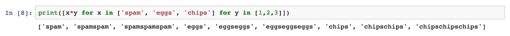

Lab 7. Becoming Pythonic
====================

Overview

By the end of this lab, you will be able to, write succinct,
readable expressions for creating lists; use Python comprehensions with
lists, dictionaries, and sets; use `collections.defaultdict`
to avoid exceptions when using dictionaries; write iterators to enable
Pythonic access to your own data types; explain how generator functions
are related to iterators, and write them in order to defer complex
calculations; use the `itertools` module to succinctly express
complex sequences of data and use the `re` module to work with
regular expressions in Python.


Exercise 99: Introducing List Comprehensions
--------------------------------------------

In this exercise, you will be writing a program that creates a list of
the cubes of whole numbers from 1 to 5. This example is trivial because
we\'re focusing more on how you can build a list than on the specific
operations that are done to each member of the list.

Nonetheless, you may need to do this sort of thing in the real world.
For instance, if you were to write a program to teach students about
functions by graphing those functions. That application might require a
list of `x` coordinates and generated a list of `y`
coordinates so that it could plot a graph of the function. First, you
will explore what this program looks like using the Python features you
have already seen:

1.  Open a Jupyter notebook and type in the following code:


    ```
    cubes = []
    for x in [1,2,3,4,5]:
            cubes.append(x**3)
    print(cubes)
    ```

    You should get the following output:

    


    Understanding this code involves keeping track of the state of the
    cube\'s variable, which starts as an empty list, and of the
    `x` variable, which is used as a cursor to keep track of
    the program\'s position in the list. This is all irrelevant to the
    task at hand, which is to list the cubes of each of these numbers.
    It will be better -- more Pythonic, even -- to remove all the
    irrelevant details. Luckily, list comprehensions allow us to do
    that.

2.  Now write the following code, which replaces the previous loop with
    a list comprehension:


    ```
    cubes = [x**3 for x in [1,2,3,4,5]]
    print(cubes)
    ```

    You should get the following output:

    


    This says, \"For each member in the `[1,2,3,4,5]` list,
    call it `x`, calculate the `x**3` expression,
    and put that in the list cubes.\" The list used can be any list-like
    object; for example, a range.

3.  Now you can make this example even simpler by writing the following:


    ```
    cubes = [x**3 for x in range(1,6)]
    print(cubes)
    ```

    You should get the following output:

    


    Caption: The output with the optimized style of writing code

    Now the code is as short and succinct as it can be. Rather than
    telling you the recipe that the computer follows to build a list of
    the cubes of the numbers 1, 2, 3, 4, and 5, it tells you that it
    calculates the cube of `x` for every `x`
    starting from 1 and smaller than 6. This, then, is the essence of
    Pythonic coding: reducing the gap between what you say and what you
    mean when you tell the computer what it should do.

    A list comprehension can also filter its inputs when building a
    list. To do this, you add an `if` expression to the end of
    the comprehension, where the expression can be any test of an input
    value that returns `True` or `False`. This is
    useful when you want to transform some of the values in a list while
    ignoring others. As an example, you could build a photo gallery of
    social media posts by making a list of thumbnail images from photos
    found in each post, but only when the posts are pictures, not text
    status updates.

4.  You want to get Python to shout the names of the Monty Python cast,
    but only those whose name begins with `"T"`. Enter the
    following Python code into a notebook:

    ```
    names = ["Graham Chapman", "John Cleese", "Terry Gilliam", "Eric Idle", "Terry Jones"]
    ```

5.  Those are the names you are going to use. Enter this list
    comprehension to filter only those that start with `"T"`
    and operate on them:


    ```
    print([name.upper() for name in names if name.startswith("T")
    ```

    You should get the following output:


Caption: The output with the optimized style of writing code

By completing this exercise, we have created a filter list using list
comprehension.


Exercise 100: Using Multiple Input Lists
----------------------------------------

All the examples you have seen so far build one list out of another by
performing an expression on each member of the list. You can define a
comprehension over multiple lists, by defining a different element name
for each of the lists.

Note

Monty Python is the name of an Anglo-American comedy group known for
their TV show \"Monty Python\'s Flying Circus\" (BBC, 1969), as well as
films such as \"Monty Python and the Holy Grail\" (1975), stage shows,
and albums. The group has achieved international popularity, especially
among the computer science community. The Python language was named
after the group. The term spam, now used for unsolicited email and other
unwanted digital communications, also comes from a Monty Python sketch
in which a café humorously insists on serving tinned meat (or spam) with
everything. Other jokes, scenarios, and names taken from the group are
often found in examples and even official Python documentation. So, if
you ever encounter strange names or odd situations when going through
tutorials, now you know why.

To show how this works, in this exercise, you will be multiplying the
elements of two lists together. The Spam Café in *Monty Python\'s Flying
Circus (refer to the preceding note)* famously served a narrow range of
foodstuffs mostly centered around a processed meat product. You will use
ingredients from its menu to explore multiple-list comprehension:

1.  Enter this code into a Jupyter notebook:


    ```
    print([x*y for x in ['spam', 'eggs', 'chips'] for y in [1,2,3]])
    ```

    You should get the following output:

    



    Caption: The output printing the elements of two lists together

    Inspecting the result shows that the collections are iterated in a
    nested fashion, with the rightmost collection on the inside of the
    nest and the leftmost on the outside. Here, if `x` is set
    to `spam`, then `x*y` is calculated with
    `y` being equal to each of the values of `1`,
    `2`, and then `3` before `x` is set to
    `eggs`, and so on.

2.  Reverse the order of the lists:


    ```
    print([x*y for x in [1,2,3] for y in ['spam', 'eggs', 'chips']])
    ```

    You should get the following output:


Caption: The output with the reverse order of the list

Swapping the order of the lists changes the order of the results in the
comprehension. Now, `x` is initially set to `1`,
then `y` to each of `spam`, `eggs`, and
`chips`, before `x` is set to `2`, and so
on. While the result of anyone multiplication does not depend on its
order (for instance, the results of \'`spam`\'\*2 and
2\*`'spam'` are the same, namely, `spamspam`), the
fact that the lists are iterated in a different order means that the
same results are computed in a different sequence.

For instance, the same list could be iterated multiple times in a list
comprehension --- the lists for `x` and `y` do not
have to be different:


``` {.language-markup}
numbers = [1,2,3]
print([x**y for x in numbers for y in numbers])
```

You should get the following output:


Caption: The output iterating lists multiple times

In the following activity, we will be creating fixtures for a chess
tournament among four players. We will be using list comprehension and
filters to find the best fixture.


Activity 18: Building a Chess Tournament
----------------------------------------

In this activity, you will use a list comprehension to create the
fixtures for a chess tournament. Fixtures are strings of the form
\"player 1 versus player 2.\" Because there is a slight advantage to
playing as white, you also want to generate the \"player 2 versus player
1\" fixture so that the tournament is fair. But you do not want people
playing against themselves, so you should also filter out fixtures such
as \"player 1 versus player 1.\"

You need to complete this activity with the following steps:

1.  Open a Jupyter notebook.

2.  Define the list of player names: `Magnus Carlsen`,
    `Fabiano Caruana`, `Yifan Hou`, and
    `Wenjun Ju`.

3.  Create a list comprehension that uses this list of names twice to
    create tournament fixtures in the correct format.

4.  Add a filter to the comprehension so that no player is pitted
    against themselves.

5.  Print the list of tournament fixtures.

    You should get the following output:


Set and Dictionary Comprehensions
=================================


List comprehensions are handy ways in which to concisely build sequences
of values in Python. Other forms of comprehensions are also available,
which you can use to build other collection types. A set is an unordered
collection: you can see what elements are in a set, but you cannot index
into a set nor insert an object at a particular location in the set
because the elements are not ordered. An element can only be present in
a set once, whereas it could appear in a list multiple times.

Sets are frequently useful in situations where you want to quickly test
whether an object is in a collection but do not need to track the order
of the objects in the collection. For example, a web service might keep
track of all of the active session tokens in a set, so that when it
receives a request, it can test whether the session token corresponds to
an active session.

A dictionary is a collection of pairs of objects, where one object in
the pair is called the key, and the other is called the value. In this
case, you associate a value with a particular key, and then you can ask
the dictionary for the value associated with that key. Each key may only
be present in a dictionary once, but multiple keys may be associated
with the same value. While the name \"dictionary\" suggests a connection
between terms and their definitions, dictionaries are commonly used as
indices (and, therefore, a dictionary comprehension is often used to
build an index). Going back to your web service example, different users
of the service could have different permissions, thus limiting the
actions that they can perform. The web service could construct a
dictionary in which the keys are session tokens, and the values
represent user permissions. This is so that it can quickly tell whether
a request associated with a given session is permissible.

The syntax for both set and dictionary comprehensions looks very similar
to list comprehension, with the square brackets (`[]`) simply
replaced by curly braces (`{}`). The difference between the
two is how the elements are described. For a set, you need to indicate a
single element, for example, `{ x for x in … }`. For a
dictionary, you need to indicate a pair containing the key and the
value, for example, `{ key:value for key in… }`.


Exercise 101: Using Set Comprehensions
--------------------------------------

The difference between a list and a set is that the elements in a list
have an order, and those in a set do not. This means that a set cannot
contain duplicate entries: an object is either in a set or not.

In this exercise, you will be changing a set comprehension into a set:

1.  Enter the following comprehension code into a notebook to create a
    list:


    ```
    print([a + b for a in [0,1,2,3] for b in [4,3,2,1]])
    ```

    You should get the following output:

    


    Caption: The result of the set

2.  Now change the result into a set.

    Change the outer square brackets in the comprehension to curly
    braces:


    ```
    print({a+b for a in [0,1,2,3] for b in [4,3,2,1]})
    ```

    You should get the following output:


Caption: A set without duplicate entries

Notice that the set created in *step 2* is much shorter than the list
created in *step 1*. The reason for this is that the set does not
contain duplicate entries -- try counting how many times the number
`4` appears in each collection. It\'s in the list four times
(because 0 + 4 = 4, 1 + 3 = 4, 2 + 2 = 4, and 3 + 1 = 4), but sets
don\'t retain duplicates, so there\'s only one instance of the number
`4` in the set. If you just removed the duplicates from the
list produced in *step 1*, you\'d have a list of \[4, 3, 2, 1, 5, 6,
7\]. Sets don\'t preserve the order of their elements either, so the
numbers appear in a different order in the set created in *step 2*. The
fact that the numbers in the set appear in numerical order is due to the
implementation of the `set` type in Python.


Exercise 102: Using Dictionary Comprehensions
---------------------------------------------

Curly-brace comprehension can also be used to create a dictionary. The
expression on the left-hand side of the `for` keyword in the
comprehension should contain a comprehension. You write the expression
that will generate the dictionary keys to the left of the colon and the
expression that will generate the values to the right. Note that a key
can only appear once in a dictionary.

In this exercise, you will create a lookup dictionary of the lengths of
the names in a list and print the length of each name:

1.  Enter this list of names of Monty Python stars in a notebook:

    ```
    names = ["Eric", "Graham", "Terry", "John", "Terry"]
    ```

2.  Use a comprehension to create a lookup dictionary of the lengths of
    the names:


    ```
    print({k:len(k) for k in ["Eric", "Graham", "Terry", "John", "Terry"]})
    ```

    You should get the following output:


Notice that the entry for `Terry` only appears once, because
dictionaries cannot contain duplicate keys. You have created an index of
the length of each name, keyed by name. An index like this could be
useful in a game, where it could work out how to layout the score table
for each player without repeatedly having to recalculate the length of
each player\'s name.


Activity 19: Building a Scorecard Using Dictionary Comprehensions and Multiple Lists
------------------------------------------------------------------------------------

You are the backend developer for a renowned college. The management has
asked you to build a demo scorecard for their students based on the
marks they have achieved in their exams.

Your goal in this activity is to use dictionary comprehension and lists
in Python to build a demo scorecard for four students in the college.

Let\'s do this with the following steps:

1.  Create two separate lists: one for the names of the students and the
    other for their scores.

2.  Create a dictionary comprehension that iterates over the numbers in
    a range of the same length as the lists of names and scores. The
    comprehension should create a dictionary where, for the
    `i`th number in the range, the key is the ith name, and
    the value is the ith score.

3.  Print out the resulting dictionary to make sure it\'s correct.

    You should get the following output:


Default Dictionary
==================


The built-in dictionary type considers it to be an error when you try to
access the value for a key that doesn\'t exist. It will raise a
`KeyError`, which you have to handle or your program crashes.
Often, that\'s a good idea. If the programmer doesn\'t get the key
correct, it could indicate a typo or a misunderstanding of how the
dictionary is used.

It\'s often a good idea, but not always. Sometimes, it\'s reasonable
that a programmer doesn\'t know what the dictionary contains; whether
it\'s created from a file supplied by the user or the content of a
network request, for example. In situations like this, any of the keys
the programmer expects could be missing, but handling
`KeyError` instances everywhere will be tedious, repetitive,
and make the intent of the code harder to see.

For these situations, Python provides the
`collections.defaultdict` type. It works like a regular
dictionary, except that you can give it a function that creates a
default value to use when a key is missing. Rather than raise an error,
it calls that function and returns the result.


Exercise 103: Adopting a Default Dict
-------------------------------------

In this exercise, you will be using a regular dictionary that raises a
`KeyError` when you try to access a missing key:

1.  Create a dictionary for `john`:


    ```
    john = { 'first_name': 'John', 'surname': 'Cleese' }
    ```

    Attempt to use a `middle_name` key that was not defined in
    the dictionary:


    ```
    john['middle_name']
    ```

    You should get the following output:

    


    Caption: The output showing KeyError: \'middle\_name\'

2.  Now, import the `defaultdict` from `collections`
    and wrap the dictionary in a `defaultdict`:


    ```
    from collections import defaultdict
    safe_john = defaultdict(str, john)
    ```

    The first argument is the type constructor for a string, so missing
    keys will appear to have the empty string as their value.

3.  Attempt to use a key that was not defined via the wrapped
    dictionary:


    ```
    print(safe_john['middle_name'])
    ```

    You should get the following output:

    


    No exception is triggered at this stage; instead, an empty string is
    returned. The first argument to the constructor of
    `defaultdict`, called `default_factory`, can be
    any callable (that is, function-like) object. You can use this to
    compute a value based on the key or return a default value that is
    relevant to your domain.

4.  Create a `defaultdict` that uses a lambda as its
    `default_factory`:


    ```
    from collections import defaultdict
    courses = defaultdict(lambda: 'No!')
    courses['Java'] = 'This is Java'
    ```

    This dictionary will return the value from the `lambda` on
    any unknown key.

5.  Access the value at an unknown key in this new dictionary:


    ```
    print(courses['Python'])
    'No!'
    ```

    You should get the following output:

    


    Caption: The returned value from the lambda on an unknown key

6.  Access the value at a known key in this new dictionary:


    ```
    print(courses['Java'])
    ```

    The output is as follows:


Caption: The print value for the Java list

The benefit of the default dictionary is that in situations where you
know it is likely that expected keys will be missing from a dictionary,
you can work with default values and not have to sprinkle your code with
exception-handling blocks. This is another example of Pythonicity: if
what you mean is \"use the value for the \"foo\" key, but if that
doesn\'t exist, then use \"bar\" as the value,\" then you should write
that, rather than \"use the value for the \"foo\" key, but if you get an
exception and the exception is `KeyError`, then use \"bar\" as
the value.\"

Default dicts are great for working with untrusted input, such as a file
chosen by the user or an object received over the network. A network
service shouldn\'t expect any input it gets from a client to be well
formatted. If it treats the data, it receives in a request as a JSON
object. It should be ready for the data to not be in JSON format. If the
data is really JSON, the program should not expect all of the keys
defined by the API to have been supplied by the client. The default dict
gives you a really concise way to work with such under-specified data.


Iterators
=========


The Pythonic secret that enables comprehensions to find all of the
entries in a list, range, or other collection is an iterator. Supporting
iterators in your own classes opens them up for use in comprehensions,
`for…in` loops, and anywhere that Python works with
collections. Your collection must implement a method called
`__iter__()`, which returns the iterator.

The iterator itself is also a Python object with a simple contract. It
must provide a single method,` __next__()`. Each time
`__next__()` is called, the iterator returns the next value in
the collection. When the iterator reaches the end of the collection,
`__next__()` raises `StopIteration` to signal that
the iteration should terminate.

If you\'ve used exceptions in other programming languages, you may be
surprised by this use of an exception to signal a fairly commonplace
situation. After all, plenty of loops reach an end, so it\'s not exactly
an exceptional circumstance. Python is not so dogmatic about exceptions,
favoring simplicity and expressiveness over universal rules-lawyering.

Once you\'ve learned the techniques to build iterators, the applications
are limitless. Your own collections or collection-like classes can
supply iterators so that programmers can work with them using Pythonic
collection techniques such as comprehensions. For example, an
application that stores its data model in a database can use an iterator
to retrieve each row that matches a query as a separate object in a loop
or comprehension. A programmer can say, \"For each row in the database,
do this to the row,\" and treat it like a list of rows, when your data
model object is secretly running a database query each time the
iterator\'s `__next__()` method is called.


Exercise 104: The Simplest Iterator
-----------------------------------

The easiest way to provide an iterator for your class is to use one from
another object. If you are designing a class that controls access to its
own collection, then it might be a good idea to let programmers iterate
over your object using the collection\'s iterator. In this case, just
have `__iter__()` return the appropriate iterator.

In this exercise, you will be coding an `Interrogator` who
asks awkward questions to people on a quest. It takes a list of
questions in its constructor. You will write this program that prints
these questions as follows:

1.  Enter the constructor into a notebook:


    ```
    class Interrogator:
      def __init__(self, questions):
        self.questions = questions
    ```

    Using an `Interrogator` in a loop probably means asking
    each of its questions in sequence. The easiest iterator that can
    achieve this is the iterator for the collection of questions.
    Therefore to implement the `__iter__()` method to return
    that object.

2.  Add the `__iter__()` method:


    ```
      def __iter__(self):
        return self.questions.__iter__()
    ```

    Now you can create a list of questions, give them to an
    `Interrogator`, and use that object in a loop.

3.  Create a list of questions:

    ```
    questions = ["What is your name?", "What is your quest?", "What is the average airspeed velocity of an unladen swallow?"]
    ```

4.  Create an `Interrogator`:

    ```
    awkward_person = Interrogator(questions)
    ```

5.  Now use the `Interrogator` in a `for` loop:


    ```
    for question in awkward_person:
      print(question)
    ```

    You should get the following output:


On the face of it, you\'ve done nothing more than adding a level of
interaction between the `Interrogator` class and the
collection of questions. From an implementation perspective, that\'s
exactly right. However, from a design perspective, what you\'ve done is
much more powerful. You\'ve designed an `Interrogator` class
that programmers can ask to iterate over its questions, without having
to tell the programmer anything about how the `Interrogator`
stores its questions. While it\'s just forwarding a method call to a
list object today, you could change that tomorrow to use a SQLite3
database or a web service call, and programmers using the
`Interrogator` class will not need to change anything.

For a more complicated case, you need to write your own iterator. The
iterator is required to implement a `__next__()` method, which
returns the next element in the collection or raises
`StopIteration` when it gets to the end.


Exercise 105: A Custom Iterator
-------------------------------

In this exercise, you\'ll implement a classical-era algorithm called the
Sieve of Eratosthenes. To find prime numbers between 2 and an upper
bound value, `n`, first, list all of the numbers in that
range. Now, 2 is a prime, so return that. Then, remove 2 from the list,
and all multiples of 2, and return the new lowest number (which will be
3). Continue until there are no more numbers left in the collection.
Every number that gets returned using this method is a successively
higher prime. It works because any number you find in the collection to
return did not get removed at an earlier step, so has no lower prime
factors other than itself.

First, build the architecture of the class. Its constructor needs to
take the upper bound value and generate the list of possible primes. The
object can be its own iterator, so its `__iter__()` method
will return itself:

1.  Define the `PrimesBelow` class and its initializer:

    ```
    class PrimesBelow:
        def __init__(self, bound):
            self.candidate_numbers = list(range(2,bound))
    ```

2.  Implement the `__iter__()` method to return itself:


    ```
        def __iter__(self):
             return self
    ```

    The main body of the algorithm is in the `__next__()`
    method. With each iteration, it finds the next lowest prime. If
    there isn\'t one, it raises `StopIteration`. If there is
    one, it sieves that prime number and its multiples from the
    collection and then returns the prime number.

3.  Define the `__next__()` method and the exit condition. If
    there are no remaining numbers in the collection, then the iteration
    can stop:

    ```
        def __next__(self):
            if len(self.candidate_numbers) == 0:
                raise StopIteration
    ```

4.  Complete the implementation of `__next__()` by selecting
    the lowest number in the collection as the value for
    `next_prime` and removing any multiples of that number
    before returning the new prime:

    ```
            next_prime = self.candidate_numbers[0]
            self.candidate_numbers = [x for x in self.candidate_numbers if x % next_prime != 0]
            return next_prime
            return next_prime
    ```

5.  Use an instance of this class to find all the prime numbers below
    100:


    ```
    primes_to_a_hundred = [prime for prime in PrimesBelow(100)]
    print(primes_to_a_hundred)
    ```

    You should get the following output:


Caption: The output indicating all prime numbers below 100

This exercise demonstrates that by implementing an iterative algorithm
as a Python iterator, you can treat it like a collection. In fact, the
program does not actually build the collection of all of the prime
numbers: you did that yourself in *step 5* by using the
`PrimesBelow` class, but otherwise, `PrimesBelow`
was generating one number at a time, whenever you called the
`__next()__` method. This is a great way to hide the
implementation details of an algorithm from a programmer. Whether you
actually give them a collection of objects to iterate over or an
iterator that computes each value as it is requested, programmers can
use the results in exactly the same way.


Exercise 106: Controlling the Iteration
---------------------------------------

You do not have to use an iterator in a loop or comprehension. You can
use the `iter()` function to get its argument\'s iterator
object, and then pass that to the `next()` function to return
successive values from the iterator. These functions call through to the
`__iter__()` and `__next__()` methods, respectively.
You can use them to add custom behavior to an iteration or to gain more
control over the iteration.

In this exercise, you will print the prime numbers below 5. An error
should be raised when the object runs out of prime numbers. To do this,
you will use the `PrimesBelow` class created in the previous
exercise:

1.  Get the iterator for a `PrimesBelow` instance.
    `PrimesBelow` is the class you created in *Exercise 105, A
    Custom Iterator*, so if you still have the notebook you created for
    that exercise, you can enter this code in a cell at the end of that
    notebook:

    ```
    primes_under_five = iter(PrimesBelow(5))
    ```

2.  Repeatedly use `next()` with this object to generate
    successive prime numbers:


    ```
    next(primes_under_five)
    ```

    You should get the following output:


    ```
    2
    ```

    Now, run this code once again.


    ```
    next(primes_under_five)
    ```

    You should get the following output:


    ```
    3
    ```

3.  When the object runs out of prime numbers, the subsequent use of
    `next()` raises the `StopIteration` error:


    ```
    next(primes_under_five)
    ```

    You should get the following output:


Exercise 107: Using Infinite Sequences and takewhile
----------------------------------------------------

An alternative algorithm to the Sieve of Eratosthenes for generating
prime numbers is to test each number in sequence -- to see whether it
has any divisors other than itself. This algorithm uses a lot more time
than the Sieve in return for a lot less space.

In this exercise, you will be implementing a better algorithm that uses
less space than the Sieve for generating prime numbers:

1.  Enter this iterator algorithm into a notebook:

    Exercise107.ipynb


    ```
    class Primes:
        def __init__(self):
            self.current = 2
        def __iter__(self):
            return self
        def __next__(self):
            while True:
                current = self.current
                square_root = int(current ** 0.5)
                is_prime = True
    ```


    Note

    The class you just entered is an iterator, but the
    `__next__()` method never raises a
    `StopIteration` error. That means it never exits. Even
    though you know that each prime number it returns is bigger than the
    previous one, a comprehension doesn\'t know that so you can\'t
    simply filter out large values.

2.  Enter the following code to get a list of primes that are lower than
    100:


    ```
    [p for p in Primes() if p < 100]
    ```

    Because the iterator never raises `StopIteration`, this
    program will never finish. You\'ll have to force it to exit.

3.  Click on the **Stop** button in the Jupyter notebook.

    You should get the following output:

    


    Caption: Iterator forced exit

    To work with this iterator, `itertools` provides the
    `takewhile()` function, which wraps the iterator in
    another iterator. You also supply `takewhile()` with a
    Boolean function, and its iteration will take values from the
    supplied iterator until the function returns `False`, at
    which time it raises `StopIteration` and stops. This makes
    it possible to find the prime numbers below 100 from the infinite
    sequence entered previously.

4.  Use `takewhile()` to turn the infinite sequence into a
    finite one:


    ```
    import itertools
    print([p for p in itertools.takewhile(lambda x: x<100, Primes())])
    ```

    You should get the following output:


Surprisingly, it\'s also useful to be able to turn a finite sequence
into an infinite one.


Exercise 108: Turning a Finite Sequence into an Infinite One, and Back Again
----------------------------------------------------------------------------

In this exercise, consider a turn-based game, such as chess. The person
playing white makes the first move. Then, the person playing black takes
their turn. Then white. Then black. Then white, black, white, and so on
until the game ends. If you had an infinite list of white, black, white,
black, white, and so on, then you could always look at the next element
to decide whose turn it is:

1.  Enter the list of players into a notebook:

    ```
    import itertools
    players = ['White', 'Black']
    ```

2.  Use the `itertools` function `cycle` to generate
    an infinite sequence of turns:


    ```
    turns = itertools.cycle(players)
    ```

    To demonstrate that this has the expected behavior, you\'ll want to
    turn it back into a finite sequence so that you can view the first
    few members of the `turns` iterator. You can use
    `takewhile()` for that, and, here, combine it with the
    `count()` function from `itertools`, which
    produces an infinite sequence of numbers.

3.  List the players who take the first 10 turns in a chess game:


    ```
    countdown = itertools.count(10, -1)
    print([turn for turn in itertools.takewhile(lambda x:next(countdown)>0, turns)])
    ```

    You should get the following output:


Exercise 109: Generating a Sieve
--------------------------------

In this exercise, you will be rewriting the Sieve of Eratosthenes as a
generator function and comparing it with the result of the iterator
version:

1.  Rewrite the Sieve of Eratosthenes as a generator function that
    yields its values:

    ```
    def primes_below(bound):
        candidates = list(range(2,bound))
        while(len(candidates) > 0):
            yield candidates[0]
            candidates = [c for c in candidates if c % candidates[0] != 0]
    ```

2.  Confirm that the result is the same as the iterator version:


    ```
    [prime for prime in primes_below(100)]
    ```

    You should get the following output:


Caption: The output indicating all prime numbers below 100

That\'s really all there is to generators --- they\'re just a different
way of expressing an iterator. They do, however, communicate a different
design intention; namely, that the flow of control is going to pass back
and forth between the generator and its caller.

The answer to *Why does Python provide both the iterator and the
generator?* is found at the end of *Exercise 109*, *Generating a Sieve*.
They do the same thing, but they expose different design intentions. The
PEP in which generators were introduced
(<https://www.python.org/dev/peps/pep-0255/>) contains more, in the
\"motivations\" and \"Q&A\" sections, for students who would like to dig
deeper.


Activity 20: Using Random Numbers to Find the Value of Pi
---------------------------------------------------------

The Monte Carlo method is a technique that is used for approximating a
numerical solution using random numbers. Named after the famous casino,
chance is at the core of Monte Carlo methods. They use random sampling
to obtain information about a function that will be difficult to
calculate deterministically. Monte Carlo methods are frequently used in
scientific computation to explore probability distributions, and in
other fields including quantum physics and computational biology.
They\'re also used in economics to explore the behavior of financial
instruments under different market conditions. There are many
applications for the Monte Carlo principle.

In this activity, you\'ll use a Monte Carlo method to find an
approximate value for π. Here\'s how it works: two random numbers,
`(x,y)`, somewhere between `(0,0)` and
`(1,1)`, represent a random point in a square positioned at
`(0,0)` with sides of length `1`:


Caption: A random point in a square having its side as unit 1

Using Pythagoras\' Theorem, if the value of
`$$\sqrt{x^2 + y^2}$$` is less than `1`, then the
point is also in the top-right corner of a circle centered at
`(0,0)` with a radius of -`1`:


Generate lots of points, count how many are within the circle segment,
and divide the number of points within the circle by the total number of
points generated. This gives you an approximation of the area of the
circle segment, which should be π/4. Multiply by 4, and you have an
approximate value of π. Data scientists often use this technique to find
the area under more complex curves that represent probability
distributions.

Write a generator to yield successive estimates of π. The steps are as
follows:

1.  Define your generator function.

2.  Set the total number of points, and the number within the circle
    segment, to 0.

3.  Do the following substeps 10,000 times:

    Generate two numbers between 0 and 1, using Python\'s
    `random.random()` function.

    Add 1 to the total number of points.

    Use `math.sqrt()` to find out how far the point
    represented by the numbers is from (0,0).

    If the distance is less than 1; add 1 to the number of points within
    the circle.

    Calculate your estimate for π: 4 \* (points within the circle) /
    (total points generated).

    If you have generated a multiple of 1,000 points, yield the
    approximate value for π. If you have generated 10,000 points, return
    the value.

4.  Inspect the successive estimates of π and check how close they are
    to the true value (`math.pi`).

    Note that because this activity uses random numbers, you may not get
    the exact results shown here:


Regular Expressions
===================


Regular expressions (or regexes) are a domain-specific programming
language, defining a grammar for expressing efficient and flexible
string comparisons. Introduced in 1951 by Stephen Cole Kleene, regular
expressions have become a popular tool for searching and manipulating
text. As an example, if you\'re writing a text editor and you want to
highlight all web links in a document and make them clickable, you might
search for strings that start with HTTP or HTTPS, then those that
contain `://`, and then those that contain some collection of
printable characters, until you stop finding printable characters (such
as a space, newline, or the end of the text), and highlight everything
up to the end. With standard Python syntax, this will be possible, but
you will end up with a very complex loop that will be difficult to get
right. Using regexes, you match against `https?://\S+`.


Exercise 110: Matching Text with Regular Expressions
----------------------------------------------------

In this exercise, you\'ll use the Python `re` module to find
instances of repeated letters in a string.

The regex you will use is `(\w)\\1+"`.`"(\w)`
searches for a single character from a word (that is, any letter or the
underscore character, `_`) and stores that in a numbered
sub-expression, `\1`. Then, `\\1+` uses a quantifier
to find one or more occurrences of the same character. The steps for
using this regex are as follows:

1.  Import the `re` module:

    ```
    import re
    ```

2.  Define the string that you will search for, and the pattern by which
    to search:

    ```
    title = "And now for something completely different"
    pattern = "(\w)\\1+"
    ```

3.  Search for the pattern and print the result:


    ```
    print(re.search(pattern, title))
    ```

    You should get the following output:


Caption: Searching for a string using the re module

The `re.search()` function finds matches anywhere in the
string: if it doesn\'t find any matches, it will return
`None`. If you were only interested in whether the beginning
of the string matched the pattern, you could use `re.match()`.
Similarly, modifying the search pattern to start with the
beginning-of-line marker (`^`) achieves the same aim as
`re.search("^(\w)\\1+", title)`.


Exercise 111: Using Regular Expressions to Replace Text
-------------------------------------------------------

In this exercise, you\'ll use a regular expression to replace
occurrences of a pattern in a string with a different pattern. The steps
are as follows:

1.  Define the text to search:

    ```
    import re
    description = "The Norwegian Blue is a wonderful parrot. This parrot is notable for its exquisite plumage."
    ```

2.  Define the pattern to search for, and its replacement:

    ```
    pattern = "(parrot)"
    replacement = "ex-\\1"
    ```

3.  Substitute the replacement for the search pattern, using the
    `re.sub()` function:


    ```
    print(re.sub(pattern, replacement, description))
    ```

    You should get the following output:


The replacement refers to the capture group, `"\1"`, which is
the first expression in the search pattern to be surrounded by
parentheses. In this case, the capture group is the whole word
`parrot`. This lets you refer to the word `parrot`
in the replacement without having to type it out again.


Activity 21: Regular Expressions
--------------------------------

At your online retail company, your manager has had an idea for a
promotion. There is a whole load of old \"The X-Files\" DVDs in the
warehouse, and she has decided to give one away for free to any customer
whose name contains the letter *x*.

In this activity, you will be using Python\'s `re` module to
find winning customers. The *x* could be capitalized if it\'s their
initial, or lower case if it\'s in the middle of their name, so use the
regular expression `[Xx]` to search for both cases:

1.  Create a list of customer names. The customers are
    `Xander Harris`, `Jennifer Smith`,
    `Timothy Jones`, `Amy Alexandrescu`,
    `Peter Price`, and `Weifung Xu`.

2.  Create a list comprehension using the list of names. Use the
    comprehension to filter only names where a search for the
    `[Xx]` regex is successful.

3.  Print the list of matching names. The result should look like this:


    ```
    ['Xander Harris', 'Amy Alexandrescu', 'Weifung Xu']
    ```

    You should get the following output:


Summary
=======


In this lab, you\'ve learned how even though there is often more
than one way to do something in Python, there is often a \"Pythonic\"
way. The Pythonic way is succinct and easy to understand, leaving out
boilerplate code and extraneous information to focus on the task at
hand. Comprehensions are a Pythonic tool for manipulating collections,
including lists, sets, and dictionaries. Comprehensions are powered by
iterators, which can be written as classes or as generator functions
that yield the iterated values. The Python library includes useful
functions for working with iterators, including infinite sequences
expressed as iterators.

In the next lab, you\'ll move past the details of the Python
language and into how to work as a professional Python programmer.
You\'ll see how to debug your Python code, write unit tests, and
document, package, and share your Python code with other coders.
