Lab 8. Software Development
=======================

Overview

By the end of this lab, you will be able to, troubleshoot issues in
Python applications; explain why testing in software development is
important; write test scenarios in Python to validate code; create a
Python package that can be published to PyPI; write and publish
documentation on the web and create a Git repository and manage your
source code versions.


Debugging
=========


The `pdb` module and its command line interface which is a
`cli` tool allows you to navigate through the code as it runs
and ask questions about the state of the program, its variables, and the
flow of execution. It is similar to other tools, such as
`gdb`, but it is at a higher level and is designed for Python.

There are two main ways to start `pdb`. You can just run the
tool and feed it with a file or use the `breakpoint` command.

As an example, take a look at the following file:


``` {.language-markup}
# This is a comment
this = "is the first line to execute"
def secret_sauce(number):
    if number <= 10:
        return number + 10
    else:
        return number - 10
def magic_operation(x, y):
    res = x + y
    res *= y
    res /= x
    res = secret_sauce(res)
    return res
print(magic_operation(2, 10))
```

When you begin executing the script with `pdb`, it works as
follows:


``` {.language-markup}
python3.8 -m pdb magic_operation.py
> [...]Lesson08/1.debugging/magic_operation.py(3)<module>()
-> this = "is the first line to execute"
(Pdb)
```

It will stop on the first line of the Python code to execute and give us
a prompt to interact with `pdb`.

The first line shows us which current file you are in at the moment,
while the final line shows us the `pdb` prompt
(`pdb`), which tells us which debugger you are running and
that it is waiting for input from the user.

Another way to start `pdb` is to change the source code to do
this. At any point in the code, we can write
`"import pdb;pdb.set_trace()"` for earlier versions of Python
to tell the Python interpreter that you want to start a debugging
session at that point. If you are using Python 3.7 or a later version,
you can use `breakpoint()`.

If you execute the `magic_operation_with_breakpoint.py` file
attached in the GitHub repository, which has `breakpoint()` in
one of its lines, you will see that the debugger starts for you where
you requested it.


When you are running things in an IDE or code in a large application you
could achieve the same effect by using the operations that we will
demonstrate later, but just dropping that line in the file is by far the
simplest and fastest way:


``` {.language-markup}
$ python3.8 magic_operation_with_breakpoint.py
> [...]/Lesson08/1.debugging/magic_operation_with_breakpoint.py(7)secret_sauce()
-> if number <= 10:
(Pdb)
```

At this point, you can get a list of all the commands by running
`help`, or you can get more information about a specific
command by running the `help` command. 

Many functions have shortcuts; for example, you can use `b`
instead of `break`, `c` or `cont` instead
of `continue`, `l` instead of a `list`,
`ll` for `longlist`, and so on.


Exercise 112: Debugging a Salary Calculator
-------------------------------------------

In this exercise, you will use the skills you learned to use
`pdb` to debug an application that is not working as expected.

This is a salary calculator. Our company is using this to calculate the
salary increase that will be given to our employees year after year, and
a manager has reported that she is getting a 20% raise when the rulecourse
seems to suggest that she should be getting a 30% raise.

You are just told that the manager\'s name is `Rose`, and you
will find that the code for the salary raise calculation is the
following:

Exercise112.py


``` {.language-markup}
3 def _manager_adjust(salary, rise):
4     if rise < 0.10:
5         # We need to keep managers happy.
6         return 0.10
7
8     if salary >= 1_000_000:
9         # They are making enough already.
10         return rise - 0.10
11 
12 
13 def calculate_new_salary(salary, promised_pct, is_manager, is_good_year):
14     rise = promised_pct
15     # remove 10% if it was a bad year
16     if not is_good_year:
```


The following steps will help you complete this exercise:

1.  Understand the problem by asking the right questions.

    The first step is to fully understand the issue, evaluate whether
    there is an issue with the source code, and to get all the possible
    data. You need to ask the user who reported the error, and
    ourselves, common questions such as the following indent question
    list:

    What version of the software were they using?

    When did the error happen for the first time?

    Has it worked before?

    Is it an intermittent failure, or can the user consistently
    reproduce it?

    What was the input of the program when the issue manifested?

    What is the output and what would be the expected output?

    Do we have any logs or any other information to help us debug the
    issue?

    In this instance, you get to know that this happened with the last
    version of our script and the person who reported it could reproduce
    it. It seems to be happening only to `Rose`, but that
    might be related to the arguments she is providing.

    For instance, she reported that her current salary is \$1,000,000.
    She was told she would get a 30% raise, and even if she is aware
    that managers earning that much get a penalty of 10%, as the company
    had a good year and she was a high earner, she was expecting a 10%
    bonus, which should amount to 30%. But she saw that her new salary
    was \$1,200,000, rather than \$1,300,000.

    You can translate this into the following `arguments`:

    `salary`: 1,000,000.

    `promised_pct`: 0.30.

    `is_manager`: True

    `is_good_year`: True

    The expected output was 1,300,000, and the output she reported was
    1,200,000.

    We don\'t have any logs about the execution, as the code was not
    instrumented with this.

2.  Reproduce the issue by running the `calculate_new_salary`
    function and the known arguments.

    The next step in our debugging investigation is to confirm that you
    can reproduce the issue. If you are not able to reproduce it, then
    it means that some of the input or assumptions that either we or the
    user made were incorrect, and you should go back to step 1 for
    clarification.

    In this scenario, trying to reproduce the issue is easy---you need
    to run the function with the known arguments:


    ```
    rose_salary = calculate_new_salary(1_000_000, 0.30, True, True)
    print("Rose's salary will be:", rose_salary)
    ```

    The output will be as follows:


    ```
    1200000
    ```

    This effectively returns `1200000` rather than 1,300,000,
    and you know from the HR guidelines that she should be getting the
    latter. Indeed, something starts to look suspicious.

3.  Run the code with the other current inputs, such as 1,000,000 and
    2,000,000, to see the difference.

    In some situations, it is helpful to try with other inputs to see
    how the program behaves before even running the debugger. This can
    give you some extra information. You know that there are special
    rules for people that earn a million dollars or more, so what
    happens if you raise that number to, say, \$2,000,000?

    Consider the following:


    ```
    rose_salary = calculate_new_salary(2_000_000, 0.30, True, True)
    print("Rose's salary will be:", rose_salary)
    ```

    You see that, now, the output is 2,400,000. The raise was 20% rather
    than 30%. There is something wrong in the code.

    You can also try changing the percentage, so let\'s try that with a
    promised initial raise of 40%:


    ```
    rose_salary = calculate_new_salary(1_000_000, 0.40, True, True)
    print("Rose's salary will be:", rose_salary)
    ```

    The output will be as follows:


    ```
    Rose's salary will be: 1400000
    ```

    Interestingly, she would get a `40%` raise because there
    is no penalty applied.

    From just trying out different inputs, you have seen what is special
    about Rose\'s situation, it is her 30% increase. When you start to
    debug things in the following step, you will see that you should
    keep an eye on the code that interacts with the promised percentage,
    as the initial salary change did not make a difference.

4.  Start the debugger by firing up `pdb` and set up a
    breakpoint in your `calculate_new_salary` function:

    ```
    $ python3.8 -m pdb salary_calculator.py
    > /Lesson08/1.debugging/salary_calculator.py(1)<module>()
    -> """Adjusts the salary rise of an employ"""
    (Pdb) b calculate_new_salary
    Breakpoint 1 at /Lesson08/1.debugging/salary_calculator.py:13
    (Pdb)
    ```

5.  Now run `continue` or `c` to ask the interpreter
    to run until the function is executed:


    ```
    (Pdb) c
    ```

    The output will be as follows:


    ```
    > /Lesson08/1.debugging/salary_calculator.py(14)calculate_new_salary()
    -> rise = promised_pct
    (Pdb)
    ```

6.  Run the `where` command in order to get information about
    how you got to this point:


    ```
    (Pdb) where
    ```

    The output will be as follows:


    ```
      /usr/local/lib/python3.8/bdb.py(585)run()
    -> exec(cmd, globals, locals)
      <string>(1)<module>()
      /Lesson08/1.debugging/salary_calculator.py(34)<module>()
    -> rose_salary = calculate_new_salary(1_000_000, 0.30, True, True)
    > /Lesson08/1.debugging/salary_calculator.py(14)calculate_new_salary()
    -> rise = promised_pct
    (Pdb)
    ```

    See how `pdb` tells you that you are on line 14 of the
    `salary_calculator` file and this function was executed as
    it was called from line 34 with the arguments that are displayed on
    the screen.

    Note

    You can use `up` here if you want to go to the stack frame
    where the function was executed. This is the line of code with the
    state that the program was in when the function was called.

    When you can pinpoint the issue to a part of the program, you can go
    step by step, running the code and checking whether your
    expectations match what the result of running that line gives us.

    An important step here is to think about what you expect to happen
    before you run the line. This might seem to make it take longer to
    debug the program, but it will pay off, because if there is a result
    that appears to be correct, but it is not, it will be easier to
    detect whether you expected the result rather than just confirming
    whether it was right a posteriori. Let\'s do this in your program.

7.  Run the `l` command to confirm where we are in the program
    and `args` to print the arguments of the function:

    Note

    The output from the debugger and the input that we provide is
    mentioned next.


    ```
    (Pdb) l
    ```

    You should get the following output:

    
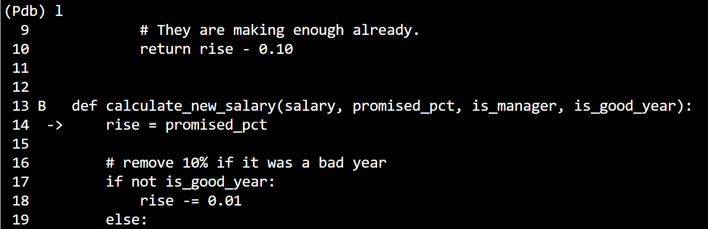


    Caption: Listing the pdb output

    To use `args` to print the arguments of the function:


    ```
    (Pdb) args
    ```

    You should get the following output:

    


    Caption: The args output (continued)

    You are effectively on the first line of the code, and the arguments
    are what you expected. We could also run `ll` to get the
    whole function printed.

8.  Advance the lines of code by using `n` to move one line at
    a time:


    ```
     (Pdb) n
    ```

    You should get the following output:


    ```
    > /Lesson08/1.debugging/salary_calculator.py(17)calculate_new_salary()
    -> if not is_good_year:
    (Pdb) n
    > /Lesson08/1.debugging/salary_calculator.py(23)calculate_new_salary()
    -> if is_manager:
    (Pdb) n
    > /Lesson08/1.debugging/salary_calculator.py(24)calculate_new_salary()
    -> rise = _manager_adjust(salary, rise)
    ```

    You next check on whether it was a good year. As the variable is
    `True`, it does not get into the branch and jumps to
    line 23. As Rose is a manager, this does get into that branch, where
    it will perform the manager adjustment.

9.  Print the value of the raise before and after the
    `_manager_adjust` function is called by running
    `p` `rise`.

    You can run `step` to get into the function, but the error
    is unlikely to be there, so you can print the current raise before
    and after executing the function. You know that, as she is earning a
    million dollars, her pay should be adjusted, and, therefore, the
    rise should be `0.2` after executing it:


    ```
    (Pdb) p rise
    0.3
    (Pdb) n
    > /Lesson08/1.debugging/salary_calculator.py(27)calculate_new_salary()
    -> if rise >= 0.20:
    (Pdb) p rise
    0.19999999999999998
    ```

    The adjusted raise is `0.199999999999999998` rather than
    `0.20`, so what is going on here? There is clearly an
    issue within the `_manager_adjust` function. You will have
    to restart the debugging and investigate it.

10. You can then continue to the second execution and print the lines
    and arguments at that point, by running \"c\", \"c\", \"ll\" and
    \"args\" as follows:


    ```
    (Pdb) b _manager_adjust
    Breakpoint 2 at /Lesson08/1.debugging/salary_calculator.py:3
    (Pdb) restart
    ```

    The output will be as follows:


    ```
    Restarting salary_calculator.py with arguments:
            salary_calculator.py
    > /Lesson08/1.debugging/salary_calculator.py(1)<module>()
    -> """Adjusts the salary rise of an employ"""
    (Pdb) c
    > /Lesson08/1.debugging/salary_calculator.py(14)calculate_new_salary()
    -> rise = promised_pct
    (Pdb) c
    > /Lesson08/1.debugging/salary_calculator.py(4)_manager_adjust()
    -> if rise < 0.10:
    (Pdb) ll
      3 B   def _manager_adjust(salary, rise):
      4  ->     if rise < 0.10:
      5             # We need to keep managers happy.
      6             return 0.10
      7
      8         if salary >= 1_000_000:
      9             # They are making enough already.
     10             return rise - 0.10
    (Pdb) args
    salary = 1000000
    rise = 0.3
    (Pdb)
    ```

    You see the input is what you expected (`0.3`), but you
    know the output is not. Rather than `0.2`, you are getting
    `0.19999999999999998`. Let\'s walk through this function
    code to understand what is happening. By running \"n\" three times
    until the end of the function, you can then use \"`rv`\"
    to see the returned value as follows:


    ```
    (Pdb) n
    > /Lesson08/1.debugging/salary_calculator.py(8)_manager_adjust()
    -> if salary >= 1_000_000:
    (Pdb) n
    > /Lesson08/1.debugging/salary_calculator.py(10)_manager_adjust()
    -> return rise - 0.10
    (Pdb) n
    --Return--
    > /Lesson08/1.debugging/salary_calculator.py(10)_manager_adjust()->0.19999999999999998
    -> return rise - 0.10
    (Pdb) rv
    0.19999999999999998
    ```

You found the error: when we are subtracting `0.10` from
`0.30`, the result is not `0.20` as you might have
expected. It is that weird number, `0.19999999999999998`, due
to the loose precision of float numbers. This is a well-known issue in
computer science. We should not rely on floats for equality comparison
if you need fraction numbers, we should use the decimal module instead,
as we have seen in previous labs.

In this exercise, you have learned how to identify errors when you
perform debugging. You can now start to think about how to fix these
errors and propose solutions to our colleagues.

Now, let\'s take a look at an activity to debug a Python code
application.


Activity 22: Debugging Sample Python Code for an Application
------------------------------------------------------------

Consider the following scenario: you have a program that creates a
picnic basket for you. The baskets are created in a function that
depends on whether the user wants a healthy meal and whether they are
hungry. You provide a set of initial items in the basket, but users can
also customize this via a parameter.

A user reported that they got more strawberries than expected when
creating multiple baskets. When asked for more information, they said
that they tried to create a healthy basket for a non-hungry person
first, and a non-healthy basket for a hungry person with just \"tea\" in
the initial basket. Those two baskets were created correctly, but when
the third basket was created for a healthy person who was also hungry,
the basket appeared with one more strawberry than expected.

In this activity, you need to run the reproducers
mentioned on GitHub and check for the error in the third basket. Once
you have found the error with the basket, you need to debug the code and
fix the error.


The following table is a summary of the preceding scenario:

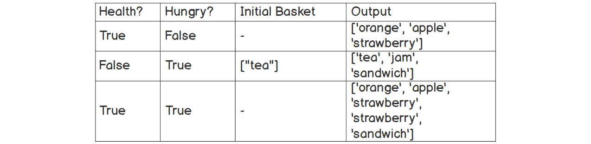


Caption: A summary table of the problem

There is a reproducer in the code example, so continue the debugging
from there, and figure out where the issue is in the code.

Take a look at the following steps:

1.  First, write test cases with the inputs provided in the preceding
    table.

2.  Next, confirm whether the error report is genuine.

3.  Then, run the reproducers in the code file and confirm the error in
    the code.

4.  Finally, fix the code with the simple logic of
    `if and else`.

    You should get the following output:

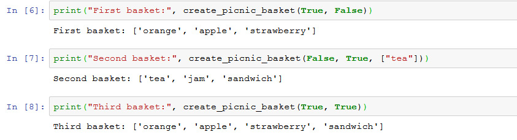


In the next topic, you will be learning about automated testing


Automated Testing
=================


Even though you explored and learned how to debug applications when
errors are reported, you would prefer not having to find errors in our
applications. To increase the chances of having a bug-free code base,
most developers rely on automated testing.

At the beginning of their careers, most developers will just manually
test their code as they develop it. By just providing a set of inputs
and verifying the output of the program, you can get a basic level of
confidence that our code \"works.\" But this quickly becomes tedious and
does not scale as the code base grows and evolves. Automated testing
allows you to record a series of steps and stimuli that you perform in
our code and have a series of expected output recorded.

This is extremely efficient to reduce the number of bugs in our code
base, because not only are we verifying the code, but we are also
implementing it, and you keep a record of all those verifications for
future modifications of the codebase.

The amount of test lines that you write for each line of code really
depends on each application. There are notorious cases, such as SQLite,
where orders of magnitude more lines of tests are needed than lines of
code, which greatly improves confidence in the software and allows quick
release of new versions as features are added without needing the
extensive quality assurance (QA) that other systems might require.

Automated testing is similar to the QA process that we see in other
engineering fields. It is a key step of all software development and
should be taken into account when developing a system.

Additionally, having automated tests also helps you to troubleshoot, as
we have a set of test scenarios that you can adapt to simulate the
user\'s input and environment and keep what is known as a regression
test. This is a test that is added when an issue is detected, to ensure
that the issue never happens again.


Test Categorization
-------------------

One of the first things to think about when writing an automated test is
\"*What are we verifying?*\". And that would depend on the \"*level*\"
of testing that you are doing. There is a lot of literature about how to
categorize different test scenarios in the functions that they validate
and the corresponding dependencies they have. It is not the same to
write a test that just validates a simple Python function in our source
code, as it is to write something that validates an accounting system
that connects to the internet and sends emails. To validate large
systems, it is common to create different types of tests. They are
usually known as the following:

-   **Unit tests**: These are tests that just validate a small part of
    your code. Usually, they just validate a function with specific
    inputs within one of your files and only depend on code that has
    already been validated with other unit tests.
-   **Integration tests**: These are more coarse-grained tests that will
    either validate interactions between different components of your
    codebase (known as integration tests without environment) or the
    interactions between your code and other systems and the environment
    (known as integration tests with the environment).
-   **Functional or end-to-end tests**: These are usually really
    high-level tests that depend on the environment and often on
    external systems that validate the solution with inputs as the user
    provides them.

Say that you were to test the workings of Twitter, using the tests you
are familiar with:

-   A unit test would verify one of the functions, which will check
    whether a tweet body is shorter than a specific length.
-   An integration test would validate that, when a tweet is injected
    into the system, the trigger to other users is called.
-   An end-to-end test is one that ensures that, when a user writes a
    tweet and clicks `Send`, they can then see it on their
    home page.

Software developers tend to prefer unit tests as they don\'t have
external dependencies and are more stable and faster to run. The further
we go into more coarse-grained tests, the more we\'ll come across what
the user will perform, but both integration and end-to-end tests usually
take much longer to run, as the dependencies need to be set up and they
are usually flakier because, for example, the email server might not be
working on that day, meaning we would be unable to run our tests.

Note

This categorization is a simplification of many experts working in the
field. If you are interested in the different levels of testing and
getting the right balance of tests, then a good place to start is the
famous Testing Pyramid.


Test Coverage
-------------

Something that generates debate across the community is test coverage.
When you write tests for our code, you start to exercise it and begin to
hit different code paths. As you write more tests, we cover more and
more of the code that you are testing. The percentage of code that you
test is known as **test coverage**, and developers will argue that
different percentages are \"the right amount.\" Getting to 100% coverage
might seem an unnecessary task, but it proves to be quite useful in
large codebases that need to perform tasks such as migrating from Python
2 to Python 3. However, this all depends on how much you are willing to
invest in testing your application, and each developer might target a
different number for each of the projects that they run.

Moreover, something important to remember is that 100% coverage does not
mean that your code does not have bugs. You can write tests that
exercise your code but do not properly validate it, so be mindful of
falling into the trap of just writing tests to hit the coverage target.
Tests should be written to exercise the code with inputs that will be
provided by users and try to find edge cases that can uncover issues
with the assumptions that you made at the time that you wrote it, and
not just to hit a number.


Writing Tests in Python with Unit Testing
-----------------------------------------

The Python standard library comes with a module, `unittest`,
to write test scenarios and validate your code. Usually, when you are
creating tests, we create a file for the test to validate the source
code of another file. In that file, you can create a class that inherits
from `unittest.TestCase` and has method names that contain the
word `test` to be run on execution. You can record
expectations through functions such as `assertEquals` and
`assertTrue`, which are part of the base class, and you can,
therefore, access them.


Exercise 113: Checking Sample Code with Unit Testing
----------------------------------------------------

In this exercise, you will write and run tests for a function that
checks whether a number is divisible by another. This will help you to
validate the implementation and potentially find any existing bugs:

1.  Create a function, `is_divisible`, which checks whether a
    number is divisible by another. Save this function in a file named
    `sample_code`.

    This function is also provided in the `sample_code.py`
    file. The file just has a single function that checks whether a
    number is divisible by another:


    ```
    def is_divisible(x, y):
        if x % y == 0:
            return True
        else:
            return False
    ```

2.  Create a `test` file that will include the test cases for
    our function. Then, add the skeleton for a test case:


    ```
    import unittest
    from sample_code import is_divisible
    class TestIsDivisible(unittest.TestCase):
        def test_divisible_numbers(self):
            pass
    if __name__ == '__main__':
        unittest.main()
    ```

    This code imports the function to test, `is_divisible`,
    and the `unittest` module. It then creates the common
    boilerplate to start writing tests: a class that inherits from
    `unittest.TestCase` and two final lines that allow us to
    run the code and execute the tests.

3.  Now, write the test code:


    ```
        def test_divisible_numbers(self):
           self.assertTrue(is_divisible(10, 2))
           self.assertTrue(is_divisible(10, 10))
           self.assertTrue(is_divisible(1000, 1))
       def test_not_divisible_numbers(self):
           self.assertFalse(is_divisible(5, 3))
           self.assertFalse(is_divisible(5, 6))
           self.assertFalse(is_divisible(10, 3))
    ```

    You now write the code for Your tests by using the
    `self.assertX` methods. There are different kinds of
    methods for different kinds of asserts. For example,
    `self.assertEqual` will check whether the two arguments
    are equal or fail otherwise. You will use
    `self.assertTrue` and `self.assertFalse`. With
    this, you can create the preceding tests.

4.  Run the test:


    ```
    python3.8 test_unittest.py  -v
    ```

    Run the test by executing it with a Python interpreter. By using
    `-v`, you get extra information about the test names as
    the tests are running.

    You should get the following output:

    
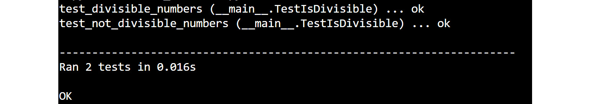


    Caption: The unit test run output

5.  Now, add more complex tests:


    ```
       def test_dividing_by_0(self):
            with self.assertRaises(ZeroDivisionError):
                is_divisible(1, 0)
    ```

    By adding a test when you pass `0`, you want to check
    whether it will raise an exception.

    The `assertRaises` context manager will validate that the
    function raises the exception passed in within the context.

    So, there you go: you have a test suite with the standard library
    `unittest` module.

Unit testing is a great tool for writing automated tests, but the
community seems to generally prefer to use a third-party tool named
**Pytest**. Pytest allows the user to write tests by just having plain
functions in their function and by using Python `assert`.

This means that rather than using `self.assertEquals(a, b)`,
you can just do `assert a == b`. Additionally, pytest comes
with some enhancements, such as capturing output, modular fixtures, or
user-defined plugins. If you plan to develop any test suite that is
bigger than a few tests, consider checking for pytest.


Writing a Test with pytest
--------------------------

Even if a unit test is part of the standard library, it is more common
to see developers use pytest to run and write the test. You can refer to
the `pytest` package for more information about how to write
and run tests with pytest: <https://docs.pytest.org/en/latest/>


``` {.language-markup}
from sample_code import is_divisible
import pytest
def test_divisible_numbers():
    assert is_divisible(10, 2) is True
    assert is_divisible(10, 10) is True
    assert is_divisible(1000, 1) is True
def test_not_divisible_numbers():
    assert is_divisible(5, 3) is False
    assert is_divisible(5, 6) is False
    assert is_divisible(10, 3) is False
def test_dividing_by_0():
    with pytest.raises(ZeroDivisionError):
        is_divisible(1, 0)
```

This code creates three test cases by using `pytest`. The main
difference is that having a class that has `assert` methods
within it, you can create free functions and use the `assert`
keyword of Python itself. This also gives us more explicit error reports
when they fail.

In the next section, let\'s take a look at creating PIP packages.


Creating a PIP Package
======================


When you want to distribute our code to users, you need to create source
or binary distributions and then upload them to a repository. The most
common Python repository is `PyPI`, which allows users to
install packages by using `pip`.

The **Python Packaging Index** (**PyPI**), is an official package
repository maintained by the Python Software Foundation that contains
Python packages. Anyone can publish packages to it, and many Python
tools usually default to consume packages from it. The most common way
to consume from `PyPI` is through `pip`, which is
the **Python Packaging Authority** (**PyPA**). This is the recommended
tool for consuming Python packages.

The most common tool to package our source code is
`setuptools`. With `setuptools`, you can create a
`setup.py` file that contains all the information about how to
create and install the package. `Setuptools` comes with a
method named `setup`, which should be called with all the
**metadata** that we want to create a package with.

Here\'s some example boilerplate code that could be copied and pasted
when creating a package:


``` {.language-markup}
import setuptools
setuptools.setup(
    name="fenago-sample-package",
    version="1.0.0",
    author="Author Name",
    author_email="author@email.com",
    description="fenago example package",
    long_description="This is the longer description and will appear in the       web.",
    py_modules=["fenago"],
    classifiers=[
        "Programming Language :: Python :: 3",
        "Operating System :: OS Independent",
    ],
)
```

Take special note of the following parameters:

-   `Name`: The name of the package in PyPA. It is a good
    practice to have it match your library or file import name.
-   `Version`: A string that identifies the version of the
    package.
-   `Py_modules`: A list of Python files to package. You can
    also use the `package` keyword to target full Python
    packages--- you will explore how to do this in the next exercise.

You can now create the source distribution by running the following:


``` {.language-markup}
python3.8 setup.py sdist
```

This will generate a file in the `dist` folder, which is ready
to be distributed to PyPI.

If you have the `wheel` package installed, you can also run
the following to create a `wheel`:


``` {.language-markup}
python3.8 setup.py bdist_wheel
```

Once you have this file generated, you can install Twine, which is the
tool recommended by the PyPA for uploading packages to PyPI. With twine
installed, you just need to run the following:


``` {.language-markup}
twine upload dist/*
```

You can test our package by installing any of the artifacts in the
`dist` folder.

Usually, you won\'t just have a single file to distribute, but a whole
set of files within a folder, which makes a Python package. In those
situations, there is no need to write all the files within the folder
one by one---you can just use the following line instead of the
`py_module` option:


``` {.language-markup}
packages=setuptools.find_packages(),
```

This will find and include all the packages in the directory where the
`setup.py` file is.


Exercise 114: Creating a Distribution That Includes Multiple Files within a Package
-----------------------------------------------------------------------------------

In this exercise, you are going to create our own package that can
contain multiple files and upload them to the test version of PyPI:

1.  Create a virtual environment and install `twine` and
    `setuptools`.

    Start by creating a virtual environment with all the dependencies
    that you need.

    Make sure you are in an **empty** folder to start:


    ```
    python3.8 -m venv venv
    . venv/bin/activate
    python3.8 -m pip install twine setuptools
    ```

    You now have all the dependencies we need to create and distribute
    our package.

2.  Create the actual package source code.

    You will create a Python package named `john_doe_package`.

    Note, please change this to your first and last name:


    ```
    mkdir john_doe_package
    touch john_doe_package/__init__.py
    echo "print('Package imported')" > john_doe_package/code.py
    ```

    The second line will create a Python file, which you will package
    within the Python package.

    This is a basic Python package that just contains an
    `init` file and another file named `code`---we
    can add as many files as desired. The `'__init__'` file
    marks the folder as a Python package.

3.  Add the `setup.py` file.

    You need to add a `setup.py` file at the top of our source
    tree to indicate how our code should be packaged. Add a
    `setup.py` file like the following:


    ```
    import setuptools
    setuptools.setup(
        name="john_doe_package",
        version="1.0.0",
        author="Author Name",
        author_email="author@email.com",
        description="fenago example package",
        long_description="This is the longer description and will appear in       the web.",
        packages=setuptools.find_packages(),
        classifiers=[
            "Programming Language :: Python :: 3",
            "Operating System :: OS Independent",
        ],
    )
    ```

    The previously mentioned code is a function call where you pass all
    the metadata.

    Be sure to change `john_doe_package` to the name of your
    own package.

4.  Create the distribution by calling the `setup.py` file:


    ```
    python3.8 setup.py sdist
    ```

    This will create a source distribution. You can test it out by
    installing it locally:


    ```
    cd dist && python3.8 -m pip install *
    ```

5.  Upload to the `PyPI` test:


    ```
    twine upload --repository-url=https://test.pypi.org/legacy/ dist/*
    ```

    The last step is to upload the file to the test version of
    `PyPI`.

    To run this step, you need an account in Test `PyPI`. Go
    to <https://test.pypi.org/account/register/> to create one.

    Once created, you can run the following command to upload the
    package to the web:

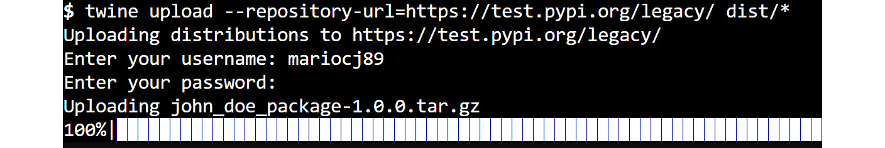


Caption: Uploading with the twine output

This will prompt you for the user and password that you used to create
your account. Once this is uploaded, you can go to
<https://test.pypi.org/account/login/?next=/manage/projects/>, click on your **project**, and you should
be able to see the following on the `PyPI` web:

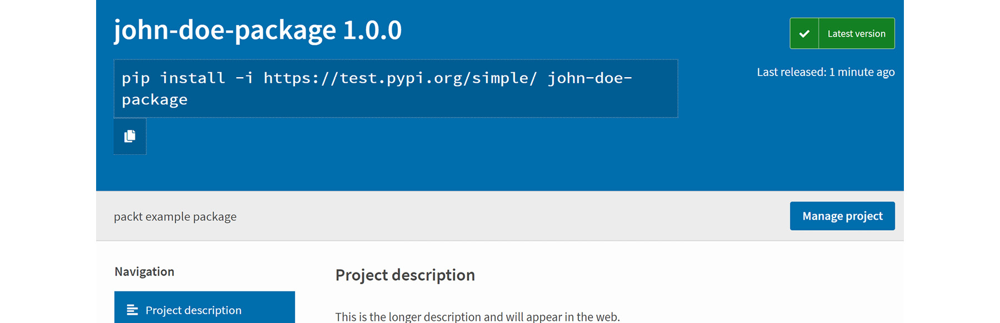


Caption: Sample uploaded package website

You just published your first package. In this exercise, you learned how
to create a Python package, package it, and upload it to
`PyPI`.


Adding More Information to Your Package
---------------------------------------

So, you have seen how to create a really simple package. When you create
a package, you should also include a `README` file that can be
used to generate a description of the project and is part of the source
distribution. This file gets packaged by default.

Consider exploring the different attributes that can be used with
`setuptools.setup`. By having a look through documentation,
you can find a lot of useful metadata that might be appropriate for your
package.

Additionally, to facilitate testing, many people consider it to be good
practice to place all the source code of your package within an
`src` directory. This is done to prevent the Python
interpreter from automatically finding your package, as it is part of
the current working directory, as Python adds the current working
directory to the Python path. If your package contains any logic about
the data files that are packaged with your code, you should really use
the `src` directory, as it will force you to work against the
installed version of your package, rather than the source directory
tree.

PyPA has recently created a guide on how to package projects, which
contains further details than those discussed in this course.

Note

If you need to package multiple applications, consider having a look
through <https://packaging.python.org/tutorials/packaging-projects/>.


Creating Documentation the Easy Way
===================================


A critical part of all software that is distributed across the world is
documentation. Documentation allows the users of your code to be able to
understand calling the different functions that we provide without
having to read the code. There are multiple levels of documentation that
you are going to explore in this topic. You will see how to write
documentation that can be consumed in the console and on the web. In the
purpose and size of our project, you should consider how broad our
documentation should be and what kind of instructions and information it
should contain.


Docstrings
----------

In Python, documentation is part of the language. When you declare a
function, you can use docstrings to document its interface and behavior.
Docstrings can be created by having a triple-quoted string block just
after the function signature. This content is not only available to the
reader but also to the user of the API, as it is part of a
`__doc__` attribute of the function, class, or module. It is
the content that will be provided if we call the help function in the
object passed. As an example, take a look at the contents of the
`__doc__` attribute of the print function:


``` {.language-markup}
print(print.__doc__)
```

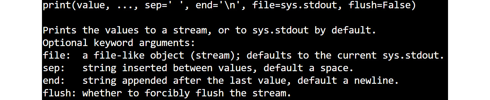


Caption: Print documentation

It is the same content as calling `help(print)`. You can
create your own function with a `__doc__` attribute, as
follows:


``` {.language-markup}
>>>def example():
    """Prints the example text"""
    print("Example")
>>>example.__doc__
'Prints the example text' 
```

You can now use `help` in your function, by executing the
\"help(example)\" which will result in the following text:


Caption: The Help content in the example module

Docstrings usually contain a title with a short description of the
function and a body with further information about what it does in
detail. Additionally, you can also document all the parameters the
function takes, including its types, the return type, and whether it
raises any exceptions. This is all really useful information for your
users and even for ourselves when you have to use the code at a later
time.


Using Sphinx
------------

Using docstrings to document APIs is useful, but quite often you need
something more. You want to generate a website with guides and other
information about your library. In Python, the most common way to do
this is via **Sphinx**. Sphinx allows you to generate documentation in
multiple formats, such as `PDF`, `epub`, or
`html`, easily from `RST` with some markup. Sphinx
also comes with multiple plugins, and some of them are useful for
Python, such as generating API documentation from docstrings or allowing
you to view code behind the API implementation.

Once installed via `pip`, it comes with two main CLI scripts,
which the user interacts with:
`sphinx-build and sphinx-quickstart`. The first is used to
build the documentation on an existing project with Sphinx
configuration, while the second can be used to quickly bootstrap a
project.

When you bootstrap a project, Sphinx will generate multiple files for
you, and the most important ones are as follows:

-   `Conf.py`: This contains all the user configuration for
    generating the documentation. This is the most common place to look
    for configuration parameters when you want to customize something
    from the Sphinx output.
-   `Makefile`: An easy-to-use `makefile` that can
    be used to generate the documentation with a simple \"make html.\"
    There are other targets that can be useful, such as the one to run
    `doctests`.
-   `Index.rst`: The main entry point for our documentation.

Usually, most projects create a folder named `docs` within
their source tree root to contain everything related to the
documentation and Sphinx. This folder can then refer to the source code
by either installing it or by adding it to the path in their
configuration file.

If you are not familiar with `RST`, it is best to have a quick
look through
<https://www.sphinx-doc.org/en/master/usage/restructuredtext/basics.html>.
It has a short explanation of the different special syntaxes you can
find in `RST` that will be translated into special HTML tags
such as `links`, `anchors`, `tables`,
`images`, and others.

On top of this, Sphinx is easily extendible via plugins. Some of them
are part of the default distribution when you install sphinx. Plugins
allow you to extend the functionality to do things such as automatically
create documentation for your modules, classes, and functions by just
writing a single directive.

Finally, there are multiple themes available when you generate
documentation with Sphinx---these are all configurable in conf.py. Quite
often, you can find more Sphinx themes available on `PyPI`,
which can be just installed easily via `pip`.


Exercise 115: Documenting a Divisible Code File
-----------------------------------------------

In this exercise, you are going to document the module that you created
in the testing topic, `divisible.py`, from *Exercise 113*,
*Checking Sample Code with Unit Testing* using `sphinx`:

1.  Create a folder structure.

    First, create an empty folder with just the `divisible.py`
    module and another empty folder named `docs`. The
    `divisible.py` module should contain the following code:


    ```
    def is_divisible(x, y):
        if x % y == 0:
            return True
        else:
            return False
    ```

2.  Run the `sphinx` quick-start tool:

    Make sure you have Sphinx installed (otherwise, run
    `python3.8 -m pip install sphinx –user`) and run
    `sphinx-quickstart` within the `docs` folder.
    You can leave all the functions with the default value by pressing
    return when prompted, except for the following:

    Project name: `divisible`.

    Author name: Write your name here.

    Project Release: 1.0.0.

    Autodoc: y.

    Intersphinx: y.

    With these options, you are ready to start a project that can be
    easily documented and generate HTML output with Sphinx.
    Additionally, you have enabled two of the most common plugins:
    `autodoc`, which we will use to generate documentation out
    of the code; and `intersphinx`, which allows you to
    reference other sphinx projects, such as the Python standard
    library.

3.  Build the documentation for the first time.

    Building the documentation is easy---just run make html within the
    docs directory to generate the HTML output of your documentation.
    You can now open the `index.html` file in your browser
    within the `docs/build/html` folder.

    You should get the following output:

    
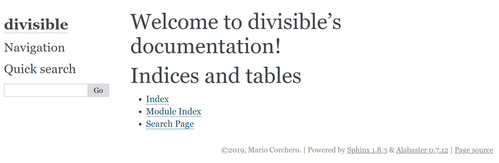


    Caption: The first documentation output with Sphinx

    It\'s not a lot of content, but it\'s quite impressive for the
    amount of code you have written.

4.  Configure Sphinx to find our code.

    The next step is to generate and include documentation from your
    Python source code. The first thing that you will have to do to be
    able to do that is to edit the `conf.py` file within the
    docs folder and uncomment these three lines:


    ```
    # import os
    # import sys
    # sys.path.insert(0, os.path.abspath('.'))
    ```

    Once uncommented, the last line should be changed to this since you
    have our divisible source code one level above our code:


    ```
    sys.path.insert(0, os.path.abspath('..'))
    ```

    A better alternative to this would be to make sure your package is
    installed when running Sphinx---this is a more extended method, but
    a simpler solution.

    Last but not least, you are going to use another plugin, called
    `Napoleon`. This allows you to format your functions by
    using the `Napoleon` syntax. To do so, add the following
    line in the list of extensions within the `conf.py` file,
    within the extensions variable, after \'sphinx.ext.autodoc\':


    ```
        'sphinx.ext.napoleon',
    ```

    You can read
    <https://www.sphinx-doc.org/en/master/usage/extensions/napoleon.html>
    for more information about the `Napoleon` syntax for
    Sphinx.

5.  Generate documentation from the source code.

    Adding the documentation from a module to Sphinx is really
    simple---you can just add the following two lines to your
    `index.rst`:


    ```
        automodule:: divisible
        :members:
    ```

    Once those two lines are added, run `make html` again and
    check whether an error is generated. If no error appears, then you
    are all set. You have configured Sphinx to bring the documentation
    from docstrings to your `rst` file.

6.  Add docstrings.

    To give Sphinx something to work with, add a docstring at the module
    level and one docstring for the function that you defined.

    Our `divisible.py` file should now look like the
    following:


    ```
    """Functions to work with divisibles"""
    def is_divisible(x, y):
        """Checks if a number is divisible by another
        Arguments:
            x (int): Divisor of the operation.
            y (int): Dividend of the operation.
        Returns:
            True if x can be divided by y without reminder,
            False otherwise.
        Raises:
            :obj:'ZeroDivisionError' if y is 0.
        """
        if x % y == 0:
            return True
        else:
            return False
    ```

    You are using the `napoleon` style syntax to define the
    different arguments that our function takes, what it can return, and
    the exception it raises.

    Note that you we use a special syntax to reference the exception
    that it raises. This will generate a link to the definition of the
    object.

    If you run `make html` again, you should get the following
    output:

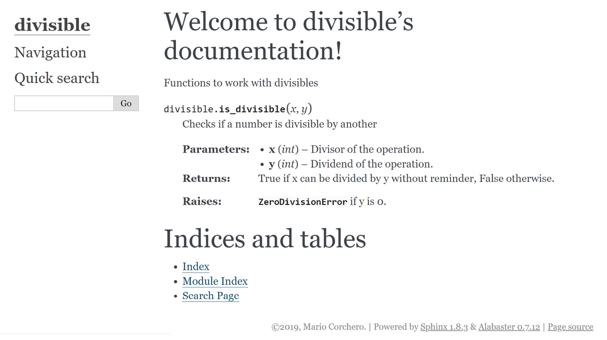


Caption: HTML documentation output with docstring

You can now distribute our documentation to our users. Note that it will
always be up to date as you are generating it from the source code.


More Complex Documentation
--------------------------

In the previous exercise, you examined simple documentation for a really
small module. Most libraries also include tutorials and guides along
with their API documentation. Check `Django`,
`flask`, or `CPython` as examples, as they are all
generated with Sphinx.


Additionally, there are tools such as Read the Docs, which greatly
simplifies the generation and hosting of documentation. You can take the
project that we just generated and connect it to `readthedocs`
through their UI to have our documentation hosted on the web and
automatically regenerated every time you update the master branch of our
project.

Note

You can go to <https://readthedocs.org/> to create an account and set up
your repositories in GitHub to automatically generate documentation.


Source Management
=================


When you work with code, you need a way in which to keep a picture of
how your code evolves and how changes are being applied to different
files. For instance, say that, by mistake, you make changes to your code
that suddenly breaks it, or you start to make changes and just want to
go back to the previous version. Many people start with just copying
their source code into different folders and naming them with a
timestamp based on checkpoints they make on different phases of the
project. This is the most rudimentary approach to version control.

Version control is the system by which you keep control of code as it
evolves over time. Developers have been suffering for long enough to
create a piece of software that can do this job efficiently, and one of
the most popular tools to do this is a Git. **Git** is a **Distributed
Version Control System** that allows developers to manage their code
locally as it evolves, look at the history, and easily collaborate with
other developers. Git is used to manage some of the biggest projects
around the world, such as the Windows kernel, CPython, Linux, or Git
itself; however, at the same time, git is really useful and versatile
for small projects as well.


Repository
----------

A repository is an isolated workspace where you can work with your
changes and have git record them and track the history of them. One
repository can contain as many files and folders as you want, with all
of them tracked by git.

There are two ways to create a repository: you can either clone an
existing repository by using
`git clone <url of the repository>`, which will bring a local
copy of a repository into your current path, or you can create a
repository from an existing folder with `git init`, which will
just mark the folder as a repository by creating the necessary files.

Once you have a repository locally created, you can start to work with
our version control system by issuing different commands to indicate
whether you want to add changes, check previous versions, or more.


Commit
------

A `commit` object is the history of our repository. Each
repository has many commits: one for every time we use
`git commit`. Each of those commits will contain the commit
title, the person who added the commit to the repository, the author of
the changes, the dates when the commit and the changes were made, an ID
that is represented by a hash, and the hash of the parent commit. With
this, you can create a tree of all the commits within the repository,
which allows us to see the history of our source code. You can see the
content of any commit by running `git show <commit sha>`.

When you run `git commit`, we create a commit from all the
changes that you have in the staging area. An editor will open, which
includes some meta-information such as the title and the commit body.


Staging Area
------------

When you are working locally, making changes to our files and source
code, git will report that those changes happened, and they are not
saved. By running `git status`, you can see what files were
modified. If you decide that we want to save those changes in the
staging area in preparation for a commit, you can add them with the
`git add <path>` command. It can be used in files or folders
to add all the files within that folder. Once they are added to the
staging area, the next `git commit` command will save the
changes in the repository through a commit object.

Sometimes, you don\'t want to add all the contents of a file to the
staging area, just part of them. For this use case, both
`git commit` and `git add` have an option to guide
you through the different changes in the file and allow you to select
which ones you want to add. This is through the `-p` option,
which will ask you for each of the changed chunks within your code,
which ones you do want to add.


Undoing Local Changes
---------------------

When you are working on a file, you can run `git diff` to see
all the changes that have been made locally but are not yet part of the
staging area or a commit. Sometimes, you realize we want to undo our
changes and come back to the version you have saved in the staging area
or in the last commit. You can do this by checking out the file by
running `git checkout <path>`. This applies to both files and
folders.

If instead, you want to revert our repository back to a previous commit
in history, you can do this by running
`git reset <commit sha>`.


History
-------

As you mentioned before, the repository has a commit history. This
includes all the commits that have been performed before. You can see
them by running `git log`, which will present you with the
title, body, and some other information. The most important part of each
of these entries is the `sha` of the commit, which uniquely
represents each of the commits.


Ignoring Files
--------------

When you work with our source code, we may find that, by running our
program or any other action, you have files in your repository that you
don\'t want git to track. In that scenario, you can use a special file
that has to be placed at the top of the directory and named
`.gitignore`, which can list all the files in glob patterns
that you don\'t want git to track. This is especially handy for adding
things such as IDE-generated files, compiled Python files, and more.


Exercise 116: Making a Change in CPython Using git
--------------------------------------------------

In this exercise, you are going to change a file in the local
`CPython` repository by cloning the repository and working on
our local copy. For the sake of the exercise, you will just add our name
to the list of authors of the project.

Note

The repository will be on your local PC, so no one will see the changes
-- don\'t worry.

You begin by first installing `git`. That is the first step to
installing the tool itself. You can install it on Windows via
<https://git-scm.com/download/win>, or in Unix by following the
instructions here:
<https://git-scm.com/course/en/v2/Getting-Started-Installing-Git>.

If you are running on Windows, follow this exercise by using the
`git-shell` for Windows. On Unix, just use your preferred
Terminal:

1.  Now, begin by cloning the `cpython` repository.

    As you mentioned before, you can create a repository by simply
    cloning it. You can clone the `cpython` source code by
    running the following:


    ```
    git clone https://github.com/python/cpython.git
    ```

    This will create a folder named `cpython` in the current
    workspace. Don\'t worry; it is normal for it to take a few minutes,
    as CPython has a lot of code and long history:

    
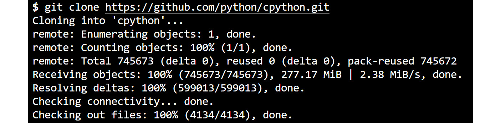


    Caption: The git clone output of CPython

2.  Edit the `Misc/ACKS` file and confirm the changes.

    You can now add your name to the `Misc/ACKS` file. To do
    this, just open the file in that path and add your name in
    alphabetical and your surname.

    Check the changes by running `git status`. This command
    will show you whether there are any changed files:

    
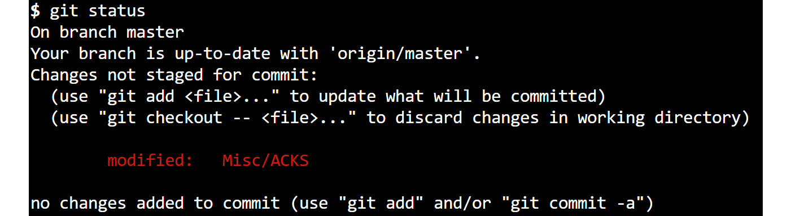


    Caption: The git status output

    Note how it gives you instructions on how to proceed if you want to
    add the changes to the staging area in preparation for a commit or
    to reset them. Let\'s check the content of the changes by running
    `git diff`:

    
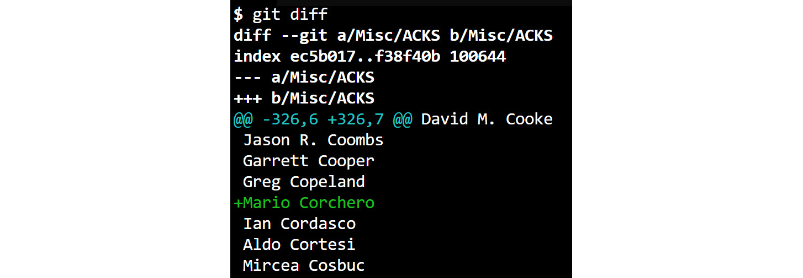


    Caption: The git diff output

    This provides you with a nice output that indicates the changes in
    the lines. Green with a plus sign means that a line was added, while
    red with a minus sign means a line was removed.

3.  Now `commit` the changes.

    Now that you are happy with the changes that you have made let\'s
    add those to the staging area by running
    `git add Misc/ACKS`, which will move the file into the
    staging area, allowing us to then commit them at any time by running
    `git commit`. When you run `git commit`, an
    editor will open to create the commit. Add a title and body
    (separated by an empty line):

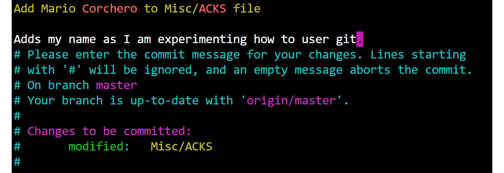


Caption: A commit message output example

When you close the editor and save, the commit should be created:


Caption: The git commit output

You have created your first commit. You can check the contents of it by
running `git show`:

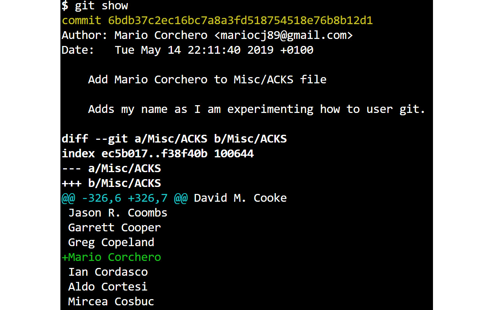


Summary
=======


In this lab, you have seen that software development is more than
just writing code in Python. When you want to elevate your code further
than a simple script on our computer, you need to know how to
troubleshoot it, distribute it, document it, and test it. The Python
ecosystem provides us with tools to do all of these things. You have
learned how to troubleshoot code using `pdb` and steps on how
to identify and narrow down a problem by inspecting logs and the input.
You have also learned how to write automated tests and the importance of
them.
