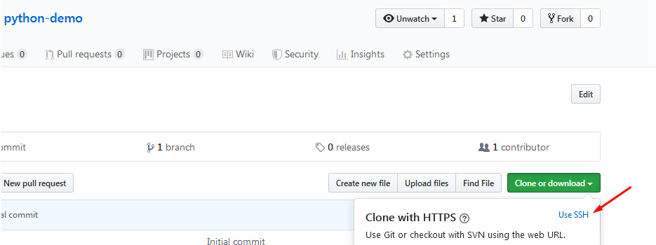
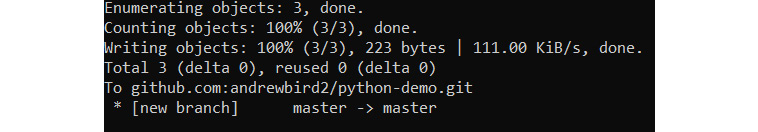
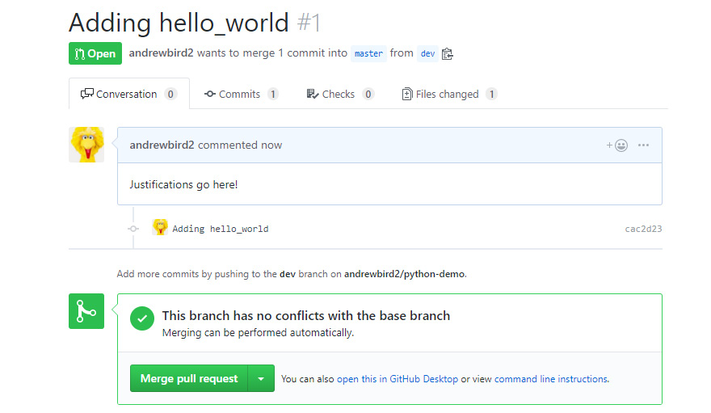
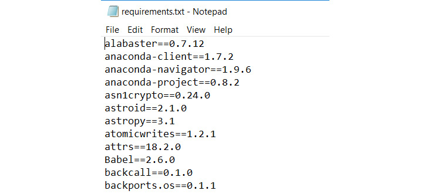
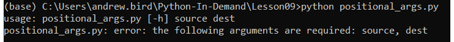

Lab 9. Practical Python -- Advanced Topics
======================================

Overview

By the end of this lab, you will be able to, write Python
collaboratively as a member of a team; use conda to document and set up
the dependencies for your Python programs; use Docker to create
reproducible Python environments to run your code; write programs that
take advantage of multiple cores in modern computers; write scripts that
can be configured from the command line and explain the performance
characteristics of your Python programs, and use tools to make your
programs faster.


Exercise 117: Writing Python on GitHub as a Team
------------------------------------------------

In this exercise, you will learn how to host code on GitHub, make a
`pull` request, and then approve changes to the code. To make
this exercise more effective, you can collaborate with a friend.

1.  If you don\'t have an account already, create one on
    [github.com](http://github.com/).

2.  Log into <https://github.com/> and create a new repository by
    clicking on **New**:

    


    Caption: The GitHub home page

3.  Give the repository an appropriate name, such as
    `python-demo`, and click on **Create**.

4.  Now click on **Clone or download,** and you will be able to see the
    HTTPS URL; however, note that we will need the SSH URL. Hence, you
    will see **Use SSH** on the same tab, which you need to click on:

    



    Caption: Using SSH URL on GitHub

5.  Now copy the `SSH URL` on GitHub. Then, using your local
    Command Prompt, such as `CMD` in Windows, clone the
    repository:


    ```
    git clone git@github.com:andrewbird2/python-demo.git
    ```

    Note

    Your command will look slightly different from the preceding command
    because of the different username. You need to add your SSH URL
    after `git clone`. Note that you may also need to add an
    SSH key to your GitHub account for authentication. If so, follow the
    instructions here to add the SSH key:

    https://docs.github.com/en/enterprise/2.16/user/github/authenticating-to-github/generating-a-new-ssh-key-and-adding-it-to-the-ssh-agent

6.  In your new `python-demo` directory, create a Python file.
    It doesn\'t matter what it contains; for instance, create a simple
    one-line `test.py` file, as shown in the following code
    snippet:

    ```
    echo "x = 5" >> test.py
    ```

7.  Let\'s `commit` our changes:


    ```
    git add .
    git commit -m "Initial"
    git push origin master
    ```

    You should get the following output:

    



    Caption: Pushing our initial commit

    At this point, if you are working with someone else, clone their
    repository, and perform the following steps on their code base to
    experience what collaboration feels like. If working alone, just
    proceed with your own repository.

8.  Create a new branch called `dev`:


    ```
    git checkout -b dev
    ```

    You should get the following output:

    


    Caption: Creating a dev branch

9.  Create a new file called `hello_world.py`. This can be
    done in a text editor, or with the following simple command:

    ```
    echo "print("Hello World!")" >> hello_world.py
    ```

10. `commit` the new file to the `dev` branch and
    `push` it to the created `python-demo`
    repository:

    ```
    git add .
    git commit -m "Adding hello_world"
    git push --set-upstream origin dev
    ```

11. Go to the project repository in your web browser and click on
    **Compare & pull request**:

    


    Caption: The home page of the repository on GitHub

12. Here, you can see a list of changes made on the `dev`
    branch that you created. You can also provide an explanation that
    someone else might read when reviewing your code before deciding
    whether or not it should be committed to the master branch:

    


    Caption: Adding justifications to the code on GitHub

13. Click on **Create pull request** to add the justifications on
    GitHub.

14. Now, if working with a partner, you should switch back to the
    original repository that you own and view their `pull`
    request. You could comment on it if you have any concerns regarding
    the `commit` request; otherwise, you can simply click on
    **Merge pull request**:




Dependency Management
=====================


In the IT world, most complex programs depend on libraries beyond the
Python standard library. You may use `numpy` or
`pandas` to deal with multidimensional data or
`matplotlib` to visualize data in graphs (this will be covered
in *Lab 10*, *Data Analytics with pandas and NumPy*), or any number
of other libraries available to Python developers.


There are multiple tools for solving this problem. These include
`pip`, `easy_install`, `brew`, and
`conda`, to name a few. You are already familiar with
`pip`, and in some contexts, it suffices to use this package
manager to keep track of dependencies.

For instance, try running `pip freeze` in Command Prompt. You
should get the following output:


This package list could be saved to a `text` file with the
following command: `pip freeze` \>
`requirements.txt`. This will create a file called
`requirements.txt`, which will be similar to:




Now that you have the information about the packages, you can choose to
install these packages on another machine or environment with the
following command: `pip install -r requirements.txt`.


Exercise 118: Creating and Setting Up a conda Virtual Environment to Install numpy and pandas
---------------------------------------------------------------------------------------------

In this exercise, you\'ll create a virtual environment with
`conda` and execute some simple code to import basic
libraries. This exercise will be performed in the `conda`
environment.

Note

If you have not already installed Anaconda, refer to the *Preface*
section for installation instructions.

Now, with `conda` installed on your system, you can create a
new `conda` environment and include packages in it; for
example, `numpy`.

1.  Now you should run the following command using the
    `Anaconda Prompt` program, which is now installed on your
    computer:


    ```
    conda create -n example_env numpy
    ```

    You should get the following output:

    


    Caption: Creating a new conda environment (truncated)

    Note

    If you are asked to enter `y/n` by the prompt, you need to
    enter `y` to proceed further.

2.  Activate the `conda` environment:


    ```
    conda activate example_env
    ```

    You can add other packages to the environment with
    `conda install`.

3.  Now, add `pandas` to the `example_env`
    environment:


    ```
    conda install pandas
    ```

    You should get the following output:

    


    Caption: The pandas output

    Note

    The preceding output is truncated.

4.  Next, open a Python terminal within the virtual environment by
    typing in `python` and then verify that you can import
    `pandas` as `numpy` as expected:

    ```
    python
    import pandas as pd
    import numpy as np
    ```

5.  Now, exit the Python terminal in the virtual environment using the
    `exit()` method:

    ```
    exit()
    ```

6.  Finally, deactivate the virtual environment:


    ```
    conda deactivate
    ```

    Note

    You may have noticed the `$` sign in the prompts. While
    working on the prompt, you need to ignore the `$` sign.
    The `$` sign is just to mention that the command will be
    executed on the terminal.

In this exercise, you created your first virtual environment using
`conda`, installed packages such as `numpy` and
`pandas`, and ran simple Python code to import libraries.


Saving and Sharing Virtual Environments
---------------------------------------

Now, suppose you have built an application that relies on various Python
packages. You now decide that you want to run the application on a
server, so you want a way of setting up the same virtual environment on
the server as you have running on your local machine. As you previously
encountered with `pip freeze`, the metadata defining a
`conda` environment can be easily exported to a file that can
be used to recreate an identical environment on another computer.


Exercise 119: Sharing Environments between a conda Server and Your Local System
-------------------------------------------------------------------------------

In this exercise, you will export the metadata of our
`example_env` conda environment, which you created in
*Exercise 118*, *Creating and Setting Up a conda Virtual Environment to
Install numpy and pandas*, to a `text` file and learn how to
recreate the same environment using this file.

This exercise will be performed on the `conda` environment
command line:

1.  Activate your example environment, for `example_env`:

    ```
    conda activate example_env
    ```

2.  Now, `export` the environment to a text file:


    ```
    conda env export > example_env.yml
    ```

    The `env export` command produces the text metadata (which
    is mainly just a list of Python package versions), and the
    `> example_env.yml` part of the command stores this text
    in a file. Note that the `.yml` extension is a special
    easy-to-read file format that is usually used to store configuration
    information.

3.  Now `deactivate` that environment and remove it from
    `conda`:

    ```
    conda deactivate
    conda env remove --name example_env
    ```

4.  You no longer have an `example_env` environment, but you
    can recreate it by importing the `example_env.yml` file
    you created earlier in the exercise:

    ```
    conda env create -f example_env.yml 
    ```

You have now learned how to save your environment and create an
environment using the saved file. This approach could be used when
transferring your environment between your personal computers when
collaborating with another developer, or even when deploying code to a
server.


Multiprocessing
===============


As a simple example, suppose your program had to execute three steps: A,
B, and C. These steps are not dependent on each other, meaning they can
be completed in any order. Usually, you would simply execute them in
order, as follows:


Caption: Processing with a single thread

However, what if you could do all of these steps at the same time,
rather than waiting for one to complete before moving onto the next? Our
workflow would look like this:


Exercise 121: Working with execnet to Execute a Simple Python Squaring Program
------------------------------------------------------------------------------

In this exercise, you\'ll create a `squaring` process that
receives `x` over an `execnet` channel and responds
with `x**2`. This is much too small a task to warrant
multiprocessing, but it does demonstrate how to use the library.

This exercise will be performed on a Jupyter notebook:

1.  First, install `execnet` using the `pip` package
    manager:

    ```
    $ pip install execnet
    ```

2.  Now write the `square` function, which receives numbers on
    a channel and returns their square:


    ```
    import execnet
    def square(channel):
        while not channel.isclosed():
            number = channel.receive()
            number_squared = number**2
            channel.send(number_squared) 
    ```

    Note

    Due to the way `execnet` works, you must type the
    following examples into a Jupyter notebook. You cannot type them
    into the interactive `>>>` prompt.

    The `while not channel.isclosed()` statement ensures that
    we only proceed with the calculation if there is an open channel
    between the parent and child Python processes.
    `number = channel.receive()` takes the input from the
    parent process that you want to `square`. It is then
    squared in the `number_squared = number**2` code line.
    Lastly, you send the squared number back to the parent process with
    `channel.send(number_squared)`.

3.  Now set up a `gateway` channel to a remote Python
    interpreter running that function:


    ```
    gateway = execnet.makegateway()
    channel = gateway.remote_exec(square)
    ```

    A `gateway` channel manages the communication between the
    parent and child Python processes. The channel is used to actually
    send and receive data between the processes.

4.  Now send some integers from our parent process to the child process,
    as shown in the following code snippet:


    ```
    for i in range(10):
        channel.send(i)
        i_squared = channel.receive()
        print(f"{i} squared is {i_squared}") 
    ```

    You should get the following output:

    


    Here, you loop through 10 integers, send them through the
    `square` channel, and then receive the result using the
    `channel.receive()` function.

5.  When you are done with the remote Python interpreter, close the
    `gateway` channel to cause it to quit:

    ```
    gateway.exit()
    ```

In this exercise, you learned how to use `execnet` to pass
instructions between Python processes. In the next section, you will be
looking at multiprocessing with the `multiprocessing` package.


Multiprocessing with the Multiprocessing Package
------------------------------------------------

The `multiprocessing` module is built into Python\'s standard
library. Similar to `execnet`, it allows you to launch new
Python processes. However, it provides an API that is lower-level than
`execnet`. This means that it\'s harder to use than
`execnet`, but affords more flexibility. An
`execnet` channel can be simulated by using a pair of
multiprocessing queues.


Exercise 122: Using the Multiprocessing Package to Execute a Simple Python Program
----------------------------------------------------------------------------------

In this exercise, you will use the `multiprocessing` module to
complete the same task as in *Exercise 121, Working with execnet to
Execute a Simple Python Squaring Program*:

1.  Create a new text file called `multi_processing.py`.

2.  Now, `import` the `multiprocessing` package:

    ```
    import multiprocessing
    ```

3.  Create a `square_mp` function that will continuously
    monitor the queue for numbers, and when it sees a number, it will
    take it, square it, and place it in the outbound queue:

    ```
    def square_mp(in_queue, out_queue):
        while(True):
            n = in_queue.get()
            n_squared = n**2
            out_queue.put(n_squared) 
    ```

4.  Finally, add the following block of code to
    `multi_processing.py`:


    ```
    if __name__ == '__main__':
        in_queue = multiprocessing.Queue()
        out_queue = multiprocessing.Queue()
        process = multiprocessing.Process(target=square_mp, args=(in_queue, out_queue))
        process.start()
        for i in range(10):
            in_queue.put(i)
            i_squared = out_queue.get()
            print(f"{i} squared is {i_squared}")
        process.terminate()
    ```

    Recall that the `if name == '__main__'` line simply avoids
    executing this section of code if the module is being imported
    elsewhere in your project. In comparison, `in_queue` and
    `out_queue` are both queue objects through which data can
    be sent between the parent and child processes. Within the following
    loop, you can see that you add integers to `in_queue` and
    get the results from `out_queue`. If you look at the
    preceding `square_mp` function, you can see how the child
    process will get its values from the `in_queue` object,
    and pass the result back into the `out_queue` object.

5.  Execute your program from the command line as follows:


    ```
    python multi_processing.py
    ```

    You should get the following output:


Caption: Running our multiprocessing script

In this exercise, you learned how to pass tasks between our parent and
child Python processes using the `multiprocessing` package,
and you found the square of a set of numbers.


Multiprocessing with the Threading Package
------------------------------------------

Whereas `multiprocessing` and `execnet` create a new
Python process to run your asynchronous code, threading simply creates a
new thread within the current process. It, therefore, uses fewer
operating resources than alternatives. Your new thread shares all
memory, including global variables, with the creating thread. The two
threads are not truly concurrent, because the GIL means only one Python
instruction can be running at once across all threads in a Python
process.

Finally, you cannot terminate a thread, so unless you plan to exit your
whole Python process, you must provide the `thread` function
with a way to exit. In the following exercise, you\'ll use a special
signal value sent to a queue to exit the thread.


Exercise 123: Using the Threading Package
-----------------------------------------

In this exercise, you will use the `threading` module to
complete the same task of squaring numbers as in *Exercise 121*,
*Working with execnet to Execute a Simple Python Squaring Program*:

1.  In a Jupyter notebook, `import` the `threading`
    and `queue` modules:

    ```
    import threading
    import queue
    ```

2.  Create two new queues to handle the communication between our
    processes, as shown in the following code snippet:

    ```
    in_queue = queue.Queue()
    out_queue = queue.Queue()
    ```

3.  Create the function that will watch the queue for new numbers and
    return squared numbers. The `if n == 'STOP'` line allows
    you to terminate the thread by passing `STOP` into the
    `in_queue` object:

    ```
    def square_threading():
        while True:
            n = in_queue.get()
            if n == 'STOP':
                return
            n_squared = n**2
            out_queue.put(n_squared)
    ```

4.  Now, create and start a new thread:

    ```
    thread = threading.Thread(target=square_threading)
    thread.start() 
    ```

5.  Loop through `10` numbers, pass them into the
    `in_queue` object, and receive them from the
    `out_queue` object as the expected output:


    ```
    for i in range(10):
        in_queue.put(i)
        i_squared = out_queue.get()
        print(f"{i} squared is {i_squared}")
    in_queue.put('STOP')
    thread.join()
    ```

    You should get the following output:


Caption: Output from the threading loop

In this exercise, you learned how to pass tasks between our parent and
child Python processes using the threading package. In the next section,
you will look at parsing command-line arguments in scripts.


Parsing Command-Line Arguments in Scripts
=========================================


Scripts often need input from their user in order to make certain
choices about what the script does or how it runs. For instance,
consider a script to train a deep learning network used for image
classification. A user of this script will want to tell it where the
training images are, what the labels are, and may want to choose what
model to use, the learning rate, where to save the trained model
configuration, and other features.

It\'s conventional to use command-line arguments; that is, values that
the user supplies from their shell or from their own script when running
your script. Using command-line arguments makes it easy to automate
using the script in different ways and will be familiar to users who
have experience of using the Unix or Windows command shells.

Python\'s standard library module for interpreting command-line
arguments, `argparse`, supplies a host of features, making it
easy to add argument handling to scripts in a fashion that is consistent
with other tools. You can make arguments required or optional, have the
user supply values for certain arguments, or define default values.
`argparse` creates usage text, which the user can read using
the `--help argument`, and checks the user-supplied arguments
for validity.

Using `argparse` is a four-step process. First, you create a
`parser` object. Second, you add arguments your program
accepts to the `parser` object. Third, tell the
`parser` object to parse your script\'s `argv`
(short for argument vector, the list of arguments that were supplied to
the script on launch); it checks them for consistency and stores the
values. Finally, use the object returned from the `parser`
object in your script to access the values supplied in the arguments.

To run all of the exercises in this section, later on, you will need to
type the Python code into the `.py` files and run them from
your operating system\'s command line, not from a Jupyter notebook.


Exercise 124: Introducing argparse to Accept Input from the User
----------------------------------------------------------------

In this exercise, you\'ll create a program that uses
`argparse` to take a single input from the user called
`flag`. If the `flag` input is not provided by the
user, its value is `False`. If it is provided, its value is
`True`. This exercise will be performed in a Python terminal:

1.  Create a new Python file called `argparse_demo.py`.

2.  Import the `argparse` library:

    ```
    import argparse
    ```

3.  Create a new `parser` object, as shown in the following
    code snippet:

    ```
    parser = argparse.ArgumentParser(description="Interpret a Boolean flag.")
    ```

4.  Add an argument that will allow the user to pass through the
    `–flag` argument when they execute the program:


    ```
    parser.add_argument('--flag', dest='flag', action='store_true', help='Set the flag value to True.')
    ```

    The `store_true` action means that the parser will set the
    value of the argument to `True` if the `flag`
    input is present. If the `flag` input is not present, it
    will set the value to `False`. The exact opposite can be
    achieved using the `store_false` action.

5.  Now call the `parse_args()` method, which executes the
    actual processing of the arguments:

    ```
    arguments = parser.parse_args()
    ```

6.  Now, `print` the value of the argument to see whether it
    worked:

    ```
    print(f"The flag's value is {arguments.flag}")
    ```

7.  Execute the file with no arguments supplied; the value of
    `arguments.flag` should be `False`:


    ```
    python argparse_example.py
    ```

    You should get the following output:

    


    Caption: Running argparse\_demo with no arguments

8.  Run the script again, with the `--flag` argument, to set
    it to `True`:


    ```
    python argparse_demo.py –flag
    ```

    You should get the following output:

    


    Caption: Running argparse\_demo with the \--flag argument

9.  Now enter the following code and see the `help` text that
    `argparse` extracted from the description and
    `help` text you supplied:


    ```
    python argparse_demo.py –help
    ```

    You should get the following output:


You have successfully created a script that allows an argument to be
specified when it is executed. You can probably imagine how useful this
can often be.


Positional Arguments
--------------------

Some scripts have arguments that are fundamental to their operation. For
example, a script that copies a file always needs to know the **source**
file and **destination** file. It would be inefficient to repetitively
type out the names of the arguments; for instance,
`python copyfile.py --source infile --destination outfile`,
every time you use the script.


Exercise 125: Using Positional Arguments to Accept Source and Destination Inputs from a User
--------------------------------------------------------------------------------------------

In this exercise, you will create a program that uses
`argparse` to take two inputs from the user:
`source` and `destination`.

This exercise will be performed in a Python terminal:

1.  Create a new Python file called `positional_args.py`.

2.  Import the `argparse` library:

    ```
    import argparse
    ```

3.  Create a new `parser` object:

    ```
    parser = argparse.ArgumentParser(description="Interpret positional arguments.")
    ```

4.  Add two arguments for the `source` and
    `destination` values:

    ```
    parser.add_argument('source', action='store', help='The source of an operation.')
    parser.add_argument('dest', action='store', help='The destination of the operation.')
    ```

5.  Call the `parse_args()` method, which executes the actual
    processing of `arguments`:

    ```
    arguments = parser.parse_args()
    ```

6.  Now, `print` the value of `arguments` so that
    you can see whether it worked:

    ```
    print(f"Picasso will cycle from {arguments.source} to {arguments.dest}")
    ```

7.  Now, execute the file while using this script with no arguments,
    which causes an error because it expects two `positional`
    arguments:


    ```
    python positional_args.py
    ```

    You should get the following output:

    



    Caption: Running the script with no arguments specified

8.  Try running the script and specifying two locations as the source
    and destination positional arguments.

    Note

    The arguments are supplied on the command line with no names or
    leading hyphens.


    ```
    $ python positional_args.py Chichester Battersea
    ```

    You should get the following output:


Caption: Successfully specifying two positional arguments

In this exercise, you learned how to parameterize your scripts by
accepting positional arguments using the `argparse` Python
package.


Exercise 126: Using PyPy to Find the Time to Get a List of Prime Numbers
------------------------------------------------------------------------

In this exercise, you will be executing a Python program to get a list
of prime numbers using milliamp-hours. But remember that you are more
interested in checking the amount of time needed to execute the program
using `pypy`.

This exercise will be performed in a Python terminal.

Note

You need to install `pypy` for your operating system. Go to
<https://pypy.org/download.html> and make sure to get the version that
is compatible with Python 3.7.

1.  First, run the `pypy3` command, as shown in the following
    code snippet:


    ```
    pypy3
    Python 3.6.1 (dab365a465140aa79a5f3ba4db784c4af4d5c195, Feb 18 2019, 10:53:27)
    [PyPy 7.0.0-alpha0 with GCC 4.2.1 Compatible Apple LLVM 10.0.0 (clang-1000.11.45.5)] on darwin
    Type "help", "copyright", "credits" or "license" for more information.
    And now for something completely different: ''release 1.2 upcoming''
    >>>>
    ```

    Note that you may find it easier to navigate to the folder with the
    `pypy3.exe` file and run the preceding command, instead of
    following the installation instructions to create a symlink.

2.  Press **Ctrl + D** to exit `pypy`.

    You\'re going to use the program from *Lab 7*, *Becoming
    Pythonic*, again, which finds prime numbers using the *Sieve of
    Eratosthenes method*. There are two changes that you will introduce
    here: firstly, find prime numbers up to 1,000 to give the program
    more work to do; secondly, instrument it with Python\'s
    `timeit` module so that you can see how long it takes to
    run. `timeit` runs a Python statement multiple times and
    records how long it takes. Tell `timeit` to run your Sieve
    of Eratosthenes 10,000 times (the default is 100,000 times, which
    takes a very long time).

3.  Create a `eratosthenes.py` file and enter the following
    code:

    ```
    import timeit
    class PrimesBelow:
        def __init__(self, bound):
            self.candidate_numbers = list(range(2,bound))
        def __iter__(self):
            return self
        def __next__(self):
            if len(self.candidate_numbers) == 0:
                raise StopIteration
            next_prime = self.candidate_numbers[0]
            self.candidate_numbers = [x for x in self.candidate_numbers if x %           next_prime != 0]
            return next_prime
    print(timeit.timeit('list(PrimesBelow(1000))', setup='from __main__ import   PrimesBelow', number=10000)) 
    ```

4.  Run the file with the regular Python interpreter:


    ```
    python eratosthenes.py 
    ```

    You should get the following output:


Caption: Executing with the regular Python interpreter

The number will be different on your computer, but that\'s
`17.6` seconds to execute the
`list(PrimesBelow(1000))` statement 10,000 times, or 1,760
`µs` per iteration. Now, run the same program, using
`pypy` instead of CPython:


``` {.language-markup}
$ pypy3 eratosthenes.py 
```

You should get the following output:


``` {.language-markup}
4.81645076300083
```

Here, it is 482 `µs` per iteration.

In this exercise, you will have noticed that it only takes 30% of the
time to run our code in `pypy` as it took in Python. You
really can get a lot of performance boost with very little effort, just
by switching to `pypy`.


Cython
------

A Python module can be compiled to C, with a wrapper that means it is
still accessible from other Python code. Compiling code simply means it
is taken from one language and put into another. In this case, the
compiler takes Python code and expresses it in the C programming
language. The tool that does this is called `Cython`, and it
often generates modules with lower memory use and execution time than if
they\'re left as Python.

Note

The standard Python interpreter, the one you\'ve almost certainly been
using to complete the exercises and activities in this course, is
sometimes called \"CPython.\" This is confusingly similar to \"Cython,\"
but the two really are different projects.


Exercise 127: Adopting Cython to Find the Time Taken to get a List of Prime Numbers
-----------------------------------------------------------------------------------

In this exercise, you will install `Cython`, and, as mentioned
in *Exercise 126*, you will find a list of prime numbers, but you are
more interested in knowing the amount of time it takes to execute the
code using Cython.

This exercise will be performed on the command line:

1.  Firstly, install `cython`, as shown in the following code
    snippet:

    ```
    $ pip install cython
    ```

2.  Now, go back to the code you wrote for *Exercise 8*, and extract the
    class for iterating over primes using the Sieve of Eratosthenes into
    a file, `sieve_module.py`:

    ```
    class PrimesBelow:
        def __init__(self, bound):
            self.candidate_numbers = list(range(2,bound))
        def __iter__(self):
            return self
        def __next__(self):
            if len(self.candidate_numbers) == 0:
                raise StopIteration
            next_prime = self.candidate_numbers[0]
            self.candidate_numbers = [x for x in self.candidate_numbers if x %           next_prime != 0]
            return next_prime 
    ```

3.  Compile that into a C module using `Cython`. Create a file
    called `setup.py` with the following contents:

    ```
    drom distutils.core import setup
    from Cython.Build import cythonize  
    setup(
        ext_modules = cythonize("sieve_module.py")
    )
    ```

4.  Now, on the command line, run `setup.py` to build the
    module, as shown in the following code snippet:


    ```
    $ python setup.py build_ext --inplace

    running build_ext
    building 'sieve_module' extension
    creating build
    creating build/temp.macosx-10.7-x86_64-3.7
    gcc -Wno-unused-result -Wsign-compare -Wunreachable-code -DNDEBUG -g -fwrapv -O3 -Wall -Wstrict-prototypes -I/Users/leeg/anaconda3/include -arch x86_64 -I/Users/leeg/anaconda3/include -arch x86_64 -I/Users/leeg/anaconda3/include/python3.8m -c sieve_module.c -o build/temp.macosx-10.7-x86_64-3.7/sieve_module.o
    gcc -bundle -undefined dynamic_lookup -L/Users/leeg/anaconda3/lib -arch x86_64 -L/Users/leeg/anaconda3/lib -arch x86_64 -arch x86_64 build/temp.macosx-10.7-x86_64-3.7/sieve_module.o -o /Users/leeg/Nextcloud/Documents/Python Book/Lesson_9/sieve_module.cpython-37m-darwin.so
    ```

    The output will look different if you\'re on Linux or Windows, but
    you should see no errors.

5.  Now import the `timeit` module and use it in a script
    called `cython_sieve.py`:

    ```
    import timeit
    print(timeit.timeit('list(PrimesBelow(1000))', setup='from sieve_module   import PrimesBelow', number=10000))
    ```

6.  Run this program to see the timing:


    ```
    $ python cython_sieve.py 
    ```

    You should get the following output:


    ```
    3.830873068
    ```

Here, it is 3.83 seconds, so 383 μs per iteration. That\'s a little over
40% of the time taken by the CPython version, but the `pypy`
Python was still able to run the code faster. The advantage of using
Cython is that you are able to make a module that is compatible with
CPython, so you can make your module code faster without needing to make
everybody else switch to a different Python interpreter to reap the
benefits.


Profiling with cProfile
-----------------------

The goal of this example is to learn how to diagnose code performance
using cProfile. In particular, to understand which parts of your code
are taking the most time to execute.

This is a pretty long example, and the point is not to make sure that
you type in and understand the code but to understand the process of
profiling, to consider changes, and to observe the effects those changes
have on the profile. This example will be performed on the command line:

1.  Start with the code you wrote in *Lab 7*, *Becoming Pythonic*,
    to generate an infinite series of prime numbers:

    ```
    class Primes:
        def __init__(self):
            self.current = 2
        def __iter__(self):
            return self
        def __next__(self):
            while True:
                current = self.current
                square_root = int(current ** 0.5)
                is_prime = True
                if square_root >= 2:
                    for i in range(2, square_root + 1):
                        if current % i == 0:
                            is_prime = False
                            break
                self.current += 1
                if is_prime:
                    return current
    ```

2.  You\'ll remember that you had to use
    `itertools.takewhile()` to turn this into a finite
    sequence. Do so to generate a large list of primes and use
    `cProfile` to investigate its performance:


    ```
    import cProfile
    import itertools
    cProfile.run('[p for p in itertools.takewhile(lambda x: x<10000, Primes())]')
    ```

    You should get the following output:

    


    Caption: Investigating performance with cProfile

    The `__next__()` function is called most often, which is
    not surprising as it is the iterative part of the iteration. It also
    takes up most of the execution time in the profile. So, is there a
    way to make it faster?


3.  As a hypothesis, change the `__next__()` method so that it
    only searches the list of known prime numbers. You know that if the
    number being tested is divisible by any smaller numbers, at least
    one of those numbers is itself prime:


    ```
    class Primes2:
        def __init__(self):
            self.known_primes=[]
            self.current=2
        def __iter__(self):
            return self
        def __next__(self):
            while True:
                current = self.current
                prime_factors = [p for p in self.known_primes if current % p               == 0]
                self.current += 1
                if len(prime_factors) == 0:
                    self.known_primes.append(current)
                    return current
    cProfile.run('[p for p in itertools.takewhile(lambda x: x<10000, Primes2())]')
    ```

    You should get the following output:

    


4.  One thing that changed in the switch from testing a range of factors
    to the list of known primes is that the upper bound of tested
    numbers is no longer the square root of the candidate prime. Going
    back to thinking about testing whether 101 is prime, the first
    implementation tested all numbers between 2 and 10. The new one
    tests all primes from 2 to 97 and is therefore doing more work.
    Reintroduce the square root upper limit, using `takewhile`
    to filter the list of primes:


    ```
    class Primes3:
        def __init__(self):
            self.known_primes=[]
            self.current=2
        def __iter__(self):
            return self
        def __next__(self):
            while True:
                current = self.current
                sqrt_current = int(current**0.5)
                potential_factors = itertools.takewhile(lambda x: x < sqrt_current, self.known_primes)
                prime_factors = [p for p in potential_factors if current % p               == 0]
                self.current += 1
                if len(prime_factors) == 0:
                    self.known_primes.append(current)
                    return current
    cProfile.run('[p for p in itertools.takewhile(lambda x: x<10000, Primes3())]')
    ```

    You should get the following output:

    


    Caption: Getting faster this time

5.  Much better. Well, much better than `Primes2` anyway. This
    still takes seven times longer than the original algorithm. There\'s
    still one trick to try. The biggest contribution to the execution
    time is the list comprehension on line 12. By turning that into a
    `for` loop, it\'s possible to break the loop early by
    exiting as soon as a prime factor for the candidate prime is found:


    ```
    class Primes4:
        def __init__(self):
            self.known_primes=[]
            self.current=2
        def __iter__(self):
            return self
        def __next__(self):
            while True:
                current = self.current
                sqrt_current = int(current**0.5)
                potential_factors = itertools.takewhile(lambda x: x < sqrt_              current, self.known_primes)
                is_prime = True
                for p in potential_factors:
                    if current % p == 0:
                        is_prime = False
                        break
                self.current += 1
                if is_prime == True:
                    self.known_primes.append(current)
                    return current
    cProfile.run('[p for p in itertools.takewhile(lambda x: x<10000, Primes4())]')
    ```

    You should get the following output:

    


6.  In fact, the good news is that our effort has not been wasted. It\'s
    don\'t recommend running this yourself unless the instructor says
    it\'s time for a coffee break, but if you increase the number of
    primes your iterator searches for, there will come the point where
    the \"optimized\" algorithm will outpace the \"naive\"
    implementation:


    ```
    cProfile.run('[p for p in itertools.takewhile(lambda x: x<10000000, Primes())]')
    ```

    You should get the following output:


Caption: The result of the naive implementation


``` {.language-markup}
cProfile.run('[p for p in itertools.takewhile(lambda x: x<10000000, Primes4())]')
```

You should get the following output:


Activity 23: Generating a List of Random Numbers in a Python Virtual Environment
--------------------------------------------------------------------------------

You work for a sports betting website and want to simulate random events
in a particular betting market. In order to do so, your goal will be to
create a program that is able to generate long lists of random numbers
using multiprocessing.

In this activity, the aim is to create a new Python environment, install
the relevant packages, and write a function using the
`threading` library to generate a list of random numbers.

Here are the steps:

1.  Create a new `conda` environment called
    `my_env`.

2.  Activate the `conda` environment.

3.  Install `numpy` in your new environment.

4.  Next, install and run a Jupyter notebook from within your virtual
    environment.

5.  Next, create a new Jupyter notebook and `import` libraries
    such as `numpy`, `cProfile`,
    `itertools`, and `threading`.

6.  Create a function that uses the `numpy` and
    `threading` libraries to generate an array of random
    numbers. Recall that when threading, we need to be able to send a
    signal for the `while` statement to terminate. The
    function should monitor the queue for an integer that represents the
    number of random numbers it should return. For example, if the
    number `10` was passed into the queue, it should return an
    array of `10` random numbers.

7.  Next, add a function that will start a thread and put integers into
    the `in_queue` object. You can optionally print the output
    by setting the `show_output` argument to `True`.
    Make this function loop through the integers `0` to
    `n`, where `n` can be specified when the
    function is called. For each integer between `0` and
    `n`, it will pass the integer into the queue, and receive
    the array of random numbers.

8.  Run the numbers on a small number of iterations to test and see the
    output.

    You should get the following output:

    


    Caption: The expected sample output

9.  Rerun the numbers with a large number of iterations and use
    `cProfile` to view a breakdown of what is taking time to
    execute.


Summary
=======


In this lab, you have seen some of the tools and skills needed to
transition from being a Python programmer to a Python software engineer.
You have learned how to collaborate with other programmers using
`Git` and GitHub, how to manage dependencies and virtual
environments with `conda`, and how to deploy Python
applications using Docker. You have explored multiprocessing and
investigated tools and techniques used for improving the performance of
your Python code. These new skills leave you better equipped to handle
the messy real world of collaborative teams working on large problems in
production environments. These skills are not just academic but are
essential tools for any aspiring Python developer to familiarize
themselves with.

The next lab begins the part of the course on using Python for data
science. You will learn about popular libraries for working with
numerical data, and techniques to import, explore, clean up, and analyze
real-world data.
